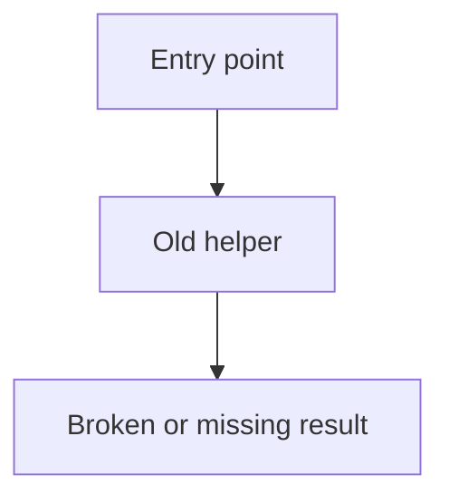
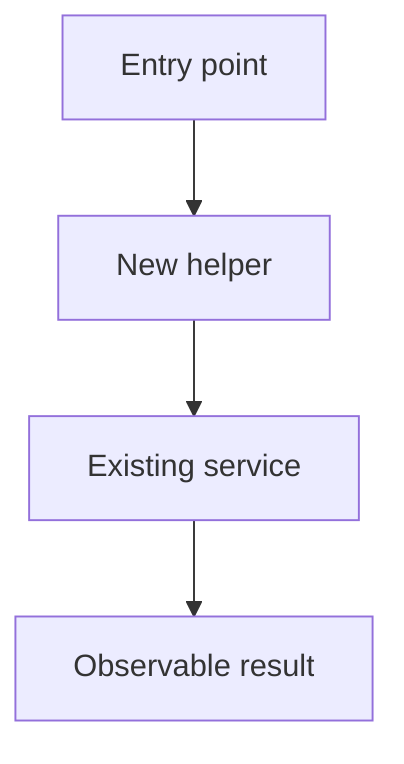
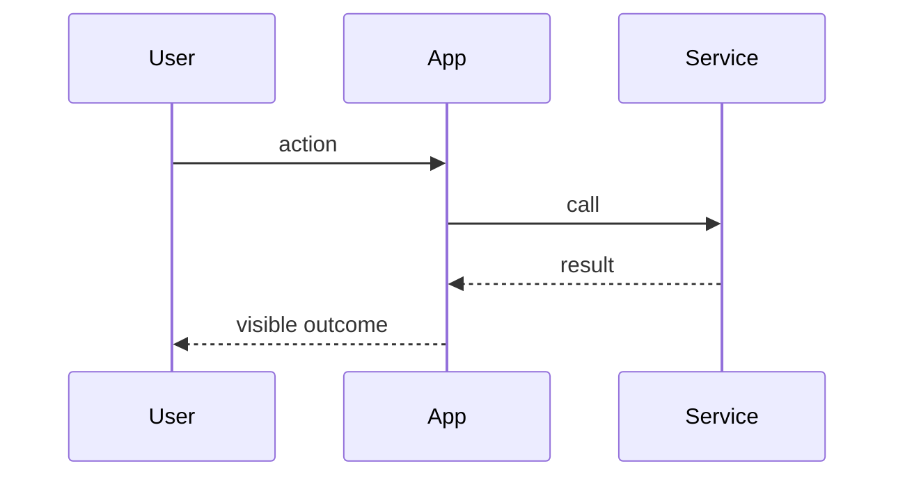

# Walk through landed code

This skill is the counter-equivalent of `$generate-spec-v2`. That skill writes a spec for work that has not happened yet. This skill writes a walkthrough of work that already landed.

Do not plan, spec, or phase future work. Explain what changed and how it runs now, including implemented but uncommitted changes when requested. Use annotated call stack diffs as the main explanation. Link meaningful changed steps to source patches in the shared source panel. Keep standalone source-code excerpts and type declarations out of the walkthrough unless the user explicitly asks for them.

## Research the landed change

1. Read the request and repository instructions.
2. Collect the change: `git diff`, `git diff --cached`, `git log`, and the files those commands name. If the user points at a branch, PR, or commit range, use that range.
3. Use `calldiff` to research changed call paths. Read the calldiff skill and run `calldiff --help` for current usage. Compare the same refs as the requested change; use `tree` or `reach` to inspect a particular entry point when useful.
4. Verify the old and new paths against their respective source versions, especially calls through interfaces, callbacks, events, and dependency boundaries that static analysis may miss. Condense the result around the behavior being explained. Name real files and symbols; do not paste raw tool output without checking it.
5. Read external docs only when a dependency or API is part of the landed change. Record the links used.

Use the amount of research the change needs. Do not impose a fixed research process.

## Write the markdown file

Choose a short kebab-case name. Create a named temp directory under the repo's `tmp/` directory and write one markdown file there. Do not write walkthroughs into `specs/`.

```sh
mkdir -p tmp/code-walkthrough-<name>
```

Write `tmp/code-walkthrough-<name>/walkthrough.md`. Use this structure. In each outcome chapter, put the call-stack diff first, then explain the behavior and its implications in short prose. Do not title the stack fence or follow it with inline source-code blocks. Put linked patches in `source-diff` fences, which render in the shared source panel.

````md
# <Name of the landed change>

Compared **<base> → <head or local working tree>**. State whether the change is committed. These are condensed, source-checked call flows, not recorded runtime traces. `-` marks removed steps; `+` marks added steps; unmarked lines provide unchanged context.

## Problem

Explain the problem that existed before the change, in a few plain sentences. Add a Mermaid diagram when it makes the old path clearer.



## Solution

Explain what landed and why that design, in a few plain sentences. Write in the past tense. Add a Mermaid diagram when it makes the new path clearer.



## User flows

After Solution, add a Mermaid `sequenceDiagram` for each main user-visible flow (happy path and the other paths a user actually takes). Put the flow name in a Markdown heading immediately before each Mermaid fence, such as `### Create a conversation`. Name participants that exist in the landed design. Keep node text short. Skip this section only when the change has no user-facing sequence.

### Send a request



## Goals

- State a user-visible or system-level result that is true after the change.

Out of scope:

- State what this walkthrough does not cover.

## <One outcome that is now true>

No `Chapter:` prefix. The heading is the outcome name only.

```callstack
 requestHandler
+├── validateInput  # return a tagged error if input is invalid
 └── existingService
     └── dataStore  # reached only after validation succeeds
```

The handler now validates before it stores. If validation returns a tagged error, the handler returns that error and skips the write. The existing storage path is unchanged.

## Verification

Summarize checks actually run and their results. State material gaps or failures. Do not imply that a source-checked call flow was exercised at runtime.
````

Prefer `[[path/to/file.ts#symbolName]]` on a stack line when linking a current TypeScript or JavaScript declaration. Use qualified names such as `[[src/store.ts#Store.save]]` when names are ambiguous. TK Stack highlights a matching included new-side patch when possible, otherwise the current file. A symbol reference does not require an embedded patch. Use `[[path/to/file]]` or `[[path/to/file#L12-L30]]` for files and ranges in other languages.

Append `[[id:old:start-end]]` or `[[id:new:start-end]]` to a stack line to link an exact source change. Use actual source line numbers from the compared versions; `[[id:new:12]]` links a single line. Keep references separate from the visible `#` explanation. Link removed steps with `old` references, including steps whose source file was deleted. Link unchanged steps when their implementation changed, and leave context-only steps unlinked. A line may reference several changes, including different files.

Define each referenced ID once in a `source-diff:id:path` fence anywhere in the Markdown. Copy the real file patch from the same Git comparison, including `diff --git`, `---`, `+++`, and `@@` headers. Include surrounding context; each reference range must fit within one included hunk. Use the new path for renames and the old path for deletions. Do not invent patches or renumber hunks. For untracked files, obtain a patch with `git diff --no-index -- /dev/null <path>` (exit 1 means differences).

Mermaid diagrams can use the same references. Inside the fence, add `%% ref node:<id> [[path#symbol]]` for a node or sequence participant, or `%% ref edge:<index> [[id:new:start-end]]` for an edge or sequence message. Edge indices start at zero in declaration order. Put multiple references on one directive rather than repeating its target. These are Mermaid comments and do not appear in labels.

TK Stack hides reference markers and renders source definitions in one shared panel. Clicking a stack line, linked diagram node, or linked edge scrolls to and highlights its code. For full syntax, read the [TK Stack README](https://github.com/tanishqkancharla/tkstack#link-call-stacks-to-source-changes) and [example](https://github.com/tanishqkancharla/tkstack/blob/main/fixtures/annotations.md).

Use `callstack` fences with tree branches (`└──` / `├──`) and unified diff signs. Call stacks render without a file header. Put a trailing `#` comment on a line when the symbol name does not explain its purpose, return value, condition, or side effect. A standalone `#` comment can explain the next step. Skip comments that merely repeat the symbol name.

Show ownership and meaningful ordering accurately. Sibling calls stay siblings; do not nest a later call beneath an earlier one unless it actually calls it. Mark asynchronous handoffs and conditional alternatives instead of implying a single synchronous stack. Plain-language steps such as a database write are useful when clearly labeled as behavior rather than invented function names.

Use an `html` fence, or write HTML in the markdown, for callouts. HTML from this file is trusted local content. tkstack does not sanitize it. Only use it for files you wrote.

Repeat `## <outcome>` for each slice of the change. Put Mermaid in a chapter when a local flow is clearer than the Problem, Solution, or User flows diagrams. Keep each chapter on one outcome. Skip a Mermaid fence in Problem or Solution when prose is enough.

## Fence reference

See the [TK Stack README](https://github.com/tanishqkancharla/tkstack) for rendering details. The walkthrough uses these fences:

| Fence info string                              | Viewer                                                       |
| ---------------------------------------------- | ------------------------------------------------------------ |
| `mermaid`                                      | Beautiful Mermaid ([Craft](https://agents.craft.do/mermaid)) |
| `callstack` or `diff` containing `└──` / `├──` | Interactive stack rows, no file header                       |
| `source-diff:id:path`                          | Named Git patch in the shared source panel                   |
| `html`                                         | Trusted HTML from this file. tkstack does not sanitize it.   |

Walkthroughs are markdown. Curly braces in prose are plain text. Use small tables for state ownership or data mappings when they clarify the call flows. Link to relevant source files in prose when useful; use source-diff annotations to show the changes.

## Serve it

This skill’s CLI is tkstack. After the markdown file exists, run it from the repo root:

```sh
npx tkstack tmp/code-walkthrough-<name>/walkthrough.md
```

Options:

- `--port <n>` — listen port (default `4177`)
- `--root <dir>` — workspace root for file excerpts (default cwd)

The command prints a local URL and keeps running. **Done** in the top right posts `/__tkstack/shutdown` and stops the server.
The server also stops after 24 hours without a page or file-excerpt request. Loading or refreshing the page resets that timer.

Tell the user the markdown path and the URL. Do not open the URL in a browser unless the user explicitly asks.

## Chapter rules

- After Solution, add a `sequenceDiagram` for each main user-visible flow. Name participants that exist in the landed design.
- Name exact files, symbols, behavior, and commands that exist in the tree.
- In each runtime chapter, lead with an annotated call-stack diff and follow it with concise prose explaining the outcome, ownership, and important limits. Do not add a fixed set of subheadings.
- Keep call-stack diffs central. Use Mermaid, tables, and source links only where they add information; use linked `source-diff` patches for code changes and omit standalone excerpts and type blocks unless explicitly requested.
- Make the call-stack diff start from the previous path and mark the landed path with unified diff signs. For UI work, a component render or event-handler path counts as the call stack.
- Annotate call-stack lines with `#` comments where the reader needs a reason, return, or side effect that the symbol name does not say. Do not comment every line.
- Do not invent call paths or diffs. If behavior changed inside an unchanged call path, show the unchanged structure and explain the behavior in annotations and prose; do not invent added or removed calls. For docs, data, or config slices with no changed runtime path, use prose without a stack fence.

## Final check

Confirm that the markdown lives under `tmp/`; the comparison range and commit status are explicit; Problem and Solution match the implemented change; User flows covers each main user path; runtime chapters center on accurate, annotated call-stack diffs and prose; source-diff annotations point to real patches and valid old/new ranges; standalone source-code blocks are absent unless requested; source links are real; verification claims match checks actually run; tkstack is serving the page; and the walkthrough explains existing work without turning into a plan.
