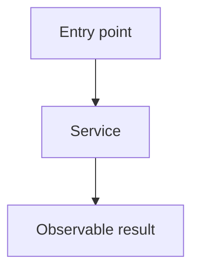
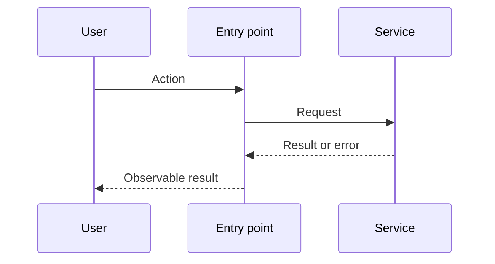

# Generate an implementation spec

Research first, settle the design with the user, then write a spec an engineer can implement without repeating that work. Do not write the spec while critical questions remain open.

## Workflow

### 1. Research

- Read the request, repository instructions, and relevant code.
- Trace the current runtime paths from entry points through state, side effects, errors, and user-visible results. Find the key types, callers, tests, and commands.
- Research external libraries, APIs, and prior art that affect the design. Prefer official docs and primary sources. Record useful links for the spec.
- Separate facts found in code or docs from design choices that still need the user's input.

### 2. Establish the design with the user

- Ask critical guiding questions before drafting. Focus on product behavior, scope, ownership boundaries, tradeoffs, failure behavior, migration, and rollout.
- Ask one focused question at a time. Give concrete options and explain the effect of each when useful.
- Use each answer to research further or ask the next question. Do not ask the user for facts the code or docs can answer.
- Continue until the goals, non-goals, behavior, and key technical choices are settled. State the agreed design briefly and resolve any correction before writing.

### 3. Write and serve the spec

Create `specs/<short-kebab-case-name>.md` with the format below. Then run, from the repository root:

```sh
pnpm spec specs/<name>.md
# or: pnpm exec tkstack specs/<name>.md
```

Keep the server running and give the user the spec path and local URL. Do not write the spec to a temporary directory.

## Spec format

````markdown
# <Feature or fix name>

## System flow

Put the main Mermaid flowcharts and sequence diagrams here, immediately after the title. Show current and proposed paths, boundaries, state changes, and important failure paths. Use multiple diagrams when they make the design easier to follow.





## Problem overview

Explain the current problem and why it matters in a few plain sentences.

## Solution overview

Explain the agreed change and its key design choices in a few plain sentences.

## Goals

- State the results that must hold.

## Non-goals

- State what this spec leaves out.

## Important files, docs, and websites

- [`path/to/file.ts`](../path/to/file.ts) — Explain why it matters.
- [External source](https://example.com) — Explain the decision it supports.

List only sources that help implement the change.

## Implementation

### Phase 1: <Commit-sized outcome>

Explain the outcome and how this phase changes the runtime path.

```callstack
 requestHandler
-└── existingService
+└── validateInput
+    └── existingService
```

Walk through the call-stack change, then show short code previews of the main edits. Include paths and enough surrounding control flow to make the plan concrete; use `...` instead of writing a full patch.

```diff:path/to/handler.ts
 async function requestHandler(input: ImportantInput) {
-  return existingService(input);
+  const valid = validateInput(input);
+  return existingService(valid);
 }
```

- [ ] Make the concrete change, naming files and symbols.
- [ ] Wire it into its nearest caller or consumer.
- [ ] Add or update the high-value test when this phase reaches a public behavior boundary.
- [ ] Run `<exact focused check>`.
- [ ] Run `<repository check command>`.
````

## Phase rules

- Use as many phases as needed. Each phase should be one working commit and about 200 changed lines or fewer, including tests. Split it when it grows beyond that.
- Every phase must leave the repository working and produce visible or testable progress. Avoid setup-only phases unless later work cannot land safely without them.
- Give each phase four or five concrete checklist steps with exact files, symbols, and commands where known.
- Start every code phase with a unified-diff `callstack` fence, then explain it and show concise code diffs, types, or excerpts. Use more call stacks and sequence diagrams wherever they clarify control flow, async work, events, state, or errors.
- Call stacks must show the current path with removed lines and the proposed path with added lines. A UI render or event-handler path counts as a call stack.
- Show the contracts that matter: inputs, outputs, state, events, and errors. Use `Not applicable — no code path changes` only for a true docs, data, or config phase.
- Test through a public package export or end-user surface when practical. For internal steps, use a focused smoke check rather than low-value tests or mocks.

Use `mermaid`, `callstack`, `diff:path`, `start:end:path`, and language fences supported by tkstack. Follow [`packages/tkstack/README.md`](../../../packages/tkstack/README.md) for fence details.

## Final check

Before serving, confirm that the spec reflects every user decision; diagrams and call stacks cover the important paths; each phase stays near the 200-line limit and can land alone; previews name real files and symbols; links and commands are valid; and the full plan covers every goal without pulling in a non-goal.
