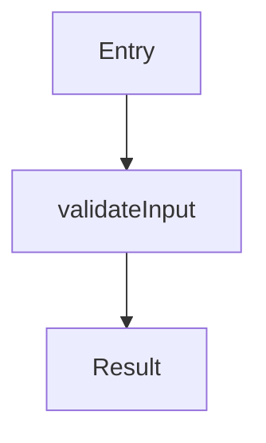
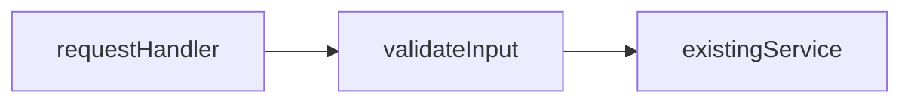

# Living spec

This markdown file is the spec for the work. It should stay true to the repo. It should show what is already there, and what is still planned. Use the same file for the whole job. Keep editing that file. Do not start a second walkthrough later.

Put the file at `specs/<short-kebab-case-name>.md`. Look up the current paths before you write. Do not keep asking questions. Write the page. Ask a question only when the answer would change how you split the work into phases.

When they change the plan, or when they ask you to implement, update **this file** so it still matches. Do that after the code lands too. If they only want a walkthrough of what a pull request did, and no spec exists yet, put that file under `tmp/`.

## Serve and share

Run these commands from the repo root:

```sh
npx @tanishqkancharla/diffmap list
npx @tanishqkancharla/diffmap serve specs/<name>.md
```

`npx @tanishqkancharla/diffmap specs/<name>.md` does the same thing as `serve`. If `list` already shows that file, use the URL it already printed. Do not start a second server. Leave the server running. Tell them the file path and the URL. Do not open the browser unless they ask.

**Close server** sends a request to `/__diffmap/shutdown`. The server also stops after 24 hours with no use. A hosted gist and a GitHub viewer have no local server, so they do not show this button.

Share the spec when they want other people to read it:

```sh
npx @tanishqkancharla/diffmap share specs/<name>.md
```

That command prints `https://diffmap.dev/g/<id>`. The gist is unlisted, but it is not private. A spec on a pull request is available at `https://diffmap.dev/<owner>/<repo>/pull/<n>/specs/<name>.md`. That URL stays on one commit. Do not start a local server when you share.

## What to put in the file

Start with a title. Then write the problem and the solution. Put the system flows in those two sections. Then write the goals, the non-goals, and the phases. Put **References** at the bottom.

**Planned.** Sketch how you will implement the work. Mermaid diagrams, call stacks, and pseudocode can all tell the story. In a call stack, `-` means the current code and `+` means the proposed code. Use each diagram where it fits. That can be in the problem, in the solution, or in a phase. Put the diagram next to the sentences it explains. Also link the current source with `[[path]]` or `[[path#symbol]]`. Use other code blocks when they help. Point links at code that exists now. If a symbol is not written yet, leave it unlinked. Do not invent a `source-diff`.

**Done.** After the code for a phase is committed, paste a real `git diff` of the named files into a `source-diff:id:path` block. Include the `diff --git`, `---`, `+++`, and `@@` lines. Then point that phase's stack rows and mermaid `%% ref` lines at the changed lines, instead of at the whole file. Change `[[path]]` and `[[path#symbol]]` into `[[id:new:12-18]]` or `[[id:old:…]]`. The Diff panel should open the change, not only the file. One spec can mix work that is still planned with work that is already done.

A bad `source-diff` makes the whole page blank. If the patch would be invalid, skip it and say so. For a file that git is not tracking yet, run `git diff --no-index -- /dev/null <path>`. An exit code of 1 means the files differ.

````md
# <Feature>

## Problem overview

<Write what is going wrong.>

```callstack
 requestHandler [[src/request.ts#requestHandler]]
 └── existingService [[src/service.ts#existingService]]
```

Empty names fall through to the service.

## Solution overview

Validate the input, and then make the same call.



An empty name stops. Anything else is the record.

```
validateInput(record):
  empty name → Error
  else → record
```

## Goals

## Non-goals

## Implementation

### Phase 1: <Commit-sized outcome>

<Write one or two sentences. Say what this phase does and why it exists.>

```callstack
 requestHandler [[src/request.ts#requestHandler]]
-└── existingService [[src/service.ts#existingService]]
+└── validateInput
    └── existingService [[src/service.ts#existingService]]
```

That new step sits between the handler and the service.



Reject an empty name before the service runs.

```
validateInput(record):
  empty name → Error
  else → record
```

- [ ] Make the concrete change. Name the files and the symbols.
- [ ] Connect it to the code that calls it.
- [ ] Run `<focused check>`.

## References

- [`src/request.ts`](../src/request.ts) — This file handles the request.
````

Each phase starts with one or two sentences. Say what the phase does and why it exists. Do not fill the phase with repeated filler. In the problem, the solution, and each phase, put mermaid diagrams, call stacks, and pseudocode next to the sentences they explain. Pick the diagram that fits that part of the story. Any of them can go in any of those sections. The template above is one example. It is not a rule that each kind of diagram has its own section.

Keep each phase small enough to commit on its own. About 200 lines is a good size. Link a mermaid node with `%% ref node:<id> [[path#symbol]]`. Link an edge with `%% ref edge:<index> [[…]]`. In a call stack, use `└──` and `├──` to show the tree. Use the unified diff signs to mark current lines and proposed lines. A `#` comment on a line should say the purpose, the return value, or a side effect. Do not add a comment that only repeats the name.

`[[path/to/file.ts#symbolName]]` links to a TypeScript or JavaScript declaration that exists now. If the name is ambiguous, use a longer form such as `[[src/store.ts#Store.save]]`. Use `[[path]]` or `[[path#L12-L30]]` for a whole file or a range of lines. Leave those as file links until the change is committed. After you paste the `source-diff:id:path` block, rewrite them to `[[id:old:start-end]]` or `[[id:new:12]]`. Do the same for mermaid `%% ref` lines. Do not invent those ids or line ranges.

The full syntax is in the [diffmap README](https://github.com/tanishqkancharla/diffmap#link-call-stacks-to-source-changes), the [annotations](https://github.com/tanishqkancharla/diffmap/blob/main/fixtures/annotations.md) fixture, and the [diagrams](https://github.com/tanishqkancharla/diffmap/blob/main/fixtures/references.md) fixture.

A `mermaid` fence draws a diagram. A `callstack` fence draws stack rows. A `source-diff:id:path` fence puts a real git patch in the Diff panel. A fence in another language draws a code block. Use that for pseudocode and for types. An `html` fence draws HTML from this file, and the viewer trusts it.

HTML in an `html` fence is not sanitized. Use that fence only in files you wrote.
