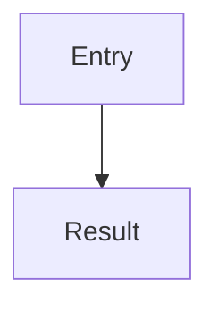

# Living spec

This markdown is the spec for the work. It should stay true to the repo: what’s already there, and what’s still planned. Same file for the life of that work — keep editing it, not a second walkthrough later.

Put it in `specs/<short-kebab-case-name>.md`. Research the current paths. Don’t interview forever; write the page. Ask only if the answer would change how you phase the work.

When they change the plan or ask you to implement, update **this file** so it still matches, including after code lands. Walkthrough-only (“what did this PR do?”) goes under `tmp/` only if no spec exists yet.

## Serve and share

From the repo root:

```sh
npx @tanishqkancharla/diffmap list
npx @tanishqkancharla/diffmap serve specs/<name>.md
```

Bare `npx @tanishqkancharla/diffmap specs/<name>.md` is the same as `serve`. If `list` already shows that file, reuse its URL — don’t start a second server. Leave it running. Tell them the path and URL. Don’t open the browser unless they ask.

**Close server** posts `/__diffmap/shutdown`. The server also stops after 24 hours idle. Hosted gist and GitHub viewers have no local server, so they omit this control.

Share when they want others to read it:

```sh
npx @tanishqkancharla/diffmap share specs/<name>.md
```

That prints `https://diffmap.dev/g/<id>` (unlisted gist, not private). A spec on a PR is `https://diffmap.dev/<owner>/<repo>/pull/<n>/specs/<name>.md` (pins to one SHA). Don’t start a local server when sharing.

## What to put in the file

Shape: title, system flow (mermaid), problem / solution / goals / non-goals, sources, then phases.

**Planned:** sketch the implementation. Call stacks (`-` current, `+` proposed) are one component of that sketch — also mermaid, `[[path]]` / `[[path#symbol]]`, and pseudocode or other code blocks when those help. Links point at current source. Leave unwritten symbols unlinked. No invented `source-diff`.

**Done:** after a phase lands, paste a real `git diff` of the named files into `source-diff:id:path` (include `diff --git`, `---`, `+++`, `@@`) and retarget that phase’s stack rows and mermaid `%% ref`s from the file to the hunk — `[[path]]` / `[[path#symbol]]` become `[[id:new:12-18]]` / `[[id:old:…]]` — so the Diff panel opens the change, not just the file. Mixed planned/done in one file is the point.

A bad `source-diff` blanks the whole page. If the patch would be invalid, skip it and say so. For untracked files: `git diff --no-index -- /dev/null <path>` (exit 1 means differences).

````md
# <Feature>

## System flow



## Problem overview

## Solution overview

## Goals

## Non-goals

## Important files, docs, and websites

- [`src/request.ts`](../src/request.ts) — Why it matters.

## Implementation

### Phase 1: <Commit-sized outcome>

<A sentence or two: what this phase is and why it exists.>

```callstack
 requestHandler [[src/request.ts#requestHandler]]
-└── existingService [[src/service.ts#existingService]]
+└── validateInput
    └── existingService [[src/service.ts#existingService]]
```

```
validateInput(record):
  empty name → Error
  else → record
```

- [ ] The concrete change, with files and symbols.
- [ ] Wire it to its caller.
- [ ] Run `<focused check>`.
````

Each Implementation phase starts with a sentence or two summarizing the phase and why it exists — not a ritual dump. Sketch with pseudocode when it helps; stacks, mermaid, and `[[path]]` links still belong in the picture.

Phases should be small enough to land alone (~200 lines). Link mermaid with `%% ref node:<id> [[path#symbol]]` or `%% ref edge:<index> [[…]]`. Call stacks use `└──` / `├──` and unified diff signs. A `#` comment on a line is for purpose, return, or side effect — skip comments that just repeat the name.

`[[path/to/file.ts#symbolName]]` links a current TS/JS declaration (`[[src/store.ts#Store.save]]` if the name is ambiguous). `[[path]]` or `[[path#L12-L30]]` for files and ranges. Those stay as file links until the change lands. Then rewrite them to `[[id:old:start-end]]` / `[[id:new:12]]` against the `source-diff:id:path` you pasted — same for mermaid `%% ref`s. Don’t invent those IDs or hunks.

Full syntax: [diffmap README](https://github.com/tanishqkancharla/diffmap#link-call-stacks-to-source-changes), [annotations](https://github.com/tanishqkancharla/diffmap/blob/main/fixtures/annotations.md), [diagrams](https://github.com/tanishqkancharla/diffmap/blob/main/fixtures/references.md).

| Fence                 | Viewer                           |
| --------------------- | -------------------------------- |
| `mermaid`             | Diagram                          |
| `callstack`           | Stack rows                       |
| `source-diff:id:path` | Real git patch in the Diff panel |
| other langs           | Code block (pseudocode, types)   |
| `html`                | Trusted HTML from this file      |

`html` is unsanitized. Only for files you wrote.
