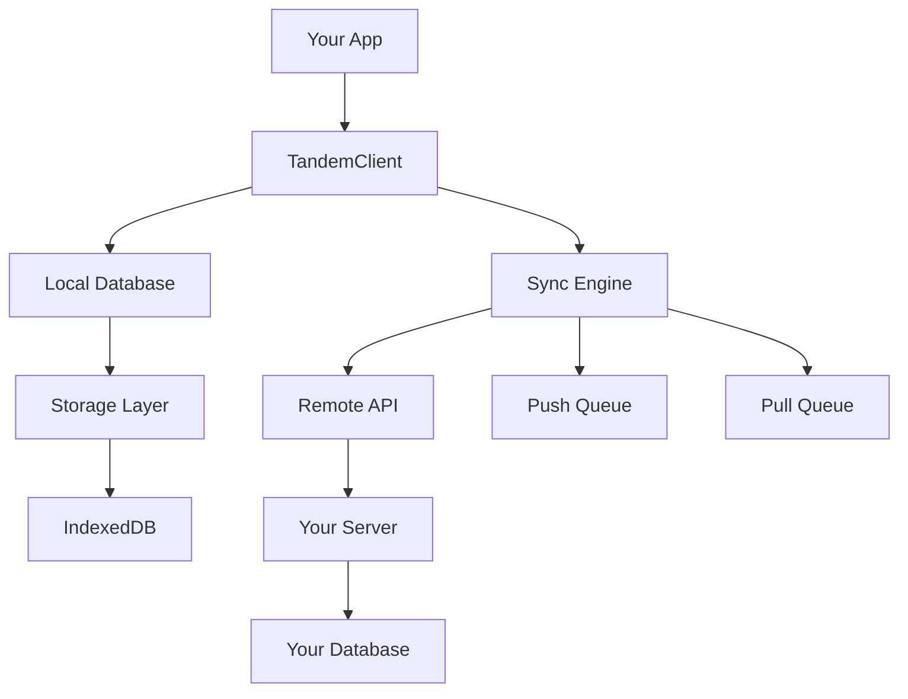
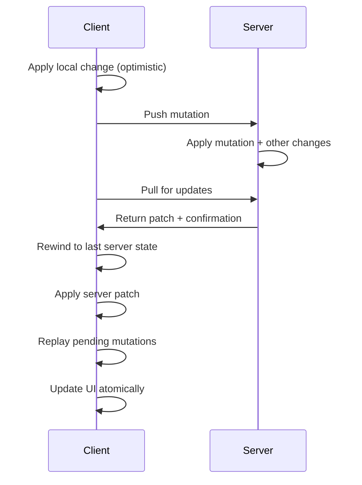

# How Does Tandem Work?

Tandem is a sync engine that enables real-time collaboration by synchronizing client-side state with your backend. This guide explains the core concepts and algorithms behind Tandem's sync model.

## The Big Picture

Tandem operates with three main components working together:

1. **Local Database**: A persistent, query-able database in your browser
2. **Sync Engine**: Handles bidirectional synchronization with your server
3. **Remote API**: Your backend implementation for handling sync operations



## Core Concepts

### Client View

Each client maintains a **Client View** - a local, persistent database of your application state. This is stored as tuples in the format `["record", collection, id]` for efficient querying and synchronization.

- **Performance**: Reads and writes are <1ms latency
- **Persistence**: Data survives browser restarts via IndexedDB
- **Consistency**: All clients eventually converge to the same state

### Mutations

Changes to data are represented as **Mutations** - structured operations that can be applied both locally and on the server.

```typescript
// A mutation contains operations
type Mutation = {
  id: string
  ops: MutationOp[]
}

// Operations are either set or remove
type MutationOp = 
  | { type: "set", collection: string, value: any }
  | { type: "remove", collection: string, id: string }
```

### Scan Windows

**Scan Windows** define what data each client is interested in. They contain the encoded queries that the client is subscribed to.

```typescript
// Example scan window
const scanWindow = [
  { collection: "todos", where: [["complete", "=", false]] },
  { collection: "users", select: ["id", "name"] }
]
```

## Sync Algorithm

Tandem's sync algorithm is inspired by Git's distributed version control model. It ensures that all clients converge to the same state while allowing optimistic updates.

### 1. Local Execution (Optimistic Updates)

When you make a change:

1. **Apply Locally**: Changes are immediately applied to the Client View
2. **Create Mutation**: A mutation record is created with a unique ID
3. **Update UI**: Subscriptions fire and the UI updates instantly
4. **Queue for Sync**: The mutation is queued to be sent to the server

```typescript
// Example: Adding a todo
const tx = db.transact()
tx.set("todos", { id: "123", text: "Learn Tandem", complete: false })
await db.commit(tx)
// UI updates immediately, sync happens in background
```

### 2. Push (Upstream Sync)

Mutations are sent to the server in batches:

1. **Queue Mutations**: Local changes are queued for push
2. **Send to Server**: The server receives mutations and applies them
3. **Server Processing**: Server executes mutations and updates canonical state
4. **Acknowledgment**: Server tracks which mutations were applied

```typescript
// Push operations
await remote.push({
  mutations: [
    {
      id: "m1",
      ops: [{ type: "set", collection: "todos", value: { id: "123", text: "Learn Tandem" } }]
    }
  ],
  clientId: "client-abc"
})
```

### 3. Pull (Downstream Sync)

Clients periodically fetch updates from the server:

1. **Request Updates**: Client asks for changes since last known state
2. **Server Response**: Server returns a patch of changes
3. **Apply Patch**: Client applies server changes to local state
4. **Update Cookie**: Client updates its last-known-state marker

```typescript
// Pull operations  
const { cookie, patch, lastMutationId } = await remote.pull({
  clientId: "client-abc",
  cookie: "previous-state-marker",
  scanWindow: [{ collection: "todos" }]
})
```

### 4. Conflict Resolution (Rebase)

When server state differs from local state, Tandem performs a **rebase** operation:

1. **Rewind**: Roll back to the last known server state
2. **Apply Patch**: Apply the server's changes
3. **Replay**: Re-apply local optimistic changes on top
4. **Reveal**: Atomically update the UI with the final state



## Detailed Flow Example

Let's trace through a complete sync cycle:

### Initial State
- Client A has todos: `[{id: "1", text: "Buy milk", complete: false}]`
- Client B has the same state
- Server has the same state

### 1. Concurrent Changes
- Client A: Marks todo complete
- Client B: Edits todo text to "Buy organic milk"

### 2. Optimistic Updates
Both clients apply changes locally and see immediate updates:
- Client A sees: `[{id: "1", text: "Buy milk", complete: true}]`
- Client B sees: `[{id: "1", text: "Buy organic milk", complete: false}]`

### 3. Push to Server
Both clients send mutations to server:
- Client A pushes: `{ type: "set", value: {id: "1", text: "Buy milk", complete: true} }`
- Client B pushes: `{ type: "set", value: {id: "1", text: "Buy organic milk", complete: false} }`

### 4. Server Processing
Server receives both mutations and applies them in order:
- Final server state: `[{id: "1", text: "Buy organic milk", complete: false}]`
- (Client B's change overwrote Client A's)

### 5. Pull and Rebase
Client A pulls updates:
1. Receives patch with Client B's changes
2. Rewinds to last server state: `[{id: "1", text: "Buy milk", complete: false}]`
3. Applies server patch: `[{id: "1", text: "Buy organic milk", complete: false}]`
4. Replays its own mutation: `[{id: "1", text: "Buy organic milk", complete: true}]`

### 6. Final State
- Client A: `[{id: "1", text: "Buy organic milk", complete: true}]`
- Client B: `[{id: "1", text: "Buy organic milk", complete: false}]`
- Server: `[{id: "1", text: "Buy organic milk", complete: false}]`

Client A's completion change was preserved on top of Client B's text change.

## Key Features

### Optimistic Updates
- Changes appear instantly in the UI
- No waiting for server round-trips
- Automatic rollback if conflicts occur

### Conflict Resolution
- Automatic merging of concurrent changes
- Last-write-wins at the field level
- Deterministic resolution across all clients

### Offline Support
- Local database works without network
- Changes queue when offline
- Automatic sync when reconnected

### Real-time Collaboration
- Poke system for instant notifications
- Subscription-based updates
- Minimal data transfer via patches

### Type Safety
- Full TypeScript integration
- Schema validation
- Compile-time query checking

## Performance Characteristics

- **Local Reads**: <1ms latency
- **Local Writes**: <1ms latency
- **Sync Frequency**: ~150ms intervals (configurable)
- **Memory Usage**: Minimal (data stored in IndexedDB)
- **Network Usage**: Only sends deltas/patches

## Next Steps

- [**Remote Implementation Guide**](./how_to_implement_remote.md) - Learn how to build your backend
- **API Reference** - Complete API documentation (coming soon)
- **Advanced Patterns** - Complex sync scenarios (coming soon)
