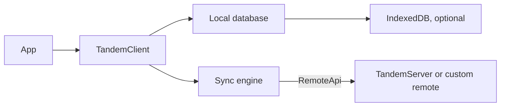

# Overview

Tandem is a sync engine and database for collaborative apps. Each client keeps a local database that the UI reads from directly. Writes apply locally right away, and Tandem syncs them with a server in the background.

## Why

Collaborative apps need a few things at once:

- Writes that show up in the UI immediately
- Changes from other clients that appear without a reload
- A consistent result when clients edit the same data at the same time
- Something sensible to do when the network is slow or unavailable

Tandem handles these in the data layer, so app code can read and write local data without managing requests.

## Components

### `TandemClient`

`TandemClient` is the app-facing API from `@tanishqkancharla/tandem-core`. It exposes:

- `query` and `subscribe` for typed object queries
- `transact` and `commit` for writes
- `connect`, `disconnect`, and `pullFromRemote` for sync control

### Local database

The local database stores records as ordered tuples. It evaluates queries in memory and can persist to IndexedDB through `TandemClientIndexedDbStorage`.

### Sync engine

The sync engine runs when a client has a `remote`. It pushes local mutations, pulls patches for the queries the client subscribes to, and rebases pending local mutations on top of each patch. See [How sync works](sync.md).

### Remote

A remote implements the `RemoteApi` contract: `connect`, `push`, and `pull`. `TandemServer` from `@tanishqkancharla/tandem-server` implements it directly. In a browser app, a small HTTP or RPC transport on the client forwards calls to it. See [Server](server.md) and [Custom remotes](custom-remote.md).

## Current limitations

- Conflicts resolve as last write wins per record. There are no field-level merges or intents.
- Server sync metadata lives in memory and resets when the server process restarts.
- There is no schema versioning or migration story for persisted client storage.

See the [Roadmap](roadmap.md) for planned work.

## Next steps

- [Quickstart](quickstart.md)
- [How sync works](sync.md)
