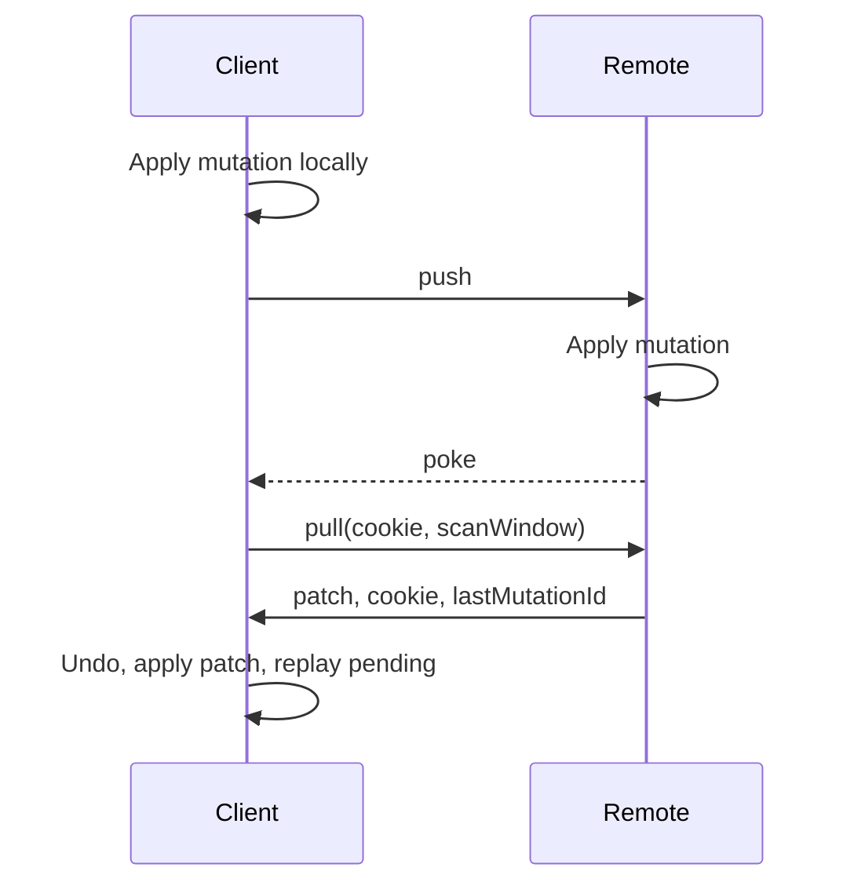

# How sync works

This page covers what happens between a `TandemClient` and its remote. The sync engine only runs when the client has a `remote`.

## Records and tuples

Each client stores records as ordered tuples: `["record", collection, ...idParts]`. A scalar ID contributes one part. A compound ID contributes each of its parts in order, so a transaction can scan by ID prefix.

## Mutations

`commit` turns a transaction into a mutation: an ID and a list of operations.

```ts
type Mutation = {
	id: MutationId
	ops: (
		| { type: "set"; collection: string; value: Record }
		| { type: "remove"; collection: string; id: Id }
	)[]
}
```

A `set` carries the whole record, not a field-level diff. Locally, the client also keeps each operation's previous value so it can undo the mutation.

## Scan windows

A scan window is the list of queries the client currently subscribes to, encoded for the wire. `subscribe` adds a query, and `destroy` removes it. Each pull sends the scan window, and the remote returns only records inside it.

So a client does not receive another client's writes until it subscribes to a query that covers them. Calling `pullFromRemote()` runs a pull with the current scan window.

## The sync loop

### Local write

1. `commit` applies the mutation to the local database right away.
2. Subscriptions re-run and the UI updates.
3. The mutation joins the list of pending (speculative) mutations and is queued for push.

### Push

The sync engine batches queued pushes and pulls on an interval (`syncInterval`, 150 ms by default). A push sends pending mutations with the client ID:

```ts
await remote.push({ clientId, mutations })
```

If the push fails, the client rolls back that batch locally, and the `commit` promise rejects. While disconnected, the client skips pushes and sends pending mutations after `connect`.

### Pull

A pull asks for changes since the last cookie, limited to the scan window:

```ts
const { cookie, patch, lastMutationId } = await remote.pull({
	clientId,
	cookie,
	scanWindow,
})
```

- `patch` lists records to `set` and to `remove`.
- `cookie` is an opaque marker the client sends back on its next pull.
- `lastMutationId` is the last mutation from this client that the remote has applied.

### Poke

`connect` gives the remote a `poke` function. Calling it makes the client pull. The remote decides when to poke, for example over a WebSocket, SSE, or a polling timer.

### Rebase

The client applies each patch in one local transaction:

1. Undo all speculative mutations.
2. Apply the patch.
3. Drop speculative mutations up to and including `lastMutationId`, since the patch already reflects them.
4. Re-apply the remaining speculative mutations.

Subscribers see only the final state.



## Conflicts

Conflicts resolve as last write wins per record, in the order the remote applies pushes. Say clients A and B both edit todo `1`:

1. A sets `{ text: "Buy milk", complete: true }`.
2. B sets `{ text: "Buy oat milk", complete: false }`.
3. The remote applies A, then B. Its record is B's value.
4. After both clients pull and their mutations are acknowledged, both have B's value.

A's `complete: true` is lost because B's `set` replaced the whole record. Until A's pull acknowledges its mutation, A keeps replaying its own value on top of each patch.

## Client storage

With `clientStorage`, the client loads from storage on startup (`client.ready`) and writes changes back in batches (`clientStorageWriteInterval`, 120 ms by default). `flushClientStorage()` writes immediately.

## Next steps

- [Server](server.md): a `RemoteApi` implementation you can use directly
- [Custom remotes](custom-remote.md): what a remote must guarantee
