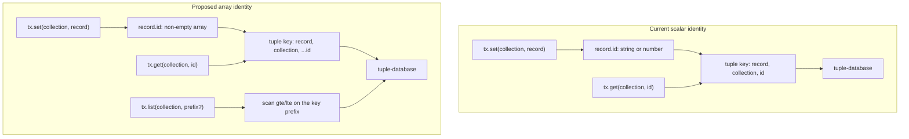
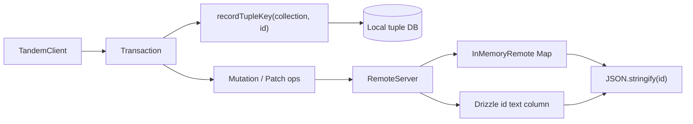

# Array record keys

## System flow





## Problem overview

Tandem records are identified by a single `id` field of type `string | number`. Storage already uses tuple-database, but the stored key is `["record", collection, id]` with that scalar as one element. Callers cannot model hierarchical identity such as `[threadId, messageId]`, and they cannot prefix-scan related records from the tuple key. Foreign keys and remote stores copy the same scalar assumption, so identity is a string everywhere even though the database underneath is a tuple store.

## Solution overview

Make `id` a non-empty array of `string | number` on every record. Spread that array into the tuple-database key as `["record", collection, ...id]`. `t.id()` describes a 1-tuple of string by default; `t.id(t.string(), t.string())` describes a composite key. `get` / `update` / `remove` take the array. `list` takes an optional prefix of that array and scans the matching tuple range. Remotes keep using a single SQL `id` text column or an in-memory `Map`, and they encode the array with `JSON.stringify` at that boundary. Tandem is unreleased, so scalar ids are removed rather than supported side by side.

Assumption: the request to use arrays instead of scalars applies to record identity (`id`) and the APIs that look records up. Query `where` matches `id` with exact array equality. Range queries over id tuples are out of scope.

## Goals

- Every collection record has `id` typed as a non-empty array of `string | number`.
- Local storage keys are `["record", collection, ...id]`.
- `tx.get`, `tx.update`, and `tx.remove` take that array. `tx.set` reads it from `record.id`.
- `t.id()` infers `[string]`. `t.id(t.string(), t.number())` infers `[string, number]`.
- `tx.list(collection, prefix)` returns records whose id has that prefix, using a tuple scan rather than loading the whole collection and filtering.
- Relations that join to `id` compare with `isEqual`, and foreign-key fields that point at `id` use the same array type.
- In-memory and Drizzle remotes round-trip array ids without colliding distinct arrays.
- Existing package tests pass after fixtures write 1-tuple ids such as `["todo-1"]`. A new core test covers a composite key.

## Non-goals

- No migrations or backfills of persisted IndexedDB or SQL data.
- No compatibility path that still accepts scalar `string | number` ids.
- No SQL composite primary keys, extra key columns, or Drizzle schema redesign. The existing `id` text column stores `JSON.stringify(id)`.
- No id range operators (`gt` / `lt` on arrays) in the query dialect.
- No query planner that turns `where` clauses into tuple prefix scans. Collection queries still scan the collection prefix and filter in memory.
- No change to scan-window encoding, poke intersection, or sync rebase besides carrying array `id` values through existing mutation and patch shapes.

## Important files, docs, and websites

- [`packages/types/src/types.ts`](../packages/types/src/types.ts) — `AnyCollectionSchema`, mutation/patch `id` fields, `SchemaToTupleSchema`, `MutationApi.toWriteOps`, and `PatchApi.toWriteOps` all assume a scalar id.
- [`packages/types/src/utils/objectUtils.ts`](../packages/types/src/utils/objectUtils.ts) — `isEqual` already compares arrays via `JSON.stringify`; reuse it for identity and relation joins.
- [`packages/core/src/schema/Schema.ts`](../packages/core/src/schema/Schema.ts) — `t.id()` returns `string`, and `RecordFromShape` forces `id: string | number` on top of the shape.
- [`packages/core/src/transaction/Transaction.ts`](../packages/core/src/transaction/Transaction.ts) — `get` / `set` / `update` / `remove` / `list` build `["record", collection, id]`.
- [`packages/core/src/Database.ts`](../packages/core/src/Database.ts) — collection scans use `gte: ["record", collection, null]` and join related rows with `===`.
- [`packages/core/src/sync/SyncEngine.ts`](../packages/core/src/sync/SyncEngine.ts) — copies remove `id` onto `MutationOp`; the field type follows `@tandem/types`.
- [`packages/server/src/RemoteServer.ts`](../packages/server/src/RemoteServer.ts) — `mergePatch` identities records with `` `${collection}.${id}` ``, which stringifies arrays as comma lists and can collide.
- [`packages/server/src/InMemoryRemote.ts`](../packages/server/src/InMemoryRemote.ts) — stores records in `Map<string | number, record>` and compares where values with `Object.is`.
- [`packages/server/src/drizzle/sqlite.ts`](../packages/server/src/drizzle/sqlite.ts), [`pg.ts`](../packages/server/src/drizzle/pg.ts), [`mysql.ts`](../packages/server/src/drizzle/mysql.ts), [`utils.ts`](../packages/server/src/drizzle/utils.ts) — upsert and delete against a scalar `table.id` column.
- [`packages/core/test/fixtures.ts`](../packages/core/test/fixtures.ts) and [`packages/server/test/fixtures.ts`](../packages/server/test/fixtures.ts) — todo/thread helpers and SQL tables that treat `id` as a string.
- [`docs/how_does_tandem_work.md`](../docs/how_does_tandem_work.md) — documents the current three-element tuple key.
- [tuple-database](https://github.com/ccorcos/tuple-database) — scan bounds and prefix ordering for spread tuple keys.
- Serve this spec from the repo root after copying tkstack into `tmp/tkstack`: `pnpm --dir tmp/tkstack exec tsx src/cli.ts specs/array-record-keys.md --root .`

## Implementation

### Phase 1: Make record identity an array in shared types

Change the public identity contract in `@tandem/types` so records, mutations, patches, and tuple keys all use a spread id array. Keep this phase in `packages/types` so later runtime code has one encoding helper.

#### Important types

```ts
// packages/types/src/types.ts
export type RecordId = readonly (string | number)[]

export type AnyCollectionSchema = Record<string, any> & {
	id: RecordId
}

export function recordTupleKey(
	collection: string,
	id: RecordId,
): ["record", string, ...RecordId] {
	if (id.length === 0) {
		throw new Error("Record id must be a non-empty array")
	}
	return ["record", collection, ...id]
}

export function recordIdentity(collection: string, id: RecordId): string {
	return `${collection}:${JSON.stringify(id)}`
}

export type SchemaToTupleSchema<Schema extends AnySchema> = {
	[C in CollectionName<Schema>]: {
		key: ["record", collection: C, ...Schema[C]["id"]]
		value: Schema[C]
	}
}[CollectionName<Schema>]
```

#### Call stack diff

```callstack
 MutationApi.toWriteOps
-└── key: ["record", collection, op.value.id]
+└── recordTupleKey(collection, op.value.id)
     └── tuple-database WriteOps

 PatchApi.toWriteOps
-└── key: ["record", collection, s.value.id]
+└── recordTupleKey(collection, s.value.id)
```

#### Code diff preview

```diff
 // packages/types/src/types.ts
 export function toWriteOps(ops: MutationOp<any>[]): WriteOps {
   const [setOps, removeOps] = partition(ops, (op) => op.type === "set")
   const writeOps = {
     set: setOps.map((op) => ({
-      key: ["record", op.collection, op.value.id],
+      key: recordTupleKey(op.collection, op.value.id),
       value: op.value,
     })),
-    remove: removeOps.map((op) => ["record", op.collection, op.id]),
+    remove: removeOps.map((op) => recordTupleKey(op.collection, op.id)),
   }
   return writeOps
 }
```

- [ ] Add `RecordId`, `recordTupleKey`, and `recordIdentity` in `packages/types/src/types.ts` and export them from `packages/types/src/index.ts`.
- [ ] Change `AnyCollectionSchema["id"]`, `InveribleRemoveMutationOp["id"]`, `RemoveMutationOp["id"]`, and `PatchRemoveOp["id"]` to `RecordId` / `Schema[Collection]["id"]`. `InveribleRemoveMutationOp` currently hardcodes `id: string | number`.
- [ ] Update `SchemaToTupleSchema` and `_TestSchemaToTupleSchema1` so a todos id of `[string]` produces key `["record", "todos", string]`.
- [ ] Smoke `recordTupleKey("todos", [])` by hand and confirm it throws. Do not commit this check.
- [ ] Run `pnpm --filter @tandem/types type-check`.

### Phase 2: Teach schema and the local database to use array ids

Point `t.id()` at tuple field types and spread those tuples in `Transaction` and `Database`. Join related rows with `isEqual` so array foreign keys match array ids. After this phase, a record with `id: ["todo-1"]` round-trips through set/get/list/query on a local client.

#### Important types

```ts
// packages/core/src/schema/Schema.ts
type RecordFromShape<Shape extends CollectionShape> = {
	[Field in keyof Shape & string]: Shape[Field] extends RuntimeFieldDefinition<
		infer Value
	>
		? Value
		: never
}

export const t = {
	id: <const Parts extends readonly RuntimeFieldDefinition<string | number>[]>(
		...parts: Parts
	): RuntimeFieldDefinition<
		Parts["length"] extends 0
			? [string]
			: {
					[Index in keyof Parts]: Parts[Index] extends RuntimeFieldDefinition<
						infer Value
					>
						? Value
						: never
				}
	> =>
		field(
			"id",
		) as RuntimeFieldDefinition<[string] | (string | number)[]>,
}
```

#### Call stack diff

```callstack
 TandemClient.commit
 └── Transaction.set
-    └── tupleDbTx.set(["record", collection, record.id], record)
+    └── tupleDbTx.set(recordTupleKey(collection, record.id), record)

 Database.expandRelationalRow
-└── target[relation.to] === joinValue
+└── isEqual(target[relation.to], joinValue)
```

#### Code diff preview

```diff
 // packages/core/src/transaction/Transaction.ts
 get<Collection extends CollectionName<Schema>>(
   collection: Collection,
   id: Schema[Collection]["id"],
 ): Readonly<Schema[Collection]> | undefined {
-  const tupleSchemaKey = ["record", collection, id]
+  const tupleSchemaKey = recordTupleKey(collection, id)
   const result = this.tupleDbTx.scan({
     gte: tupleSchemaKey,
     lte: tupleSchemaKey,
   })
   return result[0]?.value
 }

 set<Collection extends CollectionName<Schema>>(
   collection: Collection,
   record: Schema[Collection],
 ): Transaction<Schema> {
   const tupleSchema = {
-    key: ["record", collection, record.id],
+    key: recordTupleKey(collection, record.id),
     value: record,
   }
```

```22:34:packages/core/src/schema/Schema.ts
type CollectionShape = Record<string, AnyRuntimeFieldDefinition> & {
	id: RuntimeFieldDefinition<string | number>
}

type RecordFromShape<Shape extends CollectionShape> = {
	[Field in keyof Shape & string]: Shape[Field] extends RuntimeFieldDefinition<
		infer Value
	>
		? Value
		: never
} & {
	id: string | number
}
```

- [ ] Change `CollectionShape` so `id` is `RuntimeFieldDefinition<RecordId>`. Remove the `id: string | number` intersection from `RecordFromShape` so `t.id(t.string(), t.string())` can infer `[string, string]`.
- [ ] Implement `t.id(...parts)`: zero parts means `[string]`; otherwise the tuple of the part value types. Keep the runtime field `type` as `"id"`.
- [ ] Switch `Transaction.get` / `set` / `update` / `remove` to `recordTupleKey`. Collection `list` without a prefix keeps the current `null` / `true` scan bounds.
- [ ] In `Database.expandRelationalRow`, compare join fields with `isEqual` instead of `===`.
- [ ] Run `pnpm --filter @tandem/core type-check`. Test files may still fail until phase 3.

### Phase 3: Update core fixtures so existing client tests use 1-tuple ids

Make the current public-API tests the first committed proof. Helpers such as `todo("todo-1")` return `{ id: ["todo-1"], ... }`. Foreign keys that join to `id` become the same 1-tuple, for example `ownerId: ["user-1"]`.

#### Important types

```ts
// packages/core/test/fixtures.ts
export type TestsTodo = {
	id: [string]
	text: string
	done: boolean
	priority: number
}

export function todo(
	id: string,
	overrides: Partial<TestsTodo> = {},
): TestsTodo {
	return {
		id: [id],
		text: `Todo ${id}`,
		done: false,
		priority: 1,
		...overrides,
	}
}
```

#### Call stack diff

```callstack
 TandemClient.spec.ts
 └── todo("todo-1")
-    └── { id: "todo-1", ... }
+    └── { id: ["todo-1"], ... }
     └── client.transact().set("todos", record)
         └── client.query({ collection: "todos" })
```

#### Code diff preview

```diff
 // packages/core/test/TandemClient.spec.ts
 updateTx.update("todos", "todo-1", (record) => ({
+updateTx.update("todos", ["todo-1"], (record) => ({
   ...record,
   done: true,
 }))
-updateTx.remove("todos", "todo-2")
+updateTx.remove("todos", ["todo-2"])
```

- [ ] Change `TestsTodo`, `ThreadTest*` record types, and `testsRuntimeSchema` / `threadTestSchema` so `id` and every field that joins to `id` (`ownerId`, `profileId`, `threadId`, `authorId`) are 1-tuples.
- [ ] Update `todo()` and every `tx.get` / `update` / `remove` / `where: { id }` call site in `packages/core/test` to pass arrays.
- [ ] Keep relation definitions as `to: "id"` / `from: "id"`. Join values are now arrays; phase 2 `isEqual` is what makes those tests pass.
- [ ] Commit the existing `TandemClient` and `Schema` tests as the package-level proof for 1-tuple ids. Do not add mocks.
- [ ] Run `pnpm --filter @tandem/core test`.

### Phase 4: Add prefix listing and a composite-key client test

Give composite keys a public read path: `list(collection, prefix)` scans `gte: ["record", collection, ...prefix]` / `lte: ["record", collection, ...prefix, true]`. Add one end-to-end test that stores messages under `[threadId, messageId]` and lists one thread without seeing the other.

#### Important types

```ts
// packages/core/src/transaction/Transaction.ts
list<Collection extends CollectionName<Schema>>(
	collection: Collection,
	prefix?: readonly (string | number)[],
): Readonly<Schema[Collection]>[]

type Message = {
	id: [threadId: string, messageId: string]
	body: string
}
```

#### Call stack diff

```callstack
 Transaction.list
-└── scan({ gte: ["record", collection, null], lte: ["record", collection, true] })
+└── prefix === undefined
+    └── scan({ gte: ["record", collection, null], lte: ["record", collection, true] })
+└── prefix === ["thread-1"]
+    └── scan({
+          gte: ["record", collection, ...prefix],
+          lte: ["record", collection, ...prefix, true],
+        })
```

#### Code diff preview

```diff
 // packages/core/src/transaction/Transaction.ts
 list<Collection extends CollectionName<Schema>>(
   collection: Collection,
+  prefix?: readonly (string | number)[],
 ): Readonly<Schema[Collection]>[] {
-  const results = this.tupleDbTx.scan({
-    gte: ["record", collection, null],
-    lte: ["record", collection, true],
-  })
+  const results = this.tupleDbTx.scan(
+    prefix === undefined || prefix.length === 0
+      ? { gte: ["record", collection, null], lte: ["record", collection, true] }
+      : {
+          gte: ["record", collection, ...prefix],
+          lte: ["record", collection, ...prefix, true],
+        },
+  )
   return results.map((result) => result.value)
 }
```

- [ ] Add the optional `prefix` argument to `Transaction.list` and use tuple-database scan bounds, not an in-memory `id` filter.
- [ ] Add a Vitest fixture client whose schema is `t.id(t.string(), t.string())` for messages, using `test.extend` in `packages/core/test/fixtures.ts`.
- [ ] Commit a short test that sets `{ id: ["thread-1", "m1"] }`, `{ id: ["thread-1", "m2"] }`, and `{ id: ["thread-2", "m3"] }`, then asserts `list("messages", ["thread-1"])` returns only the first two and `get("messages", ["thread-1", "m1"])` returns that row.
- [ ] Assert `list("messages")` still returns all three rows.
- [ ] Run `pnpm --filter @tandem/core test`.

### Phase 5: Encode array ids at remote boundaries

In-memory remotes cannot use arrays as `Map` keys. `mergePatch` cannot join collection and id with `.` because `[1, 2]` and `"1,2"` collide. Drizzle tables keep a single text `id` primary key. Use `recordIdentity` / `JSON.stringify` at those boundaries, and parse arrays back when reading SQL rows.

#### Important types

```ts
// packages/server/src/drizzle/utils.ts
function encodeSqlValue(value: unknown): unknown {
	return Array.isArray(value) ? JSON.stringify(value) : value
}

function decodeSqlRow<Record extends { id: RecordId }>(row: object): Record {
	return Object.fromEntries(
		Object.entries(row).map(([field, value]) => [
			field,
			typeof value === "string" && value.startsWith("[")
				? JSON.parse(value)
				: value,
		]),
	) as Record
}
```

Do not detect arrays by `startsWith("[")` if a cleaner path exists: track which fields are arrays from the values you wrote. The bicycle version is: stringify every array on write, and `JSON.parse` the `id` column (and any other field whose written value was an array) on read. Prefer decoding from known array fields (`id`, plus FK fields that are arrays in the schema record type) over sniffing strings.

#### Call stack diff

```callstack
 RemoteServer.mergePatch
-└── `${setOp.collection}.${setOp.value.id}`
+└── recordIdentity(setOp.collection, setOp.value.id)

 InMemoryRemoteStore.applyMutations
-└── Map<string | number, record>.set(op.value.id, op.value)
+└── Map<string, record>.set(JSON.stringify(op.value.id), op.value)

 SQLiteDrizzleStore.setRecord
-└── insert(table).values(value).onConflictDoUpdate({ target: table.id })
+└── insert(table).values(encodeSqlRow(value)).onConflictDoUpdate({ target: table.id })
```

#### Code diff preview

```diff
 // packages/server/src/RemoteServer.ts
 for (const setOp of patch.set ?? []) {
-  const key = `${setOp.collection}.${setOp.value.id}`
+  const key = recordIdentity(setOp.collection, setOp.value.id)
   removeMap.delete(key)
   setMap.set(key, setOp)
 }

 // packages/server/src/InMemoryRemote.ts
-collectionRecords.set(op.value.id, op.value)
+collectionRecords.set(JSON.stringify(op.value.id), op.value)
-this.recordsByCollection.get(op.collection)?.delete(op.id)
+this.recordsByCollection.get(op.collection)?.delete(JSON.stringify(op.id))

 compareValues(fieldValue, "=", comparisonValue) {
-  return Object.is(fieldValue, comparisonValue)
+  return isEqual(fieldValue, comparisonValue)
 }
```

```67:79:packages/server/src/drizzle/sqlite.ts
	private async setRecord<Collection extends CollectionName<Schema>>(
		db: SQLiteExecutor,
		collection: Collection,
		value: Schema[Collection],
	): Promise<void> {
		const table = this.getTable(collection)
		await db
			.insert(table)
			.values(value as typeof table.$inferInsert)
			.onConflictDoUpdate({
				target: table.id,
				set: value as typeof table.$inferInsert,
			})
```

- [ ] Switch `RemoteServer.mergePatch` to `recordIdentity`.
- [ ] Switch `InMemoryRemoteStore` to string map keys via `JSON.stringify(id)`, and compare encoded where equality with `isEqual` so `where: { id: ["t1"] }` matches.
- [ ] In `packages/server/src/drizzle/utils.ts`, stringify array field values in `buildWhere` and when writing rows; parse them when reading rows. Apply the helper from sqlite, pg, and mysql stores. Keep the SQL `id` column as text.
- [ ] Smoke an in-memory remote push/pull of `{ id: ["thread-1", "m1"] }` by hand. Do not commit this check.
- [ ] Run `pnpm --filter @tandem/server type-check`.

### Phase 6: Update server tests and developer docs

Finish the remote package the way a caller uses it: fixtures write 1-tuple ids, SQL still has a text `id` column, and adapter tests assert stored threads round-trip. Update the few docs that still describe `["record", collection, id]` as a three-element key.

#### Important types

Not applicable — fixture and documentation updates. The runtime types come from phases 1 and 5.

#### Call stack diff

Not applicable — no code path changes.

#### Code diff preview

```diff
 // packages/server/test/fixtures.ts
 export type TestsThread = {
-  id: string
+  id: [string]
   title: string
   status: "open" | "closed"
   createdAt: number
 }

 export function thread(id: string, overrides: Partial<TestsThread> = {}): TestsThread {
   return {
-    id,
+    id: [id],
     title: `Thread ${id}`,
     ...
   }
 }

-return records.toSorted((left, right) => left.id.localeCompare(right.id))
+return records.toSorted((left, right) =>
+  JSON.stringify(left.id).localeCompare(JSON.stringify(right.id)),
+)
```

- [ ] Update `packages/server/test/fixtures.ts` record types, `thread()`, sort helpers, and any `id` assertions in `packages/server/test` so they use 1-tuple ids. Leave SQL column definitions as text primary keys; the adapter encodes the array.
- [ ] Commit `pnpm --filter @tandem/server test` as the package-level remote proof. Docker providers stay optional behind `TANDEM_DOCKER_TESTS=1`.
- [ ] Update `docs/how_does_tandem_work.md`, `packages/core/src/storage/AGENT.md`, and `CLAUDE.md` so the stored key is described as `["record", collection, ...id]`.
- [ ] Run `pnpm type-check` and `pnpm test` at the repo root.
