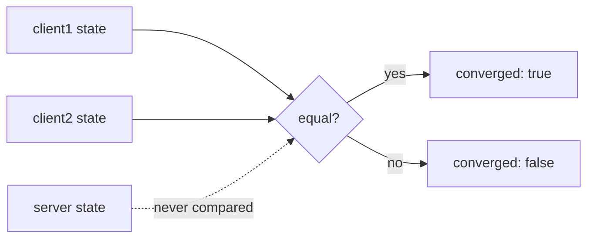
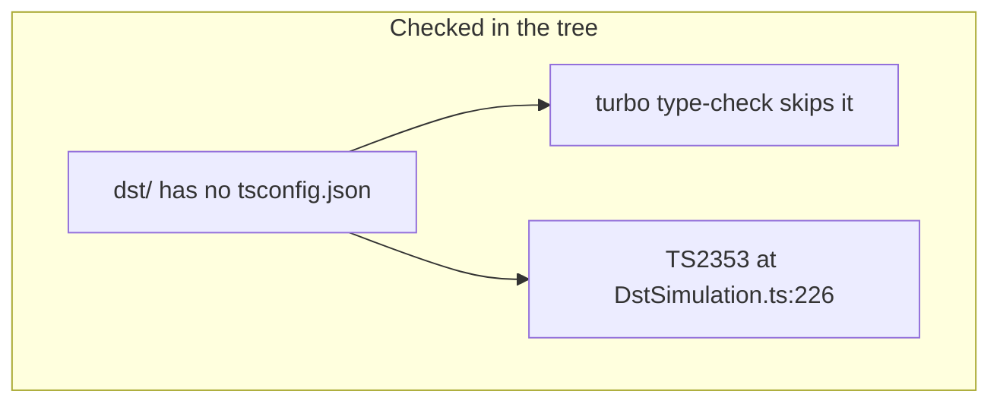
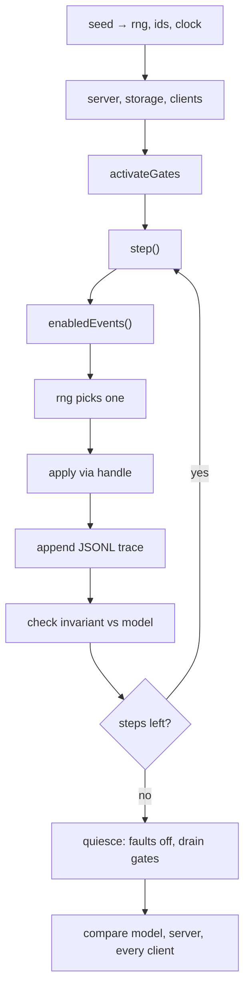
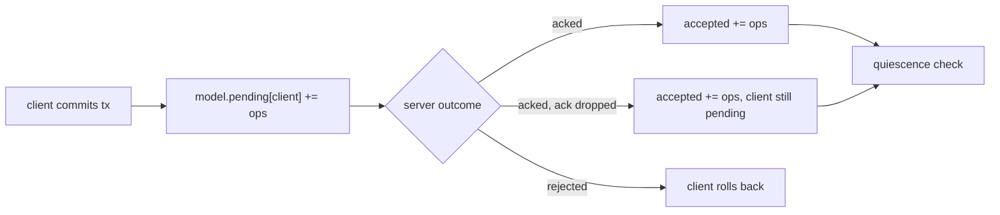

# Deterministic simulation testing

## Problem overview

`dst/` can stand up two clients and a server, but it cannot find the bugs it is built to find. A step runs one mutation all the way to completion before the next one starts, so no two operations are ever in flight together. The interleavings that break sync engines are unreachable by construction.

```
step():
  pick a client and an id at random
  transact, set or remove, commit
  run that one commit to completion   ← nothing else can interleave
  next step
```

`DstScheduler` was written to control that ordering and is never imported anywhere. Nothing in the repository references it, so the package carries two scheduling paths and uses neither well.

Correctness is decided by comparing the two clients to each other after forced pulls:



Both clients can agree on state that disagrees with the server, so a run passes while data is wrong. The normal path also calls `continueToCompletion` without inspecting the commit result, so an unexpected rejection does not fail the run.

Nothing records what happened. The trace is an in-memory array returned on success and dropped on failure, so a failure cannot be replayed or turned into a regression test. Client and transaction ids still come from Tandem's default `Math.random`, and sync work is scheduled by real `setTimeout`, so the seed does not actually determine execution.

Two smaller facts shape the work. `JsonlLoggerSink` is implemented and unit-tested but never re-exported from the core entry point, so `dst` cannot reach the one sink this design needs. And `dst/` has no `tsconfig.json` at all, so `turbo run type-check` never visits it and a real type error sits unchecked.



## Solution overview

Give the simulation an enabled-event loop instead of a commit loop, and make every source of nondeterminism derive from the seed. A step asks the runtime which events are currently possible and applies exactly one of them.

```
step():
  events = enabledEvents()          # only what is possible right now
  choose one using the seeded rng
  apply it through its Gatekeeper handle
  append the choice to the JSONL trace
  check the cheap invariant
```

Enabled events include starting a mutation, advancing an in-flight call to its next boundary, delivering a response, dropping it, killing a client, and restarting one over the same durable storage. The critical dependency is that Gatekeeper can currently report none of this. `Runtime` and `Call` are not exported, and `Call.currentInteraction()` is private, so nothing outside the module can enumerate what is pending or ask where a call is stopped. That has to be exposed before the loop can exist.



Correctness comes from a reference model that tracks server-accepted writes plus each client's pending optimistic writes. It tolerates real disagreement while calls are in flight, checks a cheap invariant after every step, and compares everything at quiescence.

```
model:
  accepted        = writes the server has committed
  pending[client] = that client's optimistic writes not yet acknowledged

invariant (every step):
  no acknowledged write ever disappears

convergence (at quiescence):
  every pending set is empty
  all clients == server == model
```

Every choice and gate decision is appended to a JSONL trace as it happens, so a failing run leaves behind the seed, the commit, the ordered event stream, and the final state of every participant. A replay runner reads that file and drives the same public APIs with no randomness, which is what turns a discovered failure into a checked-in regression.

## Goals

- A run is a pure function of `(seed, steps, faultRate, commit)`.
- Two operations are in flight together often enough that interleavings are genuinely explored.
- A step is a randomly chosen enabled event, not a completed transaction.
- Correctness is decided against a reference model, not by comparing participants to each other.
- Cheap invariants run after every step; full comparison runs at checkpoints and at quiescence.
- A failing run writes a JSONL artifact with seed, options, commit, ordered events, and final state, and that artifact replays without randomness.
- `dst` is inside the type-check and test graphs.
- A bounded run finishes in seconds on every PR, seeded from the PR number, plus a fixed regression seed set.
- A client can be killed and restarted, reading back its durable local storage.

## Non-goals

- No model checking or exhaustive state-space search. This is randomized simulation, not a solver.
- No real network, real clock, or real IndexedDB. Everything stays in-process.
- No fault injection into `tuple-database` internals or the server's storage layer in the first version.
- No replacement for the existing Vitest, example e2e, or publish-smoke suites. DST covers long interleavings; those cover ordinary behavior and the real runtime.
- No compatibility layer for the current `DstSimulation` or `DstScheduler` shapes. Both are replaced.

## Implementation

### Phase 1: Put `dst` in the type-check and test graphs

The package cannot currently fail CI, and nothing else in this spec can be trusted until it can. This phase is only about making the package a real member of the workspace.

```callstack
 DstSimulation.execute [[dst/DstSimulation.ts#DstSimulation.execute]]
-└── return { debugDetails, seed, stepsCompleted, trace, converged, finalCount }
+└── return { seed, stepsCompleted, trace, converged, finalCount }
```

`debugDetails` is a debugging leftover that the declared return type does not contain, so `tsc` rejects it with `TS2353`. The fix is to delete it, not to widen the type — the prototype does not need to hand back both client snapshots.

`dst/tsconfig.json` checks the non-spec files against the built `dist` of each dependency, the same way a consumer sees them. `dst/tsconfig.test.json` checks everything against package sources through `paths`, including `@tanishqkancharla/tandem-core/internal`, which the server's source imports. Without that mapping the server source falls through to `dist` and fails with implicit-`any` errors.

- [x] Add `dst/tsconfig.json` extending the root config, plus `dst/tsconfig.test.json` for the spec files, mirroring `packages/core`.
- [x] Add `type-check`, `lint`, and `format` scripts to `dst/package.json` so `turbo run type-check` reaches the package.
- [x] Remove `debugDetails` from the `execute` return in `DstSimulation.ts`.
- [x] Run `pnpm install` so the `workspace:*` links for gatekeeper, core, server, and tuple-database resolve.
- [x] Verify `pnpm type-check` and `pnpm --filter tandem-dst test` pass.

### Phase 2: Let the DST see what is in flight

An enabled-event loop needs to know which calls are paused and where. The runtime tracks both, but `Runtime` and `Call` are internal to the module, so a consumer can only drive handles it already holds. This phase adds read-only introspection and changes no scheduling behavior.

A call is controlled one boundary at a time: `continueTo` and `fail` act only on the call's current stop, the most recent interaction held at a gate. So the harness reports one entry per paused call, not one per paused interaction. Every entry it returns is something the loop can act on.

```callstack
 Runtime.build [[packages/gatekeeper/src/Gatekeeper.ts#Runtime.build]]
+├── harness.pendingCalls = () => this.pendingCalls()
 └── harness.activateGates = () => this.activateGates()
```

```
PendingCall = { handle, label, sentBy, waitingFor }

harness.pendingCalls():
  for each call the runtime still owns, in creation order
    skip it if it has completed, was cancelled, or a control is running
    skip it unless its current interaction is held at enter or exit
    report { handle, label, sentBy, waitingFor }
```

A call whose current interaction is processing inside a service without an enter gate is not listed. Only the service can finish that work, so there is nothing for the loop to release.

- [x] Add an exported `PendingCall` type carrying the call's `handle`, `label`, `sentBy`, and `waitingFor`.
- [x] Add a `Call.pendingCall()` helper that returns its current stop when it is held at enter or exit, leaving `currentInteraction` private.
- [x] Add `Runtime.pendingCalls()` and expose it as `harness.pendingCalls()` in the `Harness` type.
- [x] Add a gatekeeper test showing a nested server→store handoff and a second client's request both listed with their senders and receivers.
- [x] Add a gatekeeper test that drives every call to completion using only `harness.pendingCalls()`, the way the event loop will.
- [x] Add a type-level check for `harness.pendingCalls()` and document it in the gatekeeper README.
- [x] Run `pnpm --filter @tanishqkancharla/gatekeeper test` and `pnpm type-check`.

### Phase 3: Make the run a pure function of the seed

The prototype passes `syncInterval: 0` and no `rng`, so ids come from `Math.random` and sync work is driven by real `setTimeout`. The client already accepts both an `RngApi` and a `TimerApi`; this phase supplies seeded ones and closes the one gap Tandem could not reach on its own.

That gap is inside `tuple-database`. Its listener ids and fallback transaction ids come from `uuid.v4()`, which reads `crypto.randomUUID`, so seeding `Math.random` would not touch them. Listener ids matter: `subscribe` stores each listener under `[prefix, id]` and a write scans that range, so listeners on the same prefix fire in id order. Tandem now depends on a fork, [`tanishqkancharla/tuple-database`](https://github.com/tanishqkancharla/tuple-database), whose databases take an `rng` option. It is pinned by commit on the fork's `release` branch, which holds the built package at its root.

```callstack
 Database constructor [[packages/core/src/Database.ts#Database.constructor]]
+└── new TupleDatabase(new InMemoryTupleStorage(), { rng })

 TandemServer constructor [[packages/server/src/TandemServer.ts#TandemServer.constructor]]
+├── new AsyncTupleDatabase(storage, { rng: args.rng })
+└── transact() → this.tupleDb.transact(this.rng?.randomId())
```

Time does not get its own clock. Each client receives a timer service registered in the Gatekeeper harness with `{ enter: false, exit: true }`, the pattern `buildTimerGatekeeperHarness` already uses in core's tests. A tick is then an ordinary held handoff, listed by `harness.pendingCalls()` as `sentBy: "client1Timer", waitingFor: "client1"`, so Phase 4's loop delivers ticks the same way it delivers pushes. A separate simulated clock would reintroduce a second scheduler.

```
seed → SimPrng
  ├── rng for the server        (transaction and listener ids)
  ├── rng per client            (client, transaction, mutation, listener ids)
  └── choices made by the loop

per client: timer service in the harness → syncInterval and clientStorageWriteInterval
trace records: keyed by step, no wall-clock time
```

- [x] Fork `tuple-database` so `TupleDatabase` and `AsyncTupleDatabase` accept `{ rng }` for listener and fallback transaction ids, and pin Tandem to the fork's `release` build.
- [x] Pass the client's `rng` into its `TupleDatabase`, and add an optional `rng?: RngApi` to `TandemServer` for its database and transaction ids.
- [x] Remove the unused `@triplit/tuple-database` dependency from core.
- [ ] Add `SimPrng.createRngApi(label)` and give one to the server and to each client.
- [ ] Register a timer service per client in the DST harness with `{ enter: false, exit: true }`, used for both `syncInterval` and `clientStorageWriteInterval`.
- [ ] Key trace records by step and drop wall-clock timestamps.
- [ ] Add a test asserting two runs at the same seed produce identical traces, and that a different seed does not.

### Phase 4: Replace the commit loop with an enabled-event loop

This is the core change. The prototype picks a client and runs its commit to completion; `DstScheduler.stepOne` does the same and is never called. Both go away, replaced by one scheduler that asks Gatekeeper what is possible and advances exactly one thing.

```callstack
 DstScheduler.stepOne [[dst/DstScheduler.ts#DstScheduler]]
-└── handle.continueToCompletion()
+└── DstRun.step()
```

```
enabledEvents():
  mutate     → a connected client that can start a write
  advance    → a pending call stopped at a boundary
  drop       → a pending call whose response can be lost
  killClient → a connected client
  restart    → a dead client with surviving local storage
```

Choosing among these is what exposes ordering bugs. Running a whole commit inside one step removes most of them, which is why the current three tests pass while the risk stays unmeasured.

- [ ] Delete `dst/DstScheduler.ts` and the inline loop in `DstSimulation.ts`.
- [ ] Define the `DstEvent` union covering `mutate`, `advance`, `drop`, `killClient`, and `restartClient`, each carrying the fields the trace needs.
- [ ] Track every `CallHandle` the run creates in a map keyed by the id from Phase 2, so an event can name the handle it advances.
- [ ] Implement `enabledEvents()` to return only currently possible events, never offering `advance` or `drop` for a call with no pending interaction.
- [ ] Split the fault taxonomy into `DstNetworkFault` for a dropped response and `DstAckLossFault` for a response the client never sees, so the model can tell "server rejected" from "server accepted, client did not hear".
- [ ] Add a test asserting a run reaches a state where two calls are pending at once, which the current prototype cannot produce.
- [ ] Run `pnpm --filter tandem-dst test`.

### Phase 5: Decide correctness with a reference model

Comparing the two clients to each other proves nothing. The model has to know which writes the server accepted and which remain optimistic on each client, and it has to tolerate legitimate disagreement while calls are in flight.



The `acked, ack dropped` path is the one the current fault injection cannot express, and it is the case that matters most: the server has the write, the client does not know, and convergence depends on a later pull landing correctly.

- [ ] Add `dst/ReferenceModel.ts` holding server-accepted writes and a per-client map of pending optimistic writes.
- [ ] Feed the model from observed outcomes: a completed push moves writes from pending to accepted, a dropped acknowledgement moves them to accepted while leaving them pending on the client, a rejection discards them.
- [ ] Add a cheap per-step invariant that needs no pull: an acknowledged write never disappears, and each client's local state equals the model composed of accepted writes plus that client's pending writes.
- [ ] Add `assertConverged()` for quiescence: after faults stop and gates drain, every pending set is empty and all clients, the server, and the model agree.
- [ ] Replace the `converged` boolean with the model verdict, and make a mismatch throw a tagged error carrying expected and actual state.
- [ ] Add a test that a deliberately wrong expectation fails with a readable diff, and that a run with faults still converges.

### Phase 6: Emit a failure artifact and replay it

The trace is returned on success and lost on failure, so nothing about a failing run survives the process. It has to be written as it happens, and it has to be replayable.

```callstack
 DstRun.execute dst/DstRun.ts
-└── return { seed, stepsCompleted, trace, converged }
+└── await this.trace.flush()
+    └── on failure, write seed, commit, options,
+        ordered events, final states, and the error
```

- [ ] Export `JsonlLoggerSink` and `JsonlLoggerSinkArgs` from `packages/core/src/index.ts`; they are implemented and unit-tested but not currently public.
- [ ] Add a `DstTraceSink` implementing `LoggerSinkApi` that appends one record per line to the run's trace file, and attach it to the run's `Logger`.
- [ ] Extend the trace record to a typed union carrying the seed, step, chosen event, gate label, sender, receiver, injected fault, and observed outcome, so a record is self-describing.
- [ ] Add `DstRunner.replay(artifact)` that reads a JSONL artifact and re-applies each event through the public `TandemClient` and `TandemServer` APIs with no RNG, asserting the recorded outcome each time.
- [ ] Emit the artifact from a `catch` so it is written whether the failure came from an invariant, a convergence check, or an unexpected throw inside `execute`.
- [ ] Add a test that generates a failing run, replays its artifact, and asserts the replay reproduces the same failure. This is the regression harness the PR gate depends on.
- [ ] Run `pnpm --filter tandem-dst test` and `pnpm type-check`.

### Phase 7: Wire the CLI and CI

The per-PR goal is a bounded run seeded from the PR number, fast enough that nobody waits on it, with a nightly sweep that is broader. The seed has to be printed on every run, or a CI failure is not reproducible by hand.

```
dst:run --seed 123 --steps 400 --fault-rate 0.1
dst:run --replay tmp/failure-123.jsonl
```

- [ ] Add a `dst:run` script to the root `package.json` delegating to a `dst/src/cli.ts` entry that parses `--seed`, `--steps`, `--fault-rate`, and `--replay`.
- [ ] Derive the default per-PR seed as a stable hash of the PR number, keep an explicit `--seed` override for local replay, and print the seed on every run.
- [ ] Add a `pull_request` workflow running a small step budget at the derived seed plus the fixed regression seed set, uploading any trace artifact on failure.
- [ ] Add a `schedule` workflow running a couple dozen independently seeded runs at a few hundred steps each, publishing the seeds so a nightly failure can be re-run locally.
- [ ] Review the three cases in `dst/dst.spec.ts` and delete any that only assert `converged`, replacing them with seed-driven runs and a replay regression.
- [ ] Run `pnpm test`, `pnpm type-check`, and `pnpm lint`.

## References

- [`dst/DstSimulation.ts`](../dst/DstSimulation.ts) — The prototype loop this spec replaces. Its inline step loop and `DstTraceRecord` go away.
- [`dst/DstScheduler.ts`](../dst/DstScheduler.ts) — Dead code today: nothing imports it. Replaced rather than revived, because its `stepOne` runs calls to completion and it cannot see enabled events.
- [`dst/SimPrng.ts`](../dst/SimPrng.ts) — SplitMix32 generator. Becomes the source for every random choice and for `RngApi`.
- [`dst/dst.spec.ts`](../dst/dst.spec.ts) — Three fixed-seed cases that assert only `converged`.
- [`dst/package.json`](../dst/package.json) — Has only `test`. Needs `type-check` and a `tsconfig.json` to join the workspace graphs.
- [`packages/gatekeeper/src/Gatekeeper.ts`](../packages/gatekeeper/src/Gatekeeper.ts) — Owns execution order. `Runtime` and `Call` are internal to the module, so a harness consumer can only drive handles it already holds. Phase 2 adds `harness.pendingCalls()`.
- [`packages/core/src/TandemClient.ts`](../packages/core/src/TandemClient.ts) — Already accepts `rng`, and types `syncInterval` and `clientStorageWriteInterval` as `number | TimerApi`. The determinism seams exist; the prototype ignores them.
- [`tanishqkancharla/tuple-database`](https://github.com/tanishqkancharla/tuple-database) — Fork of `ccorcos/tuple-database` (unmaintained since 2023). Adds the `rng` option; `release-git.sh` builds `master` onto the `release` branch that Tandem pins by commit.
- [`packages/core/src/sync/SyncEngine.ts`](../packages/core/src/sync/SyncEngine.ts) — `queuePush` and `queuePull` serialize sync work behind a timer, which is why the clock must be simulated rather than real.
- [`packages/core/src/utils/Logger.ts`](../packages/core/src/utils/Logger.ts) — `Logger` with `sinks`, `scope`, `addSink`, and `destroy`. The trace sink plugs in here.
- [`packages/core/src/utils/Logger.node.ts`](../packages/core/src/utils/Logger.node.ts) — `JsonlLoggerSink`, implemented and unit-tested but not re-exported from the core entry point. Must be exported before `dst` can use it.
- [`packages/core/src/clientStorage/TandemClientIndexedDbStorage.ts`](../packages/core/src/clientStorage/TandemClientIndexedDbStorage.ts) — `dbName`-keyed durable client storage. Kill and restart is a new client over the same `dbName` under `fake-indexeddb`.
- [`packages/core/test/fixtures.ts`](../packages/core/test/fixtures.ts) — Canonical patterns the DST should follow rather than reinvent: `InProcessTransport` binding `poke` through `async_hooks`, `rng.create(label)`, and `await using` harness disposal.
- [FoundationDB simulation docs](https://apple.github.io/foundationdb/testing.html) — Establishes the seed-plus-oracle model this spec follows.
- [FoundationDB client testing](https://apple.github.io/foundationdb/client-testing.html) — Covers the split between simulation and ordinary end-to-end tests.
- [TigerBeetle architecture](https://github.com/tigerbeetle/tigerbeetle/blob/main/docs/ARCHITECTURE.md) — Describes running real service logic against generated workloads with a model.
