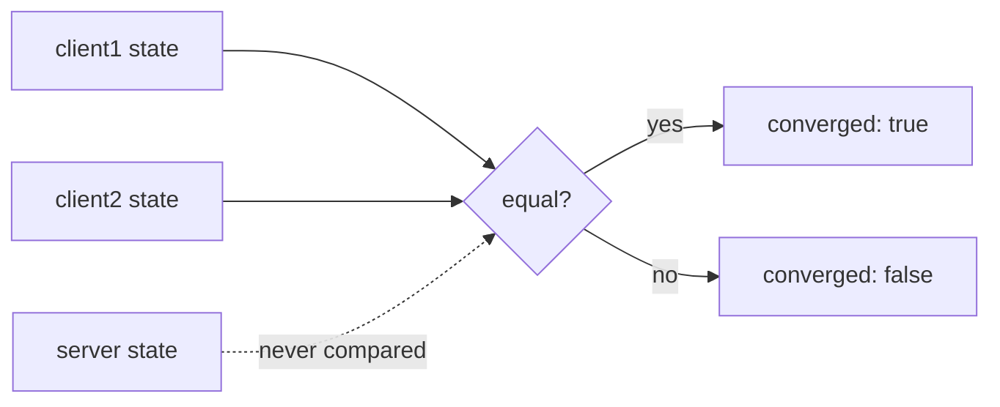
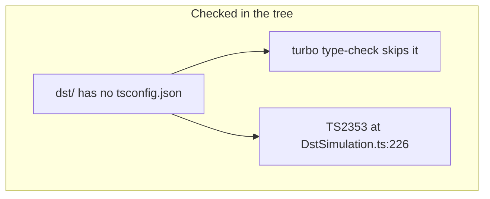
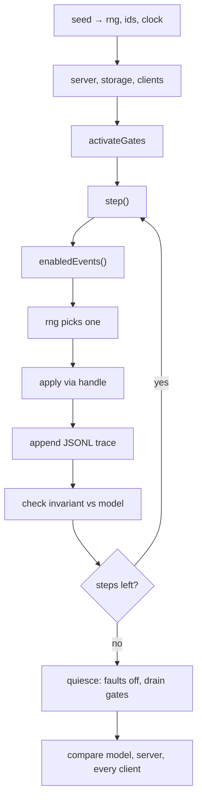
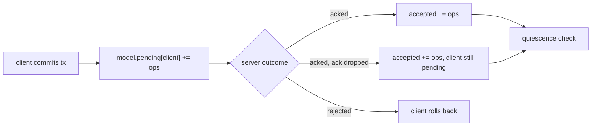

# Deterministic simulation testing

## Problem overview

`dst/` can stand up two clients and a server, but it cannot find the bugs it is built to find. A step runs one mutation all the way to completion before the next one starts, so no two operations are ever in flight together. The interleavings that break sync engines are unreachable by construction.

```
step():
  pick a client and an id at random
  transact, set or remove, commit
  run that one commit to completion   ← nothing else can interleave
  next step
```

`DstScheduler` was written to control that ordering and is never imported anywhere. Nothing in the repository references it, so the package carries two scheduling paths and uses neither well.

Correctness is decided by comparing the two clients to each other after forced pulls:


```mermaid
flowchart LR
    C1["client1 state"] --> Q{"equal?"}
    C2["client2 state"] --> Q
    Q -->|"yes"| PASS["converged: true"]
    Q -->|"no"| FAIL["converged: false"]
    S["server state"] -.->|"never compared"| Q
    %% ref node:S [[packages/server/src/TandemServer.ts#TandemServer.constructor]]
    %% ref node:Q [[dst/DstSimulation.ts#DstSimulation.execute]]
```

Both clients can agree on state that disagrees with the server, so a run passes while data is wrong. The normal path also calls `continueToCompletion` without inspecting the commit result, so an unexpected rejection does not fail the run.

Nothing records what happened. The trace is an in-memory array returned on success and dropped on failure, so a failure cannot be replayed or turned into a regression test. Client and transaction ids still come from Tandem's default `Math.random`, and sync work is scheduled by real `setTimeout`, so the seed does not actually determine execution.

Two smaller facts shape the work. `JsonlLoggerSink` is implemented and unit-tested but never re-exported from the core entry point, so `dst` cannot reach the one sink this design needs. And `dst/` has no `tsconfig.json` at all, so `turbo run type-check` never visits it and a real type error sits unchecked.


```mermaid
flowchart TD
    subgraph graph ["Checked in the tree"]
        P["dst/ has no tsconfig.json"] --> E1["turbo type-check skips it"]
        P --> E2["TS2353 at DstSimulation.ts:226"]
    end
    %% ref node:E2 [[dst/DstSimulation.ts#DstSimulation.execute]]
    %% ref node:P [[dst/package.json]]
```

## Solution overview

Give the simulation an enabled-event loop instead of a commit loop, and make every source of nondeterminism derive from the seed. A step asks the runtime which events are currently possible and applies exactly one of them.

```
step():
  events = enabledEvents()          # only what is possible right now
  choose one using the seeded rng
  apply it through its Gatekeeper handle
  append the choice to the JSONL trace
  check the cheap invariant
```

Enabled events include starting a mutation, advancing an in-flight call to its next boundary, delivering a response, dropping it, killing a client, and restarting one over the same durable storage. The critical dependency is that Gatekeeper can currently report none of this. `Runtime` and `Call` are not exported, and `Call.currentInteraction()` is private, so nothing outside the module can enumerate what is pending or ask where a call is stopped. That has to be exposed before the loop can exist.


```mermaid
flowchart TD
    S0["seed → rng, ids, clock"] --> S1["server, storage, clients"]
    S1 --> S2["activateGates"]
    S2 --> S3["step()"]
    S3 --> S4["enabledEvents()"]
    S4 --> S5["rng picks one"]
    S5 --> S6["apply via handle"]
    S6 --> S7["append JSONL trace"]
    S7 --> S8["check invariant vs model"]
    S8 --> S9{"steps left?"}
    S9 -->|"yes"| S3
    S9 -->|"no"| S10["quiesce: faults off, drain gates"]
    S10 --> S11["compare model, server, every client"]
    %% ref node:S4 [[packages/gatekeeper/src/Gatekeeper.ts#Gatekeeper]]
    %% ref node:S11 [[packages/core/src/TandemClient.ts#TandemClient]]
```

Correctness comes from a reference model that tracks server-accepted writes plus each client's pending optimistic writes. It tolerates real disagreement while calls are in flight, checks a cheap invariant after every step, and compares everything at quiescence.

```
model:
  accepted        = writes the server has committed
  pending[client] = that client's optimistic writes not yet acknowledged

invariant (every step):
  no acknowledged write ever disappears

convergence (at quiescence):
  every pending set is empty
  all clients == server == model
```

Every choice and gate decision is appended to a JSONL trace as it happens, so a failing run leaves behind the seed, the commit, the ordered event stream, and the final state of every participant. A replay runner reads that file and drives the same public APIs with no randomness, which is what turns a discovered failure into a checked-in regression.

## Goals

- A run is a pure function of `(seed, steps, faultRate, commit)`.
- Two operations are in flight together often enough that interleavings are genuinely explored.
- A step is a randomly chosen enabled event, not a completed transaction.
- Correctness is decided against a reference model, not by comparing participants to each other.
- Cheap invariants run after every step; full comparison runs at checkpoints and at quiescence.
- A failing run writes a JSONL artifact with seed, options, commit, ordered events, and final state, and that artifact replays without randomness.
- `dst` is inside the type-check and test graphs.
- A bounded run finishes in seconds on every PR, seeded from the PR number, plus a fixed regression seed set.
- A client can be killed and restarted, reading back its durable local storage.

## Non-goals

- No model checking or exhaustive state-space search. This is randomized simulation, not a solver.
- No real network, real clock, or real IndexedDB. Everything stays in-process.
- No fault injection into `tuple-database` internals or the server's storage layer in the first version.
- No replacement for the existing Vitest, example e2e, or publish-smoke suites. DST covers long interleavings; those cover ordinary behavior and the real runtime.
- No compatibility layer for the current `DstSimulation` or `DstScheduler` shapes. Both are replaced.

## Implementation

### Phase 1: Put `dst` in the type-check and test graphs

The package cannot currently fail CI, and nothing else in this spec can be trusted until it can. This phase is only about making the package a real member of the workspace.

```callstack
 DstSimulation.execute [[dst/DstSimulation.ts#DstSimulation.execute]]
-└── return { debugDetails, seed, stepsCompleted, trace, converged, finalCount }
+└── return { seed, stepsCompleted, trace, converged, finalCount }
```

`debugDetails` is a debugging leftover that the declared return type does not contain, so `tsc` rejects it with `TS2353`. The fix is to delete it, not to widen the type — the prototype does not need to hand back both client snapshots.

`dst/tsconfig.json` checks the non-spec files against the built `dist` of each dependency, the same way a consumer sees them. `dst/tsconfig.test.json` checks everything against package sources through `paths`, including `@tanishqkancharla/tandem-core/internal`, which the server's source imports. Without that mapping the server source falls through to `dist` and fails with implicit-`any` errors.

- [x] Add `dst/tsconfig.json` extending the root config, plus `dst/tsconfig.test.json` for the spec files, mirroring `packages/core`.
- [x] Add `type-check`, `lint`, and `format` scripts to `dst/package.json` so `turbo run type-check` reaches the package.
- [x] Remove `debugDetails` from the `execute` return in `DstSimulation.ts`.
- [x] Run `pnpm install` so the `workspace:*` links for gatekeeper, core, server, and tuple-database resolve.
- [x] Verify `pnpm type-check` and `pnpm --filter tandem-dst test` pass.

### Phase 2: Let the DST see what is in flight

An enabled-event loop needs to know which calls are paused and where. The runtime tracks both, but `Runtime` and `Call` are internal to the module, so a consumer can only drive handles it already holds. This phase adds read-only introspection and changes no scheduling behavior.

A call is controlled one boundary at a time: `continueTo` and `fail` act only on the call's current stop, the most recent interaction held at a gate. So the harness reports one entry per paused call, not one per paused interaction. Every entry it returns is something the loop can act on.

```callstack
 Runtime.build [[packages/gatekeeper/src/Gatekeeper.ts#Runtime.build]]
+├── harness.pendingCalls = () => this.pendingCalls()
 └── harness.activateGates = () => this.activateGates()
```

```
PendingCall = { handle, label, sentBy, waitingFor }

harness.pendingCalls():
  for each call the runtime still owns, in creation order
    skip it if it has completed, was cancelled, or a control is running
    skip it unless its current interaction is held at enter or exit
    report { handle, label, sentBy, waitingFor }
```

A call whose current interaction is processing inside a service without an enter gate is not listed. Only the service can finish that work, so there is nothing for the loop to release.

- [x] Add an exported `PendingCall` type carrying the call's `handle`, `label`, `sentBy`, and `waitingFor`.
- [x] Add a `Call.pendingCall()` helper that returns its current stop when it is held at enter or exit, leaving `currentInteraction` private.
- [x] Add `Runtime.pendingCalls()` and expose it as `harness.pendingCalls()` in the `Harness` type.
- [x] Add a gatekeeper test showing a nested server→store handoff and a second client's request both listed with their senders and receivers.
- [x] Add a gatekeeper test that drives every call to completion using only `harness.pendingCalls()`, the way the event loop will.
- [x] Add a type-level check for `harness.pendingCalls()` and document it in the gatekeeper README.
- [x] Run `pnpm --filter @tanishqkancharla/gatekeeper test` and `pnpm type-check`.

### Phase 3: Make the run a pure function of the seed

The prototype passes `syncInterval: 0` and no `rng`, so ids come from `Math.random` and sync work is driven by real `setTimeout`. The client already accepts both an `RngApi` and a `TimerApi`; this phase supplies seeded ones and closes the one gap Tandem could not reach on its own.

That gap is inside `tuple-database`. Its listener ids and fallback transaction ids come from `uuid.v4()`, which reads `crypto.randomUUID`, so seeding `Math.random` would not touch them. Listener ids matter: `subscribe` stores each listener under `[prefix, id]` and a write scans that range, so listeners on the same prefix fire in id order. Tandem now depends on a fork, [`tanishqkancharla/tuple-database`](https://github.com/tanishqkancharla/tuple-database), whose databases take an `rng` option. It is pinned by commit on the fork's `release` branch, which holds the built package at its root.

```callstack
 Database constructor [[packages/core/src/Database.ts#Database.constructor]]
+└── new TupleDatabase(new InMemoryTupleStorage(), { rng })

 TandemServer constructor [[packages/server/src/TandemServer.ts#TandemServer.constructor]]
+├── new AsyncTupleDatabase(storage, { rng: args.rng })
+└── transact() → this.tupleDb.transact(this.rng?.randomId())
```

Time does not get its own clock. Each client receives a timer service registered in the Gatekeeper harness with `{ enter: false, exit: true }`, the pattern `buildTimerGatekeeperHarness` already uses in core's tests. A tick is then an ordinary held handoff, listed by `harness.pendingCalls()` as `sentBy: "client1Timer", waitingFor: "client1"`, so Phase 5's loop delivers ticks the same way it delivers pushes. A separate simulated clock would reintroduce a second scheduler.

```
seed → SimPrng
  ├── rng for the server        (transaction and listener ids)
  ├── rng per client            (client, transaction, mutation, listener ids)
  └── choices made by the loop

per client: timer service in the harness → syncInterval and clientStorageWriteInterval
trace records: keyed by step, no wall-clock time
```

- [x] Fork `tuple-database` so `TupleDatabase` and `AsyncTupleDatabase` accept `{ rng }` for listener and fallback transaction ids, and pin Tandem to the fork's `release` build.
- [x] Pass the client's `rng` into its `TupleDatabase`, and add an optional `rng?: RngApi` to `TandemServer` for its database and transaction ids.
- [x] Remove the unused `@triplit/tuple-database` dependency from core.
- [x] Add `SimPrng.createRngApi(label)` and give one to the server and to each client. Each participant draws from its own stream seeded from the run's generator, so the ids it consumes do not shift the run's choices.
- [x] Register a timer service per client in the DST harness with `{ enter: false, exit: true }`, used for both `syncInterval` and `clientStorageWriteInterval`.
- [x] Key trace records by step with no wall-clock timestamps. The prototype's records already carried none; they now also record each mutation id, and the result records each client id.
- [x] Add a test asserting two runs at the same seed produce identical results, including every generated id, and that a different seed changes both the trace and the ids.

Gating timers changed where the prototype's faults land. A commit's first held handoff is now often its client's sync tick, so `fail()` rejected the tick instead of the push. Faults model lost network messages, so the prototype now delivers timer ticks through `harness.pendingCalls()` until the call is held at a server handoff, and records that boundary on the fault.

Rejecting a tick also exposed a sharp edge in `TaskQueue`: it removes a queued task only after the tick resolves, so a rejected tick leaves that task queued forever and every later `enqueue` returns the same rejection. Real timers never reject, so this is not reachable in production, but Phase 5's enabled events must never offer `fail` on a timer handoff.

### Phase 4: Deliver pokes as gated events

A server poke is not a reply to anything. It starts new work on another client. Gatekeeper can only add handoffs to the call already running, so the DST transport binds `poke` with `AsyncResource.bind` to the context `connect` was called from. That forces `connect` to bypass the harness, and every pull a poke triggers runs outside any Gatekeeper call, where the loop can neither see nor order it. This phase gives Gatekeeper a way for one service to start a call on another, and routes pokes through it.

```
harness factories receive (services, { events })

events.on(name, listener) → listener handle
  owner  = service that registered it (the factory being built, or the running service)
handle.emit()
  sender = service running when emit is called
  starts a new top-level call "<owner>.<name>", held at the owner's enter gate
  pendingCalls() lists it as { sentBy: sender, waitingFor: owner }
  returns immediately; the sender never waits and never sees the outcome
continueTo(owner) → runs the listener; its service calls are gated inside that call
fail(error)       → the event is lost; the listener never runs
gates off         → the listener runs at once
```

The server already pokes each connected client separately, so pokes are per client without Gatekeeper knowing about clients. The listener must be owned by the client, but `InProcessTransport` is the `server` service, so its `connect` runs as `server`. Each client's factory therefore wraps the remote it is given and registers the listener there. The server's existing loop calls each client's `poke`, which is that client's `handle.emit()`.

```callstack
 InProcessTransport.connect dst/DstSimulation.ts
-└── server.connect({ ...client, poke: AsyncResource.bind(client.poke) })
+└── server.connect(client)

 remoteWithPokeEvents dst/DstSimulation.ts            (runs in each client's factory)
+├── const pokeEvent = events.on("poke", () => poke())
+└── connect(client) → server.connect({ ...client, poke: () => pokeEvent.emit() })

 ClientApi [[packages/core/src/sync/SyncEngine.ts#ClientApi]]
-└── poke: () => void
+└── poke: () => Promise<void>    SyncEngine's handler returns this.queuePull().catch(log)
```

Gatekeeper rejects a call that makes service calls without returning a promise, because it cannot tell when the call ends. The client's poke handler currently starts a pull and returns nothing, so `ClientApi.poke` returns the pull's promise. The server ignores the result and the promise never rejects, so its behavior is unchanged.

An event has no reply, so its listener's result is never held at the exit gate. `subscribe` is synchronous but queues a pull inside its own call, so the DST pulls once after subscribing, before gates activate. Otherwise that pull would try to add a handoff to the completed `subscribe` call.

Holding pokes also exposed that `converged` compared the two clients only. It now compares every client against the server, and the result carries each participant's final state. The first held-poke run then found a sync bug; see [Known sync bugs](#known-sync-bugs).

- [x] Pass `{ events }` to harness factories as a second argument, with `events.on(name, listener)` returning `{ emit }`. `off` is left out until something needs it.
- [x] Record a listener's owner from the factory being built or the running service, and start each `emit()` as a new top-level call held at the owner's enter gate, labeled `<owner>.<name>`.
- [x] Add gatekeeper tests: one emit fans out to per-listener calls that are advanced independently of the emitting call, and failing an event call means its listener never runs.
- [x] Add type-level checks for `events` and document it in the gatekeeper README.
- [x] Change `ClientApi.poke` to return `Promise<void>`, and have `SyncEngine`'s handler return its pull.
- [x] Route the DST's pokes through `events` from each client's factory, connect through the harness, and remove `AsyncResource.bind` and `unwrappedClients`.
- [x] Compare every client against the server at the end of a run, and return each participant's final state.
- [x] Record the failing run as a known failure instead of fixing the sync bug in this phase.
- [x] Run `pnpm type-check` and `pnpm test`.

### Phase 5: Replace the commit loop with an enabled-event loop

This is the core change. The prototype picked a client and ran its commit to completion; `DstScheduler.stepOne` did the same and was never called. Both are gone, replaced by one loop that asks Gatekeeper what is possible and applies exactly one event per step.

```
step():
  pending = harness.pendingCalls()
  with probability faultRate, if a non-timer handoff is held:
    drop   → fail it with a DstFaultError
  else if nothing is in flight, or fewer than 4 calls are and a coin says so:
    mutate → a random client sets or removes a random record
  else:
    advance → continueTo(waitingFor) on a random pending call
  let promise continuations settle
```

A step never waits for a call to reach its next boundary. `continueTo`, `fail`, and a harness `commit` all resolve only when their call reaches one, and that can depend on another held call: a commit's push waits in the client's `TaskQueue` behind a pull held in a different call. Awaiting them deadlocked the loop. So a step starts the control and moves on. While the control is in motion, its call is left out of `pendingCalls()`, and it reappears at its next boundary. The run awaits every control after gates deactivate.

Dropping a handoff is classified by where it was lost, which decides what the sender can know:

```
pokeLost      a poke call's first boundary; the listener never runs
requestLost   waitingFor is the server; the server never saw the request
responseLost  otherwise; the receiver processed the request and the reply was lost
              (for a push: the server has the write and the client does not know)
```

Calls get stable trace names like `client1.commit#3`, assigned in creation order the first time a call is listed, so names do not depend on the choices made.

- [x] Delete `dst/DstScheduler.ts` and the inline commit loop in `DstSimulation.ts`.
- [x] Model the trace as `set`, `remove`, `advance`, and `drop` records, each carrying the call name and boundary it acted on.
- [x] Build `advance` and `drop` from `harness.pendingCalls()`, so each event carries the handle it acts on and no separate handle map is needed.
- [x] Never offer `drop` on a timer handoff, and classify drops as `pokeLost`, `requestLost`, or `responseLost`, passing a tagged `DstFaultError` to `fail()`. This replaces the planned `DstNetworkFault` and `DstAckLossFault` classes: the kind field carries the same distinction.
- [x] Start controls without awaiting them, so a step cannot deadlock on a call that waits for another held call.
- [x] Add a test asserting a run holds two or more calls at once, which the prototype could not produce. Runs hold up to seven.
- [x] Record the three sync bugs the loop found as known failures, with a test that each recording still reproduces exactly.
- [x] Run `pnpm --filter tandem-dst test`.

### Phase 6: Crash and restart clients over durable storage

A client that dies with writes in flight and restarts from its local storage is the case sync engines most often get wrong. A crash is a property of the harness, not of the client: Gatekeeper builds every service, hands out every connection between services, and tracks every handoff. So crash and restart are Gatekeeper primitives, and the DST only decides when to use them.

```
harness.crash(name)
  a request the service already sent          still deliverable; its reply is dropped
  a request or event addressed to it          fails with a crash error, like a refused connection
  a reply addressed to it                     dropped
  anything the dead instance calls afterwards never settles and is not tracked
  its own top-level calls                     fail once no deliverable request remains in them

harness.restart(name)
  runs the service's factory again; the harness handle and every dependency proxy
  reach the new instance, and events it registers are its own
```

The dead instance's code keeps running in memory, but it cannot reach anything, and nothing waits on it, so a run always settles. Anything that must survive a crash lives in its own service. Each client's storage is a `DstClientStorage` service: in-memory tuples that round-trip through JSON, so a write is a gated handoff and a crash can land before or after it.

```
new Gatekeeper()
  .add("client1Storage", () => new DstClientStorage())       survives client1's crashes
  .add("client1", ({ server, client1Timer, client1Storage }) => createClient(...))
```

A restarted client gets a new client id. `TandemClient` persists only materialized tuples: not its id, cookie, or pending mutations. The DST models the product as it is, which is how it found [bug D](#known-sync-bugs).

Each client subscribes in its factory, as an app does at startup; until it connects, the pull that queues is a no-op. Booting then awaits `ready` and connects through the harness, so the first real pull runs inside the gated `connect` call. A dropped connect leaves the client offline until quiescence, when the run restarts every crashed client and reconnects every offline one before comparing. Crash-free runs draw no extra randomness, so their seeds replay unchanged.

- [x] Add `harness.crash(name)` and `harness.restart(name)` to Gatekeeper, with runtime tests for each rule above, type-level checks, and a README section.
- [x] Give each client an in-memory `DstClientStorage` service with JSON round-tripping, so storage survives crashes and each write is gated.
- [x] Add `crash` and `restart` events to the loop, driven by `crashRate` and a fixed restart rate.
- [x] Add a test that a run with crashes and restarts converges.
- [x] Record the crash bug the loop found as a known failure.
- [x] Run `pnpm type-check` and `pnpm test`.

### Phase 7: Decide correctness with a reference model

Comparing the two clients to each other proves nothing. The model has to know which writes the server accepted and which remain optimistic on each client, and it has to tolerate legitimate disagreement while calls are in flight.


```mermaid
flowchart LR
    A["client commits tx"] --> B["model.pending[client] += ops"]
    B --> C{"server outcome"}
    C -->|"acked"| D["accepted += ops"]
    C -->|"acked, ack dropped"| E["accepted += ops, client still pending"]
    C -->|"rejected"| F["client rolls back"]
    D --> G["quiescence check"]
    E --> G
    %% ref node:F [[packages/core/src/TandemClient.ts#TandemClient.rollback]]
```

The `acked, ack dropped` path is the one the current fault injection cannot express, and it is the case that matters most: the server has the write, the client does not know, and convergence depends on a later pull landing correctly.

- [ ] Add `dst/ReferenceModel.ts` holding server-accepted writes and a per-client map of pending optimistic writes.
- [ ] Feed the model from observed outcomes: a completed push moves writes from pending to accepted, a dropped acknowledgement moves them to accepted while leaving them pending on the client, a rejection discards them.
- [ ] Add a cheap per-step invariant that needs no pull: an acknowledged write never disappears, and each client's local state equals the model composed of accepted writes plus that client's pending writes.
- [ ] Add `assertConverged()` for quiescence: after faults stop and gates drain, every pending set is empty and all clients, the server, and the model agree.
- [ ] Replace the `converged` boolean with the model verdict, and make a mismatch throw a tagged error carrying expected and actual state.
- [ ] Add a test that a deliberately wrong expectation fails with a readable diff, and that a run with faults still converges.

### Phase 8: Emit a failure artifact and replay it

The trace is returned on success and lost on failure, so nothing about a failing run survives the process. It has to be written as it happens, and it has to be replayable.

```callstack
 DstRun.execute dst/DstRun.ts
-└── return { seed, stepsCompleted, trace, converged }
+└── await this.trace.flush()
+    └── on failure, write seed, commit, options,
+        ordered events, final states, and the error
```

- [ ] Export `JsonlLoggerSink` and `JsonlLoggerSinkArgs` from `packages/core/src/index.ts`; they are implemented and unit-tested but not currently public.
- [ ] Add a `DstTraceSink` implementing `LoggerSinkApi` that appends one record per line to the run's trace file, and attach it to the run's `Logger`.
- [ ] Extend the trace record to a typed union carrying the seed, step, chosen event, gate label, sender, receiver, injected fault, and observed outcome, so a record is self-describing.
- [ ] Add `DstRunner.replay(artifact)` that reads a JSONL artifact and re-applies each event through the public `TandemClient` and `TandemServer` APIs with no RNG, asserting the recorded outcome each time.
- [ ] Emit the artifact from a `catch` so it is written whether the failure came from an invariant, a convergence check, or an unexpected throw inside `execute`.
- [ ] Add a test that generates a failing run, replays its artifact, and asserts the replay reproduces the same failure. This is the regression harness the PR gate depends on.
- [ ] Run `pnpm --filter tandem-dst test` and `pnpm type-check`.

### Phase 9: Wire the CLI and CI

The per-PR goal is a bounded run seeded from the PR number, fast enough that nobody waits on it, with a nightly sweep that is broader. The seed has to be printed on every run, or a CI failure is not reproducible by hand.

```
dst:run --seed 123 --steps 400 --fault-rate 0.1
dst:run --replay tmp/failure-123.jsonl
```

- [ ] Add a `dst:run` script to the root `package.json` delegating to a `dst/src/cli.ts` entry that parses `--seed`, `--steps`, `--fault-rate`, and `--replay`.
- [ ] Derive the default per-PR seed as a stable hash of the PR number, keep an explicit `--seed` override for local replay, and print the seed on every run.
- [ ] Add a `pull_request` workflow running a small step budget at the derived seed plus the fixed regression seed set, uploading any trace artifact on failure. While the known sync bugs are open, a derived seed fails often, so decide whether that run blocks merges or only reports.
- [ ] Add a `schedule` workflow running a couple dozen independently seeded runs at a few hundred steps each, publishing the seeds so a nightly failure can be re-run locally.
- [ ] Review the fixed-seed cases in `dst/dst.spec.ts` once seed-driven runs and replay exist, keeping only those that add coverage.
- [ ] Run `pnpm test`, `pnpm type-check`, and `pnpm lint`.

## Known sync bugs

The DST records sync engine bugs it finds rather than fixing them inline, so building the simulation is not blocked on sync engine changes. Each bug has a recording in [`dst/known-failures/`](../dst/known-failures/), where the README walks through its trace, and a test marked `.fails` that starts failing once the bug is fixed. The four are independent: fixing A leaves B, C, and D failing.

| Bug | Side | Minimal run | Symptom |
|---|---|---|---|
| A. An empty patch drops its acknowledgement | client | seed 2, 30 steps | acknowledged writes stay speculative and are replayed forever |
| B. The server does not count keys a client pushed | server | seed 102, 10 steps | a record survives its deletion on the client that created it |
| C. A lost push response rolls back an accepted write | client | seed 288, 10 steps, faults 0.1 | older writes are replayed over newer server data |
| D. A crash loses writes that were stored but not pushed | client | seed 25, 15 steps, crashes 0.1 | a restarted client shows a write the server never receives |

With the current loop at 300 steps, about 5% of seeds fail with no faults or crashes, 11% at a fault rate of 0.1, and 14% at a crash rate of 0.02.

Related gaps from reading the code, not yet reproduced:

- `syncedKeys` lives in memory keyed by client id. After a server restart it is empty, so the next pull sends no removes and records deleted meanwhile stay on the client.
- A record the client pushed that another client then moves out of a filtered window is kept for the same reason as B.
- An offline update to a record another client deleted resurrects it on the server.

Replicache and Triplit avoid D by persisting their pending mutations. Replicache's row-version strategy, Triplit, and LiveStore each avoid A and B differently: a per-cookie client view record with a reset on an unknown cookie, a client-supplied checkpoint of held ids, and a global event log.

## Future work

- **A global event log.** Sync an ordered log of mutations instead of scan-window snapshots, as LiveStore does. Deletes become ordinary events, a client's acknowledged writes are part of the confirmed log, and the gaps above disappear by construction. This is a sync engine refactor, so it is out of scope for the DST, which should make it safer to attempt.

## References

- [`dst/DstSimulation.ts`](../dst/DstSimulation.ts) — The simulation: the gated harness, the enabled-event loop, and the final comparison of every client against the server.
- [`dst/SimPrng.ts`](../dst/SimPrng.ts) — SplitMix32 generator. Becomes the source for every random choice and for `RngApi`.
- [`dst/dst.spec.ts`](../dst/dst.spec.ts) — Fixed-seed convergence, concurrency, and determinism checks, plus the known-failure recordings.
- [`dst/known-failures/`](../dst/known-failures/) — Recorded runs for open sync bugs, with a README walking through each trace.
- [`dst/package.json`](../dst/package.json) — Joins the workspace's `type-check`, `lint`, `format`, and `test` graphs.
- [`packages/gatekeeper/src/Gatekeeper.ts`](../packages/gatekeeper/src/Gatekeeper.ts) — Owns execution order. `Runtime` and `Call` are internal to the module, so a harness consumer can only drive handles it already holds. Phase 2 adds `harness.pendingCalls()`.
- [`packages/core/src/TandemClient.ts`](../packages/core/src/TandemClient.ts) — Already accepts `rng`, and types `syncInterval` and `clientStorageWriteInterval` as `number | TimerApi`. The determinism seams exist; the prototype ignores them.
- [`tanishqkancharla/tuple-database`](https://github.com/tanishqkancharla/tuple-database) — Fork of `ccorcos/tuple-database` (unmaintained since 2023). Adds the `rng` option; `release-git.sh` builds `master` onto the `release` branch that Tandem pins by commit.
- [`packages/core/src/sync/SyncEngine.ts`](../packages/core/src/sync/SyncEngine.ts) — `queuePush` and `queuePull` serialize sync work behind a timer, which is why the clock must be simulated rather than real.
- [`packages/core/src/utils/Logger.ts`](../packages/core/src/utils/Logger.ts) — `Logger` with `sinks`, `scope`, `addSink`, and `destroy`. The trace sink plugs in here.
- [`packages/core/src/utils/Logger.node.ts`](../packages/core/src/utils/Logger.node.ts) — `JsonlLoggerSink`, implemented and unit-tested but not re-exported from the core entry point. Must be exported before `dst` can use it.
- [`packages/core/src/clientStorage/TandemClientStorage.ts`](../packages/core/src/clientStorage/TandemClientStorage.ts) — The client storage interface the DST's in-memory `DstClientStorage` implements. Client storage persists materialized tuples only, which is the root of bug D.
- [`packages/core/test/fixtures.ts`](../packages/core/test/fixtures.ts) — Canonical patterns the DST should follow rather than reinvent: `InProcessTransport` binding `poke` through `async_hooks`, `rng.create(label)`, and `await using` harness disposal.
- [FoundationDB simulation docs](https://apple.github.io/foundationdb/testing.html) — Establishes the seed-plus-oracle model this spec follows.
- [FoundationDB client testing](https://apple.github.io/foundationdb/client-testing.html) — Covers the split between simulation and ordinary end-to-end tests.
- [TigerBeetle architecture](https://github.com/tigerbeetle/tigerbeetle/blob/main/docs/ARCHITECTURE.md) — Describes running real service logic against generated workloads with a model.
