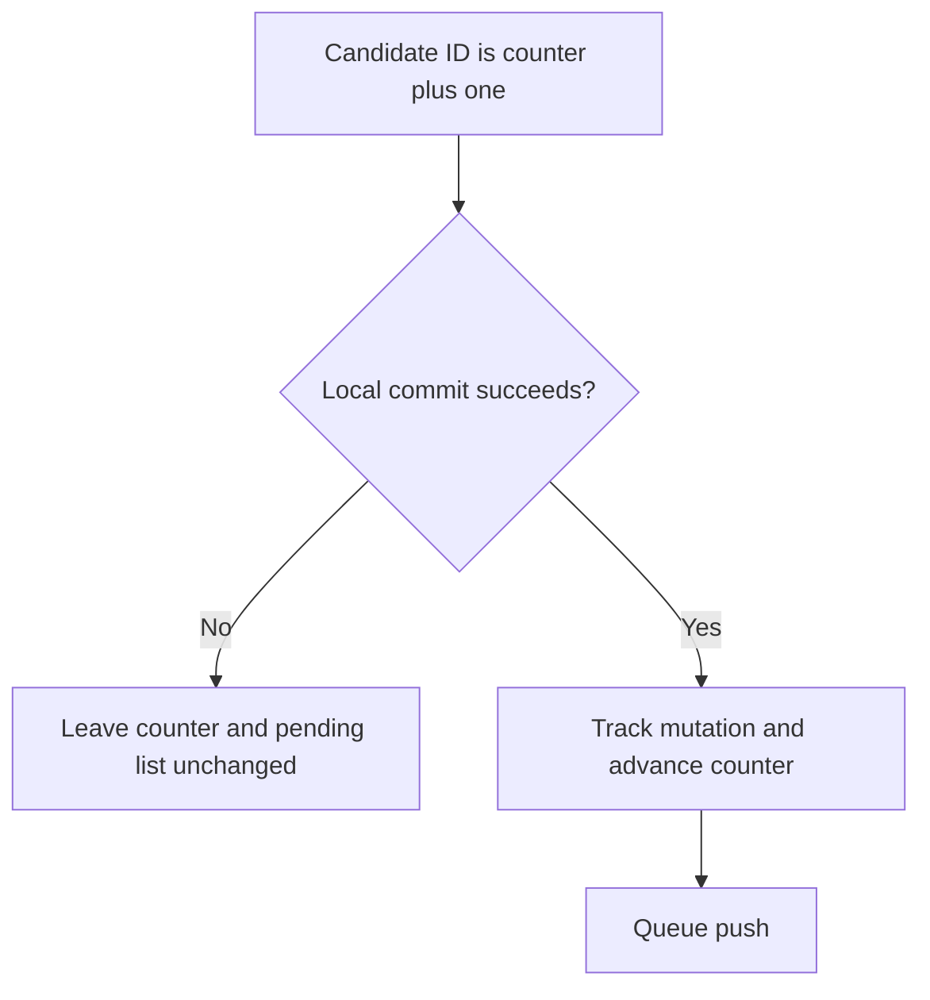
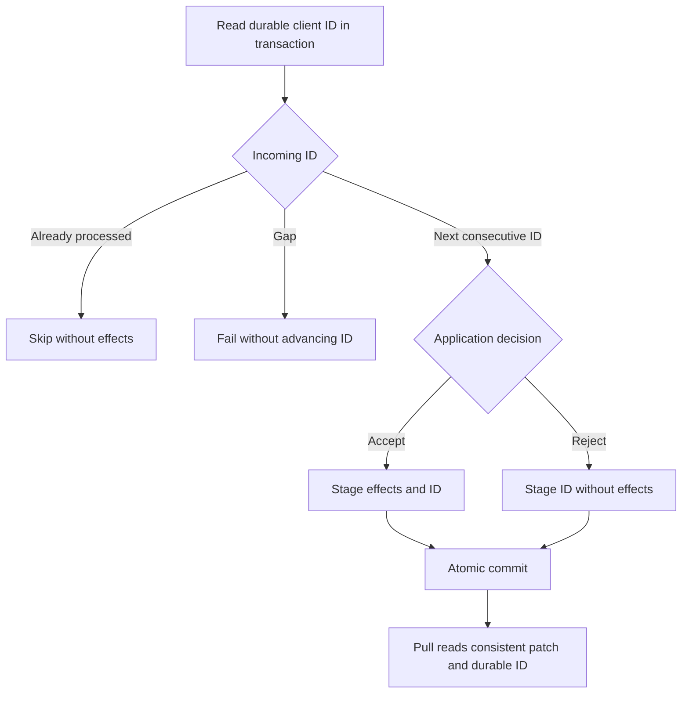
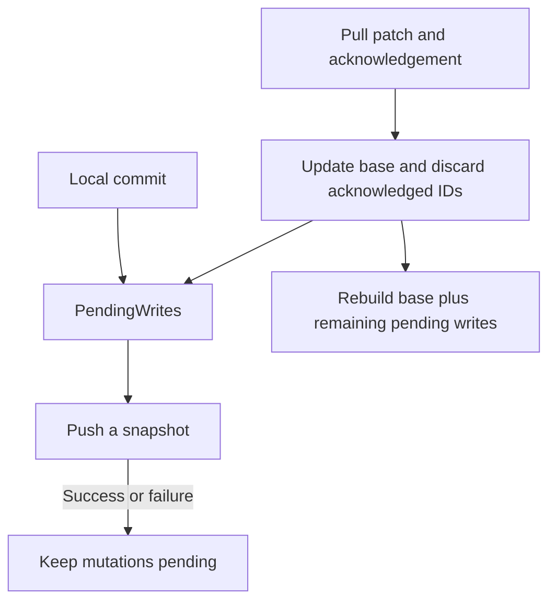
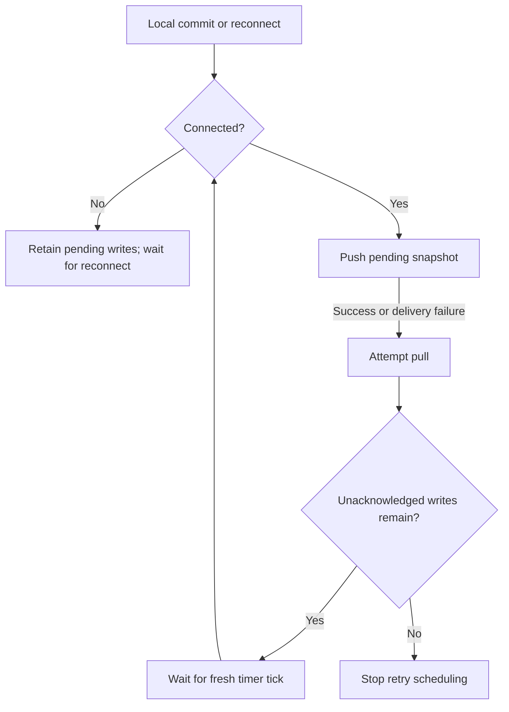
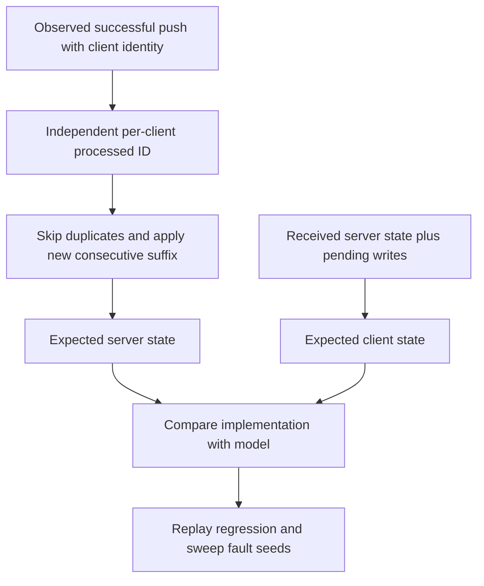

# Retry unacknowledged pushes

Fix for [#43](https://github.com/tanishqkancharla/tandem/issues/43), building on [PR #46](https://github.com/tanishqkancharla/tandem/pull/46), which added numeric mutation IDs and base-plus-pending reconciliation. Phase 1 is implemented; phases 2–5 remain planned.

## Problem

`SyncEngine.push` empties its send queue before sending. Any push failure calls the client's rollback path, removing the optimistic write. A lost request therefore loses a write permanently. A lost response removes a write the server may already have accepted.

```mermaid
sequenceDiagram
    participant C as Client
    participant S as Server
    C->>C: Commit mutation 7 optimistically
    C--xS: Push request lost
    C->>C: Push rejects; rollback removes mutation 7
    Note over C,S: No pending write remains to retry
```

The failure does not tell the client whether the server received the request. Retrying without server deduplication is also unsafe: an old set could overwrite another client's newer edit.

## Solution

Keep each mutation pending until a pull acknowledges it. Retry delivery in ID order. The server stores each client's last processed ID in the same database transaction as the mutation's effects and skips IDs it already processed.

```mermaid
sequenceDiagram
    participant C as Client
    participant S as Server
    participant D as Durable storage
    C->>C: Commit mutation 7 optimistically
    C->>S: Push mutation 7
    S->>D: Atomically commit effects and lastMutationId = 7
    S--xC: Push response lost
    Note over C: Mutation 7 stays pending and visible
    C->>S: Retry mutation 7 after a fresh tick
    S->>D: Read lastMutationId = 7
    S-->>C: Already processed; no effects reapplied
    C->>S: Pull
    S-->>C: Patch and lastMutationId = 7
    C->>C: Apply patch; drop mutation 7; rebuild
```

The scope is retrying pushes, durable server deduplication, and acknowledgement-driven removal. Client-crash persistence (#44) and cookie-based recovery from lost pull responses remain separate work. Fault sweeps may still expose those failures.

## Implementation phases

Each phase is one commit with its focused tests. Land them in order: consecutive client IDs, durable server processing, acknowledgement-owned pending writes, automatic retries, then DST integration. Server deduplication must land before the client can resend writes.

### Phase 1: Allocate IDs only for successful local commits

Implemented. [[packages/core/src/TandemClient.ts#TandemClient]] now advances the counter only after `PendingWrites.commitAndTrack` succeeds. A failed local transaction does not consume a mutation ID. This establishes the consecutive sequence the server will enforce in phase 2 without changing delivery behavior.

```diff
 TandemClient.commit(transaction):
-    increment mutation counter before local commit
+    mutation.id = mutation counter + 1
     PendingWrites.commitAndTrack(mutation, transaction)
+    advance mutation counter after local commit succeeds
     schedule push
```



A temporary regression test created a real local transaction conflict, verified that the failed draft was not replayed, then checked that the server acknowledged the next write as ID 2 rather than 3. It failed before the fix and passed afterward; the test was removed at the user's request. Repository type-checks, tests, and lint passed with the fix.

### Phase 2: Make server processing durable and idempotent

[[packages/server/src/TandemServer.ts#TandemServer]] currently applies every received mutation and records its acknowledgement in memory. This commit makes repeated delivery safe and makes pulls report the durable acknowledgement. Keep these changes together so pushes and pulls cannot disagree about which IDs were processed.

Process mutations in order, with a transaction per new mutation. Extend the server tuple storage union to include client metadata; do not expose it as application records.

```diff
 Server storage tuples:
     application records and indexes
+    ["client", clientId] -> { lastMutationId }

 TandemServer.applyPush(clientId, mutations):
-    begin batch transaction
     for mutation in mutations:
-        stage mutation.ops
-    commit batch transaction
-    inMemoryClients[clientId].lastMutationId = mutations.last.id
+        begin transaction
+        last = read ["client", clientId].lastMutationId ?? 0
+
+        if mutation.id <= last:
+            discard transaction
+            continue                      // duplicate; no writes or pokes
+
+        if mutation.id != last + 1:
+            discard transaction
+            return gap error              // missing IDs are not acknowledged
+
+        decision = validate mutation
+        if decision is explicit application rejection:
+            stage no record changes
+        else:
+            stage every mutation operation
+
+        stage ["client", clientId].lastMutationId = mutation.id
+        commit atomically
+        advance revision and emit pokes after commit
```

An explicit application rejection consumes the ID without effects. A transport error, storage failure, or unexpected exception is not such a rejection. On a failed database commit, neither the effects nor the ID advance. Validation above describes the decision boundary, not a new public validation-hook API; do not classify arbitrary caught exceptions as rejections.

Concurrent pushes for the same client must serialize or conflict on the transactional client-state read. A conflicted transaction is retried from a fresh read, never committed with a stale acknowledgement. A partially completed batch is safe to resend because its committed prefix is skipped.

The patch and acknowledgement must describe a consistent server state. Read the durable acknowledgement with the data used to build the patch, using a read transaction or equivalent serialization with pushes. A server restart must not reset the acknowledgement.

```diff
 TandemServer.readPull(clientId, window, cookie):
-    lastMutationId = inMemoryClients[clientId].lastMutationId ?? 0
-    patch = compute patch
+    in one consistent read:
+        lastMutationId = read ["client", clientId].lastMutationId ?? 0
+        patch = compute patch
     return { patch, lastMutationId, cookie }
```



Validate duplicates after another client's newer edit, reopening durable storage, gaps, concurrent duplicate pushes, and failed storage commits. A failure must leave both records and acknowledgement unchanged. Explicit application rejection must acknowledge without partial effects. The client still has its old rollback behavior at this boundary; retries are not enabled yet.

### Phase 3: Let pull acknowledgements own the pending list

`PendingWrites`, owned by `TandemClient` on remote `main`, already tracks unacknowledged mutations. Expose a snapshot to [[packages/core/src/sync/SyncEngine.ts#SyncEngine]] instead of maintaining a second list with a different lifetime. Remove transport-triggered rollback. Phase 2 makes resending the snapshot safe.

```diff
 SyncEngine:
-    pendingMutations = []
+    readPendingMutations = callback into PendingWrites

 SyncEngine.queuePush():
-    append mutation to pendingMutations
     schedule push

 SyncEngine.push():
-    mutations = pendingMutations
-    pendingMutations = []
+    mutations = snapshot(readPendingMutations())  // ascending ID order
     attempt remote.push(clientId, mutations)
     if failed:
-        handleRollback(mutations)
+        retain all pending mutations
         report delivery failure

 TandemClient:
-    rollback(mutations)

 PendingWrites:
-    rollBackRejected(mutations)

 PendingWrites.applyPull(patch, lastMutationId):
     update server base from patch
     discard mutations with id <= lastMutationId
     rebuild local records from base + remaining mutations
+    // The next push snapshot now excludes these acknowledged writes too.
```



A snapshot prevents newly committed writes from changing an in-flight request. Validate that lost requests and responses leave optimistic values visible, a later queued push includes the retained writes, and a pull removes only the acknowledged prefix, including when its patch is empty. Automatic retries remain for phase 4; this commit changes ownership, not scheduling.

Keep the current public `commit()` promise meaning: it reports the initial push attempt, not eventual pull confirmation. An attempt may reject while the mutation remains queued. Disconnect does not roll back pending writes.

### Phase 4: Schedule retries until confirmation

Retained writes must make progress without another user action. Add a coalesced retry cycle to `SyncEngine`, preserving serialized push/pull execution. [[packages/core/src/utils/TaskQueue.ts#TaskQueue]] can reuse an active batch's resolved delay, so retries must wait for a fresh timer tick rather than re-enqueue immediately into that batch.

```diff
 Sync scheduling:
-    run only the explicitly queued push or pull
+    when connected and pending work exists:
+        run one serialized sync attempt
+        attempt push(snapshot of pending mutations)
+        attempt pull even if push failed
+        if pending work remains:
+            schedule one further attempt after a fresh timer tick
+
+    when disconnected:
+        do not run or keep scheduling network attempts
+
+    when reconnected:
+        resume sync for pending work
```



A failed push may have committed, so a pull can confirm it without another delivery. A successful push also needs a confirming pull; a lost poke must not strand the pending list. Never await a pull queued behind the currently running task from inside that task. Background retries handle and log their own errors without changing the initial commit promise's outcome.

Validate retry progress without another write, lost confirming pulls and pokes, writes arriving during an in-flight attempt, and disconnect/reconnect. A deterministic timer test must prove retries wait for a new tick, stop after confirmation, and never overlap.

### Phase 5: Integrate retries into deterministic simulation

Update the independent server reference model to recognize duplicate deliveries, then retire the fixed #43 recording. This commit changes the simulation and regression artifacts, not the protocol. Focused behavior tests belong to phases 1–4 rather than being deferred here.

```diff
 DST ReferenceModel.accepted:
-    apply every mutation in a delivered push
+    receive client identity alongside mutations
+    track last processed ID per client independently
+    skip duplicates and apply only the new consecutive suffix

 DST regression artifacts:
-    assert the #43 recording still reproduces its known violation
+    verify the reproduction now preserves pending writes and converges
+    remove the fixed recording and its known-failure entry
+    run fault sweeps; distinguish remaining pull-recovery and crash failures
```



The DST client's expected state remains the last received server state plus its unacknowledged writes. The server-side reference model needs duplicate suppression because it currently applies every observed successful push, including retries.

Run the #43 replay and `pnpm dst:run --seed 2 --steps 10 --fault-rate 0.1`, then broader fault sweeps. Delete the recording only after establishing that the delivery bug is fixed, not merely because scheduling changes invalidate an old trace. Report unrelated pull-recovery and client-crash failures separately.

## References

- [Issue #43](https://github.com/tanishqkancharla/tandem/issues/43) — reproduction and expected delivery semantics.
- [PR #46](https://github.com/tanishqkancharla/tandem/pull/46) — merged base-plus-pending prerequisite.
- [[packages/core/src/sync/SyncEngine.ts]] — push, pull, and connection scheduling.
- [[packages/core/src/utils/TaskQueue.ts]] — task batching and timer ownership.
- [[packages/server/src/TandemServer.ts]] — mutation processing and pull responses.
- [[packages/server/src/storage/TandemServerStorage.ts]] — server storage contract.
- [[dst/ReferenceModel.ts]] — independently expected client and server state.
- [[dst/known-failures/README.md]] — replay artifact and remaining failures.
