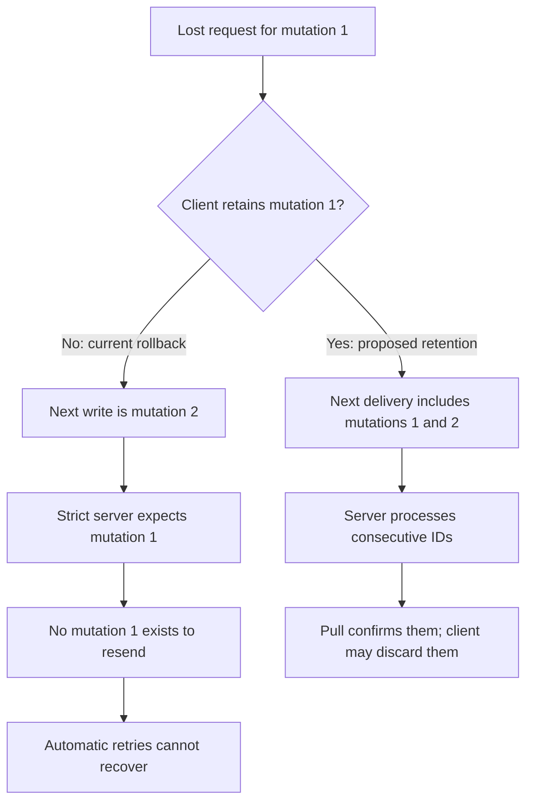
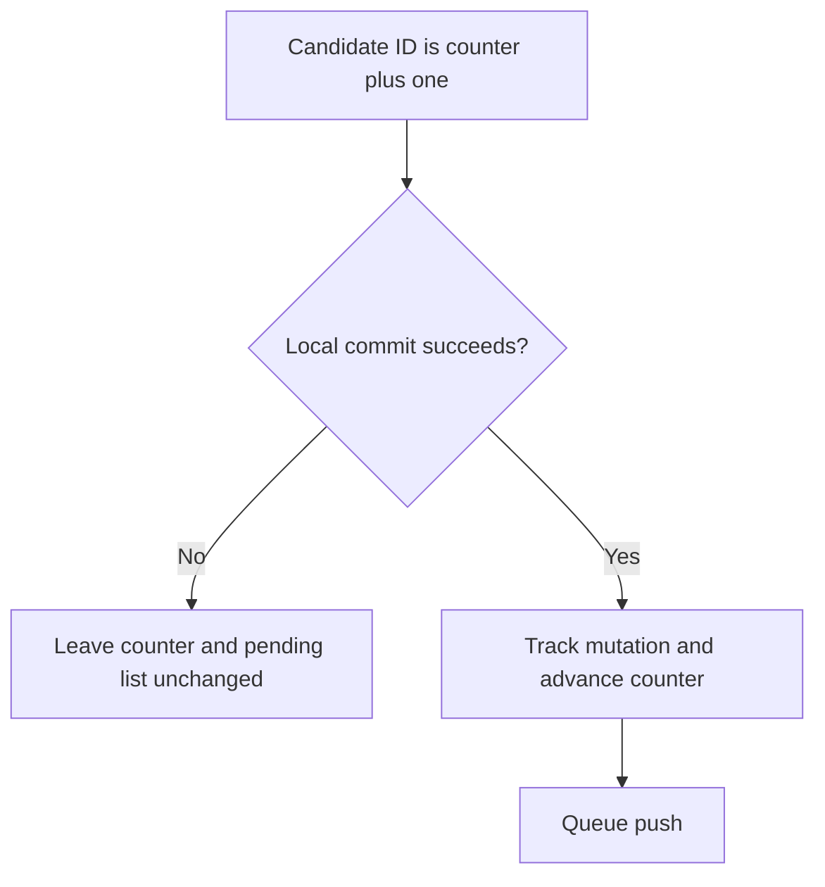
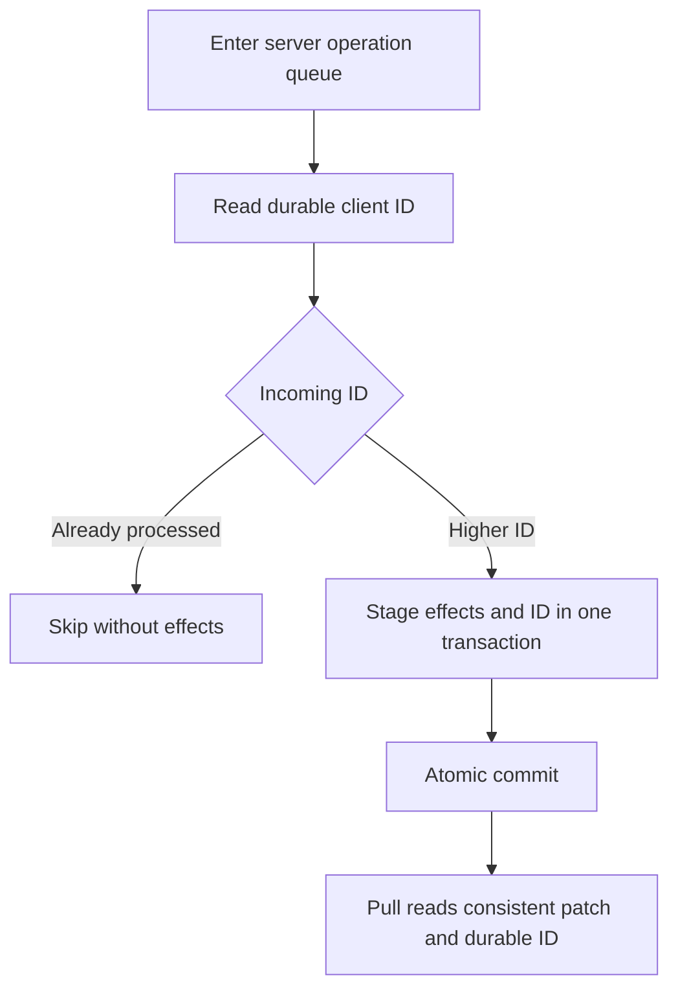
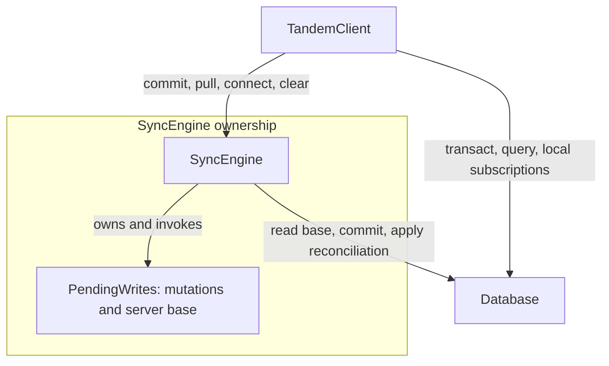
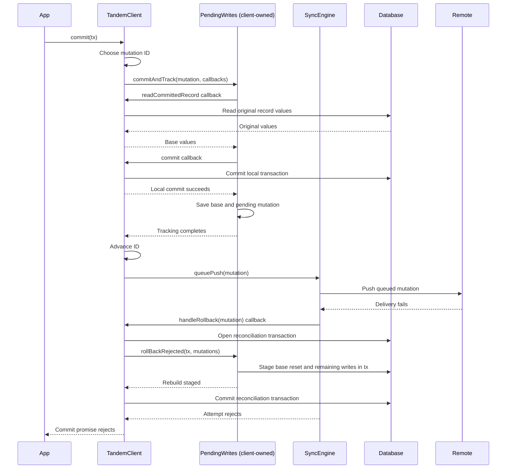
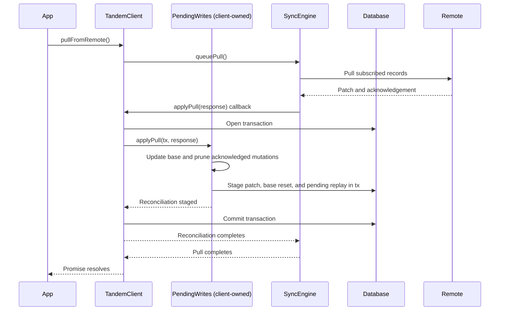
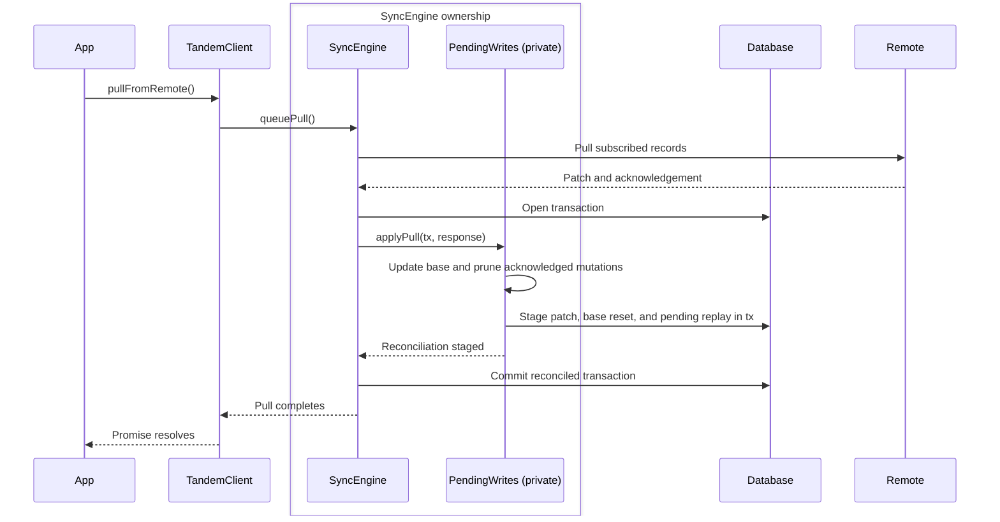
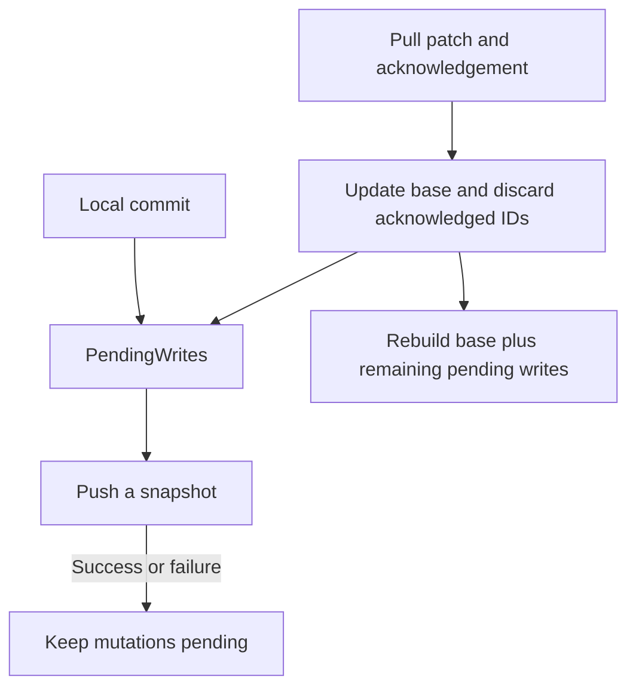
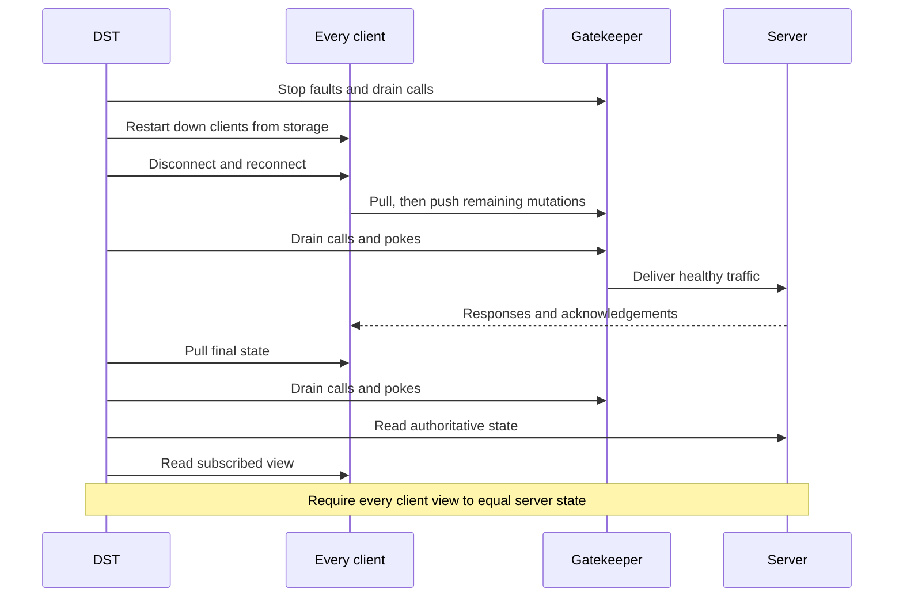

# Retry unacknowledged pushes

Retention fix for [#43](https://github.com/tanishqkancharla/tandem/issues/43), building on [PR #46](https://github.com/tanishqkancharla/tandem/pull/46), which added numeric mutation IDs and base-plus-pending reconciliation. Phases 1, 2, 2.5, and 3 are implemented. The phase-4 automatic retry experiment has been removed: delivery waits for another commit or reconnect. Phase 5 is implemented locally: DST checks final server-authoritative convergence after healthy settlement. Automatic delivery without another action and crash-durable pending writes remain out of scope.

## Problem

Before phase 3, `SyncEngine.push` emptied its send queue before sending. Any push failure called the rollback path, removing the optimistic write. A lost request therefore lost a write permanently. A lost response removed a write the server may already have accepted.

```mermaid
sequenceDiagram
    participant C as Client
    participant S as Server
    C->>C: Commit mutation 7 optimistically
    C--xS: Push request lost
    C->>C: Push rejects; rollback removes mutation 7
    Note over C,S: No pending write remains to retry
```

The failure does not tell the client whether the server received the request. Retrying without server deduplication is also unsafe: an old set could overwrite another client's newer edit.

### The phase 1 investigation reproduced a missing mutation, before gap enforcement

A temporary Gatekeeper test reproduced this sequence against the real client and server after phase 1. It dropped a push before the server received it, checked the rollback and server acknowledgement, then committed another write. The test passed and was removed afterward; no implementation changed for this investigation.

```mermaid
sequenceDiagram
    participant C as Client
    participant S as Phase 1 server
    C->>C: Commit mutation 1, creating lost
    C--xS: Drop request before delivery
    C->>C: Push rejects; discard mutation 1 and its optimistic record
    C->>S: Read acknowledgement
    S-->>C: lastMutationId = 0
    C->>C: Commit mutation 2, creating next
    C->>S: Push mutation 2
    S-->>C: Later pull reports lastMutationId = 2
    Note over C,S: Both hold only next; mutation 1 never reached the server
```

The observed failure was data loss and a jump from acknowledgement 0 to 2. The phase 2 server accepted gaps, so it did not lock the client out. Lockout would follow if we added strict gap checks without first removing destructive rollback:

```diff
 server receives mutation 2 while lastMutationId is 0:
-    current behavior: apply mutation 2 and acknowledge 2
+    proposed strict check: reject gap; expect mutation 1

 client after today's rollback:
     mutation 1 is absent from both pending state and the send queue
-    sending mutation 2 succeeds today
+    resending mutation 2 cannot satisfy the strict check
+    later mutations also cannot satisfy it
```



Phase 1 does not prevent this sequence: mutation 1 committed locally successfully, so consuming its ID was correct. The mistake happens later when transport failure discards it. Retention fixes this demonstrated case; server-generation IDs or a new client-session recovery protocol are not required for it.

Incomplete client persistence and restoring an older server database are separate possible sources of missing history, not scenarios reproduced in this investigation. With complete client retention and durable server acknowledgements, ordinary request or response loss must not create a missing mutation. If a future gap response names an ID absent locally, report missing client history instead of retrying forever or silently skipping it; recovering that corrupted/reset history is separate work.

## Solution

Keep each mutation pending until a pull acknowledges it. Each commit pushes the current pending list in ID order, including older unacknowledged mutations. Reconnect pulls first and then pushes remaining mutations. The server stores each client's last processed ID in the same database transaction as the mutation's effects and skips IDs it already processed. There is no automatic retry or backoff.

```mermaid
sequenceDiagram
    participant C as Client
    participant S as Server
    participant D as Durable storage
    C->>C: Commit mutation 7 optimistically
    C->>S: Push mutation 7
    S->>D: Atomically commit effects and lastMutationId = 7
    S--xC: Push response lost
    Note over C: Mutation 7 stays pending and visible
    C->>C: Later, commit mutation 8
    C->>S: Push pending mutations 7 and 8
    S->>D: Read lastMutationId = 7
    S->>D: Skip 7; apply and acknowledge 8
    S-->>C: Success
    C->>S: Pull
    S-->>C: Patch and lastMutationId = 8
    C->>C: Apply patch; drop mutations 7 and 8; rebuild
```

The scope is retaining writes, safe redelivery on later actions, durable server deduplication, and acknowledgement-driven removal. A final lost request can remain pending indefinitely if no further commit or reconnect occurs. Client-crash persistence (#44) and cookie-based recovery from lost pull responses remain separate work.

## Implementation phases

Each phase is one commit with its focused tests. The implemented order is consecutive client IDs, durable server deduplication, engine ownership of synchronization state, then acknowledgement-owned pending writes together with strict gap enforcement. Phase 2.5 separates the ownership refactor from phase 3's behavior change. Deduplication must precede resending, and strict gap enforcement must not precede removal of destructive rollback. Automatic scheduling is no longer part of this plan; phase numbers stay unchanged for existing references.

### ✅ Phase 1: Allocate IDs only for successful local commits

Implemented. [[phase1-client:new:193-202]] advances the counter only after `PendingWrites.commitAndTrack` succeeds. A failed local transaction does not consume a mutation ID. This establishes the consecutive sequence the server will enforce in phase 3 without changing delivery behavior.

```diff
 TandemClient.commit(transaction):
-    increment mutation counter before local commit
+    mutation.id = mutation counter + 1
     PendingWrites.commitAndTrack(mutation, transaction)
+    advance mutation counter after local commit succeeds
     schedule push
```



A temporary regression test created a real local transaction conflict, verified that the failed draft was not replayed, then checked that the server acknowledged the next write as ID 2 rather than 3. It failed before the fix and passed afterward; the test was removed at the user's request. Repository type-checks, tests, and lint passed with the fix.

### ✅ Phase 2: Make server processing durable and idempotent

Implemented locally. [[phase2-server:new:295-327]] skips processed mutations and makes pulls report durable acknowledgements. Effects and acknowledgements commit together, so retrying an old mutation cannot overwrite a newer edit, even after reopening JSON storage.

Mutations run in request order, with one transaction per new mutation. [[phase2-schema:new:9-16]] includes client metadata outside application records. Strict gap rejection remains deferred to phase 3, where the client stops discarding failed pushes. Phase 2 retains the existing gap acceptance rather than introducing a new lockout.

The shared storage contract owns `TandemTuple`; JSON storage trusts that schema when reading its own files rather than maintaining runtime shape validation. File-I/O and JSON syntax errors still propagate. One root client and its root transactions use the full `TandemTuple<Schema>`. Internal casts narrow collection and metadata views before selecting their subspaces. Query APIs retain full record keys and use a narrowed view of the same root. Both namespaces commit through one transaction; Tandem's public operations are unchanged.

The local `tuple-database` spike showed that distributing prefix calculation alone does not resolve generic subspace results. Explicit namespace types work for the tested string-ID collection operations, but do not yet cover Tandem's compound IDs and aggregate query APIs. The implementation therefore keeps the existing tuple schema and confines casts to internal view boundaries. No fork changes are integrated, pushed, or pinned as dependencies.

The committed changes include the root-client view [[phase2-server:new:150-165]], transaction-query view [[phase2-transaction:new:86-94]], and JSON loading boundary [[phase2-json:new:130-141]].

```diff
 Server storage tuples:
     application records
+    ["client", clientId] -> { lastMutationId }

 TandemServer.applyPush(clientId, mutations):
-    begin batch transaction
+    serialize with other pushes, pulls, and application commits
     for mutation in mutations:
-        stage mutation.ops
-    commit batch transaction
-    inMemoryClients[clientId].lastMutationId = mutations.last.id
+        last = read ["client", clientId].lastMutationId ?? 0
+
+        if mutation.id <= last:
+            continue                      // duplicate; no writes or pokes
+
+        begin transaction
+        stage every mutation operation
+
+        stage ["client", clientId].lastMutationId = mutation.id
+        commit atomically
+        advance revision and emit pokes after commit
```

On a failed storage commit, neither effects nor the ID advance for that mutation. A previously committed prefix of the batch remains committed. Empty mutations still persist their acknowledgement; their retries do not write or poke.

The earlier sketch included an application-rejection branch, but the server has no application validation API. This phase does not introduce one or classify storage exceptions as rejections. The proposed push receipts, gap responses, and pull rejection details are not implemented here; `RemoteApi` keeps its existing push and pull shapes. Explicit rejection handling remains future protocol work.

One server-owned queue serializes pushes, pulls, and application commits across asynchronous storage operations. The tuple database does not provide a snapshot read spanning these operations, so a transactional read alone is insufficient. This assumes one `TandemServer` owns the storage; it does not coordinate multiple server instances sharing storage. Query and transaction reads retain their existing behavior.

In the pinned tuple-database version, conflict bookkeeping happens before `await storage.commit`. A pull beginning during that wait can read the old acknowledgement, then read new records after the commit, without detecting a conflict. Atomic writes alone do not prevent this mixed read. Removing the queue requires stronger transaction guarantees from the database layer.

Pull reads the durable acknowledgement and builds its patch while holding the same queue. A server restart does not reset the acknowledgement.

```diff
 TandemServer.readPull(clientId, window, cookie):
-    lastMutationId = inMemoryClients[clientId].lastMutationId ?? 0
-    patch = compute patch
+    in one consistent read:
+        lastMutationId = read ["client", clientId].lastMutationId ?? 0
+        patch = compute patch
     return { patch, lastMutationId, cookie }
```



Verified retries after another client's newer edit and reopening JSON storage, concurrent duplicate pushes during a blocked storage commit, ordered pull and application commit, partial-batch failure and retry, empty mutations, and the existing failed-storage-commit checks. Repository type-checks and all 133 tests pass. The client still has its old rollback behavior; strict gap rejection and retries are not enabled yet.

The test diffs cover concurrent delivery [[phase2-server-tests:new:536-584]], restart-safe deduplication [[phase2-json-tests:new:84-146]], and the storage commit gate [[phase2-storage-fixture:new:16-25]].

### ✅ Phase 2.5: Move synchronization state into SyncEngine

Implemented, verified, and committed locally. [[phase25-engine:new:96-102]] owns the `PendingWrites` instance and mutation counter and borrows the existing database. `PendingWrites` stays a private reconciliation helper, with its mutation list and server-base map together. [[phase25-client:new:155-160]] delegates synchronized commits to the engine; the client no longer receives callbacks to apply pulls or roll back writes.

The dependency triangle has three top-level components. `TandemClient` exposes the application API and owns the database lifetime. `SyncEngine` coordinates synchronized commits and remote events. `Database` stores and queries local records. `PendingWrites` appears explicitly below, nested inside its engine owner rather than as another top-level service.



`PendingWrites` owns the pending mutation list and per-record server base, not the database or connection. `commitAndTrack` invokes read/commit callbacks supplied by its owner; `applyPull` and `rollBackRejected` stage changes in a transaction supplied by that owner. These helper-to-owner callbacks remain internal to the synchronization component after the move. The sequences show them rather than implying that the helper owns a database connection.

Before: committing touches client-owned reconciliation state, then hands the mutation to a separately maintained engine queue. A failed delivery calls back across the boundary into the client, which changes the database again.



After this ownership-only refactor: the client delegates once. The engine performs the synchronous local work before scheduling the network attempt. Even the old rollback behavior now stays inside the engine instead of calling back into the client; phase 3 removes that rollback.

```mermaid
sequenceDiagram
    participant A as App
    participant C as TandemClient
    box SyncEngine ownership
    participant E as SyncEngine
    participant P as PendingWrites (private)
    end
    participant D as Database
    participant R as Remote
    A->>C: commit(tx)
    C->>E: commit(tx)
    E->>E: Choose mutation ID
    E->>P: commitAndTrack(mutation, callbacks)
    P->>E: readCommittedRecord callback
    E->>D: Read original record values
    D-->>E: Original values
    E-->>P: Base values
    P->>E: commit callback
    E->>D: Commit local transaction
    E-->>P: Local commit succeeds
    P->>P: Save base and pending mutation
    P-->>E: Tracking completes
    E->>E: Advance ID; schedule push
    Note over C,D: Local write is visible before the network attempt
    E->>R: Push queued mutation
    R-->>E: Delivery fails
    E->>D: Open reconciliation transaction
    E->>P: rollBackRejected(tx, mutations)
    P->>D: Stage base reset and remaining writes in tx
    P-->>E: Rebuild staged
    E->>D: Commit reconciliation transaction
    Note over E,D: Rollback retained here; removed in phase 3
    E-->>C: Attempt rejects
    C-->>A: Commit promise rejects
```

Pull has the same simplification. Before, the engine fetches data but asks the client to own reconciliation:



After, the engine owns the whole pull operation. A remote poke enters directly at the engine and follows the same path; neither path asks the client to manage synchronization state.



Queries and draft creation keep the direct client-to-database edge. Subscribing has two deliberate calls: a local database subscription and an engine scan-window registration. Local notifications still return to application callbacks; those are result delivery, not synchronization callbacks into the client. Clients without a configured remote commit directly to the database and need no pending history.

```diff
 TandemClient state:
     db, optional syncEngine
-    pendingWrites, mutationCount

 TandemClient construction:
+    create database before engine; pass the same database to engine
-    pass applyPull and rollback callbacks

 TandemClient.commit(tx):
-    allocate ID; capture base; commit and track; queuePush(mutation)
+    delegate to syncEngine.commit(tx), or db.commit(tx) without a remote

 SyncEngine state:
+    pendingWrites, mutationCount, borrowed database operations
     existing transport queue and connection state

 PendingWrites state and algorithm:
     mutations, server base, commitAndTrack, applyPull, rollBackRejected
-    instance owned and invoked by TandemClient
+    instance owned and invoked privately by SyncEngine
     no algorithm change in this phase

 SyncEngine.commit(tx):
+    capture base and commit locally through PendingWrites
+    track mutation and advance ID only after local success
+    enqueue the existing push operation

 SyncEngine.pull() / failed push:
-    call back into TandemClient for reconciliation
+    open local transaction; invoke private PendingWrites helper; commit

 TandemClient.clear():
-    clear pending state and database directly
+    delegate to engine when present; otherwise clear database directly
```

This phase preserves transport behavior, including the duplicate send queue and failed-push rollback, so the refactor can be verified independently. The engine exists whenever a remote is configured, even before connection, and survives disconnect/reconnect. Local commits do not wait behind network tasks. Repository type checks and all 133 tests passed after the ownership move. Phase 3 removes the duplicate queue and changes retention. Explicit `clear()` discards local history and starts a new sync session.

### ✅ Phase 3: Retain unacknowledged writes and enforce consecutive delivery

Implemented. `PendingWrites`, privately owned by `SyncEngine`, tracks unacknowledged mutations. [[phase3-engine:new:292-298]] pushes a snapshot of that state instead of maintaining a second list with a different lifetime. Transport failure no longer rolls back writes, and the server rejects gaps before opening a transaction. Phase 2 makes resending the snapshot safe; retention prevents the demonstrated missing-history lockout. Explicit `clear()` discards pending writes along with the local database and resets the sync session, rather than rejecting because writes remain pending.

Before phase 3: a lost request removes the optimistic write and its pending mutation. The next write sends only mutation 2. The phase 2 server still accepts gaps, so mutation 1 is permanently lost rather than retried.

```mermaid
sequenceDiagram
    participant App
    participant C as TandemClient
    participant E as SyncEngine / private PendingWrites
    participant S as Phase 2 server
    App->>C: Commit mutation 1
    C->>E: commit(tx)
    E->>E: Apply optimistic write; track and queue mutation 1
    E->>E: Take send queue and clear it
    E--xS: Push mutation 1 lost before delivery
    E->>E: Remove pending mutation and roll back optimistic write
    E-->>C: Initial attempt rejects
    C-->>App: Initial commit attempt rejects
    App->>C: Commit mutation 2
    C->>E: commit(tx)
    E->>E: Apply optimistic write; track and queue mutation 2
    E->>S: Push only mutation 2
    S->>S: Accept gap; commit effects and acknowledgement 2
    S-->>E: Push succeeds
    E->>S: Later pull
    S-->>E: Patch and lastMutationId = 2
    E->>E: Apply pull; discard acknowledged pending writes
    Note over E,S: Mutation 1 exists on neither side
```

After phase 3: delivery failure leaves mutation 1 pending and visible. A new local write schedules a push containing both mutations. The strict server accepts them consecutively; only a later pull acknowledgement removes them from `PendingWrites`. Another write triggers delivery; there is no automatic retry timer.

```mermaid
sequenceDiagram
    participant App
    participant C as TandemClient
    participant E as SyncEngine / private PendingWrites
    participant S as Strict server
    App->>C: Commit mutation 1
    C->>E: commit(tx)
    E->>E: Apply optimistic write; retain mutation 1; schedule push
    E->>E: Snapshot pending mutation 1
    E--xS: Push mutation 1 lost before delivery
    E-->>C: Report failure without rollback
    C-->>App: Initial commit attempt rejects
    Note over E: Mutation 1 remains pending and visible
    App->>C: Commit mutation 2
    C->>E: commit(tx)
    E->>E: Apply optimistic write; retain mutation 2; schedule push
    E->>E: Snapshot mutations 1 and 2 in ID order
    E->>S: Push mutations 1 and 2
    S->>S: Expect 1; atomically commit effects and acknowledgement 1
    S->>S: Expect 2; atomically commit effects and acknowledgement 2
    S-->>E: Push succeeds
    Note over E: Both mutations remain pending until pull confirmation
    E->>S: Later pull
    S-->>E: Patch and lastMutationId = 2
    E->>E: Update base; discard IDs up to 2; rebuild remaining writes
    Note over E,S: Both writes survive; no acknowledged mutations remain pending
```

If the first request committed but its response was lost, the same snapshot is safe: the server skips mutation 1 using its durable acknowledgement, then processes mutation 2. If it receives mutation 2 while still expecting 1, it reports the gap without applying or acknowledging mutation 2.

```diff
 SyncEngine:
-    pendingMutations = []
+    pendingWrites is the only maintained mutation list

 SyncEngine.commit(tx):
     capture base; commit locally; track mutation; advance ID
-    append mutation to pendingMutations
     schedule push

 SyncEngine.push():
-    mutations = pendingMutations
-    pendingMutations = []
+    mutations = pendingWrites.snapshot()  // ascending ID order
     attempt remote.push(clientId, mutations)
     if failed:
-        handleRollback(mutations)
+        retain all pending mutations
         report delivery failure

 PendingWrites:
-    rollBackRejected(mutations)

 SyncEngine.clear():
-    discard pending state but keep client ID, counter, and cookie
+    detach the old connection
+    assign a new client ID; reset mutation counter and cookie
+    clear pending mutations, server base, and local database
+    unregister the old identity; register the new one if previously connected
+    ignore old-session pull responses and pokes

 PendingWrites.applyPull(patch, lastMutationId):
     update server base from patch
     discard mutations with id <= lastMutationId
     rebuild local records from base + remaining mutations
+    // The next push snapshot now excludes these acknowledged writes too.

 TandemServer.applyPush(clientId, mutations):
     skip mutations already processed
+    if mutation.id != lastMutationId + 1:
+        report expected and received IDs without starting a transaction
     commit mutation effects and processed ID atomically
```



A snapshot prevents newly committed writes from changing an in-flight request. Validate that lost requests and responses leave optimistic values visible, a later queued push includes the retained writes, and a pull removes only the acknowledged prefix, including when its patch is empty. Repeat the demonstrated sequence: lose mutation 1's request, commit mutation 2, and verify both reach the strict server in order. Direct requests containing a gap must leave the missing ID unacknowledged. This commit changes ownership and enforcement, not scheduling.

Keep the current public `commit()` promise meaning: it reports the initial push attempt, not eventual pull confirmation. An attempt may reject while the mutation remains queued. Disconnect does not roll back pending writes.

Expected remote failures are typed protocol values in [[packages/core/src/sync/SyncEngine.ts#RemoteApi]], not private server exceptions. They are JSON-safe so the HTTP adapter preserves the same contract as the in-process server. The contract covers the existing failure paths: mutation gaps, invalid requests (including invalid relation queries), and unavailable storage or transport. It does not invent authentication, permission, or application-validation failures that the server cannot currently produce.

```diff
 RemoteApi.push(args):
-    Promise<void>; a gap rejects as an internal server error
+    Promise<{ ok: true }
+      | { error: "mutation-gap", expectedMutationId, receivedMutationId }
+      | { error: "invalid-request", message }
+      | { error: "unavailable", message }>

 RemoteApi.pull(args):
-    Promise<{ cookie, patch, lastMutationId }>
+    Promise<{ cookie, patch, lastMutationId }
+      | { error: "invalid-request", message }
+      | { error: "unavailable", message }>

 RemoteApi.connect(client):
-    Promise<unsubscribe>
+    Promise<unsubscribe | invalid-request | unavailable>

 SyncEngine receives a failure response:
+    retain pending writes; do not apply a patch or acknowledgement
+    reject the corresponding public operation with the response as its cause

 HTTP adapter:
-    discard successful push body; flatten all server failures to HTTP 500
+    pass typed protocol responses through JSON unchanged
+    turn expected network failure into unavailable
```

```mermaid
sequenceDiagram
    participant E as SyncEngine
    participant H as HTTP remote adapter
    participant S as TandemServer
    E->>H: push(snapshot)
    H->>S: JSON push request
    S-->>H: mutation-gap with expected and received IDs
    H-->>E: Same typed error value
    E->>E: Retain pending writes; report failed attempt
    Note over E,S: A resolved remote call can still report a protocol failure
```

An `unavailable` response does not prove that nothing committed: a batch may have committed a prefix, or a reply may have been lost. A pull remains the source of acknowledgements. Invalid requests must be corrected; a gap must be filled rather than silently skipped. Unexpected exceptions may still reject. The DST transport now ignores failure responses when observing accepted writes and received patches; duplicate-aware model changes remain phase 5.

`clear()` is deliberately destructive. Keeping the old identity after discarding mutation 1 would make mutation 2 fail the strict gap check. Resetting only the counter would also be unsafe: the server could mistake a new mutation 1 for an old duplicate. A new identity, counter, and cookie form one reset. `TandemClient.clientId` reflects the current session. Await `clear()` before starting new work. Subscriptions remain registered, but clearing does not immediately pull records back into the empty database.

```mermaid
sequenceDiagram
    participant App
    participant E as SyncEngine
    participant P as PendingWrites
    participant D as Local database
    participant S as Server
    App->>E: clear()
    E->>E: New client ID; counter = 0; no cookie
    E->>P: Discard all mutations and base records
    E->>D: Clear records and client storage
    E->>S: Unregister old identity; register new identity if connected
    S-->>E: Old-session pull response arrives
    E->>E: Ignore stale patch and acknowledgement
    E-->>App: Clear completes
    App->>E: Commit new write
    E->>P: Track mutation 1 in the new session
    E->>S: Push new client ID, mutation 1
    S-->>E: Accepted without a gap or duplicate collision
```

Clearing does not undo server writes or cancel requests already dispatched. Those records may return on a later pull. Tests cover offline clearing followed by successful sync, and a delayed old pull that must not prune the new session's first write.

The lost-request recording no longer loses the optimistic value at step 5. Phase 5 supplies an explicit reconnect during settlement, so its retained mutation reaches the server and both clients converge. This does not promise automatic delivery without another action.

### Phase 4: Automatic retry removed from scope

The local retry/backoff implementation was removed in favor of the committed phase-3 behavior. `TaskQueue` only batches, coalesces, and serializes explicitly requested pushes and pulls. No retry timers, background task hosts, first-attempt receipts, or automatic push-and-confirm cycles remain.

```diff
 commit(transaction):
     commit locally and retain the mutation
-    schedule background sync; return separate first-push receipt
+    return queue.enqueue(push)

 push():
     send snapshot of all pending mutations
-    confirm with pull; decide done / again / retry
-    retry automatically with exponential backoff
+    return success or failure to the caller; retain pending mutations

 pull():
     apply patch; prune acknowledged mutations; replay the rest
-    reset or cancel retry scheduling

 reconnect():
     pull, then push remaining pending mutations once
```

```mermaid
sequenceDiagram
    participant A as Application
    participant C as Client
    participant S as Server
    A->>C: Commit mutation 1
    C->>C: Retain optimistic write
    C--xS: Push lost
    C-->>A: Commit rejects
    Note over C: Keep mutation 1; no retry scheduled
    A->>C: Later, commit mutation 2
    C->>S: Push pending [1, 2]
    S-->>C: Success
    C-->>A: Commit resolves
    S->>C: Poke
    C->>S: Pull
    S-->>C: Acknowledge through 2
    C->>C: Prune both mutations
```

Pokes and explicit pulls acknowledge writes; pulls do not resend them. If a success response or poke is lost, retaining an already-applied mutation is safe because the server deduplicates its next delivery. Without another action, however, a lost request stays local. Pending mutation history is still not crash-durable.

Existing tests cover retention after a lost request, delivery with the next write, reconnect delivery, lost responses, and acknowledgement-driven removal.

### ✅ Phase 5: Check final server-authoritative convergence

Implemented locally. The server replaces the independent reference model as DST's authority. All clients subscribe to the entire `todos` collection. A run may lose in-memory writes on crash, but every final client view must match the server after faults stop and synchronization settles. Protocol tests separately cover mutation ordering and deduplication.

```diff
 simulate or replay:
     apply each scheduled event
-    compare clients and server against ReferenceModel; stop on mismatch
+    settle local work so the next event sees stable call boundaries
+    continue through every requested event

 finish:
     disable faults and drain held calls
     restart crashed clients from existing storage
+    disconnect and reconnect every client
+        pull acknowledgements, then push retained pending mutations
+    drain held calls and poke events
     pull every client and drain again
-    require every historical mutation to be accepted
-    compare server and clients with independent model
+    compare every client's subscribed view directly with server state

 regressions:
-    lost request is a known failure
+    original lost-request trace converges after reconnect
+    ghost local records still fail final convergence
```



The original lost-push recording now lives at `dst/regressions/lost-push.jsonl` and passes. `seed-13-crash-loses-outbox.jsonl` remains a known failure because a ghost record survives final pulls, not because every pre-crash write must reach the server. Removing that ghost would satisfy the contract without adding persistence.

Validation: two sweeps of seeds 1–30, 300 steps each, with fault rate 0.1. The fault-only sweep converged for 29 seeds and reproduced a final mismatch at seed 10. Adding crash rate 0.02 converged for 29 seeds and reproduced a mismatch at seed 7. Both failures leave an extra client record absent from the server; neither sweep reported replay nondeterminism or execution errors. These remaining reconciliation failures are not fixed by changing the DST contract.

## References

- [Issue #43](https://github.com/tanishqkancharla/tandem/issues/43) — reproduction and expected delivery semantics.
- [PR #46](https://github.com/tanishqkancharla/tandem/pull/46) — merged base-plus-pending prerequisite.
- [[packages/core/src/sync/SyncEngine.ts]] — push, pull, and connection scheduling.
- [[packages/core/src/utils/TaskQueue.ts]] — task batching and timer ownership.
- [[packages/server/src/TandemServer.ts]] — mutation processing and pull responses.
- [[packages/server/src/storage/TandemServerStorage.ts]] — server storage contract.
- [[dst/DstWorld.ts]] — healthy settlement and final client/server comparison.
- [[dst/known-failures/README.md]] — replay artifact and remaining failures.

```source-diff:phase1-client:packages/core/src/TandemClient.ts
diff --git a/packages/core/src/TandemClient.ts b/packages/core/src/TandemClient.ts
index 332f74f..d24ff13 100644
--- a/packages/core/src/TandemClient.ts
+++ b/packages/core/src/TandemClient.ts
@@ -190,15 +190,15 @@ export class TandemClient<
 		}
 
 		this.logger.info({ message: "committing transaction" })
-		this.mutationCount += 1
 		const mutation: Mutation<Schema> = {
 			ops: transaction.ops,
-			id: tag<MutationId>(this.mutationCount),
+			id: tag<MutationId>(this.mutationCount + 1),
 		}
 		this.pendingWrites.commitAndTrack(mutation, {
 			readCommittedRecord: ({ collection, id }) => this.db.get(collection, id),
 			commit: () => this.db.commit(transaction),
 		})
+		this.mutationCount += 1
 
 		const commitPromise =
 			this.syncEngine?.queuePush(mutation) ?? Promise.resolve()
```

```source-diff:phase2-server:packages/server/src/TandemServer.ts
diff --git a/packages/server/src/TandemServer.ts b/packages/server/src/TandemServer.ts
index 0d623db..e50062c 100644
--- a/packages/server/src/TandemServer.ts
+++ b/packages/server/src/TandemServer.ts
@@ -15,6 +15,7 @@ import type {
 	ScanWindow,
 	AnyRelations,
 	RuntimeSchemaDefinition,
+	SchemaToTupleSchema,
 } from "@tanishqkancharla/tandem-core"
 import { tag, unreachable, untag } from "@tanishqkancharla/tandem-core"
 import {
@@ -30,6 +31,7 @@ import {
 	subscribeQueryAsync,
 } from "tuple-database"
 import type {
+	AsyncTupleRootTransactionApi,
 	AsyncTupleStorageApi,
 	ReadOnlyAsyncTupleDatabaseClientApi,
 	WriteOps,
@@ -37,6 +39,7 @@ import type {
 import { TandemServerError } from "./TandemServerError.js"
 import { TandemServerTransaction } from "./TandemServerTransaction.js"
 import type {
+	TandemClientTuple,
 	TandemTuple,
 	TandemServerStorageApi,
 } from "./storage/TandemServerStorage.js"
@@ -71,15 +74,12 @@ type SyncedRecordKey<
 }[Collection]
 
 type SyncClientState<Schema extends AnySchema> = {
-	lastMutationId?: MutationId
 	poke?: ClientApi["poke"]
 	scanWindowKey?: string
 	syncedRecordKeys?: SyncedRecordKey<Schema>[]
 }
 
 type CommitOptions = {
-	advanceWithoutWrites?: boolean
-	onCommitted?: () => void
 	operation: "commit" | "push"
 }
 
@@ -142,18 +142,26 @@ export class TandemServer<
 	private readonly tupleDb: AsyncTupleDatabaseClient<TandemTuple<Schema>>
 	private readonly rng?: RngApi
 	private revision = 0
+	// Tuple transactions batch writes but do not snapshot reads or serialize
+	// asynchronous storage commits. Order sync reads and commits here.
+	private queue: Promise<void> = Promise.resolve()
 
 	constructor(args: TandemServerArgs<Schema, Relations>) {
 		this.relations = args.relations
 		this.rng = args.rng
-		this.tupleDb = new AsyncTupleDatabaseClient<TandemTuple<Schema>>(
-			new AsyncTupleDatabase(
-				tandemStorageToTupleDatabaseStorage(args.storage),
-				{
-					rng: args.rng,
-				},
-			),
+		const database = new AsyncTupleDatabase(
+			tandemStorageToTupleDatabaseStorage(args.storage),
+			{ rng: args.rng },
 		)
+		this.tupleDb = new AsyncTupleDatabaseClient<TandemTuple<Schema>>(database)
+	}
+
+	private get recordDb() {
+		// Query APIs retain full ["record", ...] keys. This is the same client,
+		// narrowed for those APIs, not a subspace that strips the record prefix.
+		return this.tupleDb as unknown as AsyncTupleDatabaseClient<
+			SchemaToTupleSchema<Schema>
+		>
 	}
 
 	transact(): TandemServerTransaction<Schema, Relations> {
@@ -163,13 +171,12 @@ export class TandemServer<
 		)
 	}
 
-	async commit(
+	commit(
 		transaction: TandemServerTransaction<Schema, Relations>,
 	): Promise<void> {
-		const result = await this.commitTransaction(transaction, {
-			operation: "commit",
-		})
-		if (result instanceof Error) throw result
+		return this.run(() =>
+			this.commitTransaction(transaction, { operation: "commit" }),
+		)
 	}
 
 	connect: RemoteApi<Schema>["connect"] = ({ clientId, poke }) => {
@@ -187,21 +194,29 @@ export class TandemServer<
 		})
 	}
 
-	push: RemoteApi<Schema>["push"] = async ({ clientId, mutations }) => {
-		const result = await this.applyPush(clientId, mutations)
-		if (result instanceof Error) throw result
-	}
+	push: RemoteApi<Schema>["push"] = ({ clientId, mutations }) =>
+		this.run(() => this.applyPush(clientId, mutations))
 
-	pull: RemoteApi<Schema>["pull"] = async (args) => {
-		const result = await this.readPull(args)
-		if (result instanceof Error) throw result
+	pull: RemoteApi<Schema>["pull"] = (args) =>
+		this.run(() => this.readPull(args))
+
+	private run<T>(operation: () => Promise<T | TandemServerError>): Promise<T> {
+		const result = this.queue.then(async () => {
+			const value = await operation()
+			if (value instanceof Error) throw value
+			return value
+		})
+		this.queue = result.then(
+			() => undefined,
+			() => undefined,
+		)
 		return result
 	}
 
 	async query<Query extends RelationalQuery<Schema, Relations>>(
 		query: Query,
 	): Promise<RelationalQueryResult<Schema, Relations, Query>> {
-		const result = await this.runQuery(this.tupleDb, query, "query")
+		const result = await this.runQuery(this.recordDb, query, "query")
 		if (result instanceof Error) throw result
 		return result
 	}
@@ -214,7 +229,7 @@ export class TandemServer<
 		TandemServerSubscription<RelationalQueryResult<Schema, Relations, Query>>
 	> {
 		const subscription = await subscribeQueryAsync(
-			this.tupleDb,
+			this.recordDb,
 			(db) => this.runQuery(db, query, "subscribe"),
 			(result) => {
 				if (result instanceof Error) {
@@ -255,7 +270,7 @@ export class TandemServer<
 	}
 
 	private runQuery<Query extends RelationalQuery<Schema, Relations>>(
-		db: ReadOnlyAsyncTupleDatabaseClientApi<TandemTuple<Schema>>,
+		db: ReadOnlyAsyncTupleDatabaseClientApi<SchemaToTupleSchema<Schema>>,
 		query: Query,
 		operation: "query" | "subscribe",
 	): Promise<
@@ -277,34 +292,52 @@ export class TandemServer<
 		return created
 	}
 
-	private applyPush(
+	private async applyPush(
 		clientId: ClientId,
 		mutations: Mutation<Schema>[],
 	): Promise<TandemServerError | undefined> {
-		if (mutations.length === 0) return Promise.resolve(undefined)
-
-		const transaction = this.transact()
-		const staged = errore.try(() => {
-			for (const mutation of mutations) {
+		for (const mutation of mutations) {
+			const lastMutationId = await this.readLastMutationId(clientId, "push")
+			if (lastMutationId instanceof Error) return lastMutationId
+			if (mutation.id <= lastMutationId) continue
+
+			const tupleTx = this.tupleDb.transact(this.rng?.randomId())
+			const transaction = new TandemServerTransaction(tupleTx, this.relations)
+			// Narrow before selecting the namespace: tuple-database cannot resolve
+			// subspace types through the generic application-record union.
+			const clientTx = (
+				tupleTx as unknown as AsyncTupleRootTransactionApi<TandemClientTuple>
+			).subspace(["client"])
+			const staged = errore.try(() => {
 				for (const operation of mutation.ops) {
 					applyMutationOperation(transaction, operation)
 				}
+				clientTx.set([clientId], { lastMutationId: mutation.id })
+			})
+			if (staged instanceof Error) {
+				await transaction.cancel()
+				return new TandemServerError({ operation: "push", cause: staged })
 			}
-		})
-		if (staged instanceof Error) {
-			return Promise.resolve(
-				new TandemServerError({ operation: "push", cause: staged }),
-			)
+
+			const committed = await this.commitTransaction(transaction, {
+				operation: "push",
+			})
+			if (committed instanceof Error) return committed
 		}
+	}
 
-		const lastMutationId = mutations.at(-1)?.id
-		return this.commitTransaction(transaction, {
-			advanceWithoutWrites: true,
-			onCommitted: () => {
-				this.getSyncClient(clientId).lastMutationId = lastMutationId
-			},
-			operation: "push",
-		})
+	private async readLastMutationId(
+		clientId: ClientId,
+		operation: "push" | "pull",
+	) {
+		const metadata = (
+			this.tupleDb as unknown as AsyncTupleDatabaseClient<TandemClientTuple>
+		).subspace(["client"])
+		const client = await metadata
+			.get([clientId])
+			.catch((cause) => new TandemServerError({ operation, cause }))
+		if (client instanceof Error) return client
+		return client?.lastMutationId ?? tag<MutationId>(0)
 	}
 
 	private async readPull(
@@ -316,6 +349,8 @@ export class TandemServer<
 		const client = this.getSyncClient(clientId)
 		const scanWindowKey = this.encodeScanWindow(scanWindow)
 		if (scanWindowKey instanceof Error) return scanWindowKey
+		const lastMutationId = await this.readLastMutationId(clientId, "pull")
+		if (lastMutationId instanceof Error) return lastMutationId
 
 		const revision = this.revision
 		const cookieRevision = cookie === undefined ? undefined : untag(cookie)
@@ -326,7 +361,7 @@ export class TandemServer<
 			cookieRevision !== revision
 		const records = shouldRead
 			? await executeScanWindowAsync<Schema, Relations>(
-					this.tupleDb,
+					this.recordDb,
 					this.relations,
 					scanWindow,
 				).catch((cause) => new TandemServerError({ operation: "pull", cause }))
@@ -341,8 +376,6 @@ export class TandemServer<
 					(previous) => !containsRecordKey(currentRecordKeys, previous),
 				)
 			: []
-		const lastMutationId = client.lastMutationId ?? tag<MutationId>(0)
-
 		client.scanWindowKey = scanWindowKey
 		if (shouldRead) client.syncedRecordKeys = currentRecordKeys
 
@@ -373,9 +406,8 @@ export class TandemServer<
 					new TandemServerError({ operation: options.operation, cause }),
 			)
 		if (hasWrites instanceof Error) return hasWrites
-		if (!hasWrites && !options.advanceWithoutWrites) return
+		if (!hasWrites) return
 
-		options.onCommitted?.()
 		this.revision += 1
 		this.emitPokes()
 	}
```

```source-diff:phase2-transaction:packages/server/src/TandemServerTransaction.ts
diff --git a/packages/server/src/TandemServerTransaction.ts b/packages/server/src/TandemServerTransaction.ts
index ad4bb5d..5e023ef 100644
--- a/packages/server/src/TandemServerTransaction.ts
+++ b/packages/server/src/TandemServerTransaction.ts
@@ -6,6 +6,7 @@ import type {
 	RelationalQuery,
 	RelationalQueryResult,
 	AnyRelations,
+	SchemaToTupleSchema,
 } from "@tanishqkancharla/tandem-core"
 import {
 	collectionIdToTuple,
@@ -82,8 +83,12 @@ export class TandemServerTransaction<
 	async query<Query extends RelationalQuery<Schema, Relations>>(
 		query: Query,
 	): Promise<RelationalQueryResult<Schema, Relations, Query>> {
+		// Query execution uses full record keys on the shared root transaction.
+		const records = this.tupleDbTx as unknown as AsyncTupleRootTransactionApi<
+			SchemaToTupleSchema<Schema>
+		>
 		const result = await executeQueryAsync<Schema, Relations, Query>(
-			this.tupleDbTx,
+			records,
 			this.relations,
 			query,
 		).catch((cause) => new TandemServerError({ operation: "query", cause }))
```

```source-diff:phase2-schema:packages/server/src/storage/TandemServerStorage.ts
diff --git a/packages/server/src/storage/TandemServerStorage.ts b/packages/server/src/storage/TandemServerStorage.ts
index 3248e12..4ac6541 100644
--- a/packages/server/src/storage/TandemServerStorage.ts
+++ b/packages/server/src/storage/TandemServerStorage.ts
@@ -1,10 +1,19 @@
 import type {
 	AnySchema,
+	ClientId,
+	MutationId,
 	SchemaToTupleSchema,
 } from "@tanishqkancharla/tandem-core"
 import type { ScanStorageArgs, WriteOps } from "tuple-database"
 
-export type TandemTuple<Schema extends AnySchema> = SchemaToTupleSchema<Schema>
+export type TandemClientTuple = {
+	key: ["client", ClientId]
+	value: { lastMutationId: MutationId }
+}
+
+export type TandemTuple<Schema extends AnySchema> =
+	| SchemaToTupleSchema<Schema>
+	| TandemClientTuple
 
 export interface TandemServerStorageApi<Schema extends AnySchema> {
 	scan(args?: ScanStorageArgs): Promise<TandemTuple<Schema>[]>
```

```source-diff:phase2-json:packages/server/src/storage/TandemServerJsonFileStorage.ts
diff --git a/packages/server/src/storage/TandemServerJsonFileStorage.ts b/packages/server/src/storage/TandemServerJsonFileStorage.ts
index 1d8c3ca..8c1cbe5 100644
--- a/packages/server/src/storage/TandemServerJsonFileStorage.ts
+++ b/packages/server/src/storage/TandemServerJsonFileStorage.ts
@@ -1,12 +1,7 @@
 import crypto from "node:crypto"
 import fs from "node:fs/promises"
 import path from "node:path"
-import type {
-	AnySchema,
-	CollectionId,
-	CollectionIdPart,
-} from "@tanishqkancharla/tandem-core"
-import { collectionIdToTuple } from "@tanishqkancharla/tandem-core/internal"
+import type { AnySchema } from "@tanishqkancharla/tandem-core"
 import * as errore from "errore"
 import { InMemoryTupleStorage } from "tuple-database"
 import type { ScanStorageArgs, WriteOps } from "tuple-database"
@@ -19,11 +14,6 @@ export type TandemServerJsonFileStorageArgs = {
 	filePath: string
 }
 
-type StoredTandemTuple = {
-	key: ["record", collection: string, ...id: CollectionIdPart[]]
-	value: Record<string, unknown> & { id: CollectionId }
-}
-
 type FileOperation =
 	| "clean up temporary file for"
 	| "create directory for"
@@ -55,62 +45,10 @@ function isRecord(value: unknown): value is Record<string, unknown> {
 	return typeof value === "object" && value !== null && !Array.isArray(value)
 }
 
-function isCollectionIdPart(value: unknown): value is CollectionIdPart {
-	return typeof value === "string" || typeof value === "number"
-}
-
-function isCollectionId(value: unknown): value is CollectionId {
-	return (
-		isCollectionIdPart(value) ||
-		(Array.isArray(value) &&
-			value.length > 0 &&
-			value.every(isCollectionIdPart))
-	)
-}
-
-function isStoredTandemTuple(value: unknown): value is StoredTandemTuple {
-	if (!isRecord(value) || !Array.isArray(value.key)) return false
-	const key = value.key
-	if (key.length < 3 || key[0] !== "record") return false
-	if (typeof key[1] !== "string") return false
-	if (!key.slice(2).every(isCollectionIdPart)) return false
-	if (!isRecord(value.value)) return false
-	if (!isCollectionId(value.value.id)) return false
-
-	const idTuple = collectionIdToTuple(value.value.id)
-	return (
-		idTuple.length === key.length - 2 &&
-		idTuple.every((part, index) => part === key[index + 2])
-	)
-}
-
 function isNotFoundError(value: unknown): boolean {
 	return isRecord(value) && value.code === "ENOENT"
 }
 
-function parseTuples({ filePath, raw }: { filePath: string; raw: string }) {
-	const parsed = errore.try({
-		// Wrap the unknown JSON value so Error remains a discriminable union.
-		try: () => ({ value: JSON.parse(raw) as unknown }),
-		catch: (cause) =>
-			new TandemServerJsonFileStorageError({
-				operation: "parse",
-				filePath,
-				cause,
-			}),
-	})
-	if (parsed instanceof Error) return parsed
-	if (Array.isArray(parsed.value) && parsed.value.every(isStoredTandemTuple)) {
-		return parsed.value
-	}
-
-	return new TandemServerJsonFileStorageError({
-		operation: "parse",
-		filePath,
-		cause: new Error("Expected a JSON array of Tandem tuples"),
-	})
-}
-
 export class TandemServerJsonFileStorage<
 	Schema extends AnySchema = AnySchema,
 > implements TandemServerStorageApi<Schema> {
@@ -128,7 +66,7 @@ export class TandemServerJsonFileStorage<
 			if (initialized instanceof Error) return initialized
 
 			// tuple-database's in-memory storage erases its tuple generic. The data
-			// entered this adapter through typed writes or the validated JSON boundary.
+			// comes from typed writes or a file previously written by this adapter.
 			return this.scanMemory(this.memory, args)
 		})
 	}
@@ -189,7 +127,15 @@ export class TandemServerJsonFileStorage<
 		if (raw instanceof Error && isNotFoundError(raw.cause)) return undefined
 		if (raw instanceof Error) return raw
 
-		const tuples = parseTuples({ filePath: this.args.filePath, raw })
+		const tuples = errore.try({
+			try: () => JSON.parse(raw) as TandemTuple<Schema>[],
+			catch: (cause) =>
+				new TandemServerJsonFileStorageError({
+					operation: "parse",
+					filePath: this.args.filePath,
+					cause,
+				}),
+		})
 		if (tuples instanceof Error) return tuples
 
 		this.memory.commit({ set: tuples })
```

```source-diff:phase2-server-tests:packages/server/test/TandemServer.spec.ts
diff --git a/packages/server/test/TandemServer.spec.ts b/packages/server/test/TandemServer.spec.ts
index e598d8d..a1f13e4 100644
--- a/packages/server/test/TandemServer.spec.ts
+++ b/packages/server/test/TandemServer.spec.ts
@@ -6,6 +6,7 @@ import {
 } from "@tanishqkancharla/tandem-core"
 import type {
 	ClientId,
+	Mutation,
 	MutationId,
 	Patch,
 	RemoteApi,
@@ -503,7 +504,7 @@ test("remote pushes preserve operation order and acknowledge the last mutation o
 		scanWindow,
 	})
 	expect(acknowledged.lastMutationId).toBe(2)
-	expect(acknowledged.cookie).toBe(1)
+	expect(acknowledged.cookie).not.toBe(initial.cookie)
 	expect(acknowledged.patch.set).toEqual([
 		{
 			collection: "threads",
@@ -532,6 +533,141 @@ test("remote pushes preserve operation order and acknowledge the last mutation o
 	await server.close()
 })
 
+test("concurrent duplicate pushes are skipped and pulls wait for committed effects", async () => {
+	const { server, storage } = createServer()
+	const clientId = tag<ClientId>("concurrent-client")
+	const scanWindow: ScanWindow<TestSchema> = [{ collection: "users" }]
+	const mutations: Mutation<TestSchema>[] = [
+		{
+			id: tag<MutationId>(1),
+			ops: [
+				{
+					type: "set",
+					collection: "users",
+					value: { id: "user-1", name: "Ada" },
+				},
+			],
+		},
+	]
+	let pokes = 0
+	await server.connect({
+		clientId,
+		poke: () => {
+			pokes += 1
+			return Promise.resolve()
+		},
+	})
+	const gate = storage.pauseNextCommit()
+	const first = server.push({ clientId, mutations })
+	await gate.entered
+	const duplicate = server.push({ clientId, mutations })
+	const pull = server.pull({ clientId, scanWindow })
+	const edit = server.transact()
+	edit.set("users", { id: "user-1", name: "Grace" })
+	const commit = server.commit(edit)
+	gate.release()
+	await Promise.all([first, duplicate, commit])
+
+	expect(await pull).toMatchObject({
+		lastMutationId: 1,
+		patch: {
+			set: [{ collection: "users", value: { id: "user-1", name: "Ada" } }],
+		},
+	})
+	expect(await server.query({ collection: "users" })).toEqual([
+		{ id: "user-1", name: "Grace" },
+	])
+	expect(pokes).toBe(2)
+	await server.close()
+})
+
+test("retrying a partially committed batch skips its prefix and processes its suffix", async () => {
+	const { server, storage } = createServer()
+	const clientId = tag<ClientId>("batch-client")
+	const scanWindow: ScanWindow<TestSchema> = [{ collection: "users" }]
+	const mutations: Mutation<TestSchema>[] = [
+		{
+			id: tag<MutationId>(1),
+			ops: [
+				{
+					type: "set",
+					collection: "users",
+					value: { id: "user-1", name: "Ada" },
+				},
+			],
+		},
+		{
+			id: tag<MutationId>(2),
+			ops: [
+				{
+					type: "set",
+					collection: "users",
+					value: { id: "user-2", name: "Grace" },
+				},
+			],
+		},
+	]
+	const storageCause = new Error("second mutation fails")
+	const disconnect = await server.connect({
+		clientId,
+		poke: () => {
+			storage.failNextCommit(storageCause)
+			return Promise.resolve()
+		},
+	})
+	await expect(server.push({ clientId, mutations })).rejects.toMatchObject({
+		cause: storageCause,
+	})
+	await disconnect()
+	expect(await server.pull({ clientId, scanWindow })).toMatchObject({
+		lastMutationId: 1,
+		patch: {
+			set: [{ collection: "users", value: { id: "user-1", name: "Ada" } }],
+		},
+	})
+
+	const edit = server.transact()
+	edit.set("users", { id: "user-1", name: "Newer edit" })
+	await server.commit(edit)
+	await server.push({ clientId, mutations })
+	expect(await server.pull({ clientId, scanWindow })).toMatchObject({
+		lastMutationId: 2,
+	})
+	expect(await server.query({ collection: "users" })).toEqual([
+		{ id: "user-1", name: "Newer edit" },
+		{ id: "user-2", name: "Grace" },
+	])
+	await server.close()
+})
+
+test("empty mutations advance acknowledgement once, without re-poking on retry", async () => {
+	const { server } = createServer()
+	const clientId = tag<ClientId>("empty-client")
+	let pokes = 0
+	await server.connect({
+		clientId,
+		poke: () => {
+			pokes += 1
+			return Promise.resolve()
+		},
+	})
+	const mutations: Mutation<TestSchema>[] = [
+		{ id: tag<MutationId>(1), ops: [] },
+	]
+	await server.push({ clientId, mutations })
+	const confirmed = await server.pull({ clientId, scanWindow: [] })
+	await server.push({ clientId, mutations })
+	expect(
+		await server.pull({ clientId, scanWindow: [], cookie: confirmed.cookie }),
+	).toEqual({
+		cookie: confirmed.cookie,
+		lastMutationId: 1,
+		patch: { set: [], remove: [] },
+	})
+	expect(pokes).toBe(1)
+	await server.close()
+})
+
 test("push acknowledgement is visible to the pull started by its poke", async () => {
 	const { server } = createServer()
 	const clientId = tag<ClientId>("poked-client")
```

```source-diff:phase2-json-tests:packages/server/test/TandemServerJsonFileStorage.spec.ts
diff --git a/packages/server/test/TandemServerJsonFileStorage.spec.ts b/packages/server/test/TandemServerJsonFileStorage.spec.ts
index 2d458c0..f39115d 100644
--- a/packages/server/test/TandemServerJsonFileStorage.spec.ts
+++ b/packages/server/test/TandemServerJsonFileStorage.spec.ts
@@ -1,7 +1,13 @@
 import fs from "node:fs/promises"
 import os from "node:os"
 import path from "node:path"
-import { collection, defineSchema } from "@tanishqkancharla/tandem-core"
+import { collection, defineSchema, tag } from "@tanishqkancharla/tandem-core"
+import type {
+	ClientId,
+	Mutation,
+	MutationId,
+	ScanWindow,
+} from "@tanishqkancharla/tandem-core"
 import { expect, test as baseTest } from "vitest"
 import { TandemServer, TandemServerJsonFileStorage } from "../src/index.js"
 
@@ -75,6 +81,69 @@ test("persists TandemServer transactions across storage instances", async ({
 	await thirdServer.close()
 })
 
+test("reopened servers acknowledge retries without overwriting another client's edit", async ({
+	filePath,
+}) => {
+	const clientId = tag<ClientId>("retry-client")
+	const otherClientId = tag<ClientId>("other-client")
+	const scanWindow: ScanWindow<TodoSchema> = [{ collection: "todos" }]
+	const mutations: Mutation<TodoSchema>[] = [
+		{
+			id: tag<MutationId>(1),
+			ops: [
+				{
+					type: "set",
+					collection: "todos",
+					value: { id: "todo-1", title: "Original", completed: false },
+				},
+			],
+		},
+	]
+	const first = createServer(filePath)
+	await first.push({ clientId, mutations })
+	await first.push({
+		clientId: otherClientId,
+		mutations: [
+			{
+				id: tag<MutationId>(1),
+				ops: [
+					{
+						type: "set",
+						collection: "todos",
+						value: { id: "todo-1", title: "Newer edit", completed: true },
+					},
+				],
+			},
+		],
+	})
+	await first.close()
+
+	const reopened = createServer(filePath)
+	const before = await reopened.pull({ clientId, scanWindow })
+	let pokes = 0
+	await reopened.connect({
+		clientId,
+		poke: () => {
+			pokes += 1
+			return Promise.resolve()
+		},
+	})
+	await reopened.push({ clientId, mutations })
+	expect(before.lastMutationId).toBe(1)
+	expect(
+		await reopened.pull({ clientId, scanWindow, cookie: before.cookie }),
+	).toEqual({
+		cookie: before.cookie,
+		lastMutationId: 1,
+		patch: { set: [], remove: [] },
+	})
+	expect(await reopened.query({ collection: "todos" })).toEqual([
+		{ id: "todo-1", title: "Newer edit", completed: true },
+	])
+	expect(pokes).toBe(0)
+	await reopened.close()
+})
+
 test("rejects malformed storage files at the adapter boundary", async ({
 	filePath,
 }) => {
```

```source-diff:phase2-storage-fixture:packages/server/test/TandemServerStorage.fixture.ts
diff --git a/packages/server/test/TandemServerStorage.fixture.ts b/packages/server/test/TandemServerStorage.fixture.ts
index fd0894e..1040e5a 100644
--- a/packages/server/test/TandemServerStorage.fixture.ts
+++ b/packages/server/test/TandemServerStorage.fixture.ts
@@ -13,6 +13,16 @@ export class TestTandemServerStorage<
 	closed = false
 	private nextCommitError: Error | undefined
 	private nextScanError: Error | undefined
+	private nextCommitGate:
+		| { entered: () => void; wait: Promise<void> }
+		| undefined
+
+	pauseNextCommit() {
+		const entered = Promise.withResolvers<void>()
+		const release = Promise.withResolvers<void>()
+		this.nextCommitGate = { entered: entered.resolve, wait: release.promise }
+		return { entered: entered.promise, release: release.resolve }
+	}
 
 	failNextCommit(error: Error) {
 		this.nextCommitError = error
@@ -32,7 +42,13 @@ export class TestTandemServerStorage<
 		return Promise.resolve(this.memory.scan(args) as TandemTuple<Schema>[])
 	}
 
-	commit(writes: WriteOps<TandemTuple<Schema>>): Promise<void> {
+	async commit(writes: WriteOps<TandemTuple<Schema>>): Promise<void> {
+		const gate = this.nextCommitGate
+		this.nextCommitGate = undefined
+		if (gate) {
+			gate.entered()
+			await gate.wait
+		}
 		if (this.nextCommitError) {
 			const error = this.nextCommitError
 			this.nextCommitError = undefined
```

```source-diff:phase25-client:packages/core/src/TandemClient.ts
diff --git a/packages/core/src/TandemClient.ts b/packages/core/src/TandemClient.ts
index d24ff13..4d0e0c0 100644
--- a/packages/core/src/TandemClient.ts
+++ b/packages/core/src/TandemClient.ts
@@ -10,22 +10,12 @@ import type {
 	RuntimeSchemaDefinition,
 } from "./schema/Schema.js"
 import type { TandemClientStorageApi } from "./clientStorage/TandemClientStorage.js"
-import { PendingWrites } from "./sync/PendingWrites.js"
-import {
-	SyncEngine,
-	type ClientId,
-	type Patch,
-	type RemoteApi,
-} from "./sync/SyncEngine.js"
-import {
-	Transaction,
-	type Mutation,
-	type MutationId,
-} from "./transaction/Transaction.js"
+import { SyncEngine, type ClientId, type RemoteApi } from "./sync/SyncEngine.js"
+import { Transaction } from "./transaction/Transaction.js"
 import { ConsoleLoggerSink, Logger, type LoggerApi } from "./utils/Logger.js"
 import { randomId, type RngApi } from "./utils/randomId.js"
 import type { TimerApi } from "./utils/Timer.js"
-import { tag, type AsyncUnsubscribe } from "./utils/typeUtils.js"
+import type { AsyncUnsubscribe } from "./utils/typeUtils.js"
 
 export type TandemClientArgs<
 	Schema extends AnySchema,
@@ -74,10 +64,6 @@ export class TandemClient<
 	private readonly logger: LoggerApi
 	private readonly rng: RngApi
 
-	private readonly pendingWrites = new PendingWrites<Schema>()
-	// Not reset by clear(): the server acknowledges every id up to the last one it
-	// applied for this client id, so a reused id would count as acknowledged.
-	private mutationCount = 0
 	constructor({
 		schema,
 		relations,
@@ -93,29 +79,26 @@ export class TandemClient<
 		this.clientId = this.rng.randomId() as ClientId
 		this.logger = logger ?? new Logger({ sinks: new ConsoleLoggerSink() })
 
+		this.db = new Database({
+			schema,
+			relations,
+			logger: this.logger.scope("db"),
+			clientStorage,
+			clientStorageWriteInterval,
+			rng: this.rng,
+		})
+
 		this.syncEngine = remote
 			? new SyncEngine({
 					remote,
+					db: this.db,
 					clientId: this.clientId,
-					handleRollback: (mutationsToRollback) => {
-						this.rollback(mutationsToRollback)
-					},
-					applyPull: (args) => this.applyPull(args),
 					autoConnect,
 					logger: this.logger.scope("sync-engine"),
 					syncInterval,
 				})
 			: undefined
 
-		this.db = new Database({
-			schema,
-			relations,
-			logger: this.logger.scope("db"),
-			clientStorage,
-			clientStorageWriteInterval,
-			rng: this.rng,
-		})
-
 		this.ready = this.db.ready
 	}
 
@@ -128,26 +111,6 @@ export class TandemClient<
 		return this.syncEngine.queuePull()
 	}
 
-	private applyPull({
-		patch,
-		lastMutationId,
-	}: {
-		patch: Patch<Schema>
-		lastMutationId: MutationId
-	}) {
-		this.logger.info({ message: "applying pull" })
-		const tx = this.db.makeTupleDbTransaction()
-		this.pendingWrites.applyPull(tx, { patch, lastMutationId })
-		tx.commit()
-	}
-
-	private rollback(mutationsToRollback: readonly Mutation<Schema>[]) {
-		this.logger.info({ message: "rolling back" })
-		const tx = this.db.makeTupleDbTransaction()
-		this.pendingWrites.rollBackRejected(tx, mutationsToRollback)
-		tx.commit()
-	}
-
 	query<Query extends RelationalQuery<Schema, Relations>>(
 		query: Query,
 	): RelationalQueryResult<Schema, Relations, Query> {
@@ -190,18 +153,11 @@ export class TandemClient<
 		}
 
 		this.logger.info({ message: "committing transaction" })
-		const mutation: Mutation<Schema> = {
-			ops: transaction.ops,
-			id: tag<MutationId>(this.mutationCount + 1),
+		if (!this.syncEngine) {
+			this.db.commit(transaction)
+			return Promise.resolve()
 		}
-		this.pendingWrites.commitAndTrack(mutation, {
-			readCommittedRecord: ({ collection, id }) => this.db.get(collection, id),
-			commit: () => this.db.commit(transaction),
-		})
-		this.mutationCount += 1
-
-		const commitPromise =
-			this.syncEngine?.queuePush(mutation) ?? Promise.resolve()
+		const commitPromise = this.syncEngine.commit(transaction)
 
 		// Ignored commit promises should not surface unhandled rejections.
 		commitPromise.catch(() => {})
@@ -236,9 +192,7 @@ export class TandemClient<
 	async clear() {
 		this.logger.info({ message: "clearing database" })
 
-		this.pendingWrites.clearAll()
-
-		// Clear the database
-		await this.db.clear()
+		if (this.syncEngine) await this.syncEngine.clear()
+		else await this.db.clear()
 	}
 }
```

```source-diff:phase25-engine:packages/core/src/sync/SyncEngine.ts
diff --git a/packages/core/src/sync/SyncEngine.ts b/packages/core/src/sync/SyncEngine.ts
index c8d9136..313ff3d 100644
--- a/packages/core/src/sync/SyncEngine.ts
+++ b/packages/core/src/sync/SyncEngine.ts
@@ -1,9 +1,16 @@
+import type { Database } from "../Database.js"
 import type { EncodedQuery, ScanWindow } from "../query/Query.js"
 import type { AnySchema, CollectionName } from "../schema/Schema.js"
-import type { Mutation, MutationId } from "../transaction/Transaction.js"
+import type {
+	Mutation,
+	MutationId,
+	Transaction,
+} from "../transaction/Transaction.js"
 import type { LoggerApi } from "../utils/Logger.js"
 import { TaskQueue } from "../utils/TaskQueue.js"
 import { Timer, type TimerApi } from "../utils/Timer.js"
+import { tag } from "../utils/typeUtils.js"
+import { PendingWrites } from "./PendingWrites.js"
 import type {
 	AsyncUnsubscribe,
 	Tagged,
@@ -77,8 +84,7 @@ export namespace PatchApi {
 export type SyncEngineArgs<Schema extends AnySchema> = {
 	clientId: ClientId
 	remote: SyncEngine<Schema>["remote"]
-	handleRollback: SyncEngine<Schema>["handleRollback"]
-	applyPull: SyncEngine<Schema>["applyPull"]
+	db: SyncEngine<Schema>["db"]
 	autoConnect?: boolean
 	logger: SyncEngine<Schema>["logger"]
 	syncInterval: number | TimerApi
@@ -87,15 +93,15 @@ export type SyncEngineArgs<Schema extends AnySchema> = {
 export class SyncEngine<Schema extends AnySchema> {
 	private syncQueue: TaskQueue<"pull" | "push">
 	private pendingMutations: Mutation<Schema>[] = []
+	private readonly pendingWrites = new PendingWrites<Schema>()
+	// Keep IDs monotonic for this client identity, including across clear().
+	private mutationCount = 0
+	private readonly db: Pick<
+		Database<Schema>,
+		"get" | "commit" | "makeTupleDbTransaction" | "clear"
+	>
 	private readonly remote: RemoteApi<Schema>
 	private readonly logger: LoggerApi
-	private readonly handleRollback: (
-		mutationsToRollback: readonly Mutation<Schema>[],
-	) => void
-	private readonly applyPull: (args: {
-		patch: Patch<Schema>
-		lastMutationId: MutationId
-	}) => void
 
 	private readonly clientId: ClientId
 	private cookie?: Cookie
@@ -106,8 +112,7 @@ export class SyncEngine<Schema extends AnySchema> {
 	constructor(args: SyncEngineArgs<Schema>) {
 		this.logger = args.logger
 		this.remote = args.remote
-		this.handleRollback = args.handleRollback
-		this.applyPull = args.applyPull
+		this.db = args.db
 		this.clientId = args.clientId
 		const timer =
 			typeof args.syncInterval === "number"
@@ -200,10 +205,21 @@ export class SyncEngine<Schema extends AnySchema> {
 
 		this.cookie = cookie
 
-		this.applyPull({ patch, lastMutationId })
+		const tx = this.db.makeTupleDbTransaction()
+		this.pendingWrites.applyPull(tx, { patch, lastMutationId })
+		tx.commit()
 	}
 
-	queuePush(mutation: Mutation<Schema>): Promise<void> {
+	commit(transaction: Transaction<Schema>): Promise<void> {
+		const mutation: Mutation<Schema> = {
+			ops: transaction.ops,
+			id: tag<MutationId>(this.mutationCount + 1),
+		}
+		this.pendingWrites.commitAndTrack(mutation, {
+			readCommittedRecord: ({ collection, id }) => this.db.get(collection, id),
+			commit: () => this.db.commit(transaction),
+		})
+		this.mutationCount += 1
 		this.logger.info({ message: "queueing push" })
 		this.pendingMutations.push(mutation)
 		return this.syncQueue.enqueue("push")
@@ -225,8 +241,15 @@ export class SyncEngine<Schema extends AnySchema> {
 		} catch (error) {
 			this.logger.error({ message: "error applying mutation", error })
 
-			this.handleRollback(mutations)
+			const tx = this.db.makeTupleDbTransaction()
+			this.pendingWrites.rollBackRejected(tx, mutations)
+			tx.commit()
 			throw error
 		}
 	}
+
+	async clear() {
+		this.pendingWrites.clearAll()
+		await this.db.clear()
+	}
 }
```

```source-diff:phase3-engine:packages/core/src/sync/SyncEngine.ts
diff --git a/packages/core/src/sync/SyncEngine.ts b/packages/core/src/sync/SyncEngine.ts
index 313ff3d..c9a3d4f 100644
--- a/packages/core/src/sync/SyncEngine.ts
+++ b/packages/core/src/sync/SyncEngine.ts
@@ -1,3 +1,4 @@
+import * as errore from "errore"
 import type { Database } from "../Database.js"
 import type { EncodedQuery, ScanWindow } from "../query/Query.js"
 import type { AnySchema, CollectionName } from "../schema/Schema.js"
@@ -7,6 +8,7 @@ import type {
 	Transaction,
 } from "../transaction/Transaction.js"
 import type { LoggerApi } from "../utils/Logger.js"
+import { randomId, type RngApi } from "../utils/randomId.js"
 import { TaskQueue } from "../utils/TaskQueue.js"
 import { Timer, type TimerApi } from "../utils/Timer.js"
 import { tag } from "../utils/typeUtils.js"
@@ -20,6 +22,36 @@ import type {
 export type ClientId = Tagged<"ClientId", string>
 export type Cookie = Tagged<"Cookie", number | string>
 
+/** Expected failures are protocol data, not Error instances requiring revival. */
+export type RemoteUnavailableError = { error: "unavailable"; message: string }
+export type RemoteInvalidRequestError = {
+	error: "invalid-request"
+	message: string
+}
+export type RemoteMutationGapError = {
+	error: "mutation-gap"
+	expectedMutationId: number
+	receivedMutationId: number
+}
+export type RemoteRequestError =
+	| RemoteUnavailableError
+	| RemoteInvalidRequestError
+export type PushResponse =
+	| { ok: true }
+	| RemoteRequestError
+	| RemoteMutationGapError
+export type PullResponse<Schema extends AnySchema> = {
+	cookie: Cookie
+	patch: Patch<Schema>
+	/** The last processed mutation, or 0 before any were applied. */
+	lastMutationId: MutationId
+}
+
+class RemoteResponseError extends errore.createTaggedError({
+	name: "RemoteResponseError",
+	message: "Remote $operation failed",
+}) {}
+
 export type ClientApi = {
 	clientId: ClientId
 	/** Settles when the pull the poke started has finished. Never rejects. */
@@ -27,24 +59,16 @@ export type ClientApi = {
 }
 
 export type RemoteApi<Schema extends AnySchema> = {
-	connect(api: ClientApi): Promise<AsyncUnsubscribe>
+	connect(api: ClientApi): Promise<AsyncUnsubscribe | RemoteRequestError>
 	push(args: {
 		mutations: Mutation<Schema>[]
 		clientId: ClientId
-	}): Promise<void>
+	}): Promise<PushResponse>
 	pull(args: {
 		clientId: ClientId
 		cookie?: Cookie
 		scanWindow: ScanWindow<Schema>
-	}): Promise<{
-		cookie: Cookie
-		patch: Patch<Schema>
-		/**
-		 * The last of this client's mutations the server applied, on every pull.
-		 * 0 before the server has applied any.
-		 */
-		lastMutationId: MutationId
-	}>
+	}): Promise<PullResponse<Schema> | RemoteRequestError>
 }
 
 export type PatchSetOp<Schema extends AnySchema> = {
@@ -88,13 +112,12 @@ export type SyncEngineArgs<Schema extends AnySchema> = {
 	autoConnect?: boolean
 	logger: SyncEngine<Schema>["logger"]
 	syncInterval: number | TimerApi
+	rng?: RngApi
 }
 
 export class SyncEngine<Schema extends AnySchema> {
 	private syncQueue: TaskQueue<"pull" | "push">
-	private pendingMutations: Mutation<Schema>[] = []
 	private readonly pendingWrites = new PendingWrites<Schema>()
-	// Keep IDs monotonic for this client identity, including across clear().
 	private mutationCount = 0
 	private readonly db: Pick<
 		Database<Schema>,
@@ -102,18 +125,24 @@ export class SyncEngine<Schema extends AnySchema> {
 	>
 	private readonly remote: RemoteApi<Schema>
 	private readonly logger: LoggerApi
+	private readonly rng: RngApi
 
-	private readonly clientId: ClientId
+	private currentClientId: ClientId
 	private cookie?: Cookie
 
 	private disconnectFromRemote?: AsyncUnsubscribe
 	private scanWindow: ScanWindow<Schema> = []
 
+	get clientId(): ClientId {
+		return this.currentClientId
+	}
+
 	constructor(args: SyncEngineArgs<Schema>) {
 		this.logger = args.logger
 		this.remote = args.remote
 		this.db = args.db
-		this.clientId = args.clientId
+		this.currentClientId = args.clientId
+		this.rng = args.rng ?? { randomId }
 		const timer =
 			typeof args.syncInterval === "number"
 				? new Timer({ interval: args.syncInterval })
@@ -121,8 +150,14 @@ export class SyncEngine<Schema extends AnySchema> {
 
 		this.syncQueue = new TaskQueue(
 			{
-				pull: () => this.pull(),
-				push: () => this.push(),
+				pull: async () => {
+					const result = await this.pull()
+					if (result instanceof Error) throw result
+				},
+				push: async () => {
+					const result = await this.push()
+					if (result instanceof Error) throw result
+				},
 			},
 			timer,
 		)
@@ -136,26 +171,41 @@ export class SyncEngine<Schema extends AnySchema> {
 	}
 
 	async connect(): Promise<AsyncUnsubscribe> {
+		const connected = await this.connectToRemote()
+		if (connected instanceof Error) throw connected
+		await this.queuePull()
+		if (!this.pendingWrites.isEmpty) {
+			await this.syncQueue.enqueue("push")
+		}
+		return () => this.disconnect()
+	}
+
+	private async connectToRemote() {
 		this.logger.info({ message: "connecting to remote" })
+		const clientId = this.clientId
 		const unsubscribe = await this.remote.connect({
-			clientId: this.clientId,
+			clientId,
 			poke: () => {
+				if (clientId !== this.clientId) return Promise.resolve()
 				this.logger.info({ message: "received poke from remote" })
 				return this.queuePull().catch((error) => {
 					this.logger.error({ message: "error pulling from remote", error })
 				})
 			},
 		})
+		if (typeof unsubscribe !== "function") {
+			return new RemoteResponseError({
+				operation: "connect",
+				cause: unsubscribe,
+			})
+		}
+		if (clientId !== this.clientId) {
+			await unsubscribe()
+			return
+		}
 		this.disconnectFromRemote = unsubscribe
 
 		this.logger.info({ message: "connected to remote" })
-
-		await this.queuePull()
-		if (this.pendingMutations.length > 0) {
-			await this.syncQueue.enqueue("push")
-		}
-
-		return unsubscribe
 	}
 
 	async disconnect() {
@@ -190,11 +240,18 @@ export class SyncEngine<Schema extends AnySchema> {
 		}
 
 		this.logger.info({ message: "pulling from remote" })
-		const { cookie, patch, lastMutationId } = await this.remote.pull({
-			clientId: this.clientId,
+		const clientId = this.clientId
+		const response = await this.remote.pull({
+			clientId,
 			cookie: this.cookie,
 			scanWindow: this.scanWindow,
 		})
+		// A response from before clear() must not acknowledge the new session.
+		if (clientId !== this.clientId) return
+		if ("error" in response) {
+			return new RemoteResponseError({ operation: "pull", cause: response })
+		}
+		const { cookie, patch, lastMutationId } = response
 
 		this.logger.info({
 			message: "pulled from remote",
@@ -221,35 +278,37 @@ export class SyncEngine<Schema extends AnySchema> {
 		})
 		this.mutationCount += 1
 		this.logger.info({ message: "queueing push" })
-		this.pendingMutations.push(mutation)
 		return this.syncQueue.enqueue("push")
 	}
 
 	private async push() {
-		if (this.pendingMutations.length === 0) return
+		if (this.pendingWrites.isEmpty) return
 
 		if (!this.disconnectFromRemote) {
 			this.logger.info({ message: "skipping push while disconnected" })
 			return
 		}
 
-		const mutations = this.pendingMutations
-		this.pendingMutations = []
-
-		try {
-			await this.remote.push({ mutations, clientId: this.clientId })
-		} catch (error) {
-			this.logger.error({ message: "error applying mutation", error })
-
-			const tx = this.db.makeTupleDbTransaction()
-			this.pendingWrites.rollBackRejected(tx, mutations)
-			tx.commit()
-			throw error
+		const response = await this.remote.push({
+			mutations: this.pendingWrites.snapshot(),
+			clientId: this.clientId,
+		})
+		if ("error" in response) {
+			return new RemoteResponseError({ operation: "push", cause: response })
 		}
 	}
 
 	async clear() {
+		const unsubscribe = this.disconnectFromRemote
+		this.disconnectFromRemote = undefined
+		this.currentClientId = tag<ClientId>(this.rng.randomId())
+		this.mutationCount = 0
+		this.cookie = undefined
 		this.pendingWrites.clearAll()
-		await this.db.clear()
+		await Promise.all([this.db.clear(), unsubscribe?.()])
+		// Preserve connection state, but leave the database empty until a later pull.
+		if (!unsubscribe) return
+		const connected = await this.connectToRemote()
+		if (connected instanceof Error) throw connected
 	}
 }
```

```source-diff:phase3-pending:packages/core/src/sync/PendingWrites.ts
diff --git a/packages/core/src/sync/PendingWrites.ts b/packages/core/src/sync/PendingWrites.ts
index fe630a2..1ac0fb9 100644
--- a/packages/core/src/sync/PendingWrites.ts
+++ b/packages/core/src/sync/PendingWrites.ts
@@ -89,6 +89,20 @@ export class PendingWrites<Schema extends AnySchema> {
 	private mutations: Mutation<Schema>[] = []
 	private readonly base = new Map<string, BaseEntry<Schema>>()
 
+	get isEmpty(): boolean {
+		return this.mutations.length === 0
+	}
+
+	/** A stable send list; subsequent commits cannot extend an in-flight push. */
+	snapshot(): Mutation<Schema>[] {
+		return [...this.mutations]
+	}
+
+	clearAll(): void {
+		this.mutations = []
+		this.base.clear()
+	}
+
 	/**
 	 * Runs commit and tracks the mutation as pending. Before the commit runs, it
 	 * reads the committed value of each record the mutation writes that no
@@ -161,35 +175,6 @@ export class PendingWrites<Schema extends AnySchema> {
 		}
 	}
 
-	/** Drops mutations the server rejected and writes the rebuild into tx. */
-	rollBackRejected(
-		tx: TupleRootTransactionApi<SchemaToTupleSchema<Schema>>,
-		rejected: readonly Mutation<Schema>[],
-	): void {
-		const rejectedIds = new Set(rejected.map((mutation) => mutation.id))
-		this.mutations = this.mutations.filter(
-			(mutation) => !rejectedIds.has(mutation.id),
-		)
-		this.resetToBaseAndReplay(tx)
-
-		const lastWrittenBy = new Map<string, MutationId>()
-		for (const mutation of this.mutations) {
-			for (const op of mutation.ops) {
-				lastWrittenBy.set(mutationOpToBaseKey(op), mutation.id)
-			}
-		}
-		for (const [baseKey, entry] of this.base) {
-			const last = lastWrittenBy.get(baseKey)
-			if (last === undefined) this.base.delete(baseKey)
-			else entry.lastWrittenBy = last
-		}
-	}
-
-	clearAll(): void {
-		this.mutations = []
-		this.base.clear()
-	}
-
 	/** Applies a patch op, and keeps it as the base if a pending mutation writes the record. */
 	private applyServerOp(
 		tx: TupleRootTransactionApi<SchemaToTupleSchema<Schema>>,
```

```source-diff:phase3-server:packages/server/src/TandemServer.ts
diff --git a/packages/server/src/TandemServer.ts b/packages/server/src/TandemServer.ts
index e50062c..91c26fa 100644
--- a/packages/server/src/TandemServer.ts
+++ b/packages/server/src/TandemServer.ts
@@ -11,6 +11,7 @@ import type {
 	RelationalQuery,
 	RelationalQueryResult,
 	RemoteApi,
+	RemoteMutationGapError,
 	RngApi,
 	ScanWindow,
 	AnyRelations,
@@ -22,6 +23,7 @@ import {
 	collectionIdsEqual,
 	executeQueryAsync,
 	executeScanWindowAsync,
+	InvalidScanWindowError,
 } from "@tanishqkancharla/tandem-core/internal"
 import type { ScanWindowRecord } from "@tanishqkancharla/tandem-core/internal"
 import * as errore from "errore"
@@ -179,7 +181,7 @@ export class TandemServer<
 		)
 	}
 
-	connect: RemoteApi<Schema>["connect"] = ({ clientId, poke }) => {
+	connect = ({ clientId, poke }: ClientApi) => {
 		const client = this.getSyncClient(clientId)
 		client.poke = poke
 		let disconnected = false
@@ -195,10 +197,22 @@ export class TandemServer<
 	}
 
 	push: RemoteApi<Schema>["push"] = ({ clientId, mutations }) =>
-		this.run(() => this.applyPush(clientId, mutations))
+		this.run(async () => {
+			const result = await this.applyPush(clientId, mutations)
+			if (result instanceof Error) {
+				return { error: "unavailable", message: result.message } as const
+			}
+			return result ?? ({ ok: true } as const)
+		})
 
 	pull: RemoteApi<Schema>["pull"] = (args) =>
-		this.run(() => this.readPull(args))
+		this.run(async () => {
+			const result = await this.readPull(args)
+			if (result instanceof Error) {
+				return { error: "unavailable", message: result.message } as const
+			}
+			return result
+		})
 
 	private run<T>(operation: () => Promise<T | TandemServerError>): Promise<T> {
 		const result = this.queue.then(async () => {
@@ -295,11 +309,18 @@ export class TandemServer<
 	private async applyPush(
 		clientId: ClientId,
 		mutations: Mutation<Schema>[],
-	): Promise<TandemServerError | undefined> {
+	): Promise<TandemServerError | RemoteMutationGapError | undefined> {
 		for (const mutation of mutations) {
 			const lastMutationId = await this.readLastMutationId(clientId, "push")
 			if (lastMutationId instanceof Error) return lastMutationId
 			if (mutation.id <= lastMutationId) continue
+			if (mutation.id !== lastMutationId + 1) {
+				return {
+					error: "mutation-gap",
+					expectedMutationId: lastMutationId + 1,
+					receivedMutationId: mutation.id,
+				}
+			}
 
 			const tupleTx = this.tupleDb.transact(this.rng?.randomId())
 			const transaction = new TandemServerTransaction(tupleTx, this.relations)
@@ -348,7 +369,11 @@ export class TandemServer<
 		const { clientId, cookie, scanWindow } = args
 		const client = this.getSyncClient(clientId)
 		const scanWindowKey = this.encodeScanWindow(scanWindow)
-		if (scanWindowKey instanceof Error) return scanWindowKey
+		if (scanWindowKey instanceof Error)
+			return {
+				error: "invalid-request",
+				message: "Scan window must be serializable",
+			}
 		const lastMutationId = await this.readLastMutationId(clientId, "pull")
 		if (lastMutationId instanceof Error) return lastMutationId
 
@@ -366,6 +391,9 @@ export class TandemServer<
 					scanWindow,
 				).catch((cause) => new TandemServerError({ operation: "pull", cause }))
 			: []
+		if (records instanceof InvalidScanWindowError) {
+			return { error: "invalid-request", message: records.message }
+		}
 		if (records instanceof Error) return records
 
 		const currentRecordKeys = records.map((record) =>
```

```source-diff:phase3-http:examples/todo/apps/web/src/TodoHttpRemote.ts
diff --git a/examples/todo/apps/web/src/TodoHttpRemote.ts b/examples/todo/apps/web/src/TodoHttpRemote.ts
index 11f52a8..e7ff32b 100644
--- a/examples/todo/apps/web/src/TodoHttpRemote.ts
+++ b/examples/todo/apps/web/src/TodoHttpRemote.ts
@@ -1,9 +1,13 @@
 import type {
 	TodoPullResult,
+	TodoPushResult,
 	TodoRemoteRequest,
 	TodoSchema,
 } from "@tandem/example-todo-shared"
-import type { RemoteApi } from "@tanishqkancharla/tandem-core"
+import type {
+	RemoteApi,
+	RemoteRequestError,
+} from "@tanishqkancharla/tandem-core"
 import * as errore from "errore"
 
 class TodoHttpRemoteError extends errore.createTaggedError({
@@ -17,31 +21,34 @@ async function request<Result>({
 }: {
 	operation: "pull" | "push"
 	body: TodoRemoteRequest
-}) {
+}): Promise<Result | RemoteRequestError> {
 	const serialized = errore.try({
 		try: () => JSON.stringify(body),
 		catch: (cause) => new TodoHttpRemoteError({ operation, cause }),
 	})
-	if (serialized instanceof Error) return serialized
+	if (serialized instanceof Error)
+		return { error: "invalid-request", message: serialized.message }
 
 	const response = await fetch("/api/tandem", {
 		method: "POST",
 		headers: { "content-type": "application/json" },
 		body: serialized,
 	}).catch((cause) => new TodoHttpRemoteError({ operation, cause }))
-	if (response instanceof Error) return response
+	if (response instanceof Error)
+		return { error: "unavailable", message: response.message }
 	if (!response.ok) {
-		return new TodoHttpRemoteError({
-			operation,
-			cause: new Error(`HTTP ${response.status}`),
-		})
+		return {
+			error: response.status === 400 ? "invalid-request" : "unavailable",
+			message: `HTTP ${response.status}`,
+		}
 	}
 
 	const parsed = await response
 		.json()
 		.then((value: unknown) => ({ value }))
 		.catch((cause) => new TodoHttpRemoteError({ operation, cause }))
-	if (parsed instanceof Error) return parsed
+	if (parsed instanceof Error)
+		return { error: "unavailable", message: parsed.message }
 
 	// This is the typed JSON boundary after the server validates the envelope.
 	return parsed.value as Result
@@ -64,14 +71,15 @@ export class TodoHttpRemote implements RemoteApi<TodoSchema> {
 	}
 
 	push: RemoteApi<TodoSchema>["push"] = async (args) => {
-		const result = await request<unknown>({
+		const result = await request<TodoPushResult>({
 			operation: "push",
 			body: { action: "push", args },
 		})
-		if (result instanceof Error) throw result
+		if ("error" in result) return result
 
 		// Pull immediately to acknowledge this client's mutation.
 		this.poke?.()
+		return result
 	}
 
 	pull: RemoteApi<TodoSchema>["pull"] = async (args) => {
@@ -79,7 +87,6 @@ export class TodoHttpRemote implements RemoteApi<TodoSchema> {
 			operation: "pull",
 			body: { action: "pull", args },
 		})
-		if (result instanceof Error) throw result
 		return result
 	}
 }
```
