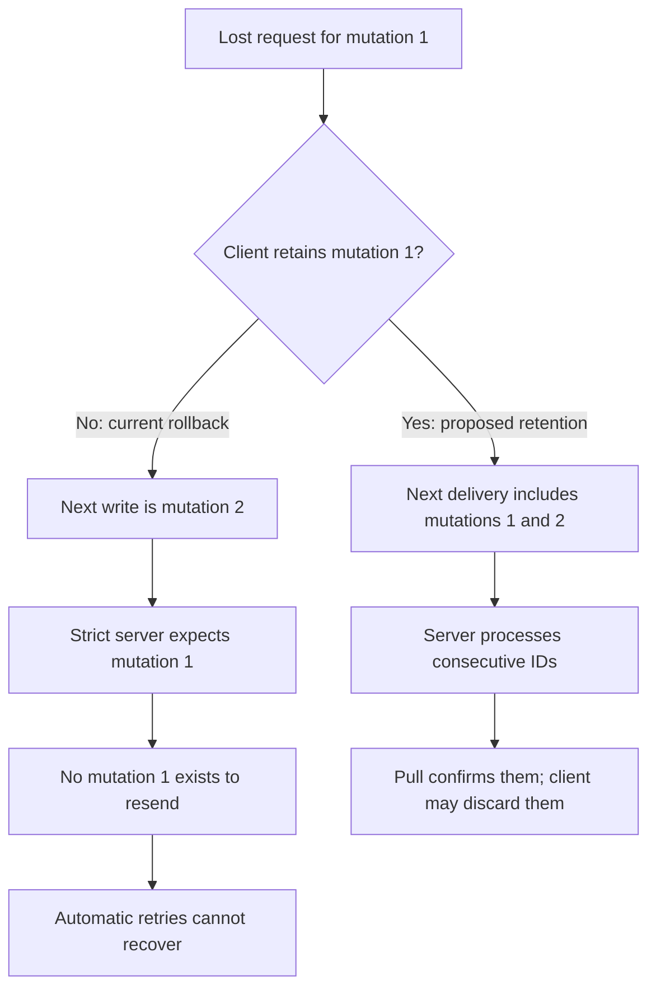
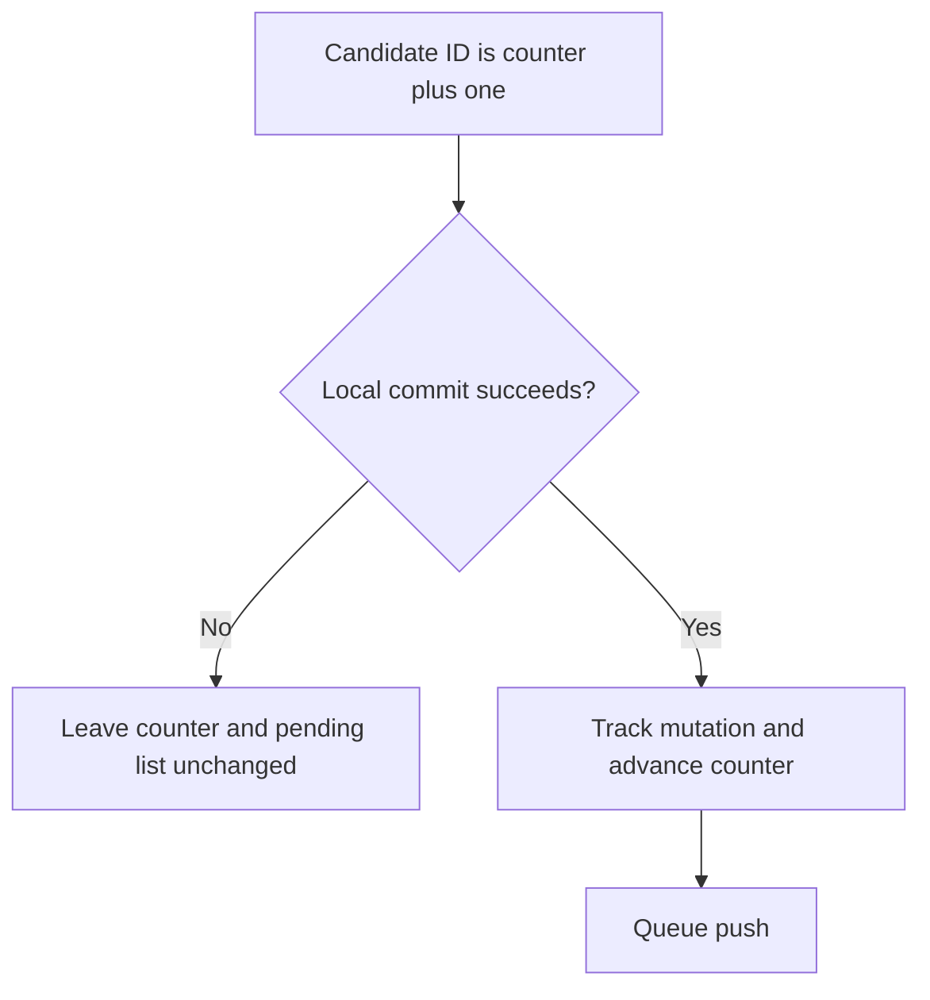
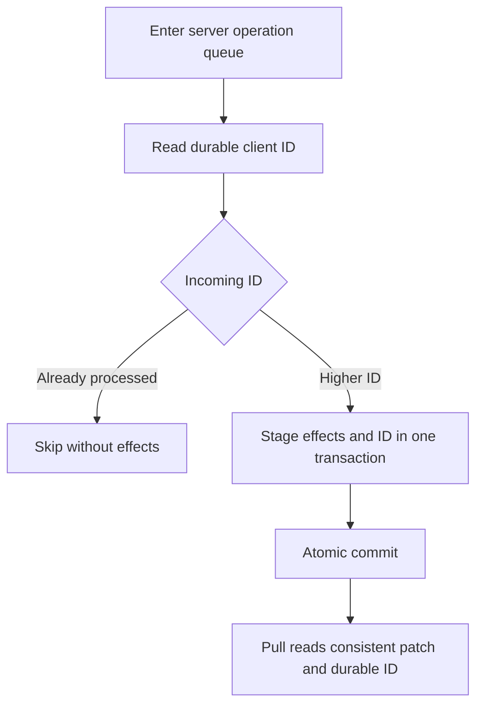
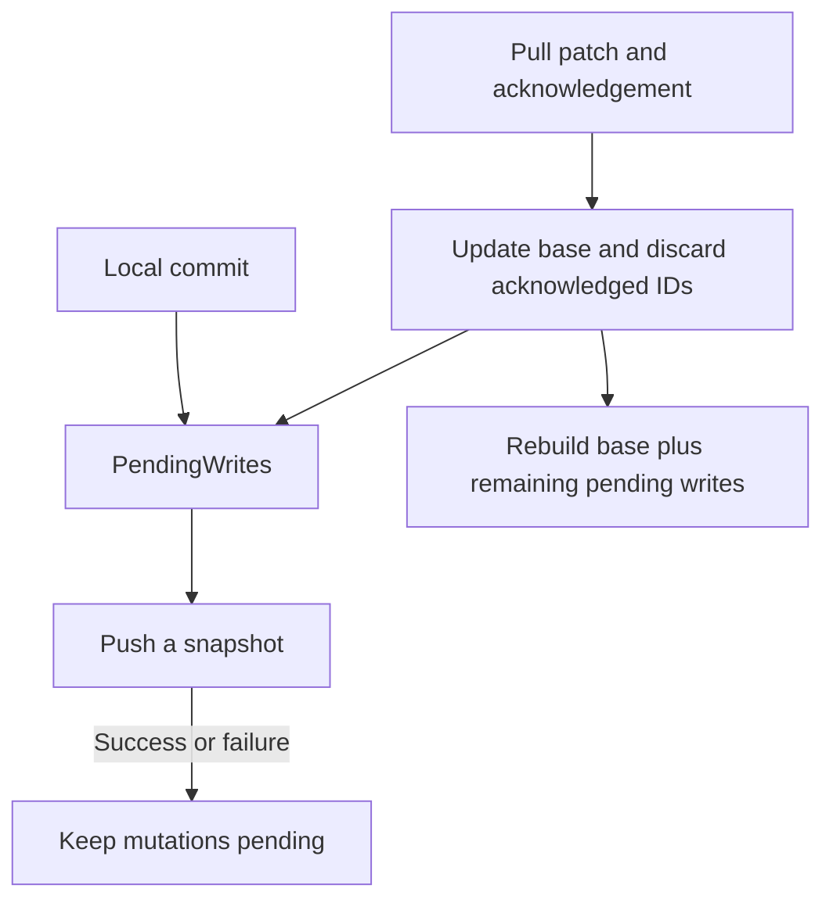
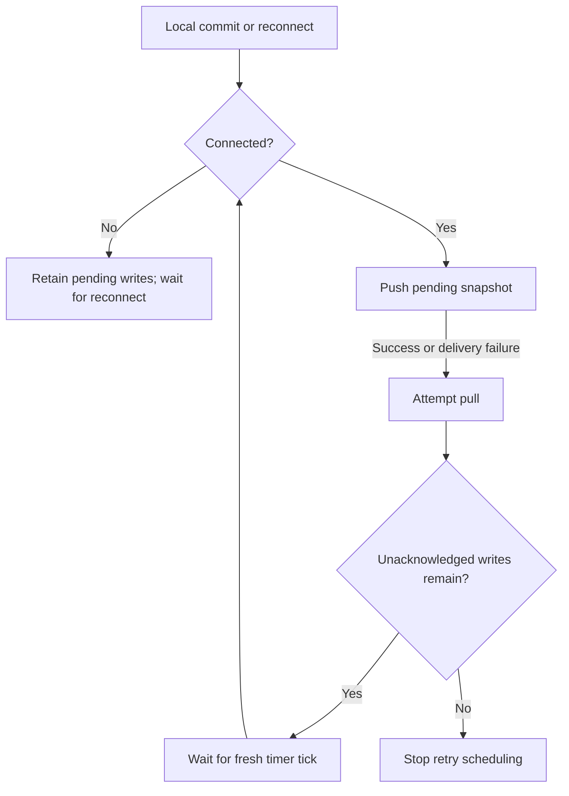
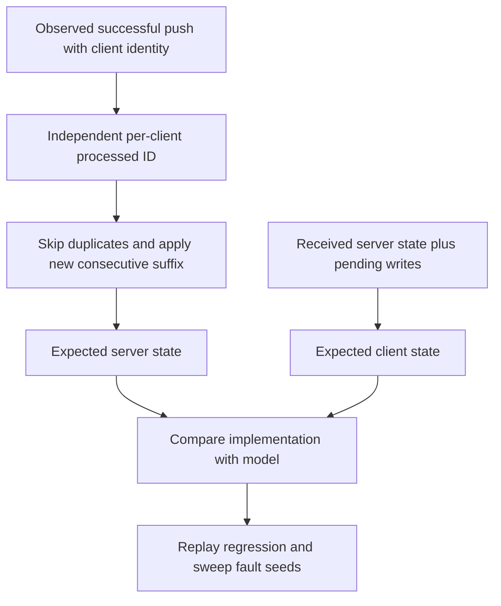

# Retry unacknowledged pushes

Fix for [#43](https://github.com/tanishqkancharla/tandem/issues/43), building on [PR #46](https://github.com/tanishqkancharla/tandem/pull/46), which added numeric mutation IDs and base-plus-pending reconciliation. Phases 1 and 2 are implemented, verified, and committed locally; phases 3–5 remain planned.

## Problem

`SyncEngine.push` empties its send queue before sending. Any push failure calls the client's rollback path, removing the optimistic write. A lost request therefore loses a write permanently. A lost response removes a write the server may already have accepted.

```mermaid
sequenceDiagram
    participant C as Client
    participant S as Server
    C->>C: Commit mutation 7 optimistically
    C--xS: Push request lost
    C->>C: Push rejects; rollback removes mutation 7
    Note over C,S: No pending write remains to retry
```

The failure does not tell the client whether the server received the request. Retrying without server deduplication is also unsafe: an old set could overwrite another client's newer edit.

### A missing mutation is reproducible; gap-check lockout is not current behavior

A temporary Gatekeeper test reproduced this sequence against the real client and server after phase 1. It dropped a push before the server received it, checked the rollback and server acknowledgement, then committed another write. The test passed and was removed afterward; no implementation changed for this investigation.

```mermaid
sequenceDiagram
    participant C as Client
    participant S as Current server
    C->>C: Commit mutation 1, creating lost
    C--xS: Drop request before delivery
    C->>C: Push rejects; discard mutation 1 and its optimistic record
    C->>S: Read acknowledgement
    S-->>C: lastMutationId = 0
    C->>C: Commit mutation 2, creating next
    C->>S: Push mutation 2
    S-->>C: Later pull reports lastMutationId = 2
    Note over C,S: Both hold only next; mutation 1 never reached the server
```

The observed failure is data loss and a jump from acknowledgement 0 to 2. Today's server accepts gaps, so it does not lock the client out. Lockout would follow if we added strict gap checks without first removing destructive rollback:

```diff
 server receives mutation 2 while lastMutationId is 0:
-    current behavior: apply mutation 2 and acknowledge 2
+    proposed strict check: reject gap; expect mutation 1

 client after today's rollback:
     mutation 1 is absent from both pending state and the send queue
-    sending mutation 2 succeeds today
+    resending mutation 2 cannot satisfy the strict check
+    later mutations also cannot satisfy it
```



Phase 1 does not prevent this sequence: mutation 1 committed locally successfully, so consuming its ID was correct. The mistake happens later when transport failure discards it. Retention fixes this demonstrated case; server-generation IDs or a new client-session recovery protocol are not required for it.

Incomplete client persistence and restoring an older server database are separate possible sources of missing history, not scenarios reproduced in this investigation. With complete client retention and durable server acknowledgements, ordinary request or response loss must not create a missing mutation. If a future gap response names an ID absent locally, report missing client history instead of retrying forever or silently skipping it; recovering that corrupted/reset history is separate work.

## Solution

Keep each mutation pending until a pull acknowledges it. Retry delivery in ID order. The server stores each client's last processed ID in the same database transaction as the mutation's effects and skips IDs it already processed.

```mermaid
sequenceDiagram
    participant C as Client
    participant S as Server
    participant D as Durable storage
    C->>C: Commit mutation 7 optimistically
    C->>S: Push mutation 7
    S->>D: Atomically commit effects and lastMutationId = 7
    S--xC: Push response lost
    Note over C: Mutation 7 stays pending and visible
    C->>S: Retry mutation 7 after a fresh tick
    S->>D: Read lastMutationId = 7
    S-->>C: Already processed; no effects reapplied
    C->>S: Pull
    S-->>C: Patch and lastMutationId = 7
    C->>C: Apply patch; drop mutation 7; rebuild
```

The scope is retrying pushes, durable server deduplication, and acknowledgement-driven removal. Client-crash persistence (#44) and cookie-based recovery from lost pull responses remain separate work. Fault sweeps may still expose those failures.

## Implementation phases

Each phase is one commit with its focused tests. Land them in order: consecutive client IDs, durable server deduplication, acknowledgement-owned pending writes together with strict gap enforcement, automatic retries, then DST integration. Deduplication must precede resending, and strict gap enforcement must not precede removal of destructive rollback. Phase 2 alone preserves today's gap acceptance; it does not fix lost writes.

### ✅ Phase 1: Allocate IDs only for successful local commits

Implemented. [[packages/core/src/TandemClient.ts#TandemClient]] now advances the counter only after `PendingWrites.commitAndTrack` succeeds. A failed local transaction does not consume a mutation ID. This establishes the consecutive sequence the server will enforce in phase 3 without changing delivery behavior.

```diff
 TandemClient.commit(transaction):
-    increment mutation counter before local commit
+    mutation.id = mutation counter + 1
     PendingWrites.commitAndTrack(mutation, transaction)
+    advance mutation counter after local commit succeeds
     schedule push
```



A temporary regression test created a real local transaction conflict, verified that the failed draft was not replayed, then checked that the server acknowledged the next write as ID 2 rather than 3. It failed before the fix and passed afterward; the test was removed at the user's request. Repository type-checks, tests, and lint passed with the fix.

### ✅ Phase 2: Make server processing durable and idempotent

Implemented locally. [[packages/server/src/TandemServer.ts#TandemServer]] skips processed mutations and makes pulls report durable acknowledgements. Effects and acknowledgements commit together, so retrying an old mutation cannot overwrite a newer edit, even after reopening JSON storage.

Mutations run in request order, with one transaction per new mutation. [[packages/server/src/storage/TandemServerStorage.ts]] includes client metadata outside application records. Strict gap rejection remains deferred to phase 3, where the client stops discarding failed pushes. Phase 2 retains the existing gap acceptance rather than introducing a new lockout.

The shared storage contract owns `TandemTuple`; JSON storage trusts that schema when reading its own files rather than maintaining runtime shape validation. File-I/O and JSON syntax errors still propagate. One root client and its root transactions use the full `TandemTuple<Schema>`. Internal casts narrow collection and metadata views before selecting their subspaces. Query APIs retain full record keys and use a narrowed view of the same root. Both namespaces commit through one transaction; Tandem's public operations are unchanged.

The local `tuple-database` spike showed that distributing prefix calculation alone does not resolve generic subspace results. Explicit namespace types work for the tested string-ID collection operations, but do not yet cover Tandem's compound IDs and aggregate query APIs. The implementation therefore keeps the existing tuple schema and confines casts to internal view boundaries. No fork changes are integrated, pushed, or pinned as dependencies.

```diff
 Server storage tuples:
     application records
+    ["client", clientId] -> { lastMutationId }

 TandemServer.applyPush(clientId, mutations):
-    begin batch transaction
+    serialize with other pushes, pulls, and application commits
     for mutation in mutations:
-        stage mutation.ops
-    commit batch transaction
-    inMemoryClients[clientId].lastMutationId = mutations.last.id
+        last = read ["client", clientId].lastMutationId ?? 0
+
+        if mutation.id <= last:
+            continue                      // duplicate; no writes or pokes
+
+        begin transaction
+        stage every mutation operation
+
+        stage ["client", clientId].lastMutationId = mutation.id
+        commit atomically
+        advance revision and emit pokes after commit
```

On a failed storage commit, neither effects nor the ID advance for that mutation. A previously committed prefix of the batch remains committed. Empty mutations still persist their acknowledgement; their retries do not write or poke.

The earlier sketch included an application-rejection branch, but the server has no application validation API. This phase does not introduce one or classify storage exceptions as rejections. The proposed push receipts, gap responses, and pull rejection details are not implemented here; `RemoteApi` keeps its existing push and pull shapes. Explicit rejection handling remains future protocol work.

One server-owned queue serializes pushes, pulls, and application commits across asynchronous storage operations. The tuple database does not provide a snapshot read spanning these operations, so a transactional read alone is insufficient. This assumes one `TandemServer` owns the storage; it does not coordinate multiple server instances sharing storage. Query and transaction reads retain their existing behavior.

In the pinned tuple-database version, conflict bookkeeping happens before `await storage.commit`. A pull beginning during that wait can read the old acknowledgement, then read new records after the commit, without detecting a conflict. Atomic writes alone do not prevent this mixed read. Removing the queue requires stronger transaction guarantees from the database layer.

Pull reads the durable acknowledgement and builds its patch while holding the same queue. A server restart does not reset the acknowledgement.

```diff
 TandemServer.readPull(clientId, window, cookie):
-    lastMutationId = inMemoryClients[clientId].lastMutationId ?? 0
-    patch = compute patch
+    in one consistent read:
+        lastMutationId = read ["client", clientId].lastMutationId ?? 0
+        patch = compute patch
     return { patch, lastMutationId, cookie }
```



Verified retries after another client's newer edit and reopening JSON storage, concurrent duplicate pushes during a blocked storage commit, ordered pull and application commit, partial-batch failure and retry, empty mutations, and the existing failed-storage-commit checks. Repository type-checks and all 133 tests pass. The client still has its old rollback behavior; strict gap rejection and retries are not enabled yet.

### Phase 3: Retain unacknowledged writes and enforce consecutive delivery

`PendingWrites`, owned by `TandemClient`, already tracks unacknowledged mutations. Expose a snapshot to [[packages/core/src/sync/SyncEngine.ts#SyncEngine]] instead of maintaining a second list with a different lifetime. Remove transport-triggered rollback and enable strict server gap checks in this same commit. Phase 2 makes resending the snapshot safe; retention prevents the demonstrated missing-history lockout.

```diff
 SyncEngine:
-    pendingMutations = []
+    readPendingMutations = callback into PendingWrites

 SyncEngine.queuePush():
-    append mutation to pendingMutations
     schedule push

 SyncEngine.push():
-    mutations = pendingMutations
-    pendingMutations = []
+    mutations = snapshot(readPendingMutations())  // ascending ID order
     attempt remote.push(clientId, mutations)
     if failed:
-        handleRollback(mutations)
+        retain all pending mutations
         report delivery failure

 TandemClient:
-    rollback(mutations)

 PendingWrites:
-    rollBackRejected(mutations)

 PendingWrites.applyPull(patch, lastMutationId):
     update server base from patch
     discard mutations with id <= lastMutationId
     rebuild local records from base + remaining mutations
+    // The next push snapshot now excludes these acknowledged writes too.

 TandemServer.applyPush(clientId, mutations):
     skip mutations already processed
+    if mutation.id != lastMutationId + 1:
+        discard transaction
+        report gap with expectedMutationId = lastMutationId + 1
     commit mutation effects and processed ID atomically
```



A snapshot prevents newly committed writes from changing an in-flight request. Validate that lost requests and responses leave optimistic values visible, a later queued push includes the retained writes, and a pull removes only the acknowledged prefix, including when its patch is empty. Repeat the demonstrated sequence: lose mutation 1's request, commit mutation 2, and verify both reach the strict server in order. Direct requests containing a gap must leave the missing ID unacknowledged. Automatic retries remain for phase 4; this commit changes ownership and enforcement, not scheduling.

Keep the current public `commit()` promise meaning: it reports the initial push attempt, not eventual pull confirmation. An attempt may reject while the mutation remains queued. Disconnect does not roll back pending writes.

### Phase 4: Schedule retries until confirmation

Retained writes must make progress without another user action. Add a coalesced retry cycle to `SyncEngine`, preserving serialized push/pull execution. [[packages/core/src/utils/TaskQueue.ts#TaskQueue]] can reuse an active batch's resolved delay, so retries must wait for a fresh timer tick rather than re-enqueue immediately into that batch.

```diff
 Sync scheduling:
-    run only the explicitly queued push or pull
+    when connected and pending work exists:
+        run one serialized sync attempt
+        attempt push(snapshot of pending mutations)
+        attempt pull even if push failed
+        if pending work remains:
+            schedule one further attempt after a fresh timer tick
+
+    when disconnected:
+        do not run or keep scheduling network attempts
+
+    when reconnected:
+        resume sync for pending work
```



A failed push may have committed, so a pull can confirm it without another delivery. A successful push also needs a confirming pull; a lost poke must not strand the pending list. Never await a pull queued behind the currently running task from inside that task. Background retries handle and log their own errors without changing the initial commit promise's outcome.

Validate retry progress without another write, lost confirming pulls and pokes, writes arriving during an in-flight attempt, and disconnect/reconnect. A deterministic timer test must prove retries wait for a new tick, stop after confirmation, and never overlap.

### Phase 5: Integrate retries into deterministic simulation

Update the independent server reference model to recognize duplicate deliveries, then retire the fixed #43 recording. This commit changes the simulation and regression artifacts, not the protocol. Focused behavior tests belong to phases 1–4 rather than being deferred here.

```diff
 DST ReferenceModel.accepted:
-    apply every mutation in a delivered push
+    receive client identity alongside mutations
+    track last processed ID per client independently
+    skip duplicates and apply only the new consecutive suffix

 DST regression artifacts:
-    assert the #43 recording still reproduces its known violation
+    verify the reproduction now preserves pending writes and converges
+    remove the fixed recording and its known-failure entry
+    run fault sweeps; distinguish remaining pull-recovery and crash failures
```



The DST client's expected state remains the last received server state plus its unacknowledged writes. The server-side reference model needs duplicate suppression because it currently applies every observed successful push, including retries.

Run the #43 replay and `pnpm dst:run --seed 2 --steps 10 --fault-rate 0.1`, then broader fault sweeps. Delete the recording only after establishing that the delivery bug is fixed, not merely because scheduling changes invalidate an old trace. Report unrelated pull-recovery and client-crash failures separately.

## References

- [Issue #43](https://github.com/tanishqkancharla/tandem/issues/43) — reproduction and expected delivery semantics.
- [PR #46](https://github.com/tanishqkancharla/tandem/pull/46) — merged base-plus-pending prerequisite.
- [[packages/core/src/sync/SyncEngine.ts]] — push, pull, and connection scheduling.
- [[packages/core/src/utils/TaskQueue.ts]] — task batching and timer ownership.
- [[packages/server/src/TandemServer.ts]] — mutation processing and pull responses.
- [[packages/server/src/storage/TandemServerStorage.ts]] — server storage contract.
- [[dst/ReferenceModel.ts]] — independently expected client and server state.
- [[dst/known-failures/README.md]] — replay artifact and remaining failures.
