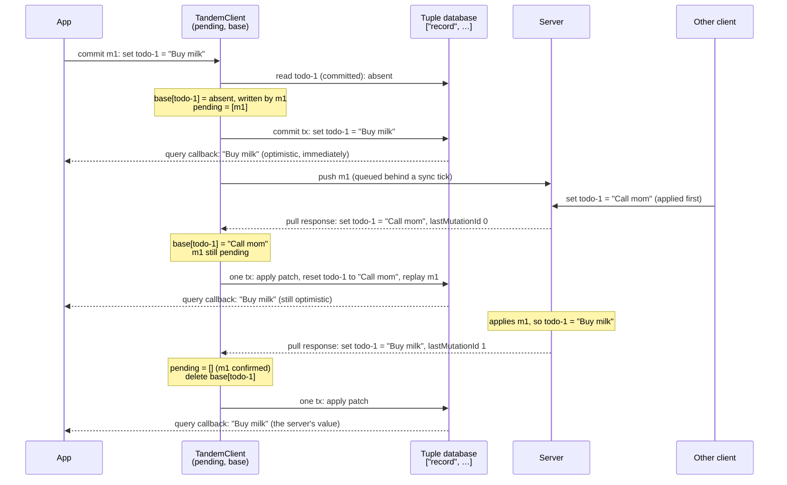

# Sync: rebuild from a base instead of undoing writes

Phase 1 of adopting the Replicache sync model. Fixes [#41](https://github.com/tanishqkancharla/tandem/issues/41) and [#42](https://github.com/tanishqkancharla/tandem/issues/42).

## Problem overview

When a pull arrives, the client rebases: it undoes its unconfirmed writes, applies the server's patch, and redoes the writes the server hasn't acknowledged.

```callstack
 SyncEngine.pull [[packages/core/src/sync/SyncEngine.ts#SyncEngine.pull]]
 └── TandemClient.applyPatchAt [[p2-client:old:132-168]]
     ├── if patch is empty → return                        # drops lastMutationId (#41) [[p2-client:old:141-144]]
     ├── MutationApi.getRollbackWrites(speculative)       # undo with prevValue saved at commit (#42) [[p2-client:old:148-150]]
     ├── PatchApi.toWriteOps(patch) [[p2-client:old:152-154]]
     └── redo speculative writes not yet acknowledged [[p2-client:old:156-163]]
```

Two things in this path are wrong:

- **An empty patch skips the acknowledgement (#41).** The early return runs before `lastMutationId` is read. The server has already cleared its stored acknowledgement in [[packages/server/src/TandemServer.ts#TandemServer.readPull]], so the write stays unconfirmed forever and is redone over every later patch.
- **Undo values go stale (#42).** [[packages/core/src/transaction/Transaction.ts#Transaction.remove]] saves the record's value at commit time. If the server deletes that record before the client's next pull, undoing the acknowledged remove restores a value the server no longer has, and no patch ever removes it.

The early return also hides a third problem. A client that writes records it never subscribed to gets back only empty patches, so its writes are never undone. They stay unconfirmed forever, which happens to keep them visible. Five core tests rely on this, so handling the acknowledgement alone breaks them.

## Solution overview

Replicache's client keeps the last server state, the **base**, separate from its **pending** writes. A pull updates the base from the patch, drops the pending writes up to `lastMutationId`, and rebuilds what the app sees as the base with the remaining pending writes applied. Nothing is undone, so no write needs an undo value.

The app always sees the optimistic value. Queries read the `["record", …]` tuples, which hold the base with every pending write applied. The base itself is private to `TandemClient`, and only the rebuild after a pull reads it.



If the server had rejected m1, the last response would still carry `lastMutationId 1` but set `todo-1 = "Call mom"`, and the app would show that.

This only works if the client can tell which writes a response confirms, whatever the patch contains. So mutation ids become per-client counters, and the server reports the last one it applied on every pull instead of once.

### The base

Tandem doesn't need a full copy of the server state. A record's base value only differs from what the app sees while a pending mutation writes it. So the base holds an entry only for records that pending mutations write, and each entry remembers the newest pending mutation that writes it.

```ts
// packages/core/src/sync/PendingWrites.ts, owned by TandemClient

/** The record an op or a patch entry writes. */
type RecordRef<Schema extends AnySchema> = {
	collection: CollectionName<Schema>
	id: Schema[CollectionName<Schema>]["id"]
}

type BaseEntry<Schema extends AnySchema> = RecordRef<Schema> & {
	/** The server's latest value, or undefined when the server has no such record. */
	value: Schema[CollectionName<Schema>] | undefined
	/** The newest pending mutation that writes this record. */
	lastWrittenBy: MutationId
}

class PendingWrites<Schema extends AnySchema> {
	/** Mutations the server hasn't acknowledged, in ascending id order. */
	private mutations: Mutation<Schema>[] = []
	/** Keyed by JSON of [collection, ...collectionIdToTuple(id)]. */
	private base = new Map<string, BaseEntry<Schema>>()

	captureBase(mutation, readCommitted: (ref: RecordRef<Schema>) => value | undefined): BaseCapture<Schema>
	add(mutation, capture: BaseCapture<Schema>): void
	applyPull(tx, patch: Patch<Schema>, lastMutationId: MutationId): void
	reject(tx, rejected: Mutation<Schema>[]): void
	clear(): void
}
```

Records are identified by collection and id. Every write goes through `getCollectionTransaction` from `Transaction.ts`, which narrows the tuple transaction to one collection's subspace so a record's value type-checks for a generic schema. `Transaction` writes the same way, so `PendingWrites` needs no casts of its own.

The implementation follows this shape:

```callstack
 PendingWrites [[packages/core/src/sync/PendingWrites.ts#PendingWrites]]
 ├── captureBase                                     # read committed values before the commit [[packages/core/src/sync/PendingWrites.ts#PendingWrites.captureBase]]
 │   └── Database.get(collection, id) [[packages/core/src/Database.ts#Database.get]]
 ├── add                                             # record the mutation after the commit succeeds [[packages/core/src/sync/PendingWrites.ts#PendingWrites.add]]
 ├── applyPull                                       # patch, reset, replay, then delete confirmed entries [[packages/core/src/sync/PendingWrites.ts#PendingWrites.applyPull]]
 │   └── receive                                     # write a server value; keep it as the base if pending [[packages/core/src/sync/PendingWrites.ts#PendingWrites.receive]]
 ├── reject                                          # drop rejected mutations and rebuild [[packages/core/src/sync/PendingWrites.ts#PendingWrites.reject]]
 └── rebuild                                         # reset base records, replay ops in order [[packages/core/src/sync/PendingWrites.ts#PendingWrites.rebuild]]
     └── writeRecord                                 # set or remove one record via getCollectionTransaction [[packages/core/src/sync/PendingWrites.ts#writeRecord]]
```

Three invariants hold between operations:

1. **An entry exists exactly for the records pending mutations write.** Its `lastWrittenBy` is the highest id among them.
2. **An entry's `value` is the server's latest value for that record,** as far as this client knows: captured when a pending mutation first writes the record, then replaced by every patch that mentions it.
3. **Each `["record", …]` tuple equals its base value with the pending ops on that record replayed in order.** Records without an entry equal what the server last sent.

Each operation keeps them:

| Operation | `mutations` | `base` | `["record", …]` tuples |
|---|---|---|---|
| `commit` m | append m | for each record m writes: create the entry from the committed value if missing; set `lastWrittenBy = m.id` | m's writes, applied by the transaction as today |
| pull | drop ids ≤ `lastMutationId` | set `value` for records the patch mentions; after the rebuild, delete entries with `lastWrittenBy ≤ lastMutationId` | one tx: apply the patch, reset each entry's record to `value`, replay pending ops in order |
| failed push | remove the rejected mutations | recompute `lastWrittenBy` for records they wrote; delete entries no mutation writes | one tx: reset each entry's record to `value`, replay pending ops in order |
| `clear` | empty | empty | cleared, as today |

Counter ids make cleanup one comparison: an acknowledgement confirms every id up to N, so `lastWrittenBy ≤ N` means no pending mutation writes the record any more. An entry is deleted only after the rebuild, because that rebuild may still need it. For example, the record may be missing from the patch because no subscription covers it.

Here's the state as two pending mutations write the same record. The client is subscribed to `todos`.

| Step | `mutations` | `base["todos/todo-1"]` | Queries see |
|---|---|---|---|
| start | — | — | nothing |
| commit m1: set "A" | m1 | `absent`, written by m1 | "A" |
| commit m2: set "B" | m1, m2 | `absent`, written by m2 | "B" |
| pull: another client set "X"; ack 0 | m1, m2 | `"X"`, written by m2 | reset "X", replay m1, m2 → "B" |
| pull: server applied m1; patch "A"; ack 1 | m2 | `"A"`, written by m2 (2 > 1, kept) | reset "A", replay m2 → "B" |
| pull: server applied m2; patch "B"; ack 2 | — | deleted after the rebuild | "B" |

Two variants of the same history:

- **m2 is rejected after the fourth step:** `mutations` becomes m1, the entry's `lastWrittenBy` is recomputed as m1, and the rebuild resets to "X" and replays m1, so queries show "A".
- **No subscription covers `todo-1`:** no patch ever mentions it, so the entry keeps `absent`. After ack 2 the rebuild resets the record to `absent` and replay adds nothing, so the record disappears locally. This is the behavior change for writes outside the window.

Keying entries by record rather than by mutation matters. If each mutation kept its own copy, m2's copy would be the value m1 wrote, not the server's: that's `prevValue`, the #42 bug. And deleting m1's copy on its acknowledgement would lose the server value that m2's rebuild still needs.

The base stays out of the tuple database. `SchemaToTupleSchema` only allows `["record", …]` keys, client storage persists every tuple and would store the base without its pending mutations, and no query reads it. Phase 4 of the Replicache plan persists the base and pending mutations together.

Replay applies each op in order with `tx.set` and `tx.remove`. Within one tuple transaction, the last `set` or `remove` for a key wins (`TupleRootTransaction.set` and `.remove`), so queries only see each record's final value. `tx.write(MutationApi.toWriteOps(ops))` can't be used: `TupleRootTransaction.write` applies all removes before all sets, so a mutation that sets and then removes a record would replay as a set. Today's rebase replays that way.

### Why this is bigger than the one-line fix

The one-line fix (handle the acknowledgement on an empty patch) fixes #41 but breaks five tests and leaves #42. Doing it properly touches every layer that knows what a mutation looks like:

| Area | Change | Why it's needed |
|---|---|---|
| Wire protocol, `RemoteApi` | `MutationId` becomes a per-client counter; `pull` always returns `lastMutationId` | The client must match acknowledgements by order, on every pull |
| Server, `TandemServer.readPull` | Report `lastMutationId` on every pull instead of clearing it | Same |
| Client, `TandemClient` | Keep the base next to pending mutations; rebuild instead of undo | Fixes #41 and #42 |
| Transactions, `Transaction` | Ops lose `prevValue` and `value`; `remove` is recorded even when the record isn't local | Undo values go away; a client can delete a record outside its window |
| Public exports, `index.ts` | Remove `InvertibleMutation*` types and `MutationApi.getRollbackWrites` | They describe undo values that no longer exist |
| **Behavior** | A confirmed write outside the client's subscriptions disappears locally on the next pull | This is what the base model means, and it's Replicache's behavior. Five tests change |
| DST | The reference model acknowledges by counter; every recording is re-recorded | Recorded mutation ids change format, so old recordings stop replaying |

Of these, only the behavior change affects app code.

## Goals

- #41 and #42 no longer reproduce, in DST or through the public API.
- No mutation carries an undo value.
- An acknowledgement is handled on every pull, including one with an empty patch.
- The base only holds entries for records pending mutations write, and an acknowledgement deletes them.
- A client can delete a record it doesn't have locally, and the delete reaches the server.
- A write rejected by a failed push is removed by rebuilding from the base, not by undoing it.

## Non-goals

- Retrying failed pushes or deduplicating on the server. That's phase 3 of the Replicache plan (#43). A failed push still rolls back in this work.
- Client view records per cookie, row versions, or delta patches. That's phase 2 of the Replicache plan.
- Persisting the base or pending mutations across restarts. That's phase 4 of the Replicache plan (#44). Both live in memory here.
- Keeping writes outside the client's subscriptions visible after they're confirmed.
- Replaying mutation logic. Replay repeats each op's stored value, as today, not the function that produced it.

## Implementation

Each phase is one commit that leaves `pnpm test` and `pnpm type-check` passing.

### Phase 1: Per-client mutation counters, acknowledged on every pull

Change the protocol first, with no change to how the client rebases. The server reports its last applied id on every pull, and the client numbers its mutations 1, 2, 3, … per client instance.

```callstack
 TandemClient.commit [[packages/core/src/TandemClient.ts#TandemClient.commit]]
-└── id: transaction.tupleDbTx.id                    # random transaction id [[p1-client:old:233]]
+└── id: ++this.mutationCount                        # 1, 2, 3, … per client [[p1-client:new:227-230]]

 TandemClient.applyPatchAt
-├── findIndex((m) => m.id === lastMutationId) [[p1-client:old:146-148]]
+└── filter((m) => m.id > lastMutationId)            # a repeated acknowledgement is harmless [[p1-client:new:157-158]]

 TandemServer.readPull [[packages/server/src/TandemServer.ts#TandemServer.readPull]]
-├── lastMutationId = client.lastMutationId [[p1-server:old:340]]
-└── client.lastMutationId = undefined               # consumed once [[p1-server:old:342]]
+└── lastMutationId = client.lastMutationId ?? 0     # reported on every pull [[p1-server:new:340]]
```

```callstack
 MutationId
-└── Tagged<"MutationId", string>                    # a random transaction id [[p1-mutation-id:old:100]]
+└── Tagged<"MutationId", number>                    # a per-client counter [[p1-mutation-id:new:100-104]]

 RemoteApi.pull → response
-└── lastMutationId?: MutationId [[p1-remote-api:old:46]]
+└── lastMutationId: MutationId                      # on every pull, 0 before the first [[p1-remote-api:new:46-50]]
```

`applyPatchAt` keeps its early return in this phase. Its `findIndex` becomes a filter on `id <= lastMutationId`, which handles a repeated acknowledgement. The counter is not reset by `clear()`, because the server's acknowledgement covers every id up to its last for that client id.

Repeating the acknowledgement changes one outcome: the acknowledgement an empty patch drops arrives again with the next non-empty patch, which confirms the write. So #41 no longer shows up in DST. In a no-fault sweep of 300 seeds at 30 steps, `main` fails seeds 2 (#41), 216, and 223 (#42); this phase fails only 216 and 223. In 60 seeds at 300 steps both fail the same 15 seeds with identical violations, all with #42's shape: an extra record the server doesn't have. #41 is still reachable when a client receives only empty patches after its write is acknowledged, which the `(known bug)` test in `conflicts.spec.ts` covers until phase 2.

DST assigns ids in the reference model instead of reading `tx.tupleDbTx.id`: ids are a per-client counter in the protocol, so `ReferenceModel.wrote` returns the next one, and a crash restarts the count. A remove of a record the client doesn't have commits nothing, so its trace record has no `mutationId`.

```callstack
 DstWorld.write [[dst/DstWorld.ts#DstWorld.write]]
-└── mutationId: tx.tupleDbTx.id [[p1-dst-world:old:478-484]]
+└── mutationId: model.wrote(client, op)             # the client's next counter value [[p1-dst-world:new:473-490]]

 ReferenceModel.wrote [[dst/ReferenceModel.ts#ReferenceModel.wrote]]
-└── pending.push(write) [[p1-model:old:36-37]]
+└── assign the next per-client id, then push       # a crash restarts the count [[p1-model:new:41-48]]

 ReferenceModel.pulled [[dst/ReferenceModel.ts#ReferenceModel.pulled]]
-└── pending.slice(findIndex(mutationId === lastMutationId) + 1) [[p1-model:old:69-76]]
+└── pending.filter((write) => write.mutationId > lastMutationId) [[p1-model:new:80-84]]
```

- [x] `MutationId` becomes a tagged number; `TandemClient.commit` assigns ids from a per-client counter.
- [x] `RemoteApi.pull` returns `lastMutationId: MutationId`; `TandemServer.readPull` reports it on every pull and no longer clears it.
- [x] `TandemClient.applyPatchAt` confirms by `id <= lastMutationId`.
- [x] Update the server tests that expected string ids and a consumed acknowledgement.
- [x] DST: assign ids in `ReferenceModel.wrote`, confirm by counter in `ReferenceModel.pulled`, change `mutationId` in trace records to a number.
- [x] Re-record the #42, #43, and #44 recordings with their original options; each reaches the same violation through the same events. Delete the #41 recording, which no longer fails, and its `dst.spec.ts` case; its README entry now points at the core `(known bug)` test.
- [x] Update the #43 README entry: a lost response no longer breaks the next acknowledgement's lookup.
- [x] Update the remote docs for numeric ids reported on every pull. After rebasing onto the docs restructure, that's `docs/custom-remote.md` and `docs/sync.md`, which also describe the rebuild from the base.
- [x] Run `pnpm test`, `pnpm type-check`, `pnpm lint`, and the todo example's end-to-end tests.

Diffs from `eb7321e`:

```source-diff:p1-client:packages/core/src/TandemClient.ts
diff --git a/packages/core/src/TandemClient.ts b/packages/core/src/TandemClient.ts
index 20988d5..99d06de 100644
--- a/packages/core/src/TandemClient.ts
+++ b/packages/core/src/TandemClient.ts
@@ -26,7 +26,7 @@ import {
 import { ConsoleLoggerSink, Logger, type LoggerApi } from "./utils/Logger.js"
 import { randomId, type RngApi } from "./utils/randomId.js"
 import type { TimerApi } from "./utils/Timer.js"
-import type { AsyncUnsubscribe } from "./utils/typeUtils.js"
+import { tag, type AsyncUnsubscribe } from "./utils/typeUtils.js"
 
 export type TandemClientArgs<
 	Schema extends AnySchema,
@@ -76,6 +76,9 @@ export class TandemClient<
 	private readonly rng: RngApi
 
 	private speculativeMutations: InvertibleMutation<Schema>[] = []
+	// Not reset by clear(): the server acknowledges every id up to the last one it
+	// applied for this client id, so a reused id would count as acknowledged.
+	private mutationCount = 0
 	constructor({
 		schema,
 		relations,
@@ -131,7 +134,7 @@ export class TandemClient<
 		lastMutationId,
 	}: {
 		patch: Patch<Schema>
-		lastMutationId?: MutationId
+		lastMutationId: MutationId
 	}) {
 		this.logger.info({ message: "applying patch" })
 
@@ -140,13 +143,6 @@ export class TandemClient<
 			return
 		}
 
-		// A little magick-y but this works as expected even when lastMutationId is
-		// undefined because this will be -1, and we'll report all speculative mutations
-		// as still speculative
-		const commitedMutationIndex = this.speculativeMutations.findIndex(
-			(m) => m.id === lastMutationId,
-		)
-
 		const tx = this.db.makeTupleDbTransaction()
 
 		// Rollback to before all the speculative mutations
@@ -158,8 +154,8 @@ export class TandemClient<
 		tx.write(writeOps)
 
 		// Apply the un-committed still speculative mutations on top
-		const stillSpeculative = this.speculativeMutations.slice(
-			commitedMutationIndex + 1,
+		const stillSpeculative = this.speculativeMutations.filter(
+			(m) => m.id > lastMutationId,
 		)
 
 		for (const mutation of stillSpeculative) {
@@ -228,9 +224,10 @@ export class TandemClient<
 		}
 
 		this.logger.info({ message: "committing transaction" })
+		this.mutationCount += 1
 		const mutation: InvertibleMutation<Schema> = {
 			ops: transaction.ops,
-			id: transaction.tupleDbTx.id as MutationId,
+			id: tag<MutationId>(this.mutationCount),
 		}
 		this.db.commit(transaction)
 		this.speculativeMutations.push(mutation)
```

```source-diff:p1-server:packages/server/src/TandemServer.ts
diff --git a/packages/server/src/TandemServer.ts b/packages/server/src/TandemServer.ts
index 19cd5a5..2f36ba6 100644
--- a/packages/server/src/TandemServer.ts
+++ b/packages/server/src/TandemServer.ts
@@ -337,9 +337,8 @@ export class TandemServer<
 					(previous) => !containsRecordKey(currentRecordKeys, previous),
 				)
 			: []
-		const lastMutationId = client.lastMutationId
+		const lastMutationId = client.lastMutationId ?? tag<MutationId>(0)
 
-		client.lastMutationId = undefined
 		client.scanWindowKey = scanWindowKey
 		if (shouldRead) client.syncedRecordKeys = currentRecordKeys
 
```

```source-diff:p1-mutation-id:packages/core/src/transaction/Transaction.ts
diff --git a/packages/core/src/transaction/Transaction.ts b/packages/core/src/transaction/Transaction.ts
index 1e9a2eb..910a58a 100644
--- a/packages/core/src/transaction/Transaction.ts
+++ b/packages/core/src/transaction/Transaction.ts
@@ -97,7 +97,11 @@ export type MutationOp<Schema extends AnySchema> =
 	| SetMutationOp<Schema>
 	| RemoveMutationOp<Schema>
 
-export type MutationId = Tagged<"MutationId", string>
+/**
+ * A per-client counter: a client's first committed mutation is 1, and each
+ * commit adds 1. A server acknowledges every mutation up to an id at once.
+ */
+export type MutationId = Tagged<"MutationId", number>
 export type Mutation<Schema extends AnySchema> = {
 	ops: MutationOp<Schema>[]
 	id: MutationId
```

```source-diff:p1-remote-api:packages/core/src/sync/SyncEngine.ts
diff --git a/packages/core/src/sync/SyncEngine.ts b/packages/core/src/sync/SyncEngine.ts
index 7ebef31..32018f8 100644
--- a/packages/core/src/sync/SyncEngine.ts
+++ b/packages/core/src/sync/SyncEngine.ts
@@ -43,7 +43,11 @@ export type RemoteApi<Schema extends AnySchema> = {
 	}): Promise<{
 		cookie: Cookie
 		patch: Patch<Schema>
-		lastMutationId?: MutationId
+		/**
+		 * The last of this client's mutations the server applied, on every pull.
+		 * 0 before the server has applied any.
+		 */
+		lastMutationId: MutationId
 	}>
 }
 
@@ -147,7 +151,7 @@ export class SyncEngine<Schema extends AnySchema> {
 	) => void
 	private readonly applyPatchAt: (args: {
 		patch: Patch<Schema>
-		lastMutationId?: MutationId
+		lastMutationId: MutationId
 	}) => void
 
 	private readonly clientId: ClientId
```

```source-diff:p1-dst-world:dst/DstWorld.ts
diff --git a/dst/DstWorld.ts b/dst/DstWorld.ts
index e82d0a6..e62ade7 100644
--- a/dst/DstWorld.ts
+++ b/dst/DstWorld.ts
@@ -29,7 +29,7 @@ import {
 	type WriteOps,
 } from "tuple-database"
 import * as errore from "errore"
-import { ReferenceModel, type DstOp } from "./ReferenceModel.js"
+import { ReferenceModel } from "./ReferenceModel.js"
 import { SimPrng } from "./SimPrng.js"
 
 export interface DstTodo {
@@ -202,7 +202,7 @@ export type DstViolation =
 			/** A client's writes never reached the server, though the run settled. */
 			kind: "writeNeverAccepted"
 			client: DstClientName
-			mutationIds: string[]
+			mutationIds: number[]
 	  }
 
 /** Where a dropped handoff was lost, which decides what its sender can know. */
@@ -226,14 +226,15 @@ export type DstTraceRecord =
 			type: "set"
 			step: number
 			client: DstClientName
-			mutationId: string
+			mutationId: number
 			item: DstTodo
 	  }
 	| {
 			type: "remove"
 			step: number
 			client: DstClientName
-			mutationId: string
+			/** Missing when the client doesn't have the record, so the remove commits nothing. */
+			mutationId?: number
 			id: string
 	  }
 	| ({ type: "advance"; step: number } & DstBoundary)
@@ -465,23 +466,28 @@ export class DstWorld implements AsyncDisposable {
 	): DstTraceRecord {
 		const client = this.harness[intent.client]
 		const tx = client.transact()
-		let op: DstOp
-		if (intent.type === "remove") {
-			tx.remove("todos", intent.id)
-			op = { type: "remove", id: intent.id }
-		} else {
+		// The commit handle arrives only once the commit reaches a boundary, which
+		// may wait on another held call. Its call shows up in pending() then.
+		if (intent.type === "set") {
 			tx.set("todos", intent.item)
-			op = { type: "set", item: intent.item }
+			const mutationId = this.model.wrote(intent.client, {
+				type: "set",
+				item: intent.item,
+			})
+			this.inFlight.push(client.commit(tx))
+			return { ...intent, step, mutationId }
 		}
+		tx.remove("todos", intent.id)
 		// Removing a record the client does not show records no op, so nothing
-		// is written or synced.
-		if (tx.ops.length > 0) {
-			this.model.wrote(intent.client, { mutationId: tx.tupleDbTx.id, op })
-		}
-		// The handle arrives only once the commit reaches a boundary, which may
-		// wait on another held call. Its call shows up in pending() then.
+		// is written or synced, and no mutation id is used.
+		const mutationId =
+			tx.ops.length > 0
+				? this.model.wrote(intent.client, { type: "remove", id: intent.id })
+				: undefined
 		this.inFlight.push(client.commit(tx))
-		return { ...intent, step, mutationId: tx.tupleDbTx.id }
+		return mutationId === undefined
+			? { ...intent, step }
+			: { ...intent, step, mutationId }
 	}
 
 	private async boot(name: DstClientName): Promise<void> {
```

```source-diff:p1-model:dst/ReferenceModel.ts
diff --git a/dst/ReferenceModel.ts b/dst/ReferenceModel.ts
index 18f2247..1a235c5 100644
--- a/dst/ReferenceModel.ts
+++ b/dst/ReferenceModel.ts
@@ -5,7 +5,7 @@ export type DstOp =
 	| { type: "set"; item: DstTodo }
 	| { type: "remove"; id: string }
 
-export type DstWrite = { mutationId: string; op: DstOp }
+export type DstWrite = { mutationId: number; op: DstOp }
 
 type PullArgs = Parameters<RemoteApi<DstSchema>["pull"]>[0]
 type PullResponse = Awaited<ReturnType<RemoteApi<DstSchema>["pull"]>>
@@ -32,9 +32,20 @@ export class ReferenceModel<Client extends string> {
 	private readonly server = new Map<string, DstTodo>()
 	private readonly pending = new Map<Client, DstWrite[]>()
 	private readonly received = new Map<Client, Map<string, DstTodo>>()
+	private readonly writeCounts = new Map<Client, number>()
 
-	wrote(client: Client, write: DstWrite): void {
-		this.pending.set(client, [...(this.pending.get(client) ?? []), write])
+	/**
+	 * Records a committed write and returns its mutation id. Ids are a
+	 * per-client counter in the sync protocol, so the model can assign them.
+	 */
+	wrote(client: Client, op: DstOp): number {
+		const mutationId = (this.writeCounts.get(client) ?? 0) + 1
+		this.writeCounts.set(client, mutationId)
+		this.pending.set(client, [
+			...(this.pending.get(client) ?? []),
+			{ mutationId, op },
+		])
+		return mutationId
 	}
 
 	/** The server committed these mutations. */
@@ -66,20 +77,21 @@ export class ReferenceModel<Client extends string> {
 				),
 			)
 		}
-		if (response.lastMutationId === undefined) return
 		const pending = this.pending.get(client) ?? []
-		const acknowledged = pending.findIndex(
-			({ mutationId }) => mutationId === response.lastMutationId,
+		this.pending.set(
+			client,
+			pending.filter(({ mutationId }) => mutationId > response.lastMutationId),
 		)
-		if (acknowledged >= 0) {
-			this.pending.set(client, pending.slice(acknowledged + 1))
-		}
 	}
 
-	/** A crash forgets the incarnation; the restarted one must pull again. */
+	/**
+	 * A crash forgets the incarnation. The restarted one is a new client that
+	 * must pull again, and its mutation ids start over.
+	 */
 	crashed(client: Client): void {
 		this.pending.delete(client)
 		this.received.delete(client)
+		this.writeCounts.delete(client)
 	}
 
 	/** What the client should show now, or undefined before its first pull. */
```

### Phase 2: Rebuild pulls and rollbacks from the base

Add `PendingWrites` and route commit, pull, and rollback through it. This is the phase that fixes #41 and #42, so the tests and recordings that depended on the old behavior change with it. Undo values still exist but nothing reads them.

```callstack
 TandemClient.commit [[packages/core/src/TandemClient.ts#TandemClient.commit]]
-├── speculativeMutations.push(mutation) [[p2-client:old:233]]
+├── pendingWrites.captureBase, then add               # capture base values for newly written records [[p2-client:new:198-202]]
+│   └── Database.get                                  # committed value, read before the tx commits [[p2-database:new:158-163]]
 └── Database.commit [[packages/core/src/Database.ts#Database.commit]]

 SyncEngine.pull [[packages/core/src/sync/SyncEngine.ts#SyncEngine.pull]]
-└── TandemClient.applyPatchAt [[p2-client:old:132-168]]
-    ├── if patch is empty → return [[p2-client:old:141-144]]
-    ├── MutationApi.getRollbackWrites(speculative) [[p2-client:old:148-150]]
-    ├── PatchApi.toWriteOps(patch) [[p2-client:old:152-154]]
-    └── redo speculative after the acknowledged one [[p2-client:old:156-163]]
+└── TandemClient.applyPull [[p2-client:new:131-142]]
+    └── pendingWrites.applyPull(tx, patch, lastMutationId) [[p2-pending:new:129-158]]
+        ├── set base values the patch mentions [[p2-pending:new:134-147]]
+        ├── drop mutations with id ≤ lastMutationId [[p2-pending:new:149-151]]
+        ├── tx: apply patch, reset each base record, replay pending ops in order [[p2-pending:new:189-205]]
+        └── delete entries with lastWrittenBy ≤ lastMutationId [[p2-pending:new:154-157]]

 SyncEngine.push → catch [[packages/core/src/sync/SyncEngine.ts#SyncEngine.push]]
 └── TandemClient.rollback [[packages/core/src/TandemClient.ts#TandemClient.rollback]]
-    └── MutationApi.getRollbackWrites(rejected)       # stale undo values [[p2-client:old:170-182]]
+    └── pendingWrites.reject(tx, rejected)            # recompute lastWrittenBy, reset, replay [[p2-client:new:144-149]]
```

`PendingWrites` is the only owner of `mutations` and `base`. `TandemClient` opens the tuple transaction, hands it in, and commits it, so each pull is still one change for subscribers.

`PendingWrites` splits capturing from adding: `captureBase(mutation, readCommitted)` reads committed values before the transaction commits, and `add(mutation, capture)` records the mutation only after the commit succeeds. A tuple-database commit can throw on a read-write conflict, and a mutation that never committed must not become pending. The phase 2 commit keyed records by raw tuple keys and wrote through a cast-typed view of the transaction. A follow-up commit (`40619a6`) keys them by collection and id and writes through `getCollectionTransaction` instead, which removed both casts. `Database.get` now takes a collection and id to match.

The DST sweep test swept seeds 1–4 with no faults and relied on seed 1 failing with #42's bug. It now sweeps 10 steps with a 0.1 fault rate, where seeds 1 and 2 fail with #43's bug.

A no-fault sweep of 60 seeds at 300 steps passes every seed; phase 1 failed 15 of them, all with #42's shape. The new core tests for #41, #42, the ordering bug, and writes outside subscriptions all fail on phase 1's code.

- [x] Add `packages/core/src/sync/PendingWrites.ts` with the data structure and invariants from "The base".
- [x] Add `Database.get(collection, id)` to read a committed record outside a transaction.
- [x] Replace `speculativeMutations` in `TandemClient` with a `PendingWrites`, and route `commit`, the pull handler, `rollback`, and `clear` through it. Rename `applyPatchAt` to `applyPull`, in `SyncEngine` too.
- [x] `conflicts.spec.ts`: drop `.fails` from the #41 `(known bug)` test.
- [x] Add a core test for #42's pattern: a pushed record that another client deletes before the writer's next read, then removed by the writer.
- [x] Add a core test that a confirmed write outside the client's subscriptions disappears after the next pull.
- [x] Add a core test for a mutation that sets and then removes the same record, pending across a pull.
- [x] Update the five tests that write without subscribing to subscribe first: `client.spec.ts` (local data), `compound-ids.spec.ts`, and three in `relations.spec.ts`.
- [x] Delete the #42 recording, its case in `dst.spec.ts`, and the #41 and #42 entries in `dst/known-failures/README.md`.
- [x] Point the DST sweep test at a fault sweep that still has failing seeds.
- [x] Run `pnpm test`, `pnpm type-check`, `pnpm lint`, and a no-fault DST sweep.

Diffs from `c7a1025`:

```source-diff:p2-client:packages/core/src/TandemClient.ts
diff --git a/packages/core/src/TandemClient.ts b/packages/core/src/TandemClient.ts
index 99d06de..1411fab 100644
--- a/packages/core/src/TandemClient.ts
+++ b/packages/core/src/TandemClient.ts
@@ -10,15 +10,14 @@ import type {
 	RuntimeSchemaDefinition,
 } from "./schema/Schema.js"
 import type { TandemClientStorageApi } from "./clientStorage/TandemClientStorage.js"
+import { PendingWrites } from "./sync/PendingWrites.js"
 import {
-	PatchApi,
 	SyncEngine,
 	type ClientId,
 	type Patch,
 	type RemoteApi,
 } from "./sync/SyncEngine.js"
 import {
-	MutationApi,
 	Transaction,
 	type InvertibleMutation,
 	type MutationId,
@@ -75,7 +74,7 @@ export class TandemClient<
 	private readonly logger: LoggerApi
 	private readonly rng: RngApi
 
-	private speculativeMutations: InvertibleMutation<Schema>[] = []
+	private readonly pendingWrites = new PendingWrites<Schema>()
 	// Not reset by clear(): the server acknowledges every id up to the last one it
 	// applied for this client id, so a reused id would count as acknowledged.
 	private mutationCount = 0
@@ -101,7 +100,7 @@ export class TandemClient<
 					handleRollback: (mutationsToRollback) => {
 						this.rollback(mutationsToRollback)
 					},
-					applyPatchAt: (args) => this.applyPatchAt(args),
+					applyPull: (args) => this.applyPull(args),
 					autoConnect,
 					logger: this.logger.scope("sync-engine"),
 					syncInterval,
@@ -129,57 +128,24 @@ export class TandemClient<
 		return this.syncEngine.queuePull()
 	}
 
-	private applyPatchAt({
+	private applyPull({
 		patch,
 		lastMutationId,
 	}: {
 		patch: Patch<Schema>
 		lastMutationId: MutationId
 	}) {
-		this.logger.info({ message: "applying patch" })
-
-		if (patch.set?.length === 0 && patch.remove?.length === 0) {
-			this.logger.info({ message: "no ops to apply" })
-			return
-		}
-
+		this.logger.info({ message: "applying pull" })
 		const tx = this.db.makeTupleDbTransaction()
-
-		// Rollback to before all the speculative mutations
-		const inverted = MutationApi.getRollbackWrites(this.speculativeMutations)
-		tx.write(inverted)
-
-		// Convert patch to WriteOps and apply
-		const writeOps = PatchApi.toWriteOps(patch)
-		tx.write(writeOps)
-
-		// Apply the un-committed still speculative mutations on top
-		const stillSpeculative = this.speculativeMutations.filter(
-			(m) => m.id > lastMutationId,
-		)
-
-		for (const mutation of stillSpeculative) {
-			tx.write(MutationApi.toWriteOps(mutation.ops))
-		}
-
+		this.pendingWrites.applyPull(tx, patch, lastMutationId)
 		tx.commit()
-
-		this.speculativeMutations = stillSpeculative
 	}
 
 	private rollback(mutationsToRollback: readonly InvertibleMutation<Schema>[]) {
 		this.logger.info({ message: "rolling back" })
-		const inverted = MutationApi.getRollbackWrites(mutationsToRollback)
-
 		const tx = this.db.makeTupleDbTransaction()
-		tx.write(inverted)
+		this.pendingWrites.reject(tx, mutationsToRollback)
 		tx.commit()
-
-		// Remove the rolled-back mutations from speculativeMutations so they are not re-applied on subsequent patches
-		const rollbackIds = new Set(mutationsToRollback.map((m) => m.id))
-		this.speculativeMutations = this.speculativeMutations.filter(
-			(m) => !rollbackIds.has(m.id),
-		)
 	}
 
 	query<Query extends RelationalQuery<Schema, Relations>>(
@@ -229,8 +195,11 @@ export class TandemClient<
 			ops: transaction.ops,
 			id: tag<MutationId>(this.mutationCount),
 		}
+		const base = this.pendingWrites.captureBase(mutation, (key) =>
+			this.db.get(key),
+		)
 		this.db.commit(transaction)
-		this.speculativeMutations.push(mutation)
+		this.pendingWrites.add(mutation, base)
 
 		const commitPromise =
 			this.syncEngine?.queuePush(mutation) ?? Promise.resolve()
@@ -268,8 +237,7 @@ export class TandemClient<
 	async clear() {
 		this.logger.info({ message: "clearing database" })
 
-		// Clear speculative mutations
-		this.speculativeMutations = []
+		this.pendingWrites.clear()
 
 		// Clear the database
 		await this.db.clear()
```

```source-diff:p2-pending:packages/core/src/sync/PendingWrites.ts
diff --git a/packages/core/src/sync/PendingWrites.ts b/packages/core/src/sync/PendingWrites.ts
new file mode 100644
index 0000000..654f336
--- /dev/null
+++ b/packages/core/src/sync/PendingWrites.ts
@@ -0,0 +1,206 @@
+import type { TupleRootTransactionApi } from "tuple-database"
+import {
+	type AnySchema,
+	type CollectionName,
+	collectionIdToTuple,
+	type SchemaToTupleSchema,
+} from "../schema/Schema.js"
+import type {
+	Mutation,
+	MutationId,
+	MutationOp,
+} from "../transaction/Transaction.js"
+import type { Patch } from "./SyncEngine.js"
+
+type RecordTuple<Schema extends AnySchema> = SchemaToTupleSchema<Schema>
+type RecordTupleKey<Schema extends AnySchema> = RecordTuple<Schema>["key"]
+type RecordValue<Schema extends AnySchema> = RecordTuple<Schema>["value"]
+type TupleTransaction<Schema extends AnySchema> = TupleRootTransactionApi<
+	RecordTuple<Schema>
+>
+type RecordWriter<Schema extends AnySchema> = {
+	set(key: RecordTupleKey<Schema>, value: RecordValue<Schema>): unknown
+	remove(key: RecordTupleKey<Schema>): unknown
+}
+
+// tuple-database cannot narrow a key's value type while Schema is generic, so
+// write through a view typed by the record tuple instead.
+function writerOf<Schema extends AnySchema>(
+	tx: TupleTransaction<Schema>,
+): RecordWriter<Schema> {
+	return tx as unknown as RecordWriter<Schema>
+}
+
+type BaseEntry<Schema extends AnySchema> = {
+	/** The record's tuple key, for writing it during a rebuild. */
+	key: RecordTupleKey<Schema>
+	/** The server's latest value, or undefined when the server has no such record. */
+	value: RecordValue<Schema> | undefined
+	/** The newest pending mutation that writes this record. */
+	lastWrittenBy: MutationId
+}
+
+/** Base values read before a mutation commits, for the records it writes first. */
+export type BaseCapture<Schema extends AnySchema> = ReadonlyMap<
+	string,
+	RecordValue<Schema> | undefined
+>
+
+function recordKey<Schema extends AnySchema>(
+	collection: CollectionName<Schema>,
+	id: Schema[CollectionName<Schema>]["id"],
+): RecordTupleKey<Schema> {
+	return [
+		"record",
+		collection,
+		...collectionIdToTuple(id),
+	] as unknown as RecordTupleKey<Schema>
+}
+
+function opKey<Schema extends AnySchema>(
+	op: MutationOp<Schema>,
+): RecordTupleKey<Schema> {
+	return op.type === "set"
+		? recordKey<Schema>(op.collection, op.value.id)
+		: recordKey<Schema>(op.collection, op.id)
+}
+
+const encode = (key: readonly unknown[]) => JSON.stringify(key)
+
+/**
+ * A client's unacknowledged mutations, and the base they apply to: the
+ * server's latest value for each record they write. What the app sees is the
+ * base with the pending mutations replayed on top, so a pull rebuilds those
+ * records from the base instead of undoing writes.
+ *
+ * Invariants between calls:
+ * - The base has an entry exactly for the records pending mutations write,
+ *   and each entry's lastWrittenBy is the highest id among them.
+ * - Each entry's value is the server's latest value for that record, as far
+ *   as this client knows.
+ * - Each such record in the tuple database equals its base value with the
+ *   pending ops on it replayed in order.
+ */
+export class PendingWrites<Schema extends AnySchema> {
+	/** Mutations the server hasn't acknowledged, in ascending id order. */
+	private mutations: Mutation<Schema>[] = []
+	private readonly base = new Map<string, BaseEntry<Schema>>()
+
+	/**
+	 * Reads the committed value of each record the mutation writes that no
+	 * pending mutation writes yet. Call it before the mutation commits.
+	 */
+	captureBase(
+		mutation: Mutation<Schema>,
+		readCommitted: (
+			key: RecordTupleKey<Schema>,
+		) => RecordValue<Schema> | undefined,
+	): BaseCapture<Schema> {
+		const capture = new Map<string, RecordValue<Schema> | undefined>()
+		for (const op of mutation.ops) {
+			const key = opKey(op)
+			const encoded = encode(key)
+			if (this.base.has(encoded) || capture.has(encoded)) continue
+			capture.set(encoded, readCommitted(key))
+		}
+		return capture
+	}
+
+	/** Records a committed mutation, with the base captured before it committed. */
+	add(mutation: Mutation<Schema>, capture: BaseCapture<Schema>): void {
+		for (const op of mutation.ops) {
+			const key = opKey(op)
+			const encoded = encode(key)
+			const entry = this.base.get(encoded) ?? {
+				key,
+				value: capture.get(encoded),
+				lastWrittenBy: mutation.id,
+			}
+			entry.lastWrittenBy = mutation.id
+			this.base.set(encoded, entry)
+		}
+		this.mutations.push(mutation)
+	}
+
+	/**
+	 * Writes a pull into tx: the patch, then each base record reset to the
+	 * server's value, then the still-pending mutations replayed on top.
+	 */
+	applyPull(
+		tx: TupleTransaction<Schema>,
+		patch: Patch<Schema>,
+		lastMutationId: MutationId,
+	): void {
+		const writer = writerOf(tx)
+		for (const op of patch.set ?? []) {
+			const key = recordKey<Schema>(op.collection, op.value.id)
+			const value = op.value as RecordValue<Schema>
+			const entry = this.base.get(encode(key))
+			if (entry) entry.value = value
+			writer.set(key, value)
+		}
+		for (const op of patch.remove ?? []) {
+			const key = recordKey<Schema>(op.collection, op.id)
+			const entry = this.base.get(encode(key))
+			if (entry) entry.value = undefined
+			writer.remove(key)
+		}
+
+		this.mutations = this.mutations.filter(
+			(mutation) => mutation.id > lastMutationId,
+		)
+		this.rebuild(writer)
+
+		// Only now: the rebuild above still needed these entries.
+		for (const [encoded, entry] of this.base) {
+			if (entry.lastWrittenBy <= lastMutationId) this.base.delete(encoded)
+		}
+	}
+
+	/** Drops mutations the server rejected and writes the rebuild into tx. */
+	reject(
+		tx: TupleTransaction<Schema>,
+		rejected: readonly Mutation<Schema>[],
+	): void {
+		const rejectedIds = new Set(rejected.map((mutation) => mutation.id))
+		this.mutations = this.mutations.filter(
+			(mutation) => !rejectedIds.has(mutation.id),
+		)
+		this.rebuild(writerOf(tx))
+
+		const lastWrittenBy = new Map<string, MutationId>()
+		for (const mutation of this.mutations) {
+			for (const op of mutation.ops) {
+				lastWrittenBy.set(encode(opKey(op)), mutation.id)
+			}
+		}
+		for (const [encoded, entry] of this.base) {
+			const last = lastWrittenBy.get(encoded)
+			if (last === undefined) this.base.delete(encoded)
+			else entry.lastWrittenBy = last
+		}
+	}
+
+	clear(): void {
+		this.mutations = []
+		this.base.clear()
+	}
+
+	private rebuild(writer: RecordWriter<Schema>): void {
+		for (const { key, value } of this.base.values()) {
+			if (value === undefined) writer.remove(key)
+			else writer.set(key, value)
+		}
+		// One op at a time, in order: tx.write applies every remove before every
+		// set, which would reorder a mutation that sets and then removes a record.
+		for (const mutation of this.mutations) {
+			for (const op of mutation.ops) {
+				if (op.type === "set") {
+					writer.set(opKey(op), op.value as RecordValue<Schema>)
+				} else {
+					writer.remove(opKey(op))
+				}
+			}
+		}
+	}
+}
```

```source-diff:p2-database:packages/core/src/Database.ts
diff --git a/packages/core/src/Database.ts b/packages/core/src/Database.ts
index 5c94f0f..69491d6 100644
--- a/packages/core/src/Database.ts
+++ b/packages/core/src/Database.ts
@@ -155,6 +155,13 @@ export class Database<
 		return this.tupleDb.transact(this.rng.randomId())
 	}
 
+	/** A record's committed value, read outside any open transaction. */
+	get(
+		key: SchemaToTupleSchema<Schema>["key"],
+	): SchemaToTupleSchema<Schema>["value"] | undefined {
+		return this.tupleDb.get(key)
+	}
+
 	transact(): Transaction<Schema> {
 		const tupleDbTx = this.tupleDb.transact(this.rng.randomId())
 		return new Transaction(tupleDbTx)
```

### Phase 3: Delete undo values

Nothing reads `prevValue` or the remove op's `value` after phase 2, so remove them and the types built around them. No behavior changes.

```callstack
 Transaction.set [[packages/core/src/transaction/Transaction.ts#Transaction.set]]
-├── setOp.prevValue = transaction.get(key) [[p3-transaction:old:275-289]]
+└── ops.push({ type: "set", collection, value })     [[p3-transaction:new:186-190]]
 Transaction.update [[packages/core/src/transaction/Transaction.ts#Transaction.update]]
-├── setOp.prevValue = prevRecord [[p3-transaction:old:319-327]]
+└── ops.push({ type: "set", collection, value })     [[p3-transaction:new:219]]
 Transaction.remove [[packages/core/src/transaction/Transaction.ts#Transaction.remove]]
-├── ops.push({ type: "remove", collection, id, value }) [[p3-transaction:old:346-353]]
+└── ops.push({ type: "remove", collection, id })     # still only when the record is local [[p3-transaction:new:238-240]]
 MutationApi
-└── invertMutationOp, getRollbackWrites, toWriteOps  # undo values and the helper that reordered ops [[p3-transaction:old:115-172]]

 SyncEngine.push [[packages/core/src/sync/SyncEngine.ts#SyncEngine.push]]
-├── mutations.map(invertibleMutationToMutation) [[p3-sync:old:282-287]]
+└── mutations                                         # already plain Mutations [[p3-sync:new:224]]
```

`MutationApi.toWriteOps` and `PatchApi.toWriteOps` lost their last callers in phase 2, so they go too. `MutationApi.toWriteOps` is the helper that split a mutation's ops into sets and removes and lost their order.

- [x] `Transaction.ops` becomes `MutationOp<Schema>[]`; remove `prevValue` and the remove op's `value`.
- [x] `SyncEngine` queues plain `Mutation`s; delete `invertibleMutationToMutation`.
- [x] Delete `InvertibleMutation`, `InvertibleMutationOp`, `InveribleSetMutationOp`, `InveribleRemoveMutationOp`, `MutationApi.getRollbackWrites`, and `invertMutationOp`, and remove them from [[packages/core/src/index.ts]].
- [x] Delete `MutationApi.toWriteOps` and `PatchApi.toWriteOps`, which nothing calls.
- [x] Run `pnpm test`, `pnpm type-check`, and `pnpm lint`.

Diffs from `91c0b4d`:

```source-diff:p3-transaction:packages/core/src/transaction/Transaction.ts
diff --git a/packages/core/src/transaction/Transaction.ts b/packages/core/src/transaction/Transaction.ts
index 910a58a..c6417d9 100644
--- a/packages/core/src/transaction/Transaction.ts
+++ b/packages/core/src/transaction/Transaction.ts
@@ -1,4 +1,4 @@
-import type { TupleRootTransactionApi, WriteOps } from "tuple-database"
+import type { TupleRootTransactionApi } from "tuple-database"
 import type {
 	AnySchema,
 	CollectionIdTuple,
@@ -8,8 +8,6 @@ import type {
 } from "../schema/Schema.js"
 import { collectionIdToTuple } from "../schema/Schema.js"
 import type { EncodedQuery, ScanWindow } from "../query/Query.js"
-import { WriteOpsApi } from "../clientStorage/TandemClientStorage.js"
-import { partition, reverse } from "../utils/objectUtils.js"
 import type { Tagged } from "../utils/typeUtils.js"
 
 type CollectionTupleKey<
@@ -52,26 +50,6 @@ function getCollectionTransaction<
 	return collectionRoot.subspace(["record", collection])
 }
 
-export type InveribleSetMutationOp<Schema extends AnySchema> = {
-	type: "set"
-} & {
-	[Collection in CollectionName<Schema>]: {
-		collection: Collection
-		value: Schema[Collection]
-		prevValue?: Schema[Collection]
-	}
-}[CollectionName<Schema>]
-
-export type InveribleRemoveMutationOp<Schema extends AnySchema> = {
-	type: "remove"
-} & {
-	[Collection in CollectionName<Schema>]: {
-		collection: Collection
-		id: Schema[Collection]["id"]
-		value: Schema[Collection]
-	}
-}[CollectionName<Schema>]
-
 export type SetMutationOp<Schema extends AnySchema> = {
 	type: "set"
 } & {
@@ -90,9 +68,6 @@ export type RemoveMutationOp<Schema extends AnySchema> = {
 	}
 }[CollectionName<Schema>]
 
-export type InvertibleMutationOp<Schema extends AnySchema> =
-	| InveribleSetMutationOp<Schema>
-	| InveribleRemoveMutationOp<Schema>
 export type MutationOp<Schema extends AnySchema> =
 	| SetMutationOp<Schema>
 	| RemoveMutationOp<Schema>
@@ -106,71 +81,8 @@ export type Mutation<Schema extends AnySchema> = {
 	ops: MutationOp<Schema>[]
 	id: MutationId
 }
-export type InvertibleMutation<Schema extends AnySchema> = {
-	ops: InvertibleMutationOp<Schema>[]
-	id: MutationId
-}
 
 export namespace MutationApi {
-	function invertMutationOp<Schema extends AnySchema = AnySchema>(
-		op: InvertibleMutationOp<Schema>,
-	): MutationOp<Schema> {
-		switch (op.type) {
-			case "set": {
-				return "prevValue" in op
-					? {
-							type: "set",
-							collection: op.collection,
-							value: op.prevValue as Schema[CollectionName<Schema>],
-						}
-					: {
-							type: "remove",
-							collection: op.collection,
-							id: op.value.id,
-						}
-			}
-			case "remove": {
-				return {
-					type: "set",
-					collection: op.collection,
-					value: op.value,
-				}
-			}
-			default:
-				throw new Error("Unknown mutation op type")
-		}
-	}
-
-	export function getRollbackWrites<Schema extends AnySchema>(
-		mutations: readonly InvertibleMutation<Schema>[],
-	): WriteOps<SchemaToTupleSchema<Schema>> {
-		return WriteOpsApi.merge(
-			...reverse(mutations)
-				.map((mutation) => mutation.ops.map(invertMutationOp))
-				.map(toWriteOps),
-		)
-	}
-
-	export function toWriteOps<Schema extends AnySchema>(
-		ops: MutationOp<Schema>[],
-	): WriteOps<SchemaToTupleSchema<Schema>> {
-		const [setOps, removeOps] = partition(ops, (op) => op.type === "set")
-
-		const writeOps: WriteOps<SchemaToTupleSchema<Schema>> = {
-			set: setOps.map((op) => ({
-				key: ["record", op.collection, ...collectionIdToTuple(op.value.id)],
-				value: op.value,
-			})) as unknown as SchemaToTupleSchema<Schema>[],
-			remove: removeOps.map((op) => [
-				"record",
-				op.collection,
-				...collectionIdToTuple(op.id),
-			]),
-		}
-
-		return writeOps
-	}
-
 	function opToDebugString(op: MutationOp<AnySchema>): string {
 		switch (op.type) {
 			case "set":
@@ -222,7 +134,7 @@ export class Transaction<Schema extends AnySchema> {
 	/**
 	 * @internal
 	 */
-	readonly ops: InvertibleMutationOp<Schema>[] = []
+	readonly ops: MutationOp<Schema>[] = []
 
 	constructor(
 		/**
@@ -271,22 +183,11 @@ export class Transaction<Schema extends AnySchema> {
 			Schema,
 			Collection
 		>
-		const transaction = getCollectionTransaction(this.tupleDbTx, collection)
-		const prevValue = transaction.get(tupleSchemaKey)
-
-		transaction.set(tupleSchemaKey, record)
-
-		const setOp: InvertibleMutationOp<Schema> = {
-			type: "set",
-			collection,
-			value: record,
-		}
-
-		if (prevValue !== undefined) {
-			setOp.prevValue = prevValue
-		}
-
-		this.ops.push(setOp)
+		getCollectionTransaction(this.tupleDbTx, collection).set(
+			tupleSchemaKey,
+			record,
+		)
+		this.ops.push({ type: "set", collection, value: record })
 
 		return this
 	}
@@ -315,16 +216,7 @@ export class Transaction<Schema extends AnySchema> {
 		}
 
 		transaction.set(tupleSchemaKey, updatedRecord)
-
-		const setOp: InvertibleMutationOp<Schema> = {
-			type: "set",
-			collection,
-			value: updatedRecord,
-		}
-
-		setOp.prevValue = prevRecord
-
-		this.ops.push(setOp)
+		this.ops.push({ type: "set", collection, value: updatedRecord })
 
 		return this
 	}
@@ -344,12 +236,7 @@ export class Transaction<Schema extends AnySchema> {
 		transaction.remove(tupleSchemaKey)
 
 		if (value !== undefined) {
-			this.ops.push({
-				type: "remove",
-				collection,
-				id,
-				value,
-			})
+			this.ops.push({ type: "remove", collection, id })
 		}
 
 		return this
```

```source-diff:p3-sync:packages/core/src/sync/SyncEngine.ts
diff --git a/packages/core/src/sync/SyncEngine.ts b/packages/core/src/sync/SyncEngine.ts
index e49cf71..c8d9136 100644
--- a/packages/core/src/sync/SyncEngine.ts
+++ b/packages/core/src/sync/SyncEngine.ts
@@ -1,17 +1,6 @@
-import type { WriteOps } from "tuple-database"
 import type { EncodedQuery, ScanWindow } from "../query/Query.js"
-import type {
-	AnySchema,
-	CollectionName,
-	SchemaToTupleSchema,
-} from "../schema/Schema.js"
-import { collectionIdToTuple } from "../schema/Schema.js"
-import type {
-	InvertibleMutation,
-	Mutation,
-	MutationId,
-	MutationOp,
-} from "../transaction/Transaction.js"
+import type { AnySchema, CollectionName } from "../schema/Schema.js"
+import type { Mutation, MutationId } from "../transaction/Transaction.js"
 import type { LoggerApi } from "../utils/Logger.js"
 import { TaskQueue } from "../utils/TaskQueue.js"
 import { Timer, type TimerApi } from "../utils/Timer.js"
@@ -83,52 +72,6 @@ export namespace PatchApi {
 				.join("\n") ?? ""
 		}\n${patch.remove?.map((op) => `  remove ${op.collection}.${op.id}`).join("\n") ?? ""}}`
 	}
-
-	export function toWriteOps<Schema extends AnySchema>(
-		patch: Patch<Schema>,
-	): WriteOps<SchemaToTupleSchema<Schema>> {
-		const set: SchemaToTupleSchema<Schema>[] = []
-		const remove: SchemaToTupleSchema<Schema>["key"][] = []
-
-		for (const s of patch.set ?? []) {
-			const key = ["record", s.collection, ...collectionIdToTuple(s.value.id)]
-			set.push({ key, value: s.value } as SchemaToTupleSchema<Schema>)
-		}
-
-		for (const r of patch.remove ?? []) {
-			remove.push([
-				"record",
-				r.collection,
-				...collectionIdToTuple(r.id),
-			] as SchemaToTupleSchema<Schema>["key"])
-		}
-
-		return { set, remove }
-	}
-}
-
-function invertibleMutationToMutation<Schema extends AnySchema>(
-	invertible: InvertibleMutation<Schema>,
-): Mutation<Schema> {
-	return {
-		id: invertible.id,
-		ops: invertible.ops.map((op): MutationOp<Schema> => {
-			if (op.type === "set") {
-				return {
-					type: "set",
-					collection: op.collection,
-					value: op.value,
-				}
-			} else if (op.type === "remove") {
-				return {
-					type: "remove",
-					collection: op.collection,
-					id: op.id,
-				}
-			}
-			return op
-		}),
-	}
 }
 
 export type SyncEngineArgs<Schema extends AnySchema> = {
@@ -143,11 +86,11 @@ export type SyncEngineArgs<Schema extends AnySchema> = {
 
 export class SyncEngine<Schema extends AnySchema> {
 	private syncQueue: TaskQueue<"pull" | "push">
-	private pendingMutations: InvertibleMutation<Schema>[] = []
+	private pendingMutations: Mutation<Schema>[] = []
 	private readonly remote: RemoteApi<Schema>
 	private readonly logger: LoggerApi
 	private readonly handleRollback: (
-		mutationsToRollback: readonly InvertibleMutation<Schema>[],
+		mutationsToRollback: readonly Mutation<Schema>[],
 	) => void
 	private readonly applyPull: (args: {
 		patch: Patch<Schema>
@@ -260,7 +203,7 @@ export class SyncEngine<Schema extends AnySchema> {
 		this.applyPull({ patch, lastMutationId })
 	}
 
-	queuePush(mutation: InvertibleMutation<Schema>): Promise<void> {
+	queuePush(mutation: Mutation<Schema>): Promise<void> {
 		this.logger.info({ message: "queueing push" })
 		this.pendingMutations.push(mutation)
 		return this.syncQueue.enqueue("push")
@@ -278,14 +221,7 @@ export class SyncEngine<Schema extends AnySchema> {
 		this.pendingMutations = []
 
 		try {
-			// Convert invertible mutations to regular mutations before pushing
-			const serializedMutations = mutations.map(invertibleMutationToMutation)
-
-			// Then apply to remote if available
-			await this.remote.push({
-				mutations: serializedMutations,
-				clientId: this.clientId,
-			})
+			await this.remote.push({ mutations, clientId: this.clientId })
 		} catch (error) {
 			this.logger.error({ message: "error applying mutation", error })
 
```

### Phase 4: Record removes by key

A remove of a record the client doesn't have now reaches the server. Before phase 2 this was impossible, because undoing such a remove had no value to restore. Now the base captures `absent` for it.

```callstack
 Transaction.remove [[packages/core/src/transaction/Transaction.ts#Transaction.remove]]
-└── if (value !== undefined) ops.push({ type: "remove", collection, id }) [[p4-transaction:old:233-240]]
+└── ops.push({ type: "remove", collection, id })     # even if the record isn't local [[p4-transaction:new:233-235]]
```

DST's `write` skips the model for a remove of an absent record, because such a remove used to commit nothing. It now commits a mutation, so DST records it like any other write. That changes the calls a run makes, so the #43 and #44 recordings stop replaying and are re-recorded here.

```callstack
 DstWorld.write [[dst/DstWorld.ts#DstWorld.write]]
-└── if (tx.ops.length > 0) model.wrote(...) [[p4-dst-world:old:480-490]]
+└── model.wrote(...)                                 # every write commits a mutation [[p4-dst-world:new:468-478]]
```

The #43 recording opens with a remove of a record client2 doesn't have, so it stopped replaying. Re-recorded with the same options, it still hits #43's bug, now at step 5: client1's push request is dropped and its write of `item-3` is rolled back. The #44 recording has no such remove and replays unchanged. The phase 2 writer subscriptions in `compound-ids.spec.ts` and `relations.spec.ts` are reverted: those tests only needed them to remove records, and a remove no longer needs the record. `client.spec.ts` keeps its subscription because it queries after its writes are confirmed.

- [x] `Transaction.remove` records an op whether or not the record is local.
- [x] Add a core test that removing a record the client doesn't have removes it on the server.
- [x] DST: record a model write for every remove.
- [x] Re-record the #43 recording, check that it still reaches #43's violation, and update the tests and README entry that describe it.
- [x] Run `pnpm test`, `pnpm type-check`, and `pnpm lint`.

Diffs from `f3e4c1d`:

```source-diff:p4-transaction:packages/core/src/transaction/Transaction.ts
diff --git a/packages/core/src/transaction/Transaction.ts b/packages/core/src/transaction/Transaction.ts
index c6417d9..6042e6b 100644
--- a/packages/core/src/transaction/Transaction.ts
+++ b/packages/core/src/transaction/Transaction.ts
@@ -230,14 +230,9 @@ export class Transaction<Schema extends AnySchema> {
 			Collection
 		>
 
-		const transaction = getCollectionTransaction(this.tupleDbTx, collection)
-		const value = transaction.get(tupleSchemaKey)
-
-		transaction.remove(tupleSchemaKey)
-
-		if (value !== undefined) {
-			this.ops.push({ type: "remove", collection, id })
-		}
+		getCollectionTransaction(this.tupleDbTx, collection).remove(tupleSchemaKey)
+		// Recorded even when the record isn't local, so the server removes it too.
+		this.ops.push({ type: "remove", collection, id })
 
 		return this
 	}
```

```source-diff:p4-dst-world:dst/DstWorld.ts
diff --git a/dst/DstWorld.ts b/dst/DstWorld.ts
index e62ade7..f4522e9 100644
--- a/dst/DstWorld.ts
+++ b/dst/DstWorld.ts
@@ -29,7 +29,7 @@ import {
 	type WriteOps,
 } from "tuple-database"
 import * as errore from "errore"
-import { ReferenceModel } from "./ReferenceModel.js"
+import { type DstOp, ReferenceModel } from "./ReferenceModel.js"
 import { SimPrng } from "./SimPrng.js"
 
 export interface DstTodo {
@@ -233,8 +233,7 @@ export type DstTraceRecord =
 			type: "remove"
 			step: number
 			client: DstClientName
-			/** Missing when the client doesn't have the record, so the remove commits nothing. */
-			mutationId?: number
+			mutationId: number
 			id: string
 	  }
 	| ({ type: "advance"; step: number } & DstBoundary)
@@ -466,28 +465,17 @@ export class DstWorld implements AsyncDisposable {
 	): DstTraceRecord {
 		const client = this.harness[intent.client]
 		const tx = client.transact()
-		// The commit handle arrives only once the commit reaches a boundary, which
-		// may wait on another held call. Its call shows up in pending() then.
-		if (intent.type === "set") {
-			tx.set("todos", intent.item)
-			const mutationId = this.model.wrote(intent.client, {
-				type: "set",
-				item: intent.item,
-			})
-			this.inFlight.push(client.commit(tx))
-			return { ...intent, step, mutationId }
-		}
-		tx.remove("todos", intent.id)
-		// Removing a record the client does not show records no op, so nothing
-		// is written or synced, and no mutation id is used.
-		const mutationId =
-			tx.ops.length > 0
-				? this.model.wrote(intent.client, { type: "remove", id: intent.id })
-				: undefined
+		const op: DstOp =
+			intent.type === "set"
+				? { type: "set", item: intent.item }
+				: { type: "remove", id: intent.id }
+		if (op.type === "set") tx.set("todos", op.item)
+		else tx.remove("todos", op.id)
+		const mutationId = this.model.wrote(intent.client, op)
+		// The handle arrives only once the commit reaches a boundary, which may
+		// wait on another held call. Its call shows up in pending() then.
 		this.inFlight.push(client.commit(tx))
-		return mutationId === undefined
-			? { ...intent, step }
-			: { ...intent, step, mutationId }
+		return { ...intent, step, mutationId }
 	}
 
 	private async boot(name: DstClientName): Promise<void> {
```

### Phase 5: Update docs and sweep

- [x] Update `packages/core/src/sync/AGENTS.md` and `packages/core/src/transaction/AGENTS.md`, which still describe undo-based rollback. The sync guide also showed a `sync()` remote API that doesn't exist.
- [x] Check the "expected behavior" paragraph in `dst/known-failures/README.md`: it still holds. Drop the "invertible mutations" roadmap item from the root README.
- [x] Run `pnpm lint` and the four nightly DST legs: 200 runs of 500 steps each, base seed 2026092900.

| Leg | Failing runs | Causes |
|---|---|---|
| no faults | 0 of 200 | — |
| faults (0.1) | 200 of 200 | 199 follow a dropped push (#43); 1 is a lost pull response that loses a delete |
| crashes (0.02) | 84 of 200 | 81 extra records are the crashed client's own unpushed writes (#44); 9 are stale stored records the server deleted while the client was down |
| faults and crashes | 200 of 200 | 199 dropped push (#43), 1 crash (#44) |

The two failures without an issue are gaps the Replicache plan's phase 2 fixes: `readPull` overwrites its record of what a client has before the client receives the response, and a restarted client gets a new id, so the server never sends it removes for records it deleted in the meantime. Both get the same result from the old undo-based rebase.

## References

- [`packages/core/src/TandemClient.ts`](../packages/core/src/TandemClient.ts) — `applyPatchAt`, `rollback`, and `commit`, where the rebase lives.
- [`packages/core/src/transaction/Transaction.ts`](../packages/core/src/transaction/Transaction.ts) — Mutation types, undo values, and `MutationApi`.
- [`packages/core/src/sync/SyncEngine.ts`](../packages/core/src/sync/SyncEngine.ts) — `RemoteApi`, pushes, and pulls.
- [`packages/core/src/Database.ts`](../packages/core/src/Database.ts) — The tuple database that queries, subscriptions, and client storage read.
- [`packages/server/src/TandemServer.ts`](../packages/server/src/TandemServer.ts) — `applyPush` and `readPull`, which store and report `lastMutationId`.
- [`dst/ReferenceModel.ts`](../dst/ReferenceModel.ts) and [`dst/DstWorld.ts`](../dst/DstWorld.ts) — How DST tracks writes and acknowledgements.
- [`dst/known-failures/README.md`](../dst/known-failures/README.md) — The recordings for #41 through #44.
- [Replicache: how it works](https://doc.replicache.dev/concepts/how-it-works) — Rebase from the last server state, and confirmation by `lastMutationID`.
