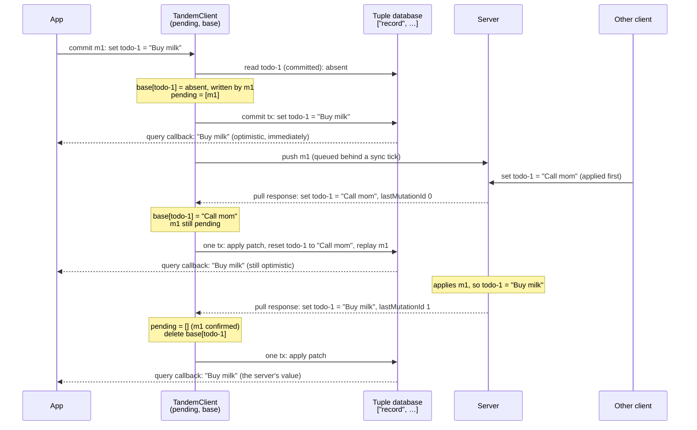

# Sync: rebuild from a base instead of undoing writes

Phase 1 of adopting the Replicache sync model. Fixes [#41](https://github.com/tanishqkancharla/tandem/issues/41) and [#42](https://github.com/tanishqkancharla/tandem/issues/42).

## Problem overview

When a pull arrives, the client rebases: it undoes its unconfirmed writes, applies the server's patch, and redoes the writes the server hasn't acknowledged.

```callstack
 SyncEngine.pull [[packages/core/src/sync/SyncEngine.ts#SyncEngine.pull]]
 └── TandemClient.applyPatchAt [[packages/core/src/TandemClient.ts#TandemClient.applyPatchAt]]
     ├── if patch is empty → return                        # drops lastMutationId (#41)
     ├── MutationApi.getRollbackWrites(speculative)       # undo with prevValue saved at commit (#42)
     ├── PatchApi.toWriteOps(patch)
     └── redo speculative after findIndex(lastMutationId)
```

Two things in this path are wrong:

- **An empty patch skips the acknowledgement (#41).** The early return runs before `lastMutationId` is read. The server has already cleared its stored acknowledgement in [[packages/server/src/TandemServer.ts#TandemServer.readPull]], so the write stays unconfirmed forever and is redone over every later patch.
- **Undo values go stale (#42).** [[packages/core/src/transaction/Transaction.ts#Transaction.remove]] saves the record's value at commit time. If the server deletes that record before the client's next pull, undoing the acknowledged remove restores a value the server no longer has, and no patch ever removes it.

The early return also hides a third problem. A client that writes records it never subscribed to gets back only empty patches, so its writes are never undone. They stay unconfirmed forever, which happens to keep them visible. Five core tests rely on this, so handling the acknowledgement alone breaks them.

## Solution overview

Replicache's client keeps the last server state, the **base**, separate from its **pending** writes. A pull updates the base from the patch, drops the pending writes up to `lastMutationId`, and rebuilds what the app sees as the base with the remaining pending writes applied. Nothing is undone, so no write needs an undo value.

The app always sees the optimistic value. Queries read the `["record", …]` tuples, which hold the base with every pending write applied. The base itself is private to `TandemClient`, and only the rebuild after a pull reads it.



If the server had rejected m1, the last response would still carry `lastMutationId 1` but set `todo-1 = "Call mom"`, and the app would show that.

This only works if the client can tell which writes a response confirms, whatever the patch contains. So mutation ids become per-client counters, and the server reports the last one it applied on every pull instead of once.

### The base

Tandem doesn't need a full copy of the server state. A record's base value only differs from what the app sees while a pending mutation writes it. So the base holds an entry only for records that pending mutations write, and each entry remembers the newest pending mutation that writes it.

```ts
// packages/core/src/sync/PendingWrites.ts (new), owned by TandemClient

/** JSON of the record's tuple key: ["record", collection, ...collectionIdToTuple(id)] */
type RecordKey = string

type BaseEntry<Schema extends AnySchema> = {
	/** The tuple key, for tx.set and tx.remove during a rebuild. */
	key: SchemaToTupleSchema<Schema>["key"]
	/** The server's latest value, or undefined when the server has no such record. */
	value: SchemaToTupleSchema<Schema>["value"] | undefined
	/** The newest pending mutation that writes this record. */
	lastWrittenBy: MutationId
}

class PendingWrites<Schema extends AnySchema> {
	/** Mutations the server hasn't acknowledged, in ascending id order. */
	private mutations: Mutation<Schema>[] = []
	private base = new Map<RecordKey, BaseEntry<Schema>>()

	/** Records a committed mutation, capturing base values for records it writes first. */
	add(mutation: Mutation<Schema>, readCommitted: (key) => value | undefined): void
	/** Writes the patch, the base, and the replayed pending ops into one tuple transaction. */
	applyPull(tx, patch: Patch<Schema>, lastMutationId: MutationId): void
	/** Drops rejected mutations and writes the rebuild into tx. */
	reject(tx, mutations: Mutation<Schema>[]): void
	clear(): void
}
```

Three invariants hold between operations:

1. **An entry exists exactly for the records pending mutations write.** Its `lastWrittenBy` is the highest id among them.
2. **An entry's `value` is the server's latest value for that record,** as far as this client knows: captured when a pending mutation first writes the record, then replaced by every patch that mentions it.
3. **Each `["record", …]` tuple equals its base value with the pending ops on that record replayed in order.** Records without an entry equal what the server last sent.

Each operation keeps them:

| Operation | `mutations` | `base` | `["record", …]` tuples |
|---|---|---|---|
| `commit` m | append m | for each record m writes: create the entry from the committed value if missing; set `lastWrittenBy = m.id` | m's writes, applied by the transaction as today |
| pull | drop ids ≤ `lastMutationId` | set `value` for records the patch mentions; after the rebuild, delete entries with `lastWrittenBy ≤ lastMutationId` | one tx: apply the patch, reset each entry's record to `value`, replay pending ops in order |
| failed push | remove the rejected mutations | recompute `lastWrittenBy` for records they wrote; delete entries no mutation writes | one tx: reset each entry's record to `value`, replay pending ops in order |
| `clear` | empty | empty | cleared, as today |

Counter ids make cleanup one comparison: an acknowledgement confirms every id up to N, so `lastWrittenBy ≤ N` means no pending mutation writes the record any more. An entry is deleted only after the rebuild, because that rebuild may still need it. For example, the record may be missing from the patch because no subscription covers it.

Here's the state as two pending mutations write the same record. The client is subscribed to `todos`.

| Step | `mutations` | `base["todos/todo-1"]` | Queries see |
|---|---|---|---|
| start | — | — | nothing |
| commit m1: set "A" | m1 | `absent`, written by m1 | "A" |
| commit m2: set "B" | m1, m2 | `absent`, written by m2 | "B" |
| pull: another client set "X"; ack 0 | m1, m2 | `"X"`, written by m2 | reset "X", replay m1, m2 → "B" |
| pull: server applied m1; patch "A"; ack 1 | m2 | `"A"`, written by m2 (2 > 1, kept) | reset "A", replay m2 → "B" |
| pull: server applied m2; patch "B"; ack 2 | — | deleted after the rebuild | "B" |

Two variants of the same history:

- **m2 is rejected after the fourth step:** `mutations` becomes m1, the entry's `lastWrittenBy` is recomputed as m1, and the rebuild resets to "X" and replays m1, so queries show "A".
- **No subscription covers `todo-1`:** no patch ever mentions it, so the entry keeps `absent`. After ack 2 the rebuild resets the record to `absent` and replay adds nothing, so the record disappears locally. This is the behavior change for writes outside the window.

Keying entries by record rather than by mutation matters. If each mutation kept its own copy, m2's copy would be the value m1 wrote, not the server's: that's `prevValue`, the #42 bug. And deleting m1's copy on its acknowledgement would lose the server value that m2's rebuild still needs.

The base stays out of the tuple database. `SchemaToTupleSchema` only allows `["record", …]` keys, client storage persists every tuple and would store the base without its pending mutations, and no query reads it. Phase 4 of the Replicache plan persists the base and pending mutations together.

Replay applies each op in order with `tx.set` and `tx.remove`. Within one tuple transaction, the last `set` or `remove` for a key wins (`TupleRootTransaction.set` and `.remove`), so queries only see each record's final value. `tx.write(MutationApi.toWriteOps(ops))` can't be used: `TupleRootTransaction.write` applies all removes before all sets, so a mutation that sets and then removes a record would replay as a set. Today's rebase replays that way.

### Why this is bigger than the one-line fix

The one-line fix (handle the acknowledgement on an empty patch) fixes #41 but breaks five tests and leaves #42. Doing it properly touches every layer that knows what a mutation looks like:

| Area | Change | Why it's needed |
|---|---|---|
| Wire protocol, `RemoteApi` | `MutationId` becomes a per-client counter; `pull` always returns `lastMutationId` | The client must match acknowledgements by order, on every pull |
| Server, `TandemServer.readPull` | Report `lastMutationId` on every pull instead of clearing it | Same |
| Client, `TandemClient` | Keep the base next to pending mutations; rebuild instead of undo | Fixes #41 and #42 |
| Transactions, `Transaction` | Ops lose `prevValue` and `value`; `remove` is recorded even when the record isn't local | Undo values go away; a client can delete a record outside its window |
| Public exports, `index.ts` | Remove `InvertibleMutation*` types and `MutationApi.getRollbackWrites` | They describe undo values that no longer exist |
| **Behavior** | A confirmed write outside the client's subscriptions disappears locally on the next pull | This is what the base model means, and it's Replicache's behavior. Five tests change |
| DST | The reference model acknowledges by counter; every recording is re-recorded | Recorded mutation ids change format, so old recordings stop replaying |

Of these, only the behavior change affects app code.

## Goals

- #41 and #42 no longer reproduce, in DST or through the public API.
- No mutation carries an undo value.
- An acknowledgement is handled on every pull, including one with an empty patch.
- The base only holds entries for records pending mutations write, and an acknowledgement deletes them.
- A client can delete a record it doesn't have locally, and the delete reaches the server.
- A write rejected by a failed push is removed by rebuilding from the base, not by undoing it.

## Non-goals

- Retrying failed pushes or deduplicating on the server. That's phase 3 of the Replicache plan (#43). A failed push still rolls back in this work.
- Client view records per cookie, row versions, or delta patches. That's phase 2 of the Replicache plan.
- Persisting the base or pending mutations across restarts. That's phase 4 of the Replicache plan (#44). Both live in memory here.
- Keeping writes outside the client's subscriptions visible after they're confirmed.
- Replaying mutation logic. Replay repeats each op's stored value, as today, not the function that produced it.

## Implementation

Each phase is one commit that leaves `pnpm test` and `pnpm type-check` passing.

### Phase 1: Per-client mutation counters, acknowledged on every pull

Change the protocol first, with no change to how the client rebases. The server reports its last applied id on every pull, and the client numbers its mutations 1, 2, 3, … per client instance.

```callstack
 TandemClient.commit [[packages/core/src/TandemClient.ts#TandemClient.commit]]
-└── id: transaction.tupleDbTx.id                    # random transaction id
+└── id: ++this.lastMutationId                       # 1, 2, 3, … per client

 TandemServer.readPull [[packages/server/src/TandemServer.ts#TandemServer.readPull]]
-├── lastMutationId = client.lastMutationId
-└── client.lastMutationId = undefined               # consumed once
+└── lastMutationId = client.lastMutationId ?? 0     # reported on every pull
```

```ts
// packages/core/src/transaction/Transaction.ts
export type MutationId = Tagged<"MutationId", number>

// packages/core/src/sync/SyncEngine.ts, RemoteApi.pull response
lastMutationId: MutationId // was lastMutationId?: MutationId
```

`applyPatchAt` keeps its early return in this phase. Its `findIndex` becomes a filter on `id <= lastMutationId`, which handles a repeated acknowledgement. The counter is not reset by `clear()`, because the server's acknowledgement covers every id up to its last for that client id.

Repeating the acknowledgement changes one outcome: the acknowledgement an empty patch drops arrives again with the next non-empty patch, which confirms the write. So #41 no longer shows up in DST. In a no-fault sweep of 300 seeds at 30 steps, `main` fails seeds 2 (#41), 216, and 223 (#42); this phase fails only 216 and 223. In 60 seeds at 300 steps both fail the same 15 seeds with identical violations, all with #42's shape: an extra record the server doesn't have. #41 is still reachable when a client receives only empty patches after its write is acknowledged, which the `(known bug)` test in `conflicts.spec.ts` covers until phase 2.

DST assigns ids in the reference model instead of reading `tx.tupleDbTx.id`: ids are a per-client counter in the protocol, so `ReferenceModel.wrote` returns the next one, and a crash restarts the count. A remove of a record the client doesn't have commits nothing, so its trace record has no `mutationId`.

```callstack
 DstWorld.write [[dst/DstWorld.ts#DstWorld.write]]
-└── mutationId: tx.tupleDbTx.id
+└── mutationId: model.wrote(client, op)             # the client's next counter value

 ReferenceModel.pulled [[dst/ReferenceModel.ts#ReferenceModel.pulled]]
-└── pending.slice(findIndex(mutationId === lastMutationId) + 1)
+└── pending.filter((write) => write.mutationId > lastMutationId)
```

- [x] `MutationId` becomes a tagged number; `TandemClient.commit` assigns ids from a per-client counter.
- [x] `RemoteApi.pull` returns `lastMutationId: MutationId`; `TandemServer.readPull` reports it on every pull and no longer clears it.
- [x] `TandemClient.applyPatchAt` confirms by `id <= lastMutationId`.
- [x] Update the server tests that expected string ids and a consumed acknowledgement.
- [x] DST: assign ids in `ReferenceModel.wrote`, confirm by counter in `ReferenceModel.pulled`, change `mutationId` in trace records to a number.
- [x] Re-record the #42, #43, and #44 recordings with their original options; each reaches the same violation through the same events. Delete the #41 recording, which no longer fails, and its `dst.spec.ts` case; its README entry now points at the core `(known bug)` test.
- [x] Update the #43 README entry: a lost response no longer breaks the next acknowledgement's lookup.
- [x] Update `docs/how_to_implement_remote.md` for numeric ids reported on every pull.
- [x] Run `pnpm test`, `pnpm type-check`, `pnpm lint`, and the todo example's end-to-end tests.

### Phase 2: Rebuild pulls and rollbacks from the base

Add `PendingWrites` and route commit, pull, and rollback through it. This is the phase that fixes #41 and #42, so the tests and recordings that depended on the old behavior change with it. Undo values still exist but nothing reads them.

```callstack
 TandemClient.commit [[packages/core/src/TandemClient.ts#TandemClient.commit]]
-├── speculativeMutations.push(mutation)
+├── pendingWrites.add(mutation, readCommitted)       # capture base values for newly written records
+│   └── Database.get                                  # committed value, read before the tx commits
 └── Database.commit [[packages/core/src/Database.ts#Database.commit]]

 SyncEngine.pull [[packages/core/src/sync/SyncEngine.ts#SyncEngine.pull]]
-└── TandemClient.applyPatchAt [[packages/core/src/TandemClient.ts#TandemClient.applyPatchAt]]
-    ├── if patch is empty → return
-    ├── MutationApi.getRollbackWrites(speculative)
-    ├── PatchApi.toWriteOps(patch)
-    └── redo speculative after the acknowledged one
+└── TandemClient.applyPull
+    └── pendingWrites.applyPull(tx, patch, lastMutationId)
+        ├── set base values the patch mentions
+        ├── drop mutations with id ≤ lastMutationId
+        ├── tx: apply patch, reset each base record, replay pending ops in order
+        └── delete entries with lastWrittenBy ≤ lastMutationId

 SyncEngine.push → catch [[packages/core/src/sync/SyncEngine.ts#SyncEngine.push]]
 └── TandemClient.rollback [[packages/core/src/TandemClient.ts#TandemClient.rollback]]
-    └── MutationApi.getRollbackWrites(rejected)       # stale undo values
+    └── pendingWrites.reject(tx, rejected)            # recompute lastWrittenBy, reset, replay
```

`PendingWrites` is the only owner of `mutations` and `base`. `TandemClient` opens the tuple transaction, hands it in, and commits it, so each pull is still one change for subscribers.

`PendingWrites` splits capturing from adding: `captureBase(mutation, readCommitted)` reads committed values before the transaction commits, and `add(mutation, capture)` records the mutation only after the commit succeeds. A tuple-database commit can throw on a read-write conflict, and a mutation that never committed must not become pending. `Database.get` takes the record's tuple key rather than a collection and id, because `PendingWrites` works in tuple keys.

The DST sweep test swept seeds 1–4 with no faults and relied on seed 1 failing with #42's bug. It now sweeps 10 steps with a 0.1 fault rate, where seeds 1 and 2 fail with #43's bug.

A no-fault sweep of 60 seeds at 300 steps passes every seed; phase 1 failed 15 of them, all with #42's shape. The new core tests for #41, #42, the ordering bug, and writes outside subscriptions all fail on phase 1's code.

- [x] Add `packages/core/src/sync/PendingWrites.ts` with the data structure and invariants from "The base".
- [x] Add `Database.get(key)` to read a committed record outside a transaction.
- [x] Replace `speculativeMutations` in `TandemClient` with a `PendingWrites`, and route `commit`, the pull handler, `rollback`, and `clear` through it. Rename `applyPatchAt` to `applyPull`, in `SyncEngine` too.
- [x] `conflicts.spec.ts`: drop `.fails` from the #41 `(known bug)` test.
- [x] Add a core test for #42's pattern: a pushed record that another client deletes before the writer's next read, then removed by the writer.
- [x] Add a core test that a confirmed write outside the client's subscriptions disappears after the next pull.
- [x] Add a core test for a mutation that sets and then removes the same record, pending across a pull.
- [x] Update the five tests that write without subscribing to subscribe first: `client.spec.ts` (local data), `compound-ids.spec.ts`, and three in `relations.spec.ts`.
- [x] Delete the #42 recording, its case in `dst.spec.ts`, and the #41 and #42 entries in `dst/known-failures/README.md`.
- [x] Point the DST sweep test at a fault sweep that still has failing seeds.
- [x] Run `pnpm test`, `pnpm type-check`, `pnpm lint`, and a no-fault DST sweep.

### Phase 3: Delete undo values

Nothing reads `prevValue` or the remove op's `value` after phase 2, so remove them and the types built around them. No behavior changes.

```callstack
 Transaction.set [[packages/core/src/transaction/Transaction.ts#Transaction.set]]
-└── setOp.prevValue = transaction.get(key)
 Transaction.update [[packages/core/src/transaction/Transaction.ts#Transaction.update]]
-└── setOp.prevValue = prevRecord
 Transaction.remove [[packages/core/src/transaction/Transaction.ts#Transaction.remove]]
-└── ops.push({ type: "remove", collection, id, value })
+└── ops.push({ type: "remove", collection, id })     # still only when the record is local

 SyncEngine.push [[packages/core/src/sync/SyncEngine.ts#SyncEngine.push]]
-└── mutations.map(invertibleMutationToMutation)
+└── mutations                                         # already plain Mutations
```

`MutationApi.toWriteOps` and `PatchApi.toWriteOps` lost their last callers in phase 2, so they go too. `MutationApi.toWriteOps` is the helper that split a mutation's ops into sets and removes and lost their order.

- [x] `Transaction.ops` becomes `MutationOp<Schema>[]`; remove `prevValue` and the remove op's `value`.
- [x] `SyncEngine` queues plain `Mutation`s; delete `invertibleMutationToMutation`.
- [x] Delete `InvertibleMutation`, `InvertibleMutationOp`, `InveribleSetMutationOp`, `InveribleRemoveMutationOp`, `MutationApi.getRollbackWrites`, and `invertMutationOp`, and remove them from [[packages/core/src/index.ts]].
- [x] Delete `MutationApi.toWriteOps` and `PatchApi.toWriteOps`, which nothing calls.
- [x] Run `pnpm test`, `pnpm type-check`, and `pnpm lint`.

### Phase 4: Record removes by key

A remove of a record the client doesn't have now reaches the server. Before phase 2 this was impossible, because undoing such a remove had no value to restore. Now the base captures `absent` for it.

```callstack
 Transaction.remove [[packages/core/src/transaction/Transaction.ts#Transaction.remove]]
-└── if (value !== undefined) ops.push({ type: "remove", collection, id })
+└── ops.push({ type: "remove", collection, id })     # even if the record isn't local
```

DST's `write` skips the model for a remove of an absent record, because such a remove used to commit nothing. It now commits a mutation, so DST records it like any other write. That changes the calls a run makes, so the #43 and #44 recordings stop replaying and are re-recorded here.

```callstack
 DstWorld.write [[dst/DstWorld.ts#DstWorld.write]]
-└── if (tx.ops.length > 0) model.wrote(...)
+└── model.wrote(...)                                 # every write commits a mutation
```

The #43 recording opens with a remove of a record client2 doesn't have, so it stopped replaying. Re-recorded with the same options, it still hits #43's bug, now at step 5: client1's push request is dropped and its write of `item-3` is rolled back. The #44 recording has no such remove and replays unchanged. The phase 2 writer subscriptions in `compound-ids.spec.ts` and `relations.spec.ts` are reverted: those tests only needed them to remove records, and a remove no longer needs the record. `client.spec.ts` keeps its subscription because it queries after its writes are confirmed.

- [x] `Transaction.remove` records an op whether or not the record is local.
- [x] Add a core test that removing a record the client doesn't have removes it on the server.
- [x] DST: record a model write for every remove.
- [x] Re-record the #43 recording, check that it still reaches #43's violation, and update the tests and README entry that describe it.
- [x] Run `pnpm test`, `pnpm type-check`, and `pnpm lint`.

### Phase 5: Update docs and sweep

- [x] Update `packages/core/src/sync/AGENTS.md` and `packages/core/src/transaction/AGENTS.md`, which still describe undo-based rollback. The sync guide also showed a `sync()` remote API that doesn't exist.
- [x] Check the "expected behavior" paragraph in `dst/known-failures/README.md`: it still holds. Drop the "invertible mutations" roadmap item from the root README.
- [ ] Run `pnpm lint` and a DST sweep with no faults: `pnpm dst:run --runs 50 --steps 300`.

## References

- [`packages/core/src/TandemClient.ts`](../packages/core/src/TandemClient.ts) — `applyPatchAt`, `rollback`, and `commit`, where the rebase lives.
- [`packages/core/src/transaction/Transaction.ts`](../packages/core/src/transaction/Transaction.ts) — Mutation types, undo values, and `MutationApi`.
- [`packages/core/src/sync/SyncEngine.ts`](../packages/core/src/sync/SyncEngine.ts) — `RemoteApi`, pushes, and pulls.
- [`packages/core/src/Database.ts`](../packages/core/src/Database.ts) — The tuple database that queries, subscriptions, and client storage read.
- [`packages/server/src/TandemServer.ts`](../packages/server/src/TandemServer.ts) — `applyPush` and `readPull`, which store and report `lastMutationId`.
- [`dst/ReferenceModel.ts`](../dst/ReferenceModel.ts) and [`dst/DstWorld.ts`](../dst/DstWorld.ts) — How DST tracks writes and acknowledgements.
- [`dst/known-failures/README.md`](../dst/known-failures/README.md) — The recordings for #41 through #44.
- [Replicache: how it works](https://doc.replicache.dev/concepts/how-it-works) — Rebase from the last server state, and confirmation by `lastMutationID`.
