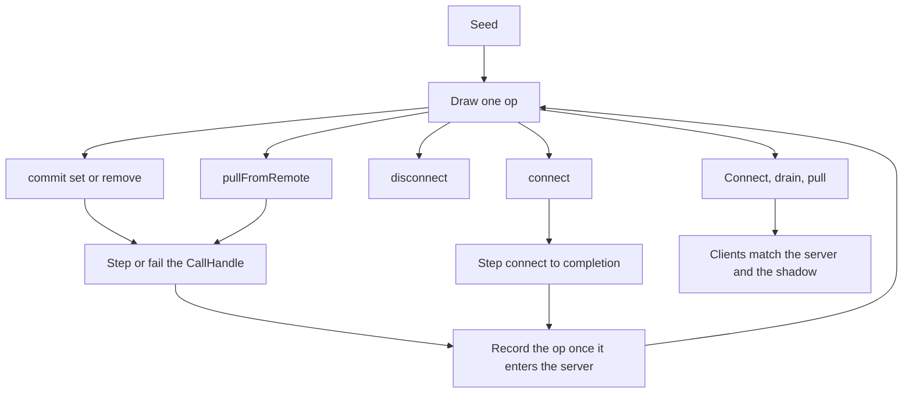

# Seeded sync fuzz

## System flow

Two clients and one in-memory server already exist. The fuzzer only chooses the next public call and whether to deliver or drop the server handoff.



A delivered edit crosses the timer exit, then the server. The shadow updates on the server enter, which is before the acknowledgement returns.

```callstack
 client1.commit [[packages/core/src/TandemClient.ts#TandemClient.commit]]
 └── client1Timer.waitForNextTick [[packages/core/src/utils/Timer.ts#TimerApi.waitForNextTick]]
    └── SyncEngine.push [[packages/core/src/sync/SyncEngine.ts#SyncEngine.push]]
       └── server.push [[packages/server/src/TandemServer.ts#TandemServer.push]]
          └── client1 # acknowledgement still held
```

## Problem overview

Ordering and conflict tests each pin one interleaving. A seeded run can shuffle edits, pulls, dropped pushes, and offline queues, then check that every client ends on the same document. Gatekeeper already exposes that control. The missing piece is the test that draws the operations and checks the end state.

## Solution overview

Add one Vitest in `packages/core/test/sync/fuzz.spec.ts`. It builds `buildTimerGatekeeperHarness`, draws from a seed, and steps `CallHandle`s. `fail` is the only network fault. `disconnect` and `connect` stay client operations because a failed push rolls back and a disconnect keeps the write queued. No Gatekeeper or sync API changes.

The shadow is the record-level result of pushes that entered the server. After every live call has been delivered and both clients have pulled, `client1`, `client2`, and `server` match that shadow.

## Goals

- A numeric seed replays the same commits, pulls, faults, and offline periods.
- After the run drains, both clients query the same todos as the server.
- A push dropped before the server is absent from that document.
- A push whose acknowledgement is dropped is present, and a later pull restores the writing client.
- A write made while disconnected appears only after `connect` delivers its push.

## Non-goals

- No migrations or backfills.
- No new Gatekeeper API, timer, or transport.
- No crash, restart, or durable sync cursors. Pending mutations, the cookie, and the server revision stay in memory.
- No `clientStorage`, subscriptions, or poke scheduling. Clients stay unsubscribed so a poke cannot pull inside another client's call.
- No second in-flight call on the same client. Cross-client interleaving is the case this test adds.
- No filesystem faults and no third client.

## Important files, docs, and websites

- [`packages/core/test/fixtures.ts`](../packages/core/test/fixtures.ts) — `buildTimerGatekeeperHarness` registers `client1Timer` and `client2Timer` with an exit gate only.
- [`packages/core/test/sync/timers.spec.ts`](../packages/core/test/sync/timers.spec.ts) — the fixture shape to copy: raw clients connect before `use`, and the test drives the proxies.
- [`packages/core/test/sync/ordering.spec.ts`](../packages/core/test/sync/ordering.spec.ts) — `continueTo("server")` then `fail` drops the acknowledgement after the server has committed.
- [`packages/core/test/sync/conflicts.spec.ts`](../packages/core/test/sync/conflicts.spec.ts) — `disconnect` keeps the mutation queued; `fail` before the server rolls it back.
- [`packages/core/src/sync/SyncEngine.ts`](../packages/core/src/sync/SyncEngine.ts) — `push` rolls back on rejection and skips the server when `disconnectFromRemote` is unset.
- [`packages/gatekeeper/src/Gatekeeper.ts`](../packages/gatekeeper/src/Gatekeeper.ts) — `CallHandle.continueTo`, `fail`, `assertSentBy`, and `assertWaitingFor`.
- [Dropbox, Testing our new sync engine](https://dropbox.tech/infrastructure/-testing-our-new-sync-engine) — the end-state check this test is modeled on. This version does not simulate crashes.

## Implementation

### Phase 1: Replay successful edits and pulls

Land the seed loop and the end-state check before adding faults. A wrong shadow or an ungated poke shows up here, while every push still reaches the server.

```callstack
 runSeed
+├── client.commit [[packages/core/src/TandemClient.ts#TandemClient.commit]]
+│  └── client1Timer.waitForNextTick [[packages/core/src/utils/Timer.ts#TimerApi.waitForNextTick]]
+│     └── SyncEngine.push [[packages/core/src/sync/SyncEngine.ts#SyncEngine.push]]
+│        └── server.push [[packages/server/src/TandemServer.ts#TandemServer.push]]
+├── client.pullFromRemote [[packages/core/src/TandemClient.ts#TandemClient.pullFromRemote]]
+└── shadow.apply # after continueTo("server") on a commit
```

The timer exit is `assertSentBy("client1Timer").assertWaitingFor("client1")`. Deliver it with `continueTo("client1")`. The server enter is `assertSentBy("client1").assertWaitingFor("server")`. `continueTo("server")` runs `server.push` and holds the acknowledgement. Apply the op to the shadow at that point, then `continueTo("client1")` to deliver the ack.

Do not subscribe. `InProcessTransport` still pokes, and that pull is not a `CallHandle`. An empty scan window does not change records. The shadow ignores it.

Keep one live call per client. Use todo ids `"a"` and `"b"` so the two clients overwrite the same records. Skip `remove` when that id is absent on that client, because `Transaction.remove` records no op and `commit` then never calls the server.

```ts
type Op = { id: "a" | "b"; type: "set"; text: string } | { id: "a" | "b"; type: "remove" }

function runSeed(seed: number) {
	const random = mulberry32(seed)
	const shadow = new Map<string, TestsTodo>()
	// 12 draws. Each draw starts one idle client's commit or pull,
	// or advances that client's live CallHandle by one gate.
	// On commit, after continueTo("server"):
	//   set → shadow.set(id, todo); remove → shadow.delete(id)
}

function settledTodos(shadow: Map<string, TestsTodo>) {
	return [...shadow.values()].sort((left, right) => left.id.localeCompare(right.id))
}
```

Copy the `timerTest` fixture from `timers.spec.ts` into `fuzz.spec.ts`. Pass the harness timer as `syncInterval`. Leave `clientStorage` unset. Connect both clients before `activateGates()`. Run seeds `1`, `2`, and `3` in one test.

- [ ] Add `packages/core/test/sync/fuzz.spec.ts` with a local `mulberry32` and the timer harness fixture.
- [ ] Drive only `commit` and `pullFromRemote` through the proxies. Step every gate forward. Never call `subscribe`.
- [ ] Update the shadow only after `continueTo("server")` on a commit.
- [ ] Drain any call still held at the timer or server by stepping those same gates, so a late push is in the shadow.
- [ ] Pull both clients to completion and expect each `query({ collection: "todos" })`, sorted by id, to equal `settledTodos(shadow)` and `server.query`.
- [ ] Run `pnpm --filter @tanishqkancharla/tandem-core test -- test/sync/fuzz.spec.ts`.

### Phase 2: Drop handoffs and go offline

Add the two outcomes a push can have besides success. `fail` while the call is waiting for the server never reaches `TandemServer.push`, and `handleRollback` drops the local write. `fail` while the server is waiting to answer the client leaves the server write in place.

```callstack
 client1.commit
 └── SyncEngine.push [[packages/core/src/sync/SyncEngine.ts#SyncEngine.push]]
-   └── server.push [[packages/server/src/TandemServer.ts#TandemServer.push]]
+   └── CallHandle.fail [[packages/gatekeeper/src/Gatekeeper.ts#CallHandle.fail]]
       └── handleRollback # shadow unchanged
```

```callstack
 client1.commit
 └── server.push [[packages/server/src/TandemServer.ts#TandemServer.push]]
-   └── ack → client1
+   └── CallHandle.fail # shadow already contains the op
       └── handleRollback # local only; the heal pull restores it
```

`disconnect` is not a failed push. The next commit ticks the timer and then returns without calling the server. Those ops stay in a per-client list. `connect` pulls and then pushes that list. Do not `fail` inside `connect`. Other calls stay held while it runs, so applying the list when `connect.result` resolves matches the server.

```callstack
 client1.disconnect [[packages/core/src/TandemClient.ts#TandemClient.disconnect]]
 └── unsubscribe # CallHandle settles with no server handoff

 client1.commit
 └── client1Timer.waitForNextTick
    └── SyncEngine.push
-     └── server.push
+     └── return # per-client list keeps the op

 client1.connect [[packages/core/src/TandemClient.ts#TandemClient.connect]]
 └── server.connect
    └── SyncEngine.pull
       └── SyncEngine.push # shadow applies the list after result resolves
```

Attach `void call.result.catch(() => {})` when a call is failed so the rejection is observed. Heal by connecting anyone offline, stepping every remaining commit or pull until it completes, recording a commit that enters the server, then pulling both clients. The same three seeds and the same equality check cover this phase.

- [ ] When a commit or pull is `assertWaitingFor("server")`, either `continueTo("server")` or `fail`. A failed commit does not change the shadow.
- [ ] When the server is `assertWaitingFor(client)`, either deliver the ack or `fail`. A commit that already entered the server stays in the shadow.
- [ ] Never `fail` a timer exit. `continueTo(client)` there only delivers the tick.
- [ ] `disconnect` only when that client has no live call. Queue its later sets and removes. `connect` runs to completion, then those ops append to the shadow.
- [ ] Run `pnpm --filter @tanishqkancharla/tandem-core test -- test/sync/fuzz.spec.ts` and `pnpm --filter @tanishqkancharla/tandem-core type-check`.
