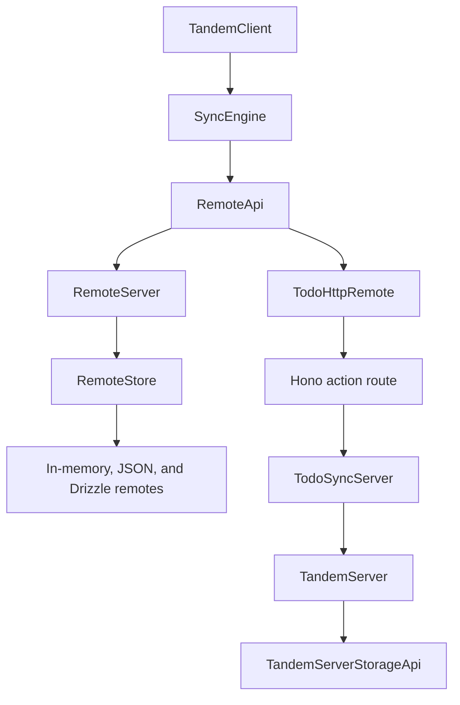
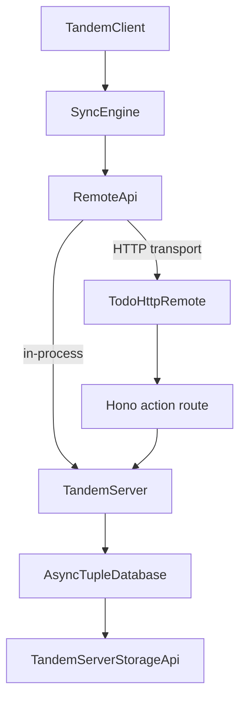
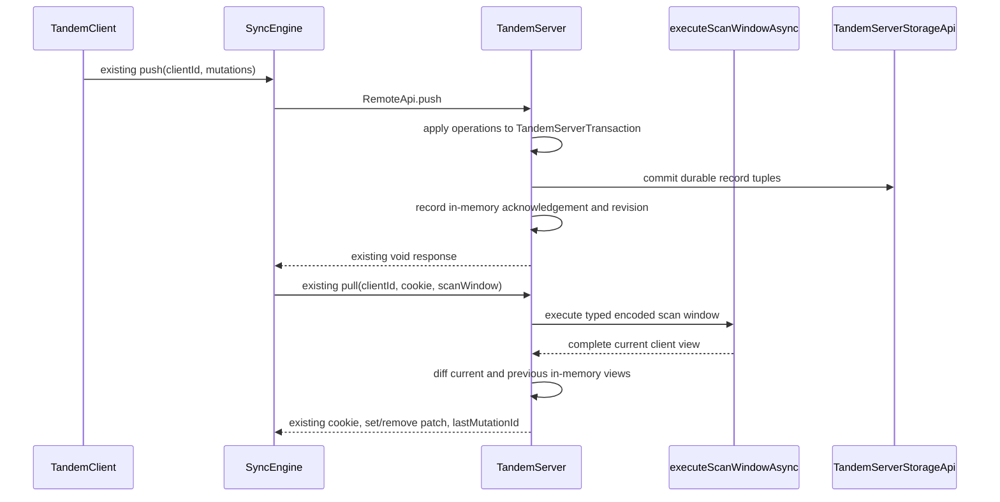

# TandemServer sync implementation refactor

## System flow

The current sync path has two server implementations. The server package routes
through `RemoteServer` and `RemoteStore`, while the todo example independently
implements cookies, mutation acknowledgement, scan-window snapshots, and patch
generation around `TandemServer`.



The refactor makes `TandemServer` the only production server implementation.
`TandemClient` and `SyncEngine` continue to consume the existing `RemoteApi`
without any type, naming, or wire-format changes.



`TandemServer` applies pushed mutations through its normal typed transaction
API. Pulls execute the encoded scan window through the shared query engine,
compare the current view with that client's previous in-memory view, and return
the same `set` and `remove` patch shape used today.



## Problem overview

`TandemServer` already owns typed server queries, transactions, subscriptions,
and durable tuple storage, but it does not implement `RemoteApi`. The older
`RemoteServer` hierarchy owns sync separately through a second `RemoteStore`
abstraction, and each legacy storage provider reimplements mutation and query
behavior.

The todo example demonstrates the desired storage direction but has to fill the
gap with `TodoSyncServer`. That class is a todo-specific copy of sync state and
query conversion. This leaves two sources of truth for server behavior and
prevents other schemas from using `TandemServer` directly with `TandemClient`.

## Protocol preservation

This refactor changes the server implementation, not the sync protocol.

| Contract                  | Preserved behavior                                                            |
| ------------------------- | ----------------------------------------------------------------------------- |
| `RemoteApi`               | Keeps the existing name and `connect`, `push`, and `pull` signatures.         |
| `TandemClientArgs.remote` | Keeps the existing option and type.                                           |
| `pullFromRemote()`        | Keeps the existing public method.                                             |
| `MutationId`              | Remains the current tagged string generated from the local tuple transaction. |
| `Cookie`                  | Remains the current opaque tagged `number \| string`.                         |
| `Patch`                   | Remains `set` and `remove`; no reset or clear operation is added.             |
| Push retry behavior       | Remains unchanged, including the current rollback-on-failure behavior.        |
| Connect transport         | Keeps callback-based pokes; the todo browser transport continues polling.     |

Cookies, mutation acknowledgements, connected clients, server revisions, and
previous client views remain in memory. Only application record tuples remain
durable through `TandemServerStorageApi`. Persisting sync metadata requires a
separate protocol/storage design and is deliberately deferred.

## Solution overview

Add a fully typed encoded-query entry point to the shared query engine. It uses
the same filtering, ordering, pagination, and relation traversal as application
queries while collecting full storage records for the root query and included
relations. Projection remains a client-side result concern and does not truncate
replicated records.

Make `TandemServer<Schema, Relations>` implement the existing
`RemoteApi<Schema>`. It owns a small in-memory sync coordinator:

- a monotonically increasing server revision used as the existing numeric
  cookie;
- each client's last acknowledged mutation ID;
- each client's last encoded scan window and synchronized record keys;
- optional poke callbacks registered through `connect`.

Every successful push uses a `TandemServerTransaction` and the injected durable
storage. Every pull recomputes the current scan-window view when the revision or
scan window changed, emits complete current records as `set` operations, and
emits `remove` operations for records that were in that client's previous view.
Unchanged pulls return an empty patch and the current cookie. Successful server
transactions conservatively poke all connected clients; this avoids retaining
the legacy mutation/scan-window intersection machinery.

The todo Hono app constructs one `TandemServer` and delegates push and pull
requests directly. Its JSON envelope, browser `TodoHttpRemote`, polling behavior,
and all client-facing names remain unchanged. Once callers move over, delete
`TodoSyncServer`, `RemoteServer`, `RemoteStore`, and the obsolete remote storage
adapters.

## Goals

- Make `TandemServer<Schema, Relations>` directly satisfy
  `RemoteApi<Schema>` without changing the public sync contract.
- Execute encoded scan windows generically through the shared typed query
  abstraction with no query-shape type assertions in the encoder, executor, or
  server call site.
- Preserve filters, ordering, offsets, limits, and nested relation membership
  while synchronizing complete schema records.
- Apply pushed mutations through `TandemServerTransaction` and the injected
  `TandemServerStorageApi`.
- Produce compatible `set` and `remove` patches by comparing the current view
  with per-client in-memory state.
- Notify in-process clients after successful pushes and application commits
  through the existing `connect` callback.
- Make the todo Hono server delegate push and pull directly to `TandemServer`.
- Delete the duplicate server, store, JSON remote, in-memory remote, and Drizzle
  remote implementations.

## Non-goals

- Do not rename `RemoteApi`, `remote`, `pullFromRemote`, or related client-facing
  vocabulary in this refactor.
- Do not change `MutationId`, `Cookie`, `Patch`, push, pull, or connect wire
  formats.
- Do not add reset patches, numeric sequential mutation IDs, durable mutation
  acknowledgement, Client View Records, row versions, tombstones, or durable
  cookies.
- Do not change optimistic mutation retry, rollback, replay, or acknowledgement
  behavior in `SyncEngine` or `TandemClient`.
- Do not persist browser client IDs, pending mutations, scan windows, or client
  views.
- Do not replace todo polling with Server-Sent Events in this refactor.
- Do not add authentication, authorization, named mutators, or server-side
  mutation validation hooks.
- Do not add cross-process poke delivery, database notifications, or pub/sub.
- Do not add a Hono integration package.
- Do not implement new production SQL or Drizzle
  `TandemServerStorageApi` adapters. Those will be designed separately.
- Do not preserve legacy remote classes or adapters after their consumers move
  to `TandemServer`; Tandem is unreleased.
- Do not push query predicates, joins, or pagination into storage in this phase.

## Important files

- [`specs/tandem-server-tuple-storage.md`](./tandem-server-tuple-storage.md) —
  Defines the typed server database and storage foundation this refactor uses.
- [`packages/core/src/sync/SyncEngine.ts`](../packages/core/src/sync/SyncEngine.ts) —
  Defines the `RemoteApi`, cookie, patch, and current client sync behavior that
  must remain unchanged.
- [`packages/core/src/TandemClient.ts`](../packages/core/src/TandemClient.ts) —
  Owns the public `remote` option, `pullFromRemote()`, optimistic writes, and
  patch rebasing; it should not change for this refactor.
- [`packages/core/src/query/Query.ts`](../packages/core/src/query/Query.ts) —
  Defines `RelationalQuery`, `EncodedQuery`, and `ScanWindow`.
- [`packages/core/src/query/executeQuery.ts`](../packages/core/src/query/executeQuery.ts) —
  Hosts the shared typed synchronous and asynchronous query evaluator.
- [`packages/core/test/executeQuery.spec.ts`](../packages/core/test/executeQuery.spec.ts) —
  Covers application and encoded query behavior without asserting private
  normalized representations.
- [`packages/server/src/TandemServer.ts`](../packages/server/src/TandemServer.ts) —
  Becomes the only production database and `RemoteApi` implementation.
- [`packages/server/src/TandemServerTransaction.ts`](../packages/server/src/TandemServerTransaction.ts) —
  Applies both application and pushed mutation operations to the async tuple
  transaction.
- [`packages/server/src/storage/TandemServerStorage.ts`](../packages/server/src/storage/TandemServerStorage.ts) —
  Remains the durable application-record storage boundary; sync metadata is not
  added to it.
- [`packages/server/src/RemoteServer.ts`](../packages/server/src/RemoteServer.ts) —
  Contains the production sync implementation to replace and delete.
- [`packages/core/test/fixtures.ts`](../packages/core/test/fixtures.ts) —
  Currently imports `InMemoryRemote` and must move its integration fixture to
  the real `TandemServer` without weakening schema and relation types.
- [`packages/server/test/TandemServer.spec.ts`](../packages/server/test/TandemServer.spec.ts) —
  Becomes the main public server database and sync integration suite.
- [`examples/todo/apps/server/src/TodoSyncServer.ts`](../examples/todo/apps/server/src/TodoSyncServer.ts) —
  Contains the duplicate example sync implementation to delete.
- [`examples/todo/apps/server/src/app.ts`](../examples/todo/apps/server/src/app.ts) —
  Becomes the thin Hono push/pull transport over `TandemServer`.
- [`examples/todo/apps/web/src/TodoHttpRemote.ts`](../examples/todo/apps/web/src/TodoHttpRemote.ts) —
  Remains the existing HTTP and polling implementation of `RemoteApi`.
- [`examples/todo/apps/web/e2e/todo.spec.ts`](../examples/todo/apps/web/e2e/todo.spec.ts) —
  Protects the unchanged visible two-browser workflow.

## Implementation

### Phase 1: Add a fully typed encoded scan-window evaluator

Extend the shared query abstraction so both application queries and encoded
wire queries normalize into the same internal evaluator input. Add an async
scan-window entry point that collects complete root and included records before
projection and deduplicates them by collection and record ID.

```callstack
 TandemServer pull query
-└── TodoSyncServer.decodeTodoQuery
-    └── TandemServer.query
+└── executeScanWindowAsync
+    ├── normalize each EncodedQuery
+    ├── execute filters, ordering, offset, and limit
+    ├── traverse declared relations and nested options
+    ├── collect full root and included records
+    └── deduplicate by collection and record ID
```

```diff:packages/core/src/query/executeQuery.ts
+export type ScanWindowRecord<
+  Schema extends AnySchema,
+  Collection extends CollectionName<Schema> = CollectionName<Schema>,
+> = {
+  [CurrentCollection in Collection]: {
+    collection: CurrentCollection
+    value: Schema[CurrentCollection]
+  }
+}[Collection]
+
+export function executeScanWindowAsync<Schema, Relations>(
+  db: ReadOnlyAsyncTupleDatabaseClientApi<SchemaToTupleSchema<Schema>>,
+  relations: Relations,
+  scanWindow: ScanWindow<Schema>,
+): Promise<ScanWindowRecord<Schema>[]> {
+  // Normalize into the shared evaluator and collect complete storage records.
+}
```

`EncodedQuery` is collection-discriminated so nested relation fields retain
their collection-specific types, while its serialized shape remains unchanged.
Validate relation names and target collections against `relations` while
constructing the normalized node. The normalized node then carries the specific
collection type through traversal, so the implementation does not cast encoded
queries into relational queries or weaken the tuple database to an untyped
record store.

- [x] Refactor `packages/core/src/query/executeQuery.ts` so relational and
      encoded inputs share typed comparison, sorting, windowing, and relation
      traversal primitives.
- [x] Remove query-shape assertions from `_encodeRelationalQuery`, the shared
      executor, and the new encoded-query path; use typed entry helpers and runtime
      validation for dynamic object entries.
- [x] Add `executeScanWindowAsync()` and `ScanWindowRecord` to
      `packages/core/src/internal.ts` without changing the serialized `EncodedQuery`
      or `ScanWindow` shapes.
- [x] Extend `packages/core/test/executeQuery.spec.ts` with one representative
      encoded workflow covering filters, ordering, offset/limit, duplicate
      membership, and nested relations; verify collected values are complete records
      even when the encoded query contains `select`.
- [x] Run
      `pnpm --filter @tanishqkancharla/tandem-core exec vitest run test/executeQuery.spec.ts`
      and `pnpm --filter @tanishqkancharla/tandem-core type-check`.

### Phase 2: Implement the existing RemoteApi on TandemServer

Add `connect`, `push`, and `pull` directly to `TandemServer` using the unchanged
method types from `RemoteApi<Schema>`. Keep synchronization state in memory and
application records in the existing tuple storage.

```callstack
 RemoteApi.push
-└── RemoteServer
-    └── RemoteStore.applyMutations
+└── TandemServer
+    ├── TandemServer.transact
+    ├── apply typed set/remove mutation operations
+    ├── commit durable record tuples
+    ├── retain current lastMutationId in memory
+    ├── advance in-memory revision
+    └── poke connected clients

 RemoteApi.pull
-└── RemoteServer
-    ├── read mutation log since cookie
-    └── RemoteStore.readSnapshot
+└── TandemServer
+    ├── compare cookie, revision, and scan-window key
+    ├── executeScanWindowAsync when the view may have changed
+    ├── diff current record keys against the client's previous view
+    └── return existing cookie, set/remove patch, and lastMutationId
```

```diff:packages/server/src/TandemServer.ts
 export class TandemServer<Schema, Relations>
+  implements RemoteApi<Schema>
 {
+  private revision = 0
+  private readonly syncClients = new Map<ClientId, SyncClientState<Schema>>()
+
+  connect: RemoteApi<Schema>["connect"] = async ({ clientId, poke }) => { ... }
+  push: RemoteApi<Schema>["push"] = async ({ clientId, mutations }) => { ... }
+  pull: RemoteApi<Schema>["pull"] = async ({ clientId, cookie, scanWindow }) => { ... }
 }
```

Push and pull must work without an active `connect` registration so request/
response transports such as the todo Hono app can delegate directly. A later
`connect` call attaches only the poke callback to the same client state.

The incoming cookie remains opaque at the public boundary. The implementation
may compare a numeric cookie to the current in-memory revision, but it must
recompute when client state is missing or the scan window changed. A successful
application commit or non-empty push advances the revision only after storage
commit succeeds. Push stores its acknowledgement before emitting pokes so a
resulting pull observes it. Failed and empty commits do not advance or poke.

- [x] Add private typed sync-client state to `TandemServer`; do not extend
      `TandemTuple` or `TandemServerStorageApi` with protocol metadata.
- [x] Implement `push` by applying every existing mutation operation through a
      `TandemServerTransaction` and committing once per push request; retain current
      empty-batch, ID, duplicate, and failure semantics.
- [x] Implement `pull` through `executeScanWindowAsync`, emitting current values
      as `set` operations and previous-view keys absent from the result as `remove`
      operations.
- [x] Implement `connect` and idempotent disconnect with the existing callback
      contract; conservatively poke connected clients after successful record
      commits.
- [x] Centralize post-commit revision and poke bookkeeping so public application
      transactions and remote pushes do not double-advance or notify before the
      acknowledgement is visible.
- [x] Clear relational subscriptions and sync client registrations in
      `TandemServer.close()` before closing tuple storage.
- [x] Keep expected internal failures as errore-style error values and convert
      them to rejected promises only at the existing public `TandemServer` boundary;
      do not export internal error-management types.
- [x] Extend `packages/server/test/TandemServer.spec.ts` with public workflows for
      two clients, mutation acknowledgement, filtered rows entering and leaving a
      view, pagination changes, nested relations, scan-window shrinkage, unchanged
      cookies, app-side commits, pokes, disconnect, storage failure, and close.
- [x] Add a type-level assertion in `packages/server/test/TandemServer.types.ts`
      that a schema/relations-specific server satisfies `RemoteApi<Schema>` without
      widening either generic.
- [x] Run
      `pnpm --filter @tanishqkancharla/tandem-server exec vitest run test/TandemServer.spec.ts`
      and `pnpm --filter @tanishqkancharla/tandem-server type-check`.

### Phase 3: Move test consumers from legacy remotes to TandemServer

Rewire integration fixtures to exercise the real `TandemServer`. Keep focused
programmable `RemoteApi` test doubles only where a core test deliberately
controls transport delay or failure. Storage helpers belong in test fixtures;
production must not gain an in-memory storage adapter solely for tests.

```callstack
 Core two-client test
-└── InMemoryRemote
-    └── RemoteServer
+└── in-process RemoteApi transport
+    └── TandemServer
+        └── test TandemServerStorageApi fixture
```

- [ ] Replace the `InMemoryRemote` import and `makeRemote` fixture in
      `packages/core/test/fixtures.ts` with a real `TandemServer` backed by a typed
      test storage fixture, preserving custom schema and relations at construction.
- [ ] Keep `packages/core/test/sync/fixtures.ts` as an in-process transport
      boundary around `RemoteApi`; point its server side at `TandemServer`.
- [ ] Remove schema-widening assertions from the fixture path. Require schema and
      relations explicitly where a custom test schema prevents safe inference.
- [ ] Preserve explicit delayed/failing remotes in `TandemClient.spec.ts` because
      they test client scheduling and rollback behavior rather than server storage.
- [ ] Move adapter-independent client/server convergence coverage to the
      `TandemServer` integration suite when that avoids duplicating the same workflow
      in core.
- [ ] Run
      `pnpm --filter @tanishqkancharla/tandem-core exec vitest run test/TandemClient.spec.ts test/sync/ordering.spec.ts`
      and the core type check.

### Phase 4: Make the todo Hono app delegate directly to TandemServer

Delete the example-specific `TodoSyncServer`. Construct and seed one
`TandemServer` in `createTodoApp()` and pass validated push and pull arguments
directly to it. Keep the existing JSON request envelope and
`TodoHttpRemote` browser implementation.

```callstack
 POST /api/tandem
-└── TodoSyncServer
-    ├── decodeTodoQuery
-    ├── manage todo-specific client views and mutation history
-    └── TandemServer query or transaction
+└── validate existing TodoRemoteRequest
+    └── TandemServer.push or TandemServer.pull
+        └── TandemServerStorageApi
```

```diff:examples/todo/apps/server/src/app.ts
 export async function createTodoApp({ filePath }) {
-  const remote = await createTodoSyncServer({ filePath })
+  const remote = new TandemServer({
+    schema,
+    relations,
+    storage: new TandemServerJsonFileStorage({ filePath }),
+  })
+  await seedIfEmpty(remote)

   app.post("/api/tandem", async (context) => {
     const request = await validateRequest(context)
-    return executeRequest({ remote: todoSyncServer, request })
+    return executeRequest({ remote, request })
   })
 }
```

- [ ] Move server construction and idempotent seed behavior from
      `TodoSyncServer.ts` into `app.ts` or a small adjacent server factory.
- [ ] Delete `TodoSyncServer.ts` and its todo-only encoded-query decoder.
- [ ] Keep `TodoRemoteRequest`, `TodoHttpRemote`, `TandemClient({ remote })`,
      polling, and manual post-push poke behavior unchanged.
- [ ] Replace `TodoSyncServer.spec.ts` with Hono route workflows using
      `app.request()` for initial pull, set/remove pushes, filtered view removal,
      invalid envelopes, and durable application records after reopening the JSON
      storage. Do not assert that cookies or acknowledgement state survive restart.
- [ ] Run `pnpm --filter @tandem/example-todo-server test`,
      `pnpm --filter @tandem/example-todo type-check`, and
      `pnpm --filter @tandem/example-todo-web test:e2e`.

### Phase 5: Delete the legacy server and remote storage stack

After production and test consumers use `TandemServer`, remove the old
`RemoteServer`/`RemoteStore` hierarchy and every adapter built for it. Keep the
core `RemoteApi` contract and the todo HTTP transport.

```callstack
 TandemClient synchronization
-└── RemoteApi
-    └── RemoteServer
-        ├── InMemoryRemoteStore
-        ├── JsonFileRemoteStore
-        └── Drizzle RemoteStores
+└── RemoteApi
+    └── TandemServer
+        └── TandemServerStorageApi
```

- [ ] Delete `RemoteServer.ts`, `InMemoryRemote.ts`,
      `InMemoryRemoteStore.ts`, `JsonFileRemote.ts`, and sync-only helpers in
      `packages/server/src/shared.ts`.
- [ ] Delete the PostgreSQL, MySQL, and SQLite Drizzle remote subclasses and
      their `RemoteStore` utilities under `packages/server/src/drizzle/`.
- [ ] Remove deleted classes and argument types from
      `packages/server/src/index.ts`; continue re-exporting the unchanged
      `RemoteApi` type if current consumers rely on that export.
- [ ] Delete `packages/server/test/RemoteAdapters.spec.ts`, its provider fixture,
      and `docker-compose.test.yml`; retain TandemServer and JSON tuple-storage tests.
- [ ] Remove Drizzle remote export subpaths, optional peer metadata, Docker test
      scripts, unused database drivers, and native build allowlist entries from the
      package and workspace manifests.
- [ ] Run `pnpm install` to regenerate `pnpm-lock.yaml`, then run the server test
      and type-check commands.

### Phase 6: Document the boundary and verify the monorepo

Update documentation to present `TandemServer` as the server implementation of
the current `RemoteApi`. Record protocol redesign as separate future work so
this refactor does not silently establish reset-sync semantics.

- [ ] Update `README.md` examples and architecture notes to use
      `TandemServer`; keep the current client-facing `remote` terminology.
- [ ] Replace the completed legacy-stack item in `TODO.md` with explicit future
      work for durable sync metadata, protocol naming, reset versus incremental pull
      strategy, retry semantics, and a production Drizzle
      `TandemServerStorageApi` adapter.
- [ ] Run
      `rg -n "RemoteServer|RemoteStore|InMemoryRemote|JsonFileRemote|TodoSyncServer|decodeTodoQuery" packages examples README.md TODO.md`
      and resolve every obsolete production reference.
- [ ] Verify that `RemoteApi`, `remote`, `pullFromRemote`, `Cookie`, the current
      string `MutationId`, and the set/remove-only `Patch` remain present and
      unchanged.
- [ ] Run `pnpm build`, `pnpm lint`, `pnpm type-check`, `pnpm test`, and
      `pnpm --filter @tandem/example-todo-web test:e2e`.
