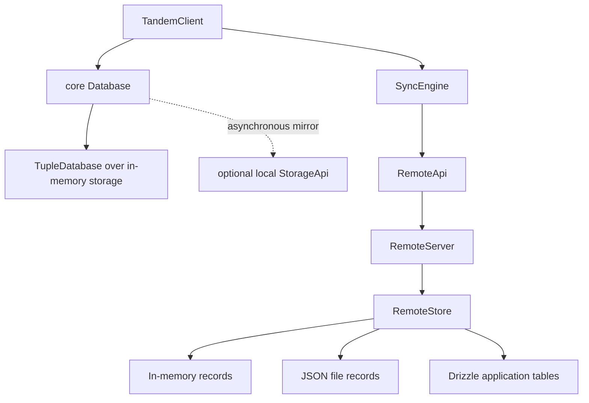
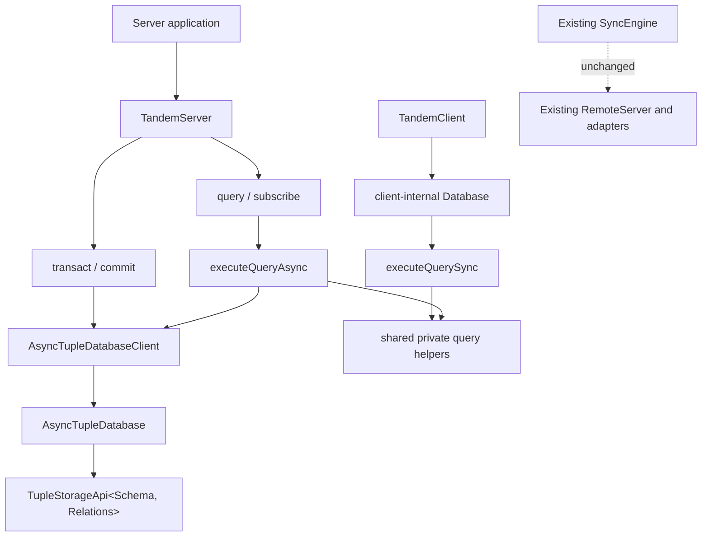
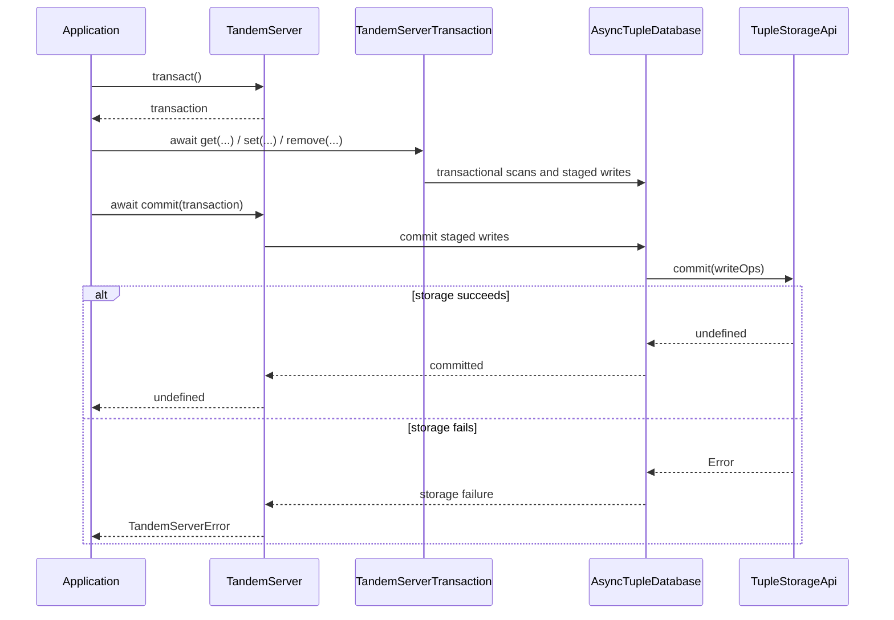
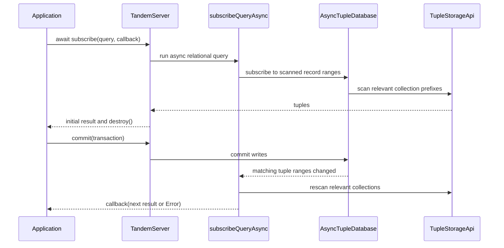

# TandemServer over typed tuple storage

## System flow

Today, the browser database and remote server use separate persistence models. The client wraps an in-memory tuple database and mirrors it into optional IndexedDB storage, while `RemoteServer` delegates domain mutations and snapshot queries to a separate `RemoteStore` abstraction.



This refactor adds the future server foundation without changing the existing sync path. `TandemServer` owns an asynchronous `tuple-database` stack, while an injected, schema-aware `TupleStorageApi` owns persistence. The core client database and the new server use parallel sync and async entry points from one shared query module so their query behavior cannot drift.







## Problem overview

The server package does not expose a database abstraction. Its current `RemoteServer` writes through `RemoteStore`, and every Drizzle provider reimplements record mutation and query execution. The only reusable database implementation is the client-specific `Database`, which must remain synchronous because `TandemClient.query()` is synchronous and therefore cannot sit directly on asynchronous server storage.

The upstream `AsyncTupleStorageApi` is also untyped: its `scan` and `commit` methods operate on unrestricted `KeyValuePair` values. A server constructed for one Tandem schema can therefore be paired with a storage implementation intended for another schema without a compile-time error.

## Solution overview

Add `TandemServer` to `@tanishqkancharla/tandem-server`. It accepts runtime `schema`, `relations`, and a Tandem-owned `TupleStorageApi<Schema, Relations>`, then wraps that storage with `AsyncTupleDatabase` and `AsyncTupleDatabaseClient`. The server exposes asynchronous `query`, `subscribe`, `transact`, `commit`, and `close` methods.

The storage contract types record tuple keys, IDs, and values from the Tandem schema. Relations participate in the storage type identity so mismatched storage cannot be injected, but this phase does not persist relation indexes. Storage failures and public server operations follow the repository's errors-as-values convention.

Extract the current relational evaluation logic from the client-specific `Database` into a shared query module with two typed entry points: `executeQuerySync(db, relations, query)` and `executeQueryAsync(db, relations, query)`. Each function owns the appropriate tuple-database reads. They share private filtering, sorting, projection, and relation-expansion helpers so query semantics remain identical without exposing record-loading details to callers.

## Goals

- Export `TandemServer` from `@tanishqkancharla/tandem-server` with inferred schema- and relation-aware query and transaction APIs.
- Export a `TupleStorageApi<Schema, Relations>` whose reads and writes preserve the correlation between collection names, record IDs, and record values.
- Make relation definitions part of storage type compatibility without adding persisted relation or secondary-index tuples.
- Support asynchronous `get`, `list`, and `update` transaction reads; synchronous staged `set` and `remove` writes; and commit only through `TandemServer.commit()`.
- Match `TandemClient` behavior and result inference for `select`, `where`, `orderBy`, `limit`, `offset`, and nested `with` queries.
- Support async relational subscriptions with an initial result, recomputation after relevant commits, and explicit destruction.
- Return expected database and storage failures as typed `Error` values at public Tandem boundaries.

## Non-goals

- Do not implement or rename the sync protocol. `RemoteApi`, `RemoteServer`, `push`, `pull`, `connect`, cookies, and mutation acknowledgement remain unchanged.
- Do not implement row versions, Client View Records, sequential client mutation IDs, durable client sync metadata, or reset patches.
- Do not remove or rewire the existing in-memory, JSON-file, SQLite, Postgres, or MySQL remote adapters in this phase.
- Do not ship production tuple-storage adapters or a Drizzle mapper. Tests may use a small in-memory implementation of the public storage contract.
- Do not add persisted relation indexes, secondary indexes, query pushdown, or adapter-specific query planning.
- Do not make `TandemClient` queries asynchronous or replace its in-memory database plus local-cache design.
- Do not provide cross-process storage invalidation. Subscriptions observe commits through the same `TandemServer` instance.
- Do not add migration or compatibility behavior for pre-release storage formats.

## Important files, docs, and websites

- [`packages/core/src/Database.ts`](../packages/core/src/Database.ts) — Contains the relational evaluator that must be shared without changing synchronous client behavior.
- [`packages/core/package.json`](../packages/core/package.json) — Defines the internal package subpath used to share query evaluation with the server package.
- [`packages/core/src/query/Query.ts`](../packages/core/src/query/Query.ts) — Defines relational query inputs, encoded query types, and inferred result types.
- [`packages/core/src/schema/Schema.ts`](../packages/core/src/schema/Schema.ts) — Defines `SchemaToTupleSchema`, runtime schemas, and normalized relation metadata.
- [`packages/core/src/transaction/Transaction.ts`](../packages/core/src/transaction/Transaction.ts) — Supplies the existing client transaction behavior that the async server API should mirror where practical.
- [`packages/core/src/storage/Storage.ts`](../packages/core/src/storage/Storage.ts) — Shows why the current `StorageApi` is a client cache contract and must remain distinct from server tuple storage.
- [`packages/server/src/RemoteServer.ts`](../packages/server/src/RemoteServer.ts) — The existing sync implementation that remains untouched until the later sync refactor.
- [`packages/server/src/index.ts`](../packages/server/src/index.ts) — Public server-package exports for the new server and storage contracts.
- [`packages/server/test/fixtures.ts`](../packages/server/test/fixtures.ts) — Existing remote-adapter fixtures that must continue working unchanged.
- [tuple-database](https://github.com/ccorcos/tuple-database) — Documents typed tuple unions, `AsyncTupleDatabase`, asynchronous transactions, and reactive query subscriptions.
- [errore](https://errore.org) — Defines the repository's errors-as-values convention for expected storage failures.

## Implementation

### Phase 1: Introduce shared sync and async query execution

Add one query module with synchronous and asynchronous entry points over the corresponding read-only tuple-database APIs. Both functions accept the same relations and query values and infer the same result type. Keep filtering, ordering, projection, and relation expansion in private shared helpers inside the module.

```callstack
 relational query caller
-└── caller-owned filtering and relation expansion
+├── executeQuerySync
+│   └── ReadOnlyTupleDatabaseClientApi.scan
+├── executeQueryAsync
+│   └── ReadOnlyAsyncTupleDatabaseClientApi.scan
+└── shared private query helpers
+    ├── filter and order rows
+    ├── apply offset, limit, and projection
+    └── expand nested relations
```

Add `packages/core/src/query/executeQuery.ts`. Preserve the existing ordering, filtering, nested `with`, projection, and cardinality behavior exactly.

```ts
export function executeQuerySync<TupleSchema, Relations, Query>(
	db: ReadOnlyTupleDatabaseClientApi<TupleSchema>,
	relations: Relations | undefined,
	query: Query,
): RelationalQueryResult<TupleSchemaToSchema<TupleSchema>, Relations, Query>

export function executeQueryAsync<TupleSchema, Relations, Query>(
	db: ReadOnlyAsyncTupleDatabaseClientApi<TupleSchema>,
	relations: Relations | undefined,
	query: Query,
): Promise<
	RelationalQueryResult<TupleSchemaToSchema<TupleSchema>, Relations, Query>
>
```

The functions infer the application schema from the tuple client's correlated record tuple union. Expose both functions from a new `packages/core/src/internal.ts` entry point and `@tanishqkancharla/tandem-core/internal` package subpath rather than making them part of the normal application API. Focused parity tests run the same query workflows through both functions and assert equal runtime results and result types.

- [x] Add typed `executeQuerySync` and `executeQueryAsync` entry points plus their shared private helpers in `packages/core/src/query/executeQuery.ts`.
- [x] Add `packages/core/src/internal.ts` and the `@tanishqkancharla/tandem-core/internal` export in `packages/core/package.json`.
- [x] Add `packages/core/test/executeQuery.spec.ts` parity workflows covering selection, filtering, ordering, and one nested relation through both entry points.
- [x] Run `pnpm --filter @tanishqkancharla/tandem-core exec vitest run test/executeQuery.spec.ts`.
- [x] Run `pnpm --filter @tanishqkancharla/tandem-core type-check`.

### Phase 2: Migrate the synchronous client database to `executeQuerySync`

Replace the relational evaluator embedded in `Database` with `executeQuerySync`, then delete the duplicate private implementation. `TandemClient.query()` and `TandemClient.subscribe()` do not change behavior or return types.

```callstack
 Database.query / Database.subscribe
-└── Database.runRelationalQuery
-    ├── Database.getRelationalRows
-    ├── Database.matchesRelationalWhere
-    └── Database.expandRelationalRow
+└── executeQuerySync
+    └── synchronous tuple scans and shared query helpers
```

```diff:packages/core/src/Database.ts
 query<Query extends RelationalQuery<Schema, Relations>>(
     query: Query,
 ): RelationalQueryResult<Schema, Relations, Query> {
-	return this.runRelationalQuery(query.collection, query) as ...
+	return executeQuerySync(this.tupleDb, this.relations, query)
 }
```

Remove the misleading public `Database` and `DatabaseArgs` exports from the core root while keeping the class available internally to `TandemClient`.

- [ ] Update `packages/core/src/Database.ts` to delegate both `query` and the function passed to `subscribeQuery` to `executeQuerySync`.
- [ ] Delete the superseded private filtering, ordering, projection, and relation-expansion methods and their unused imports from `packages/core/src/Database.ts`.
- [ ] Remove `Database` and `DatabaseArgs` from `packages/core/src/index.ts` without changing `TandemClient` exports.
- [ ] Run `pnpm --filter @tanishqkancharla/tandem-core exec vitest run test/TandemClient.spec.ts`.
- [ ] Run `pnpm --filter @tanishqkancharla/tandem-core type-check`.

### Phase 3: Define schema- and relation-typed tuple storage

Add a server-owned storage interface instead of exposing the untyped upstream storage API. Its tuple union initially contains only Tandem record tuples. A private phantom type member makes both `Schema` and `Relations` invariant for compatibility checks without producing runtime fields or persisted relation tuples.

```callstack
 storage adapter
-└── tuple-database AsyncTupleStorageApi
-    ├── scan(...) => KeyValuePair[]
-    └── commit(WriteOps<KeyValuePair>)
+└── Tandem TupleStorageApi<Schema, Relations>
+    ├── scan(...) => Error | TandemTuple<Schema, Relations>[]
+    ├── commit(WriteOps<TandemTuple<Schema, Relations>>) => Error | void
+    └── close() => Error | void
```

```ts
declare const tupleStorageTypes: unique symbol

export type TandemTuple<
	Schema extends AnySchema,
	Relations extends RuntimeRelationsDefinition<Schema>,
> = SchemaToTupleSchema<Schema>

export interface TupleStorageApi<
	Schema extends AnySchema,
	Relations extends RuntimeRelationsDefinition<Schema>,
> {
	readonly [tupleStorageTypes]?: {
		schema: (schema: Schema) => Schema
		relations: (relations: Relations) => Relations
	}

	scan(
		args?: ScanStorageArgs,
	): Promise<Error | TandemTuple<Schema, Relations>[]>

	commit(
		writes: WriteOps<TandemTuple<Schema, Relations>>,
	): Promise<Error | void>

	close(): Promise<Error | void>
}
```

The storage API owns only ordered range scans, atomic write batches, and resource cleanup. It does not expose `clear`, because server persistence is not a disposable replica cache. The adapter must return expected failures as `Error` values; a later adapter is responsible for converting database-driver rejections at its own boundary.

```ts
type AppStorage = TupleStorageApi<AppSchema, AppRelations>

declare const storage: AppStorage

await storage.commit({
	set: [
		{
			key: ["record", "threads", "thread-1"],
			value: { id: "thread-1", title: "Typed" },
		},
	],
})
```

```diff:packages/server/src/index.ts
+export type {
+	TandemTuple,
+	TupleStorageApi,
+} from "./storage/TupleStorage"
```

- [ ] Add `TandemTuple<Schema, Relations>` and `TupleStorageApi<Schema, Relations>` in `packages/server/src/storage/TupleStorage.ts`, using schema-correlated record key/value pairs and relation type identity only.
- [ ] Add `tuple-database` as a direct dependency of `packages/server/package.json` and export the new public types from `packages/server/src/index.ts`.
- [ ] Add `packages/server/test/TupleStorage.types.ts` with positive inference checks and `@ts-expect-error` cases for unknown collections, wrong ID/value types, and schema or relation mismatches.
- [ ] Run `pnpm --filter @tanishqkancharla/tandem-server type-check`.
- [ ] Run `pnpm type-check`.

### Phase 4: Add typed asynchronous server transactions

Introduce `TandemServer` and `TandemServerTransaction` with transaction CRUD before layering relational queries on top. `TandemServer` adapts the errors-as-values storage contract to the throwing contract required internally by `AsyncTupleDatabase`, then converts rejections back into a tagged `TandemServerError` at each public async boundary. The error preserves the operation and original cause, whether the failure came from storage or `tuple-database` concurrency control.

```callstack
 application write
-└── no direct server database API
+└── TandemServer.transact
+    └── TandemServerTransaction
+        ├── await get / list / update
+        ├── set / remove
+        └── TandemServer.commit
+            └── AsyncTupleRootTransaction.commit
+                └── AsyncTupleDatabase.commit
+                    └── TupleStorageApi.commit
```

```ts
export type TandemServerArgs<Schema, Relations> = {
	schema: RuntimeSchemaDefinition<Schema>
	relations: Relations
	storage: TupleStorageApi<Schema, Relations>
}

export class TandemServer<Schema, Relations> {
	constructor(args: TandemServerArgs<Schema, Relations>) {
		this.tupleDb = new AsyncTupleDatabaseClient<TandemTuple<Schema, Relations>>(
			new AsyncTupleDatabase(toTupleDatabaseStorage(args.storage)),
		)
		...
	}

	transact(): TandemServerTransaction<Schema, Relations> {
		return new TandemServerTransaction(this.tupleDb.transact())
	}

	async commit(transaction: TandemServerTransaction<Schema, Relations>) {
		return await transaction.commit().catch(
			(error) => new TandemServerError({ operation: "commit", cause: error }),
		)
	}
}
```

```ts
const tx = server.transact()

const existing = await tx.get("threads", "thread-1")
if (existing instanceof Error) return existing

tx.set("threads", { ...existing, title: "Updated" })

const committed = await server.commit(tx)
if (committed instanceof Error) return committed
```

The transaction wrapper keeps the upstream tuple transaction private. Reads return `Error | value`, `update` is asynchronous because it reads the existing record, and writes remain synchronously staged. Only `TandemServer.commit(transaction)` can commit. `close()` closes the wrapped tuple database and therefore the injected storage; adapters that wrap shared external clients may implement `close()` as a no-op.

- [ ] Add `packages/server/src/TandemServer.ts`, `packages/server/src/TandemServerTransaction.ts`, and a tagged `TandemServerError`, always importing `errore` as a namespace.
- [ ] Implement async `get`, `list`, and `update`, staged `set` and `remove`, server-owned `commit`, transaction cancellation, and server `close` over `AsyncTupleDatabaseClient`.
- [ ] Add a reusable in-memory `TupleStorageApi` test fixture and public-surface CRUD tests in `packages/server/test/TandemServer.spec.ts`, including transactional read-your-writes, a concurrent read/write conflict, and an injected storage failure returned as an `Error` value.
- [ ] Export `TandemServer`, `TandemServerArgs`, `TandemServerTransaction`, and the public error type from `packages/server/src/index.ts`; add `errore` to `packages/server/package.json`.
- [ ] Run `pnpm --filter @tanishqkancharla/tandem-server exec vitest run test/TandemServer.spec.ts`; then run `pnpm --filter @tanishqkancharla/tandem-server type-check`.

### Phase 5: Add full relational query parity

Implement `TandemServer.query()` by delegating to `executeQueryAsync`. The query abstraction owns asynchronous tuple scans and all relational evaluation; `TandemServer` only translates expected tuple-database or storage failures into `TandemServerError`. Do not push filters or joins into storage in this phase.

```callstack
 TandemServer.query
-└── not implemented
+└── executeQueryAsync
+    ├── AsyncTupleDatabaseClient.scan
+    ├── filter / order / offset / limit
+    ├── project selected fields
+    └── expand nested relations
```

```diff:packages/server/src/TandemServer.ts
+async query<Query extends RelationalQuery<Schema, Relations>>(
+	query: Query,
+): Promise<
+	| TandemServerError
+	| RelationalQueryResult<Schema, Relations, Query>
+> {
+	return executeQueryAsync(this.tupleDb, this.relations, query).catch(
+		(cause) => new TandemServerError({ cause }),
+	)
+}
```

Use the same public query types exported by core so collection names, fields, relation names, and nested result shapes infer from the `schema` and `relations` passed to `TandemServer`.

```ts
const result = await server.query({
	collection: "threads",
	select: { id: true, title: true },
	where: { status: "open" },
	orderBy: { createdAt: "desc" },
	with: {
		messages: {
			select: { body: true },
			orderBy: { createdAt: "asc" },
		},
	},
})
if (result instanceof Error) return result

// Inferred as Array<{ id: string; title: string; messages: Array<{ body: string }> }>
```

- [ ] Add `TandemServer.query()` in `packages/server/src/TandemServer.ts` by delegating to `executeQueryAsync` and translating expected storage failures at the public boundary.
- [ ] Extend `packages/server/test/TandemServer.spec.ts` with public query workflows for filtering, ordering, pagination, selection, one-to-many, many-to-one, and nested relations.
- [ ] Add `packages/server/test/TandemServer.types.ts` assertions for inferred root and nested query results plus rejected collection, field, and relation names.
- [ ] Run `pnpm --filter @tanishqkancharla/tandem-server exec vitest run test/TandemServer.spec.ts`.
- [ ] Run `pnpm --filter @tanishqkancharla/tandem-server type-check`.

### Phase 6: Add reactive relational subscriptions and lifecycle cleanup

Use `subscribeQueryAsync` with `executeQueryAsync`. Because `subscribeQueryAsync` records every tuple range scanned during execution, root and included collection changes trigger recomputation through the same `AsyncTupleDatabase` instance.

```callstack
 TandemServer.subscribe
-└── not implemented
+└── subscribeQueryAsync
+    └── executeQueryAsync
+        ├── subscribe to each scanned tuple range
+        ├── produce the initial result
+        └── recompute after matching commits

 TandemServer.close
-└── TupleStorageApi.close
+├── destroy active relational subscriptions
+└── AsyncTupleDatabase.close
+    └── TupleStorageApi.close
```

```ts
async subscribe<Query extends RelationalQuery<Schema, Relations>>(
	query: Query,
	callback: (
		result:
			| TandemServerError
			| RelationalQueryResult<Schema, Relations, Query>,
	) => void,
): Promise<
	| TandemServerError
	| {
		result: RelationalQueryResult<Schema, Relations, Query>
		destroy: () => void
	}
> {
	...
}
```

An initial read failure returns `TandemServerError` and removes any listeners registered during the failed computation. A later recomputation failure is delivered to the callback as an error value. `TandemServer` tracks returned destructors so `close()` makes every active subscription inert before closing storage.

```diff:packages/server/src/TandemServer.ts
+const subscription = await subscribeQueryAsync(
+	this.tupleDb,
+	(db) => this.runQuery(query, db),
+	callback,
+).catch(
+	(error) => new TandemServerError({ operation: "subscribe", cause: error }),
+)
+if (subscription instanceof Error) return subscription
+if (subscription.result instanceof Error) {
+	subscription.destroy()
+	return subscription.result
+}
+return this.trackSubscription(subscription)
```

- [ ] Add `TandemServer.subscribe()` using `subscribeQueryAsync`, `executeQueryAsync`, and the same schema-aware result inference as `query()`.
- [ ] Track subscription destructors and update `TandemServer.close()` to destroy listeners before closing its injected storage.
- [ ] Add public behavior tests for the initial result, root and included-record recomputation, explicit destruction, storage-read errors, and server cleanup; extend `packages/server/test/TandemServer.types.ts` with subscription result, callback, and error-union inference.
- [ ] Run `pnpm --filter @tanishqkancharla/tandem-server test`; then run `pnpm --filter @tanishqkancharla/tandem-server type-check`.
- [ ] Run `pnpm build`, `pnpm lint`, `pnpm type-check`, and `pnpm test`.
