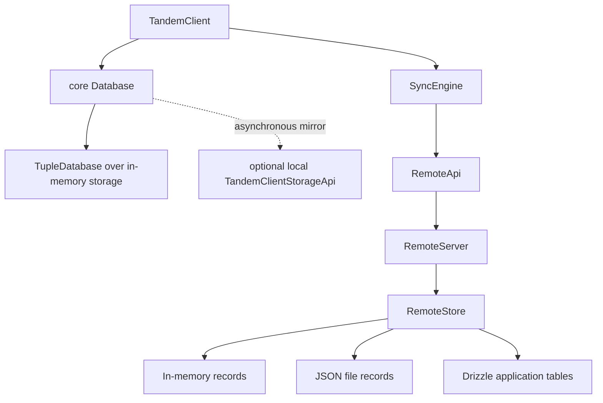
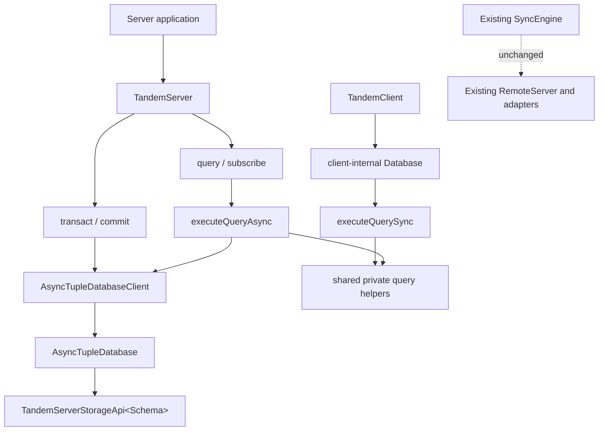
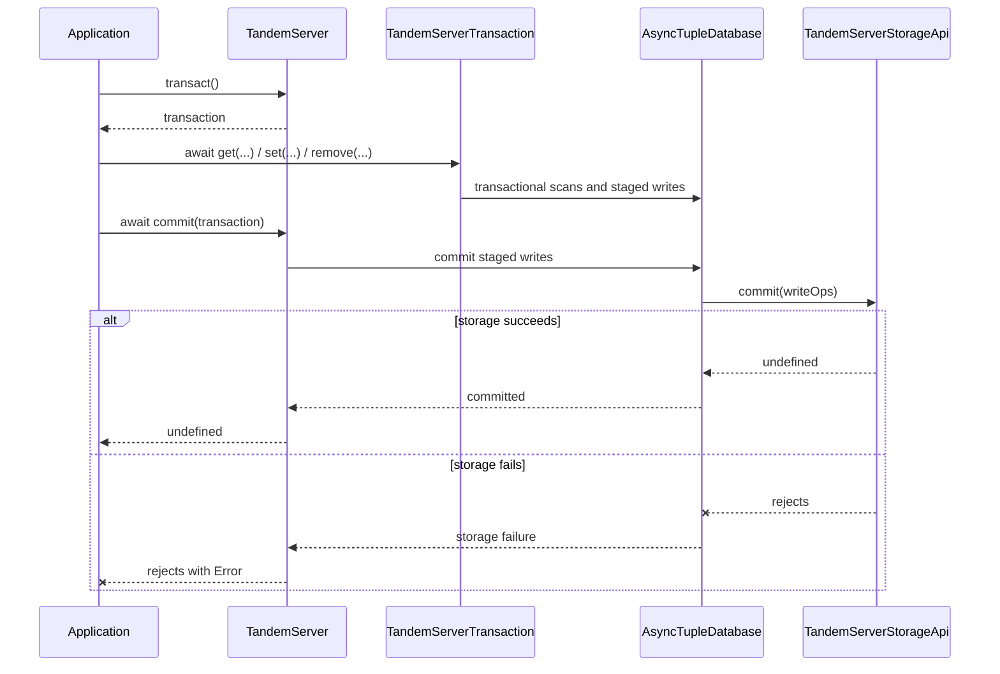
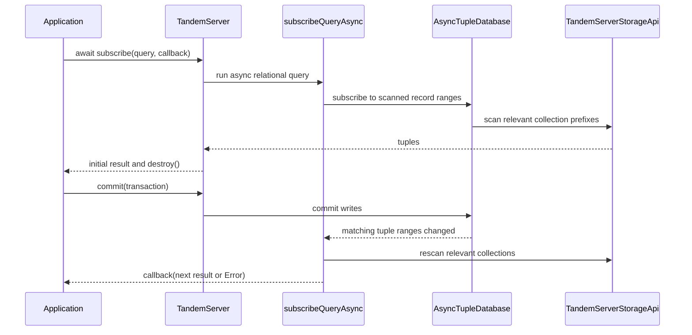

# TandemServer over typed tuple storage

## System flow

Today, the browser database and remote server use separate persistence models. The client wraps an in-memory tuple database and mirrors it into optional IndexedDB storage, while `RemoteServer` delegates domain mutations and snapshot queries to a separate `RemoteStore` abstraction.



This refactor adds the future server foundation without changing the existing sync path. `TandemServer` owns an asynchronous `tuple-database` stack, while an injected, schema-aware `TandemServerStorageApi` owns persistence. The core client database and the new server use parallel sync and async entry points from one shared query module so their query behavior cannot drift.







## Problem overview

The server package does not expose a database abstraction. Its current `RemoteServer` writes through `RemoteStore`, and every Drizzle provider reimplements record mutation and query execution. The only reusable database implementation is the client-specific `Database`, which must remain synchronous because `TandemClient.query()` is synchronous and therefore cannot sit directly on asynchronous server storage.

The upstream `AsyncTupleStorageApi` is also untyped: its `scan` and `commit` methods operate on unrestricted `KeyValuePair` values. A server constructed for one Tandem schema can therefore be paired with a storage implementation intended for another schema without a compile-time error.

## Solution overview

Add `TandemServer` to `@tanishqkancharla/tandem-server`. It accepts runtime `schema`, `relations`, and a Tandem-owned `TandemServerStorageApi<Schema>`, then wraps that storage with `AsyncTupleDatabase` and `AsyncTupleDatabaseClient`. The server exposes asynchronous `query`, `subscribe`, `transact`, `commit`, and `close` methods.

The storage contract types record tuple keys, IDs, and values from the Tandem schema. Relations remain a server query concern and do not participate in the raw storage type. Storage failures and public server operations follow the repository's errors-as-values convention.

Extract the current relational evaluation logic from the client-specific `Database` into a shared query module with two typed entry points: `executeQuerySync(db, relations, query)` and `executeQueryAsync(db, relations, query)`. Each function owns the appropriate tuple-database reads. They share private filtering, sorting, projection, and relation-expansion helpers so query semantics remain identical without exposing record-loading details to callers.

## Goals

- Export `TandemServer` from `@tanishqkancharla/tandem-server` with inferred schema- and relation-aware query and transaction APIs.
- Export a `TandemServerStorageApi<Schema>` whose reads and writes preserve the correlation between collection names, record IDs, and record values.
- Support asynchronous `get`, `list`, and `update` transaction reads; synchronous staged `set` and `remove` writes; and commit only through `TandemServer.commit()`.
- Match `TandemClient` behavior and result inference for `select`, `where`, `orderBy`, `limit`, `offset`, and nested `with` queries.
- Support async relational subscriptions with an initial result, recomputation after relevant commits, and explicit destruction.
- Return expected database and storage failures as typed `Error` values at public Tandem boundaries.

## Non-goals

- Do not implement or rename the sync protocol. `RemoteApi`, `RemoteServer`, `push`, `pull`, `connect`, cookies, and mutation acknowledgement remain unchanged.
- Do not implement row versions, Client View Records, sequential client mutation IDs, durable client sync metadata, or reset patches.
- Do not remove or rewire the existing in-memory, JSON-file, SQLite, Postgres, or MySQL remote adapters in this phase.
- Do not ship production tuple-storage adapters or a Drizzle mapper. Tests may use a small in-memory implementation of the public storage contract.
- Do not add persisted relation indexes, secondary indexes, query pushdown, or adapter-specific query planning.
- Do not make `TandemClient` queries asynchronous or replace its in-memory database plus local-cache design.
- Do not provide cross-process storage invalidation. Subscriptions observe commits through the same `TandemServer` instance.
- Do not add migration or compatibility behavior for pre-release storage formats.

## Important files, docs, and websites

- [`packages/core/src/Database.ts`](../packages/core/src/Database.ts) — Contains the relational evaluator that must be shared without changing synchronous client behavior.
- [`packages/core/package.json`](../packages/core/package.json) — Defines the internal package subpath used to share query evaluation with the server package.
- [`packages/core/src/query/Query.ts`](../packages/core/src/query/Query.ts) — Defines relational query inputs, encoded query types, and inferred result types.
- [`packages/core/src/schema/Schema.ts`](../packages/core/src/schema/Schema.ts) — Defines `SchemaToTupleSchema`, runtime schemas, and normalized relation metadata.
- [`packages/core/src/transaction/Transaction.ts`](../packages/core/src/transaction/Transaction.ts) — Supplies the existing client transaction behavior that the async server API should mirror where practical.
- [`packages/core/src/storage/TandemClientStorage.ts`](../packages/core/src/storage/TandemClientStorage.ts) — Shows why the current `TandemClientStorageApi` is a client cache contract and must remain distinct from server tuple storage.
- [`packages/server/src/RemoteServer.ts`](../packages/server/src/RemoteServer.ts) — The existing sync implementation that remains untouched until the later sync refactor.
- [`packages/server/src/index.ts`](../packages/server/src/index.ts) — Public server-package exports for the new server and storage contracts.
- [`packages/server/test/fixtures.ts`](../packages/server/test/fixtures.ts) — Existing remote-adapter fixtures that must continue working unchanged.
- [tuple-database](https://github.com/ccorcos/tuple-database) — Documents typed tuple unions, `AsyncTupleDatabase`, asynchronous transactions, and reactive query subscriptions.
- [errore](https://errore.org) — Defines the repository's errors-as-values convention for expected storage failures.

## Implementation

### Phase 1: Introduce shared sync and async query execution

Add one query module with synchronous and asynchronous entry points over the corresponding read-only tuple-database APIs. Both functions accept the same relations and query values and infer the same result type. Keep filtering, ordering, projection, and relation expansion in private shared helpers inside the module.

```callstack
 relational query caller
-└── caller-owned filtering and relation expansion
+├── executeQuerySync
+│   └── ReadOnlyTupleDatabaseClientApi.scan
+├── executeQueryAsync
+│   └── ReadOnlyAsyncTupleDatabaseClientApi.scan
+└── shared private query helpers
+    ├── filter and order rows
+    ├── apply offset, limit, and projection
+    └── expand nested relations
```

Add `packages/core/src/query/executeQuery.ts`. Preserve the existing ordering, filtering, nested `with`, projection, and cardinality behavior exactly.

```ts
export function executeQuerySync<Schema, Relations, Query>(
	db: ReadOnlyTupleDatabaseClientApi<SchemaToTupleSchema<Schema>>,
	relations: Relations | undefined,
	query: Query,
): RelationalQueryResult<Schema, Relations, Query>

export function executeQueryAsync<Schema, Relations, Query>(
	db: ReadOnlyAsyncTupleDatabaseClientApi<SchemaToTupleSchema<Schema>>,
	relations: Relations | undefined,
	query: Query,
): Promise<RelationalQueryResult<Schema, Relations, Query>>
```

The functions take the application schema as their primary type parameter instead of attempting to reconstruct it from a mapped tuple union. Generic callers provide the schema explicitly; application code continues to infer query results through `TandemClient` and `TandemServer`. Expose both functions from a new `packages/core/src/internal.ts` entry point and `@tanishqkancharla/tandem-core/internal` package subpath rather than making them part of the normal application API. Focused parity tests run the same query workflows through both functions and assert equal runtime results and result types.

- [x] Add typed `executeQuerySync` and `executeQueryAsync` entry points plus their shared private helpers in `packages/core/src/query/executeQuery.ts`.
- [x] Add `packages/core/src/internal.ts` and the `@tanishqkancharla/tandem-core/internal` export in `packages/core/package.json`.
- [x] Add `packages/core/test/executeQuery.spec.ts` parity workflows covering selection, filtering, ordering, and one nested relation through both entry points.
- [x] Run `pnpm --filter @tanishqkancharla/tandem-core exec vitest run test/executeQuery.spec.ts`.
- [x] Run `pnpm --filter @tanishqkancharla/tandem-core type-check`.

### Phase 2: Migrate the synchronous client database to `executeQuerySync`

Replace the relational evaluator embedded in `Database` with `executeQuerySync`, then delete the duplicate private implementation. `TandemClient.query()` and `TandemClient.subscribe()` do not change behavior or return types.

```callstack
 Database.query / Database.subscribe
-└── Database.runRelationalQuery
-    ├── Database.getRelationalRows
-    ├── Database.matchesRelationalWhere
-    └── Database.expandRelationalRow
+└── executeQuerySync
+    └── synchronous tuple scans and shared query helpers
```

```diff:packages/core/src/Database.ts
 query<Query extends RelationalQuery<Schema, Relations>>(
     query: Query,
 ): RelationalQueryResult<Schema, Relations, Query> {
-	return this.runRelationalQuery(query.collection, query) as ...
+	return executeQuerySync<Schema, Relations, Query>(
+		this.tupleDb,
+		this.relations,
+		query,
+	)
 }
```

Remove the misleading public `Database` and `DatabaseArgs` exports from the core root while keeping the class available internally to `TandemClient`.

- [x] Update `packages/core/src/Database.ts` to delegate both `query` and the function passed to `subscribeQuery` to `executeQuerySync`.
- [x] Type the client tuple database, persistence adapter, write batches, and transaction handles with `SchemaToTupleSchema<Schema>`.
- [x] Delete the superseded private filtering, ordering, projection, and relation-expansion methods and their unused imports from `packages/core/src/Database.ts`.
- [x] Remove `Database` and `DatabaseArgs` from `packages/core/src/index.ts` without changing `TandemClient` exports.
- [x] Run `pnpm --filter @tanishqkancharla/tandem-core exec vitest run test/TandemClient.spec.ts`.
- [x] Run `pnpm --filter @tanishqkancharla/tandem-core type-check`.

### Phase 3: Define schema-typed tuple storage

Add a server-owned storage interface instead of exposing the untyped upstream storage API. Its tuple union initially contains only Tandem record tuples. The schema determines the valid record keys, IDs, and values; relations do not affect the physical storage contract.

```callstack
 storage adapter
-└── tuple-database AsyncTupleStorageApi
-    ├── scan(...) => KeyValuePair[]
-    └── commit(WriteOps<KeyValuePair>)
+└── TandemServerStorageApi<Schema>
+    ├── scan(...) => TandemTuple<Schema>[]
+    ├── commit(WriteOps<TandemTuple<Schema>>) => void
+    └── close() => void
```

```ts
export type TandemTuple<Schema extends AnySchema> = SchemaToTupleSchema<Schema>

export interface TandemServerStorageApi<Schema extends AnySchema> {
	scan(args?: ScanStorageArgs): Promise<TandemTuple<Schema>[]>

	commit(writes: WriteOps<TandemTuple<Schema>>): Promise<void>

	close(): Promise<void>
}
```

The storage API owns only ordered range scans, atomic write batches, and resource cleanup. It does not expose `clear`, because server persistence is not a disposable replica cache. Storage adapters use conventional promise rejection so Tandem's internal errors-as-values convention does not leak into consumer implementations.

```ts
type AppStorage = TandemServerStorageApi<AppSchema>

declare const storage: AppStorage

await storage.commit({
	set: [
		{
			key: ["record", "threads", "thread-1"],
			value: { id: "thread-1", title: "Typed" },
		},
	],
})
```

```diff:packages/server/src/index.ts
+export type {
+	TandemTuple,
+	TandemServerStorageApi,
+} from "./storage/TandemServerStorage"
```

- [x] Add `TandemTuple<Schema>` and `TandemServerStorageApi<Schema>` in `packages/server/src/storage/TandemServerStorage.ts`, using schema-correlated record key/value pairs.
- [x] Add `tuple-database` as a direct dependency of `packages/server/package.json` and export the new public types from `packages/server/src/index.ts`.
- [x] Add `packages/server/test/TandemServerStorage.types.ts` with positive inference checks and `@ts-expect-error` cases for unknown collections, wrong ID/value types, and schema mismatches.
- [x] Run `pnpm --filter @tanishqkancharla/tandem-server type-check`.
- [x] Run `pnpm type-check`.

### Phase 4: Add typed asynchronous server transactions

Introduce `TandemServer` and `TandemServerTransaction` with transaction CRUD before layering relational queries on top. Tandem converts storage and `tuple-database` rejections into tagged error values internally, then throws only at consumer-facing method boundaries. The internal error preserves the operation and original cause without appearing in public return types or package exports.

```callstack
 application write
-└── no direct server database API
+└── TandemServer.transact
+    └── TandemServerTransaction
+        ├── await get / list / update
+        ├── set / remove
+        └── TandemServer.commit
+            └── AsyncTupleRootTransaction.commit
+                └── AsyncTupleDatabase.commit
+                    └── TandemServerStorageApi.commit
```

```ts
export type TandemServerArgs<Schema, Relations> = {
	schema: RuntimeSchemaDefinition<Schema>
	relations: Relations
	storage: TandemServerStorageApi<Schema>
}

export class TandemServer<Schema, Relations> {
	constructor(args: TandemServerArgs<Schema, Relations>) {
		this.tupleDb = new AsyncTupleDatabaseClient<TandemTuple<Schema>>(
			new AsyncTupleDatabase(tandemStorageToTupleDatabaseStorage(args.storage)),
		)
		...
	}

	transact(): TandemServerTransaction<Schema, Relations> {
		return new TandemServerTransaction(this.tupleDb.transact(), this.relations)
	}

	async commit(transaction: TandemServerTransaction<Schema, Relations>) {
		const result = await transaction.commit().catch(
			(cause) => new TandemServerError({ operation: "commit", cause }),
		)
		if (result instanceof Error) throw result
	}
}
```

```ts
const tx = server.transact()

const existing = await tx.get("threads", "thread-1")
tx.set("threads", { ...existing, title: "Updated" })
await server.commit(tx)
```

Like the synchronous `Transaction`, the server transaction manages one upstream tuple transaction directly on the instance. That upstream transaction owns its staged writes and read set until `TandemServer.commit(transaction)` commits it. Transaction queries use the same relation-aware API as `TandemServer.query()` and include those staged writes. Reads return their values directly and reject on failure, `update` is asynchronous because it reads the existing record, and writes remain synchronously staged. `close()` closes the wrapped tuple database and therefore the injected storage; adapters that wrap shared external clients may implement `close()` as a no-op.

- [x] Add `packages/server/src/TandemServer.ts`, `packages/server/src/TandemServerTransaction.ts`, and an internal tagged `TandemServerError`, always importing `errore` as a namespace where the package is used.
- [x] Implement async `get`, `list`, `update`, and relational `query`, staged `set` and `remove`, server-owned `commit`, transaction cancellation, and server `close` over `AsyncTupleDatabaseClient`.
- [x] Add a reusable in-memory `TandemServerStorageApi` test fixture and public-surface CRUD tests in `packages/server/test/TandemServer.spec.ts`, including transactional read-your-writes, a concurrent read/write conflict, and an injected storage rejection.
- [x] Export `TandemServer`, `TandemServerArgs`, and `TandemServerTransaction` from `packages/server/src/index.ts`; keep the tagged error type internal and add `errore` to `packages/server/package.json`.
- [x] Run `pnpm --filter @tanishqkancharla/tandem-server exec vitest run test/TandemServer.spec.ts`; then run `pnpm --filter @tanishqkancharla/tandem-server type-check`.

### Phase 5: Add full relational query parity

Implement `TandemServer.query()` by delegating to `executeQueryAsync`. The query abstraction owns asynchronous tuple scans and all relational evaluation; `TandemServer` only translates expected tuple-database or storage failures into `TandemServerError`. Do not push filters or joins into storage in this phase.

```callstack
 TandemServer.query
-└── not implemented
+└── executeQueryAsync
+    ├── AsyncTupleDatabaseClient.scan
+    ├── filter / order / offset / limit
+    ├── project selected fields
+    └── expand nested relations
```

```diff:packages/server/src/TandemServer.ts
+async query<Query extends RelationalQuery<Schema, Relations>>(
+	query: Query,
+): Promise<RelationalQueryResult<Schema, Relations, Query>> {
+	const result = await executeQueryAsync<Schema, Relations, Query>(
+		this.tupleDb,
+		this.relations,
+		query,
+	).catch(
+		(cause) => new TandemServerError({ cause }),
+	)
+	if (result instanceof Error) throw result
+	return result
+}
```

Use the same public query types exported by core so collection names, fields, relation names, and nested result shapes infer from the `schema` and `relations` passed to `TandemServer`.

```ts
const result = await server.query({
	collection: "threads",
	select: { id: true, title: true },
	where: { status: "open" },
	orderBy: { createdAt: "desc" },
	with: {
		messages: {
			select: { body: true },
			orderBy: { createdAt: "asc" },
		},
	},
})

// Inferred as Array<{ id: string; title: string; messages: Array<{ body: string }> }>
```

- [x] Add `TandemServer.query()` in `packages/server/src/TandemServer.ts` by delegating to `executeQueryAsync` and translating expected storage failures at the public boundary.
- [x] Extend `packages/server/test/TandemServer.spec.ts` with public query workflows for filtering, ordering, pagination, selection, one-to-many, many-to-one, and nested relations.
- [x] Add `packages/server/test/TandemServer.types.ts` assertions for inferred root and nested query results plus rejected collection, field, and relation names.
- [x] Run `pnpm --filter @tanishqkancharla/tandem-server exec vitest run test/TandemServer.spec.ts`.
- [x] Run `pnpm --filter @tanishqkancharla/tandem-server type-check`.

### Phase 6: Add reactive relational subscriptions and lifecycle cleanup

Use `subscribeQueryAsync` with `executeQueryAsync`. Because `subscribeQueryAsync` records every tuple range scanned during execution, root and included collection changes trigger recomputation through the same `AsyncTupleDatabase` instance.

```callstack
 TandemServer.subscribe
-└── not implemented
+└── subscribeQueryAsync
+    └── executeQueryAsync
+        ├── subscribe to each scanned tuple range
+        ├── produce the initial result
+        └── recompute after matching commits

 TandemServer.close
-└── TandemServerStorageApi.close
+├── destroy active relational subscriptions
+└── AsyncTupleDatabase.close
+    └── TandemServerStorageApi.close
```

```ts
async subscribe<Query extends RelationalQuery<Schema, Relations>>(
	query: Query,
	callback: (result: RelationalQueryResult<Schema, Relations, Query>) => void,
	options?: { onError?: (error: Error) => void },
): Promise<{
		result: RelationalQueryResult<Schema, Relations, Query>
		destroy: () => void
}> {
	...
}
```

An initial read failure rejects `subscribe()` and removes any listeners registered during the failed computation. A later recomputation failure goes to the optional `onError` callback; the result callback only receives query results. Without an error callback, Tandem logs the background failure. `TandemServer` tracks returned destructors so `close()` makes every active subscription inert before closing storage.

```diff:packages/server/src/TandemServer.ts
+const subscription = await subscribeQueryAsync(
+	this.tupleDb,
+	(db) => this.runQuery(query, db),
+	(result) => {
+		if (result instanceof Error) {
+			if (options.onError) options.onError(result)
+			else console.error(result)
+			return
+		}
+		callback(result)
+	},
+).catch(
+	(error) => new TandemServerError({ operation: "subscribe", cause: error }),
+)
+if (subscription instanceof Error) throw subscription
+if (subscription.result instanceof Error) {
+	subscription.destroy()
+	throw subscription.result
+}
+return this.trackSubscription(subscription)
```

- [x] Add `TandemServer.subscribe()` using `subscribeQueryAsync`, `executeQueryAsync`, and the same schema-aware result inference as `query()`.
- [x] Track subscription destructors and update `TandemServer.close()` to destroy listeners before closing its injected storage.
- [x] Add public behavior tests for the initial result, root and included-record recomputation, explicit destruction, storage-read errors, and server cleanup; extend `packages/server/test/TandemServer.types.ts` with result-only subscription and error-callback inference.
- [x] Run `pnpm --filter @tanishqkancharla/tandem-server test`; then run `pnpm --filter @tanishqkancharla/tandem-server type-check`.
- [x] Run `pnpm build`, `pnpm lint`, `pnpm type-check`, and `pnpm test`.
