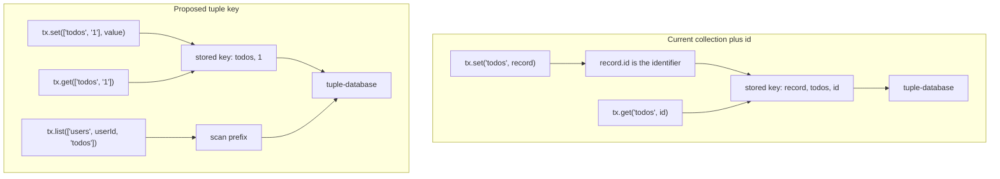
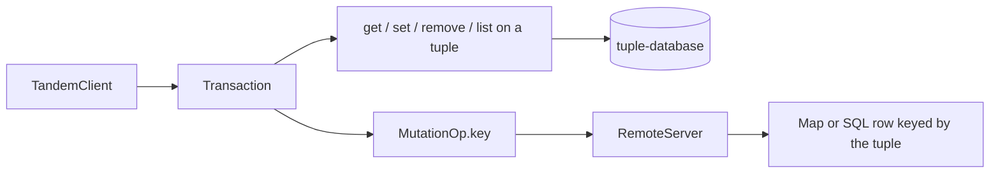

# Tuple keys

## System flow





## Problem overview

Tandem wraps tuple-database in a collection-plus-record model. Callers write `tx.set("todos", { id: "1", text: "Buy milk" })`. The client then invents a storage key `["record", "todos", "1"]` and treats `record.id` as identity. That extra identifier layer is why nested collections are awkward, why one-to-many data needs a foreign-key field, and why Tandem's API does not match the store it already uses. tuple-database already stores `{ key: Tuple, value }` and prefix-scans. Tandem should expose that model.

## Solution overview

Make the tuple the identifier. `tx.set(["todos", "1"], { text: "Buy milk" })` writes that key and value with no `id` field and no `"record"` prefix. Nested data is a longer key, for example `["users", userId, "todos", todoId]`. `list(prefix)` is a prefix scan. Schema becomes a union of `{ key, value }` pairs, the same shape tuple-database already types. Mutations, patches, and remotes carry the tuple instead of `collection` plus `id`.

Assumption: key elements are `string | number`, as in `["todos", "1"]`. This spec does not adopt tuple-database named-tuple elements such as `{ id: string }`.

## Goals

- `tx.set(["todos", "1"], value)` / `tx.get(["todos", "1"])` / `tx.remove(["todos", "1"])` / `tx.update(["todos", "1"], fn)` use the tuple as identity.
- Values do not need an `id` field. The key is not copied into the value.
- `tx.list(["users", userId, "todos"])` returns the nested rows under that prefix as `{ key, value }[]`.
- Storage keys are the caller tuple. Drop the `"record"` prefix.
- Schema is a union of `{ key, value }` pairs. `tx.get(["todos", "1"])` infers the todos value type.
- Mutations, patches, and scan-window queries identify data by tuple key or prefix, not by `collection` plus `id`.
- Existing client tests pass after they use tuple keys. A new test covers a nested prefix.

## Non-goals

- No migrations or backfills of persisted IndexedDB or SQL data.
- No compatibility path for `tx.set("todos", record)` or required `record.id`.
- No rebuild of `defineRelations` or query `with` includes. Nested keys replace parent-child foreign keys. Cross-record pointers can store a tuple on the value later.
- No query planner that turns `where` into extra prefix scans. `where` still filters values after a prefix scan.
- No named-tuple key elements (`["user", { id }]`).
- No SQL composite keys. Remote SQL stores the tuple as one text key.

## Developer experience

These are the caller-facing API changes. Tandem's user is the app author.

### Schema

Before, a schema is a map of collections, and every record type must include `id`:

```ts
const schema = defineSchema({
	todos: collection({
		id: t.id(),
		text: t.string(),
		done: t.boolean(),
	}),
	messages: collection({
		id: t.id(),
		threadId: t.string(),
		body: t.string(),
	}),
})

const relations = defineRelations(schema, ({ many }) => ({
	threads: {
		messages: many("messages", { from: "id", to: "threadId" }),
	},
}))
```

After, the schema is a union of key and value pairs. Nested collections are longer keys. `t.id()` and `defineRelations` are gone:

```ts
type Schema =
	| { key: ["todos", string]; value: { text: string; done: boolean } }
	| { key: ["threads", string]; value: { title: string } }
	| { key: ["threads", string, "messages", string]; value: { body: string } }
```

### Writes and reads

Before, the first argument is a collection name and identity lives on the record:

```ts
const tx = client.transact()
tx.set("todos", { id: "1", text: "Buy milk", done: false })
tx.get("todos", "1")
tx.update("todos", "1", (todo) => ({ ...todo, done: true }))
tx.remove("todos", "2")
await client.commit(tx)
```

After, the first argument is the key. The value has no `id`:

```ts
const tx = client.transact()
tx.set(["todos", "1"], { text: "Buy milk", done: false })
tx.get(["todos", "1"])
tx.update(["todos", "1"], (todo) => ({ ...todo, done: true }))
tx.remove(["todos", "2"])
await client.commit(tx)
```

### Nested collections

Before, a child row stores a foreign key and lives in a sibling collection. Listing a thread's messages is a query with `where: { threadId }` or a `with` include:

```ts
tx.set("threads", { id: "t1", title: "Ship keys" })
tx.set("messages", { id: "m1", threadId: "t1", body: "Hello" })
client.query({
	collection: "messages",
	where: { threadId: "t1" },
})
client.query({
	collection: "threads",
	with: { messages: true },
})
```

After, the child key is nested under the parent. Listing is a prefix scan. The message value does not repeat `threadId`:

```ts
tx.set(["threads", "t1"], { title: "Ship keys" })
tx.set(["threads", "t1", "messages", "m1"], { body: "Hello" })
tx.list(["threads", "t1", "messages"])
```

`list` and `query` return `{ key, value }[]`, so the caller still has the identifier after a scan.

### Queries

Before, the query names a collection and can select `id` as a field:

```ts
client.query({
	collection: "todos",
	where: { done: false },
	orderBy: { priority: "desc" },
	limit: 2,
	select: { id: true, text: true },
})
// [{ id: "todo-3", text: "Fix the sync bug" }, ...]
```

After, the query names a prefix. `select` projects value fields only. The key is always present:

```ts
client.query({
	prefix: ["todos"],
	where: { done: false },
	orderBy: { priority: "desc" },
	limit: 2,
	select: { text: true },
})
// [{ key: ["todos", "todo-3"], value: { text: "Fix the sync bug" } }, ...]
```

Subscribe uses the same object. `where: { id }` is not a thing; identity filters are prefixes.

## Important files, docs, and websites

- [`packages/core/src/transaction/Transaction.ts`](../packages/core/src/transaction/Transaction.ts) — `get` / `set` / `update` / `remove` / `list` take a collection name and read `record.id`.
- [`packages/types/src/types.ts`](../packages/types/src/types.ts) — `AnySchema` is a map of collections that require `id`. Mutations, patches, `EncodedQuery.collection`, and `SchemaToTupleSchema` all build `["record", collection, id]`.
- [`packages/core/src/Database.ts`](../packages/core/src/Database.ts) — queries scan `["record", collection]` and join related rows by field equality.
- [`packages/core/src/query/Query.ts`](../packages/core/src/query/Query.ts) — encodes `{ collection, with }` scan windows.
- [`packages/core/src/schema/Schema.ts`](../packages/core/src/schema/Schema.ts) — `t.id()` and `collection()` require an `id` field.
- [`packages/core/src/storage/IndexedDbAdapter.ts`](../packages/core/src/storage/IndexedDbAdapter.ts) — picks a codec from `key[1]`, which is the collection name only because of the `"record"` prefix.
- [`packages/core/src/sync/SyncEngine.ts`](../packages/core/src/sync/SyncEngine.ts) — copies collection/id mutation ops to the remote.
- [`packages/server/src/RemoteServer.ts`](../packages/server/src/RemoteServer.ts), [`InMemoryRemote.ts`](../packages/server/src/InMemoryRemote.ts), [`drizzle/sqlite.ts`](../packages/server/src/drizzle/sqlite.ts) — identify rows by `collection` plus `id`.
- [`packages/core/test/fixtures.ts`](../packages/core/test/fixtures.ts) and [`packages/core/test/TandemClient.spec.ts`](../packages/core/test/TandemClient.spec.ts) — public API tests that call `tx.set("todos", todo(...))`.
- [tuple-database typed schema and prefix scan](https://github.com/ccorcos/tuple-database) — `{ key, value }` unions, `tx.set(key, value)`, `scan({ prefix })`.
- Serve this spec: `pnpm --dir /tmp/tkstack-view exec tsx src/cli.ts specs/tuple-keys.md --root .`

## Implementation

### Phase 1: Make the public schema a tuple `{ key, value }` union

Replace the collection map and required `id` field with tuple-database's schema shape. Mutations, patches, and encoded queries identify rows by a tuple. `SchemaToTupleSchema` becomes unnecessary once the public schema is already that union.

#### Important types

```ts
// packages/types/src/types.ts
export type TupleKey = readonly (string | number)[]

export type AnySchema = {
	key: TupleKey
	value: any
}

export type SchemaValue<
	Schema extends AnySchema,
	Key extends Schema["key"],
> = Extract<Schema, { key: Key }>["value"]

export type SetMutationOp<Schema extends AnySchema> = {
	type: "set"
	key: Schema["key"]
	value: Schema["value"]
}

export type RemoveMutationOp<Schema extends AnySchema> = {
	type: "remove"
	key: Schema["key"]
}

export type EncodedQuery<Schema extends AnySchema> = {
	prefix: TupleKey
	select?: readonly string[]
	where?: EncodedWhereClause<Schema>[]
	order?: [attribute: string, direction: "asc" | "desc"][]
	limit?: number
	offset?: number
}

export function recordIdentity(key: TupleKey): string {
	return JSON.stringify(key)
}
```

#### Call stack diff

```callstack
 MutationApi.toWriteOps
-└── key: ["record", op.collection, op.value.id]
+└── key: op.key
     └── tuple-database WriteOps

 PatchApi.toWriteOps
-└── key: ["record", collection, value.id]
+└── key: op.key
```

#### Code diff preview

```diff
 // packages/types/src/types.ts
 export function toWriteOps(ops: MutationOp<any>[]): WriteOps {
   const [setOps, removeOps] = partition(ops, (op) => op.type === "set")
   return {
     set: setOps.map((op) => ({
-      key: ["record", op.collection, op.value.id],
-      value: op.value,
+      key: [...op.key],
+      value: op.value,
     })),
-    remove: removeOps.map((op) => ["record", op.collection, op.id]),
+    remove: removeOps.map((op) => [...op.key]),
   }
 }
```

```14:14:packages/types/src/types.ts
export type AnyCollectionSchema = Record<string, any> & { id: string | number }
```

- [ ] Change `AnySchema` to a `{ key, value }` pair (app schemas are unions of that pair). Remove `AnyCollectionSchema["id"]` and stop deriving `SchemaToTupleSchema` from a collection map.
- [ ] Rewrite set/remove mutation and patch ops so they carry `key`. Drop `collection` and remove-op `id`. Invertible set still stores `prevValue`.
- [ ] Change `EncodedQuery` from `collection` to `prefix`. `MutationApi.intersectsQuery` is true when the mutation key starts with the query prefix.
- [ ] Delete or stub `defineRelations` / `with` types that are built on `CollectionName` and `id`. Do not rebuild relation includes here.
- [ ] Run `pnpm --filter @tandem/types type-check`.

### Phase 2: Point Transaction at tuple keys

`Transaction` becomes a thin, typed wrapper around tuple-database: `get(key)`, `set(key, value)`, `remove(key)`, `update(key, fn)`, `list(prefix)`. The wrapper still records invertible mutation ops. It does not invent storage keys.

#### Important types

```ts
// packages/core/src/transaction/Transaction.ts
class Transaction<Schema extends AnySchema> {
	get<Key extends Schema["key"]>(
		key: Key,
	): SchemaValue<Schema, Key> | undefined

	set<Key extends Schema["key"]>(
		key: Key,
		value: SchemaValue<Schema, Key>,
	): Transaction<Schema>

	list(prefix: TupleKey): { key: Schema["key"]; value: Schema["value"] }[]
}
```

#### Call stack diff

```callstack
 TandemClient.commit
 └── Transaction.set
-    └── tupleDbTx.set(["record", collection, record.id], record)
+    └── tupleDbTx.set(key, value)

 Transaction.get
-└── scan({ gte: ["record", collection, id], lte: same })
+└── tupleDbTx.get(key)

 Transaction.list
-└── scan({ gte: ["record", collection, null], lte: ["record", collection, true] })
+└── scan({ prefix })
```

#### Code diff preview

```diff
 // packages/core/src/transaction/Transaction.ts
-set(collection, record) {
-  const key = ["record", collection, record.id]
-  this.tupleDbTx.set(key, record)
-  this.ops.push({ type: "set", collection, value: record })
-}
+set(key, value) {
+  if (key.length === 0) {
+    throw new Error("Record key must be a non-empty tuple")
+  }
+  const prevValue = this.tupleDbTx.get(key)
+  this.tupleDbTx.set(key, value)
+  const op = { type: "set", key, value }
+  if (prevValue !== undefined) op.prevValue = prevValue
+  this.ops.push(op)
+}
```

```57:76:packages/core/src/transaction/Transaction.ts
	set<Collection extends CollectionName<Schema>>(
		collection: Collection,
		record: Schema[Collection],
	): Transaction<Schema> {
		const tupleSchema: SchemaToTupleSchema<Schema> = {
			key: ["record", collection, record.id],
			value: record,
		}
```

- [ ] Change `get` / `set` / `update` / `remove` to take a tuple key. Use `tupleDbTx.get` / `set` / `remove` when those methods exist instead of an exact `scan`.
- [ ] Change `list(prefix)` to `scan({ prefix })` and return `{ key, value }[]`. An empty prefix throws, same as an empty key.
- [ ] Record mutation ops with `key` / `value` / `prevValue`. Do not read or write an `id` field.
- [ ] Smoke `set(["todos", "1"], { text: "hi" })` then `get(["todos", "1"])` in a REPL. Do not commit this check.
- [ ] Run `pnpm --filter @tandem/core type-check`. Tests may fail until phase 5.

### Phase 3: Query and subscribe by prefix

`query` / `subscribe` take `{ prefix, where, orderBy, limit, offset, select }` and scan that prefix. Each result is `{ key, value }` after `select` is applied to the value. Scan windows sent to the remote use the same prefix.

#### Important types

```ts
// packages/types/src/types.ts
export type Query<Schema extends AnySchema> = {
	prefix: TupleKey
	select?: Record<string, true>
	where?: Record<string, unknown>
	orderBy?: Record<string, "asc" | "desc">
	limit?: number
	offset?: number
}

export type QueryResult<Schema extends AnySchema, Q extends Query<Schema>> =
	{ key: Schema["key"]; value: unknown }[]
```

#### Call stack diff

```callstack
 TandemClient.subscribe
-└── Database.runRelationalQuery(query.collection)
-    └── scan({ gte: ["record", collection, null], lte: ["record", collection, true] })
+└── Database.query(query)
+    └── scan({ prefix: query.prefix })
         └── filter where / order / limit on value

 TandemClient.subscribe
-└── SyncEngine.subscribe(_encodeRelationalQuery(collection, query))
+└── SyncEngine.subscribe({ prefix, where, order, limit, offset })
```

#### Code diff preview

```diff
 // packages/core/src/Database.ts
-private getRelationalRows(collection, options, extraFilter, tupleDb) {
-  let results = tupleDb
-    .scan({
-      gte: ["record", collection, null],
-      lte: ["record", collection, true],
-    })
-    .map(({ value }) => value)
+private getRows(prefix, options, tupleDb) {
+  let results = tupleDb.scan({ prefix })
   if (options.where) {
-    results = results.filter((record) => matchesWhere(record, options.where))
+    results = results.filter(({ value }) => matchesWhere(value, options.where))
   }
   return results
 }
```

- [ ] Replace `RelationalQuery.collection` with `prefix` on the public `query` / `subscribe` object. Drop `with` from this path.
- [ ] Scan with `scan({ prefix })`. Filter, sort, and paginate the value. Return `{ key, value }[]`. `select` picks value fields and does not remove `key`.
- [ ] Encode subscriptions as `{ prefix, ... }` so remotes pull that prefix.
- [ ] Keep `where` equality on arrays using `isEqual`, because a value may store another tuple as a pointer.
- [ ] Run `pnpm --filter @tandem/core type-check`.

### Phase 4: Drop identifier helpers from the schema API

`t.id()` and `collection()`'s required `id` field exist to mint record identity. They are not needed once the tuple is the identifier. Runtime schema, if kept, describes value fields and codecs for a key prefix. IndexedDB codec lookup must stop using `key[1]`.

#### Important types

```ts
// packages/core/src/schema/Schema.ts
export const t = {
	string: () => field<string>("string"),
	number: () => field<number>("number"),
	boolean: () => field<boolean>("boolean"),
}

type PrefixCodec<Schema extends AnySchema> = {
	prefix: TupleKey
	codec: Codec<Schema["value"], unknown>
}
```

#### Call stack diff

```callstack
 IndexedDbTupleStorage.commit
-└── codec = codecs[key[1]]
+└── codec = codecForPrefix(key)
     └── encode value

 defineSchema
-└── collection({ id: t.id(), text: t.string() })
+└── type Schema = { key: ["todos", string]; value: { text: string } }
```

#### Code diff preview

```diff
 // packages/core/src/storage/IndexedDbAdapter.ts
-const recordType = key[1] as keyof Schema & string
-const codec = this.codecs?.[recordType]
+const codec = this.codecForKey(key)
```

```81:86:packages/core/src/schema/Schema.ts
export const t = {
	id: () => field<string>("id"),
	string: () => field<string>("string"),
	number: () => field<number>("number"),
	boolean: () => field<boolean>("boolean"),
}
```

- [ ] Remove `t.id()`. Stop requiring `id` on collection shapes. `defineSchema` is either removed or reduced to optional prefix codecs and value field lists.
- [ ] Look up IndexedDB codecs by longest matching key prefix, not `key[1]`.
- [ ] Export `TupleKey` / the new schema types from `packages/core/src/index.ts` and `packages/types/src/index.ts`. Remove `CollectionName` and `SchemaToTupleSchema` if nothing remains that needs them.
- [ ] Smoke that a schema type with two prefixes types `set(["todos", "1"], ...)` and rejects `set(["missing", "1"], ...)`. Do not commit this check.
- [ ] Run `pnpm --filter @tandem/core type-check`.

### Phase 5: Prove the public API with core package tests

Rewrite fixtures and `TandemClient` tests to the tuple API. Keep the existing stories (local CRUD, subscribe, sync rebase) but stop putting `id` on values. Add one nested-prefix test. This is the first committed proof.

#### Important types

```ts
// packages/core/test/fixtures.ts
export type TestsSchema =
	| {
			key: ["todos", string]
			value: { text: string; done: boolean; priority: number }
	  }
	| {
			key: ["users", string]
			value: { name: string }
	  }
	| {
			key: ["users", string, "todos", string]
			value: { text: string }
	  }

export function todo(
	text: string,
	overrides: Partial<TestsSchema extends { key: ["todos", string] } ? TestsSchema["value"] : never> = {},
) {
	return { text, done: false, priority: 1, ...overrides }
}
```

#### Call stack diff

```callstack
 TandemClient.spec.ts
-└── tx.set("todos", todo("todo-1", { text }))
-    └── stored ["record", "todos", "todo-1"]
+└── tx.set(["todos", "todo-1"], { text, done: false, priority: 1 })
+    └── stored ["todos", "todo-1"]
     └── client.query({ prefix: ["todos"] })
```

#### Code diff preview

```diff
 // packages/core/test/TandemClient.spec.ts
 const tx = client1.transact()
-tx.set("todos", todo("todo-1", { text: "Write the sync spec", priority: 2 }))
+tx.set(["todos", "todo-1"], { text: "Write the sync spec", done: false, priority: 2 })
 await client1.commit(tx)

-const rows = client1.query({ collection: "todos", where: { done: false } })
+const rows = client1.query({ prefix: ["todos"], where: { done: false } })
```

- [ ] Change core fixtures and every `tx.set` / `get` / `update` / `remove` / `query({ collection })` call site to tuple keys and `{ prefix }`.
- [ ] Stop putting `id` on todo/thread/message values. Parent-child thread tests that used `threadId` become nested keys such as `["threads", threadId, "messages", messageId]`.
- [ ] Commit a short nested test: set `["users", "u1", "todos", "t1"]` and `["users", "u2", "todos", "t2"]`, then assert `list(["users", "u1", "todos"])` returns only the first `{ key, value }`.
- [ ] Keep using Vitest fixtures from `packages/core/test/fixtures.ts`. Do not add mocks.
- [ ] Run `pnpm --filter @tandem/core test`.

### Phase 6: Carry tuple keys through remotes and docs

Remotes apply mutations by key. In-memory storage is one map keyed by `JSON.stringify(key)`. Drizzle keeps a single text primary key holding that same encoding and a value payload. Docs stop describing `["record", collection, id]`.

#### Important types

```ts
// packages/server/src/InMemoryRemote.ts
class InMemoryRemoteStore<Schema extends AnySchema> {
	private readonly records = new Map<string, { key: Schema["key"]; value: Schema["value"] }>()
}

// packages/server/src/drizzle/utils.ts
function encodeKey(key: TupleKey): string {
	return JSON.stringify(key)
}
```

#### Call stack diff

```callstack
 RemoteServer.mergePatch
-└── `${collection}.${value.id}`
+└── recordIdentity(op.key)

 InMemoryRemoteStore.applyMutations
-└── recordsByCollection.get(collection).set(value.id, value)
+└── records.set(JSON.stringify(key), { key, value })

 SQLiteDrizzleStore.setRecord
-└── insert(table).values(value) target table.id
+└── insert(records).values({ key: JSON.stringify(key), value })
```

#### Code diff preview

```diff
 // packages/server/src/RemoteServer.ts
-const key = `${setOp.collection}.${setOp.value.id}`
+const key = recordIdentity(setOp.key)

 // packages/server/src/InMemoryRemote.ts
-collectionRecords.set(op.value.id, op.value)
+this.records.set(JSON.stringify(op.key), { key: op.key, value: op.value })
```

- [ ] Update `RemoteServer`, `InMemoryRemote`, and the sqlite/pg/mysql stores to read and write `op.key`. Snapshot reads scan rows whose key starts with the query prefix.
- [ ] Replace per-collection Drizzle tables in `packages/server/test/fixtures.ts` with one records table: text `key` primary key, value columns or a JSON value. Default `pnpm --filter @tandem/server test` stays memory plus sqlite.
- [ ] Update `docs/how_does_tandem_work.md`, `packages/core/src/storage/AGENT.md`, `packages/core/src/transaction/AGENT.md`, and `CLAUDE.md` so examples use `tx.set(["todos", "1"], value)` and stored keys `["todos", "1"]`.
- [ ] Run `pnpm type-check` and `pnpm test` at the repo root.
